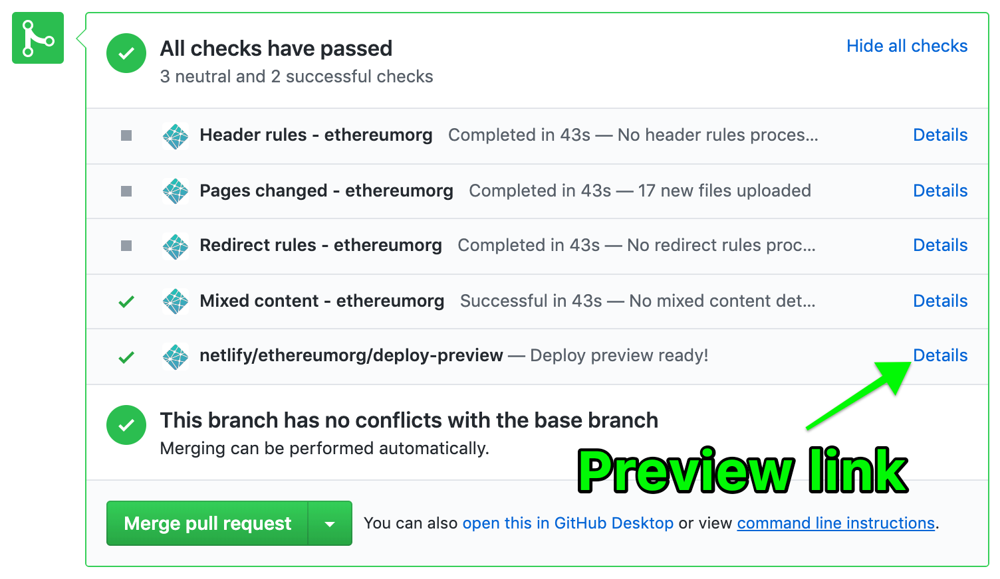

[](https://app.netlify.com/sites/ethereumorg/deploys)
[](#contributors)
[](https://discord.gg/CetY6Y4)
[](https://twitter.com/ethdotorg)
[](https://crowdin.com/project/ethereumfoundation)

<h1 align="center" style="margin-top: 1em; margin-bottom: 3em;">
  <p><a href="https://ethereum.org"></a></p>
  <p>  Welcome to ethereum.org!</p>
</h1>

This is the repo for the [ethereum.org](https://ethereum.org) website, a resource for the Ethereum community. The purpose of the site is to _“Be the best portal to Ethereum for our growing global community"_ - read more about what this means [here](https://ethereum.org/en/about/).

[ethereum.org](https://ethereum.org) is improved and changed over time through the contributions of community members who submit content, give feedback, or volunteer their time to managing its evolution. If you’re interested in helping to improve [ethereum.org](https://ethereum.org), find out [how to contribute](https://ethereum.org/en/contributing/).

## Looking for the Ethereum blockchain's code?

If you're looking for the Ethereum blockchain itself, there is no single repo. Instead, Ethereum has multiple implementations of the protocol written in different programming languages for security and diversity. [Check out the different implementations](https://ethereum.org/en/developers/docs/nodes-and-clients/#clients)

<hr style="margin-top: 3em; margin-bottom: 3em;">

# How to contribute

This project follows the [all-contributors](https://allcontributors.org/docs/en/overview) specification. Contributions of any kind welcome!

## How updates are made to ethereum.org:

### Submit an issue

- Create a [new issue](https://github.com/ethereum/ethereum-org-website/issues/new/choose)
- Comment on the issue (if you'd like to be assigned to it) - that way [our team can assign the issue to you](https://github.blog/2019-06-25-assign-issues-to-issue-commenters/).

### Fork the repository (repo)

- If you're not sure, here's how to [fork the repo](https://help.github.com/en/articles/fork-a-repo)

### Set up your local environment (optional)

If you're ready to contribute and create your PR, it will help to set up a local environment so you can see your changes.

1. [Set up your development environment](https://www.gatsbyjs.com/docs/tutorial/part-zero/)

2. Clone your fork

If this is your first time forking our repo, this is all you need to do for this step:

```
$ git clone git@github.com:[your_github_handle]/ethereum-org-website.git && cd ethereum-org-website
```

If you've already forked the repo, you'll want to ensure your fork is configured and that it's up to date. This will save you the headache of potential merge conflicts.

To [configure your fork](https://docs.github.com/en/github/collaborating-with-issues-and-pull-requests/configuring-a-remote-for-a-fork):

```
$ git remote add upstream https://github.com/ethereum/ethereum-org-website.git
```

To [sync your fork with the latest changes](https://docs.github.com/en/github/collaborating-with-issues-and-pull-requests/syncing-a-fork):

```
$ git checkout dev
$ git fetch upstream
$ git merge upstream/dev
```

3. Install dependencies

```
$ yarn
```

4. Add personal GitHub API token (free)

We recommend setting this up when running the project locally, as we use the GitHub API to fetch repository data for many projects & files.

> - [Follow these instructions](https://docs.github.com/en/github/authenticating-to-github/creating-a-personal-access-token) to create a personal GitHub API token
>   - When selecting scopes in step 7, leave everything unchecked (the data we fetch doesn't require any [scope](https://docs.github.com/en/developers/apps/scopes-for-oauth-apps#available-scopes))
> - In local repo root directory: Make a copy of `.env.example` and name it `.env`
> - Copy & paste your new GitHub API token into `.env`

```
// .env Example:
GATSBY_GITHUB_TOKEN_READ_ONLY=48f84de812090000demo00000000697cf6e6a059
```

5. Add Etherscan API token (free)

> - [Create an account](https://etherscan.io/) on Etherscan
> - Navigate to your Account Settings page
> - In the sidebar, click on 'API-KEYs' and add a new token
> - Copy & paste your Api-Key Token from Etherscan into `.env`

```
// .env Example:
ETHERSCAN_API_KEY=K6NUTARFJZJCIXHF1F1E1YGJZ8RQ29BE4U
```

6. Add DeFiPulse API token (free)

> - [Follow this guide](https://docs.defipulse.com/quick-start-guide) to create an account and get your DeFiPulse API token
> - Copy & paste your Active API Key from DeFiPulse into `.env`

```
// .env Example:
DEFI_PULSE_API_KEY=4953aaf7966dad9c129397e197a0630ed0594f66962dd5fb058972b250da
```

### Make awesome changes!

1. Create new branch for your changes

```
$ git checkout -b new_branch_name
```

2. Start developing!

```
$ yarn start
```

- Open this directory in your favorite text editor / IDE, and see your changes live by visiting `localhost:8000` from your browser
- Pro Tip: Explore scripts within `package.json` for more build options

3. Commit and prepare for pull request (PR). In your PR commit message, reference the issue it resolves (see [how to link a commit message to an issue using a keyword](https://docs.github.com/en/free-pro-team@latest/github/managing-your-work-on-github/linking-a-pull-request-to-an-issue#linking-a-pull-request-to-an-issue-using-a-keyword)).

```
$ git commit -m "brief description of changes [Fixes #1234]"
```

4. Push to your GitHub account

```
$ git push
```

### Submit your PR

- After your changes are commited to your GitHub fork, submit a pull request (PR) to the `dev` branch of the `ethereum/ethereum-org-website` repo
- In your PR description, reference the issue it resolves (see [linking a pull request to an issue using a keyword](https://docs.github.com/en/free-pro-team@latest/github/managing-your-work-on-github/linking-a-pull-request-to-an-issue#linking-a-pull-request-to-an-issue-using-a-keyword))
  - ex. `Updates out of date content [Fixes #1234]`
- Netlify (our hosting service) deploys all PRs to a publicly accessible preview URL, e.g.:
  
- _Confirm your Netlify preview deploy looks & functions as expected_
- Why not say hi and draw attention to your PR in [our discord server](https://discord.gg/CetY6Y4)?

### Wait for review

- The website team reviews every PR
- See [how decisions are made on content changes](https://ethereum.org/en/contributing/#how-decisions-about-the-site-are-made)
- Acceptable PRs will be approved & merged into the `dev` branch

### Release

- `master` is continually synced to Netlify and will automatically deploy new commits to ethereum.org
- The [website team](https://ethereum.org/en/contributing/#how-decisions-about-the-site-are-made) will periodically merge `dev` into `master` (typically multiple times per week)
- You can [view the history of releases](https://github.com/ethereum/ethereum-org-website/releases), which include PR highlights

<hr style="margin-top: 3em; margin-bottom: 3em;">

## The ethereum.org website stack

- [Node.js](https://nodejs.org/)
- [Yarn package manager](https://yarnpkg.com/cli/install)
- [Gatsby](https://www.gatsbyjs.org/)
  - Manages page builds and deployment
  - Configurable in `gatsby-node.js`, `gatsby-browser.js`, `gatsby-config.js`, and `gatsby-ssr.js`
  - [Gatsby Tutorial](https://www.gatsbyjs.com/docs/tutorial/)
  - [Gatsby Docs](https://www.gatsbyjs.org/docs/)
- [React](https://reactjs.org/) - A JavaScript library for building component-based user interfaces
- [GraphQL](https://graphql.org/) - A query language for APIs
- [Algolia](https://www.algolia.com/) - Site indexing, rapid intra-site search results, and search analytics
  - Primary implementation: `/src/components/Search/index.js`
- [Crowdin](https://crowdin.com/) - crowdsourcing for our translation efforts (See "Translation initiative" below)
- [GitHub Actions](https://github.com/features/actions) - Manages CI/CD, and issue tracking
- [Netlify](https://yarnpkg.com/cli/install) - DNS management and primary host for `master` build. Also provides automatic preview deployments for all pull requests

### Code structure

| Folder                                   | Primary use                                                                                                                                                                                                         |
| ---------------------------------------- | ------------------------------------------------------------------------------------------------------------------------------------------------------------------------------------------------------------------- |
| `/src`                                   | Main source folder for development                                                                                                                                                                                  |
| `/src/assets`                            | Image assets                                                                                                                                                                                                        |
| `/src/components`                        | React components that do not function as stand alone pages                                                                                                                                                          |
| `/src/content`                           | Markdown/MDX files for site content stored here. <br>For example: `ethereum.org/en/about/` is built from `src/content/about/index.md` <br>The markdown files are parsed and rendered by `src/templates/static.js`\* |
| `/src/content/developers/docs`           | \*Markdown files in here use the Docs template: `src/templates/docs.js`                                                                                                                                             |
| `/src/content/developers/tutorials`      | \*Markdown files in here use the Tutorial template: `src/templates/tutorial.js`                                                                                                                                     |
| `/src/data`                              | General data files importable by components                                                                                                                                                                         |
| `/src/hooks`                             | Custom React hooks                                                                                                                                                                                                  |
| `/src/intl`                              | Language translation JSON files                                                                                                                                                                                     |
| `/src/lambda`                            | Lambda function scripts for API calls                                                                                                                                                                               |
| `/src/pages`<br>`/src/pages-conditional` | React components that function as stand alone pages. <br>For example: `ethereum.org/en/wallets/find-wallet` is built from `src/pages/wallets/find-wallet.js`                                                        |
| `/src/scripts`<br>`/src/utils`           | Custom utility scripts                                                                                                                                                                                              |
| `/src/styles`                            | Stores `layout.css` which contains root level css styling                                                                                                                                                           |
| `/src/templates`                         | JSX templates that define layouts of differnt regions of the site                                                                                                                                                   |
| `/src/theme.js`                          | Declares site color themes, breakpoints and other constants (try to utilize these colors first)                                                                                                                     |

<hr style="margin-top: 3em; margin-bottom: 3em;">

## Website conventions / best practices

### ❗️ Translation initiative

_Please read carefully if adding or altering any written language content_

How to prepare your content for translation depends on whether you're working on a simple Markdown/MDX page or a React component page.

**- MDX pages (`/src/content/page/`)**

Markdown will be translated as whole pages of content, so no specific action is required. Simply create a new folder within `/src/content/` with the name of the page, then place index markdown file (ie. `index.md`) within new folder.

**- React component page**

- **English text should be placed into `/src/intl/en/page-CORRESPONDING-PAGE.json`**
- [Crowdin](https://crowdin.com/) is the platform we use to manage & crowdsource translation efforts. Please use the following conventions to help streamline this process.
- Use kebab casing (utilizing-dashes-between-words) for file names and JSON keys
- Use standard sentence casing for entry values
  - If capitalization styling required, it is preferable to style with CSS
    - Do this:
      ```
        JSON `"page-warning": "Be very careful"`
        CSS `text-transform: uppercase`
      ```
    - Not this:
      ```
        JSON `"page-warning": "BE VERY CAREFUL"`
      ```
  - This minimizes issues during translation, and allows consistent styling to all languages
- _Please avoid_ embedding links within a sentence. For a word/phrase to be a link, it requires a key/string in the intl JSON. If this is in the middle of another sentence, this results in the sentence being broken into multiple pieces, and requires coding the sentence structure into the JavaScript.

  - This results in significant challenges during translation process, as written syntax for each language will very in terms of ordering subjects/verbs/etc.
  - If you're wanting to link to something within your sentence, create a link at the end of the sentence or paragraph:

  ```
  <p>All Ethereum transactions require a fee, known as Gas, that gets paid to the miner. <Link to="link">More on Gas</Link></p>
  ```

  Once, you've addded your English content to the appropriate JSON file, the above code should look something more like:

  ```
   <p><Translation id="page-transactions" />{" "}<Link to="link"><Translation id="page-transactions-gas-link" /></Link></p>
  ```

  - _tl;dr Each individual JSON entry should be a complete phrase by itself_

- This is done using the `Translation` component. However there is an alternative method for regular JS: `gatsby-plugin-intl` with `/src/utils/translations.js`

  - **Method one: `<Translation />` component (preferred if only needed in JSX)**

    ```
    import { Translation } from "src/components/Translation"

    // Utilize in JSX using
    <Translation id="language-json-key" />
    ```

  - **Method two: `translateMessageId()`**

    ```
    import { useIntl } from "gatsby-plugin-intl"
    import { translateMessageId } from "src/utils/translations"

    // Utilize anywhere in JS using
    const intl = useIntl()
    translateMessageId("language-json-key", intl)
    ```

    ```
    const siteTitle = translateMessageId("site-title", intl)
    ```

## React Hooks

- Components and pages are written using arrow function syntax with React hooks in lieu of using class-based components

```
// Example
import React, { useState, useEffect } from 'react'

const ComponentName = props => {
  // useState hook for managing state variables
  const [greeting, setGreeting] = useState('')

  useEffect(() => {
    // useEffect hook for handling component lifecycle
    setGreeting('Hello world')
  }, [])

  return <div>{greeting}</div>
};

export default ComponentName;
```

## Styling

- `src/theme.js` - Declares site color themes, breakpoints and other constants (try to utilize these colors first)
- We use [styled-components](https://styled-components.com/)

  - Tagged template literals are used to style custom components

  ```
  // Example of styling syntax using styled-components

  import styled from "styled-components"

  const GenericButton = styled.div`
    width: 200px;
    height: 50px;
  `
  const PrimaryButton = styled(GenericButton)`
    background: blue;
  `
  const SecondaryButton = styled(GenericButton)`
    background: red;
  `

  // These are each components, capitalized by convention, and can be used within JSX code
  // ie: <PrimaryButton>Text</PrimaryButton>
  ```

  - Recommended VS Code Plugin: `vscode-styled-components` <br>To install: Open VS Code > `Ctrl+P` / `Cmd+P` > Run: <br>`ext install vscode-styled-components`

- Values from `src/theme.js` are automatically passed as a prop object to styled components

  ```
  // Example of theme.js usage

  import styled from "styled-components"

  const Container = styled.div`
    background: ${(props) => props.theme.colors.background};
    @media (max-width: ${(props) => props.theme.breakpoints.s}) {
      font-size: #{(props) => props.theme.fontSized.s};
    }
  `
  ```

- [Framer Motion](https://www.framer.com/motion/) - An open source and production-ready motion library for React on the web, used for our animated designs
- **Emojis**: We use [Twemoji](https://twemoji.twitter.com/), an open-source emoji set created by Twitter. These are hosted by us, and used to provide a consistent experience across operating systems.

```
// Example of emoji use
import Emoji from "./Emoji"

// Within JSX:
<Emoji text=":star:" size={1} /> // sized in `em`
```

- **Icons**: We use [React Icons](https://react-icons.github.io/react-icons/)
  - `src/components/Icon.js` is the component used to import icons to be used
  - If an icon you want to use is not listed you will need to add it to this file

`src/components/Icon.js`:

```
// Example of how to add new icon not listed
import { ZzIconName } from "react-icons/zz"

// Then add to IconContect.Provider children:
{name === "alias" && <ZzIconName />}
```

From React component:

```
// Example of icon use
import Icon from "./Icon"

// Within JSX:
<Icon name="alias" />
```

## Image loading and API calls using GraphQL

- [Gatsby + GraphQL](https://www.gatsbyjs.com/docs/graphql/) used for loading of images and preferred for API calls (in lieu of REST, if possible/practical). Utilizes static page queries that run at build time, not at run time, optimizing performance
- Image loading example:

```
import { graphql } from "gatsby"

export const query = graphql`
  query {
    hero: file(relativePath: { eq: "developers-eth-blocks.png" }) {
      childImageSharp {
        fluid(maxWidth: 800) {
          ...GatsbyImageSharpFluid
        }
      }
    }
  }
`
// These query results get passed as an object `props.data` to your component
```

- API call example:

```
import { graphql } from "gatsby"

export const repoInfo = graphql`
  fragment repoInfo on GitHub_Repository {
    stargazerCount
    languages(orderBy: { field: SIZE, direction: DESC }, first: 2) {
      nodes {
        name
      }
    }
    url
  }
`
export const query = graphql`
  query {
    hardhatGitHub: github {
      repository(owner: "nomiclabs", name: "hardhat") {
        ...repoInfo
      }
    }
  }
`
// These query results get passed as an object `props.data` to your component
```

<hr style="margin-top: 3em; margin-bottom: 3em;">


## Claim your POAP!

### What is POAP?

> The Proof of Attendance Protocol is a dapp that distributes badges in the form of ERC-721 tokens to prove you participated in an event. [More on POAPs](https://www.poap.xyz/).

### ethereum.org 2021 Contributor POAP

- If you have commited any changes in 2021 so far that were merged into our repo, you have a POAP waiting!
- This includes our dedicated translators on Crowdin

  [](https://discord.gg/CetY6Y4)

- 👆 To claim your Contributor POAP, join our Discord server and paste a link to your contribution in the #poaps-🏆 channel

- A member of our team will verify the request and DM you with a personalized link to claim your own freshly minted POAP collectible!

- To help with verification we request GitHub contributors connect their GitHub account with their Discord account (Discord > Settings > Connections > GitHub). Crowdin contributors will be verified directly through Crowdin by our team.

- If you haven't contributed yet and would like to earn a POAP to show your loyalty to the Ethereum space, head over to the [issues](https://github.com/ethereum/ethereum-org-website/issues/) tab to get started!

<hr style="margin-top: 3em; margin-bottom: 3em;">

## Contributors

Thanks goes to these wonderful people ([emoji key](https://allcontributors.org/docs/en/emoji-key)):

<!-- ALL-CONTRIBUTORS-LIST:START - Do not remove or modify this section -->
<!-- prettier-ignore-start -->
<!-- markdownlint-disable -->
<table>
  <tr>
    <td align="center"><a href="https://github.com/ExodusActual"><br /><sub><b>ExodusActual</b></sub></a><br /><a href="#translation-ExodusActual" title="Translation">🌍</a></td>
    <td align="center"><a href="https://github.com/P1X3L0V4"><br /><sub><b>Anna Karpińska</b></sub></a><br /><a href="#translation-P1X3L0V4" title="Translation">🌍</a></td>
    <td align="center"><a href="https://github.com/8bitp"><br /><sub><b>8bitp</b></sub></a><br /><a href="#content-8bitp" title="Content">🖋</a></td>
    <td align="center"><a href="https://github.com/AlexandrouR"><br /><sub><b>Rousos Alexandros</b></sub></a><br /><a href="#content-AlexandrouR" title="Content">🖋</a></td>
    <td align="center"><a href="https://github.com/EvanVanNessEth"><br /><sub><b>EvanVanNessEth</b></sub></a><br /><a href="#content-EvanVanNessEth" title="Content">🖋</a></td>
    <td align="center"><a href="https://github.com/JesseAbram"><br /><sub><b>JesseAbram</b></sub></a><br /><a href="#content-JesseAbram" title="Content">🖋</a></td>
    <td align="center"><a href="http://impermanence.co"><br /><sub><b>Lililashka</b></sub></a><br /><a href="#design-Lililashka" title="Design">🎨</a> <a href="https://github.com/ethereum/ethereum-org-website/issues?q=author%3ALililashka" title="Bug reports">🐛</a></td>
  </tr>
  <tr>
    <td align="center"><a href="https://github.com/vrde"><br /><sub><b>vrde</b></sub></a><br /><a href="#content-vrde" title="Content">🖋</a></td>
    <td align="center"><a href="https://github.com/RichardMcSorley"><br /><sub><b>Richard McSorley</b></sub></a><br /><a href="https://github.com/ethereum/ethereum-org-website/commits?author=RichardMcSorley" title="Code">💻</a></td>
    <td align="center"><a href="http://ajsantander.github.io/"><br /><sub><b>Alejandro Santander</b></sub></a><br /><a href="#content-ajsantander" title="Content">🖋</a></td>
    <td align="center"><a href="https://github.com/carver"><br /><sub><b>Jason Carver</b></sub></a><br /><a href="#content-carver" title="Content">🖋</a></td>
    <td align="center"><a href="https://github.com/chaitanyapotti"><br /><sub><b>Chaitanya Potti</b></sub></a><br /><a href="#content-chaitanyapotti" title="Content">🖋</a></td>
    <td align="center"><a href="https://github.com/chriseth"><br /><sub><b>chriseth</b></sub></a><br /><a href="#content-chriseth" title="Content">🖋</a> <a href="https://github.com/ethereum/ethereum-org-website/pulls?q=is%3Apr+reviewed-by%3Achriseth" title="Reviewed Pull Requests">👀</a></td>
    <td align="center"><a href="https://github.com/craigwilliams84"><br /><sub><b>Craig Williams</b></sub></a><br /><a href="#content-craigwilliams84" title="Content">🖋</a></td>
  </tr>
  <tr>
    <td align="center"><a href="https://github.com/damianrusinek"><br /><sub><b>Damian Rusinek</b></sub></a><br /><a href="#content-damianrusinek" title="Content">🖋</a></td>
    <td align="center"><a href="https://github.com/djrtwo"><br /><sub><b>Danny Ryan</b></sub></a><br /><a href="#content-djrtwo" title="Content">🖋</a> <a href="https://github.com/ethereum/ethereum-org-website/pulls?q=is%3Apr+reviewed-by%3Adjrtwo" title="Reviewed Pull Requests">👀</a></td>
    <td align="center"><a href="https://nomiclabs.io"><br /><sub><b>Franco Zeoli</b></sub></a><br /><a href="#content-fzeoli" title="Content">🖋</a> <a href="https://github.com/ethereum/ethereum-org-website/pulls?q=is%3Apr+reviewed-by%3Afzeoli" title="Reviewed Pull Requests">👀</a></td>
    <td align="center"><a href="https://secinfodb.wordpress.com"><br /><sub><b>Guy Lando</b></sub></a><br /><a href="#content-guylando" title="Content">🖋</a></td>
    <td align="center"><a href="https://github.com/jamesconnolly93"><br /><sub><b>James Connolly</b></sub></a><br /><a href="#content-jamesconnolly93" title="Content">🖋</a></td>
    <td align="center"><a href="https://burden.blog"><br /><sub><b>Jacob Burden</b></sub></a><br /><a href="#content-jekrb" title="Content">🖋</a></td>
    <td align="center"><a href="https://github.com/joshorig"><br /><sub><b>joshorig</b></sub></a><br /><a href="#content-joshorig" title="Content">🖋</a></td>
  </tr>
  <tr>
    <td align="center"><a href="https://github.com/mariapaulafn"><br /><sub><b>mariapaulafn</b></sub></a><br /><a href="#content-mariapaulafn" title="Content">🖋</a></td>
    <td align="center"><a href="https://openzeppelin.com/"><br /><sub><b>Martín</b></sub></a><br /><a href="#content-martintel" title="Content">🖋</a></td>
    <td align="center"><a href="https://github.com/mat7ias"><br /><sub><b>Mattias Nystrom</b></sub></a><br /><a href="#content-mat7ias" title="Content">🖋</a></td>
    <td align="center"><a href="http://iteasys.com"><br /><sub><b>nabetse</b></sub></a><br /><a href="#content-nabetse00" title="Content">🖋</a></td>
    <td align="center"><a href="https://github.com/nicksavers"><br /><sub><b>Nick Savers</b></sub></a><br /><a href="#content-nicksavers" title="Content">🖋</a></td>
    <td align="center"><a href="http://playproject.io"><br /><sub><b>Nina Breznik</b></sub></a><br /><a href="#content-ninabreznik" title="Content">🖋</a></td>
    <td align="center"><a href="https://odyssy.io"><br /><sub><b>Ven Gist</b></sub></a><br /><a href="#content-oovg" title="Content">🖋</a></td>
  </tr>
  <tr>
    <td align="center"><a href="http://paulfletcherhill.com"><br /><sub><b>Paul Fletcher-Hill</b></sub></a><br /><a href="#content-pfletcherhill" title="Content">🖋</a></td>
    <td align="center"><a href="https://github.com/phillux"><br /><sub><b>Phil </b></sub></a><br /><a href="#content-phillux" title="Content">🖋</a></td>
    <td align="center"><a href="https://exomel.com"><br /><sub><b>Rémi Prévost</b></sub></a><br /><a href="#content-remiprev" title="Content">🖋</a></td>
    <td align="center"><a href="http://shanejonas.net"><br /><sub><b>Shane</b></sub></a><br /><a href="#content-shanejonas" title="Content">🖋</a></td>
    <td align="center"><a href="https://shazow.net/"><br /><sub><b>Andrey Petrov</b></sub></a><br /><a href="#content-shazow" title="Content">🖋</a> <a href="#ideas-shazow" title="Ideas, Planning, & Feedback">🤔</a> <a href="#a11y-shazow" title="Accessibility">️️️️♿️</a></td>
    <td align="center"><a href="https://twitter.com/smpalladino"><br /><sub><b>Santiago Palladino</b></sub></a><br /><a href="#content-spalladino" title="Content">🖋</a> <a href="#ideas-spalladino" title="Ideas, Planning, & Feedback">🤔</a></td>
    <td align="center"><a href="http://www.twitter.com/timbeiko"><br /><sub><b>Tim Beiko</b></sub></a><br /><a href="#content-timbeiko" title="Content">🖋</a> <a href="https://github.com/ethereum/ethereum-org-website/pulls?q=is%3Apr+reviewed-by%3Atimbeiko" title="Reviewed Pull Requests">👀</a></td>
  </tr>
  <tr>
    <td align="center"><a href="https://wanseob.com"><br /><sub><b>Wanseob Lim</b></sub></a><br /><a href="#content-wanseob" title="Content">🖋</a> <a href="#translation-wanseob" title="Translation">🌍</a></td>
    <td align="center"><a href="https://github.com/wilbarnes"><br /><sub><b>Wil Barnes</b></sub></a><br /><a href="#content-wilbarnes" title="Content">🖋</a></td>
    <td align="center"><a href="https://github.com/Aniket-Engg"><br /><sub><b>Aniket</b></sub></a><br /><a href="#content-Aniket-Engg" title="Content">🖋</a></td>
    <td align="center"><a href="http://chrischinchilla.com"><br /><sub><b>Chris Chinchilla</b></sub></a><br /><a href="#content-ChrisChinchilla" title="Content">🖋</a></td>
    <td align="center"><a href="https://github.com/Perseverance"><br /><sub><b>George Spasov</b></sub></a><br /><a href="#content-Perseverance" title="Content">🖋</a></td>
    <td align="center"><a href="http://pierrickturelier.fr"><br /><sub><b>Pierrick TURELIER</b></sub></a><br /><a href="https://github.com/ethereum/ethereum-org-website/commits?author=PierrickGT" title="Code">💻</a></td>
    <td align="center"><a href="https://github.com/Solexplorer"><br /><sub><b>Solexplorer</b></sub></a><br /><a href="#content-Solexplorer" title="Content">🖋</a></td>
  </tr>
  <tr>
    <td align="center"><a href="https://github.com/Sunghee2"><br /><sub><b>Sunghee Lee</b></sub></a><br /><a href="#content-Sunghee2" title="Content">🖋</a></td>
    <td align="center"><a href="https://github.com/awallendahl"><br /><sub><b>awallendahl</b></sub></a><br /><a href="#content-awallendahl" title="Content">🖋</a></td>
    <td align="center"><a href="https://blog.bmannconsulting.com"><br /><sub><b>Boris Mann</b></sub></a><br /><a href="#content-bmann" title="Content">🖋</a></td>
    <td align="center"><a href="https://github.com/carumusan"><br /><sub><b>carumusan</b></sub></a><br /><a href="#content-carumusan" title="Content">🖋</a></td>
    <td align="center"><a href="https://github.com/econoar"><br /><sub><b>econoar</b></sub></a><br /><a href="#content-econoar" title="Content">🖋</a></td>
    <td align="center"><a href="http://twitter.com/gesq_"><br /><sub><b>Gustavo Esquinca</b></sub></a><br /><a href="#content-gesquinca" title="Content">🖋</a></td>
    <td align="center"><a href="http://www.superblocks.com"><br /><sub><b>Javier Tarazaga</b></sub></a><br /><a href="#content-javier-tarazaga" title="Content">🖋</a></td>
  </tr>
  <tr>
    <td align="center"><a href="https://github.com/kcole16"><br /><sub><b>Kendall Cole</b></sub></a><br /><a href="#content-kcole16" title="Content">🖋</a></td>
    <td align="center"><a href="https://github.com/lbrendanl"><br /><sub><b>Brendan Lee</b></sub></a><br /><a href="#content-lbrendanl" title="Content">🖋</a></td>
    <td align="center"><a href="https://www.zastrin.com"><br /><sub><b>Mahesh Murthy</b></sub></a><br /><a href="#content-maheshmurthy" title="Content">🖋</a></td>
    <td align="center"><a href="http://oneclickdapp.com"><br /><sub><b>Patrick Gallagher</b></sub></a><br /><a href="#content-pi0neerpat" title="Content">🖋</a></td>
    <td align="center"><a href="https://www.mrroom.in"><br /><sub><b>Ali Abbas</b></sub></a><br /><a href="#content-realabbas" title="Content">🖋</a></td>
    <td align="center"><a href="https://github.com/wtf"><br /><sub><b>wtf</b></sub></a><br /><a href="https://github.com/ethereum/ethereum-org-website/commits?author=wtf" title="Code">💻</a> <a href="https://github.com/ethereum/ethereum-org-website/pulls?q=is%3Apr+reviewed-by%3Awtf" title="Reviewed Pull Requests">👀</a> <a href="#infra-wtf" title="Infrastructure (Hosting, Build-Tools, etc)">🚇</a></td>
    <td align="center"><a href="https://s0b0lev.com"><br /><sub><b> Aleksandr Sobolev</b></sub></a><br /><a href="#content-s0b0lev" title="Content">🖋</a></td>
  </tr>
  <tr>
    <td align="center"><a href="http://www.whiteblock.io"><br /><sub><b>Zak Cole</b></sub></a><br /><a href="#content-zscole" title="Content">🖋</a></td>
    <td align="center"><a href="https://github.com/BogdanHabic"><br /><sub><b>Bogdan Habic</b></sub></a><br /><a href="#content-BogdanHabic" title="Content">🖋</a></td>
    <td align="center"><a href="https://sawinyh.com"><br /><sub><b>Nick Sawinyh</b></sub></a><br /><a href="#content-sneg55" title="Content">🖋</a></td>
    <td align="center"><a href="http://zoek1.github.com"><br /><sub><b>Miguel Angel Gordián</b></sub></a><br /><a href="https://github.com/ethereum/ethereum-org-website/commits?author=zoek1" title="Code">💻</a></td>
    <td align="center"><a href="https://eswarasai.com"><br /><sub><b>Eswara Sai</b></sub></a><br /><a href="https://github.com/ethereum/ethereum-org-website/commits?author=eswarasai" title="Code">💻</a></td>
    <td align="center"><a href="https://github.com/ethers"><br /><sub><b>ethers</b></sub></a><br /><a href="#content-ethers" title="Content">🖋</a> <a href="#ideas-ethers" title="Ideas, Planning, & Feedback">🤔</a></td>
    <td align="center"><a href="http://faraggi.org"><br /><sub><b>Felipe Faraggi</b></sub></a><br /><a href="#content-faraggi" title="Content">🖋</a> <a href="#translation-faraggi" title="Translation">🌍</a> <a href="#ideas-faraggi" title="Ideas, Planning, & Feedback">🤔</a> <a href="https://github.com/ethereum/ethereum-org-website/pulls?q=is%3Apr+reviewed-by%3Afaraggi" title="Reviewed Pull Requests">👀</a></td>
  </tr>
  <tr>
    <td align="center"><a href="https://github.com/maurelian"><br /><sub><b>Maurelian</b></sub></a><br /><a href="https://github.com/ethereum/ethereum-org-website/commits?author=maurelian" title="Code">💻</a> <a href="https://github.com/ethereum/ethereum-org-website/pulls?q=is%3Apr+reviewed-by%3Amaurelian" title="Reviewed Pull Requests">👀</a> <a href="#content-maurelian" title="Content">🖋</a></td>
    <td align="center"><a href="https://github.com/CPSTL"><br /><sub><b>CPSTL</b></sub></a><br /><a href="#content-CPSTL" title="Content">🖋</a> <a href="https://github.com/ethereum/ethereum-org-website/pulls?q=is%3Apr+reviewed-by%3ACPSTL" title="Reviewed Pull Requests">👀</a> <a href="https://github.com/ethereum/ethereum-org-website/commits?author=CPSTL" title="Documentation">📖</a></td>
    <td align="center"><a href="http://www.hudsonjameson.com"><br /><sub><b>Hudson Jameson</b></sub></a><br /><a href="#content-Souptacular" title="Content">🖋</a> <a href="https://github.com/ethereum/ethereum-org-website/commits?author=Souptacular" title="Documentation">📖</a></td>
    <td align="center"><a href="https://shayan.es/"><br /><sub><b>Shayan Eskandari</b></sub></a><br /><a href="https://github.com/ethereum/ethereum-org-website/commits?author=shayanb" title="Code">💻</a> <a href="#translation-shayanb" title="Translation">🌍</a></td>
    <td align="center"><a href="http://www.scydev.ch"><br /><sub><b>Lukas Sägesser</b></sub></a><br /><a href="https://github.com/ethereum/ethereum-org-website/commits?author=ScyDev" title="Code">💻</a></td>
    <td align="center"><a href="http://virgil.gr"><br /><sub><b>Virgil Griffith</b></sub></a><br /><a href="#content-virgil" title="Content">🖋</a></td>
    <td align="center"><a href="https://github.com/easeev"><br /><sub><b>Eugene Aseev</b></sub></a><br /><a href="#content-easeev" title="Content">🖋</a></td>
  </tr>
  <tr>
    <td align="center"><a href="http://jannispohlmann.de/"><br /><sub><b>Jannis Pohlmann</b></sub></a><br /><a href="#content-Jannis" title="Content">🖋</a></td>
    <td align="center"><a href="https://steemblog.github.io/@robertyan"><br /><sub><b>think-in-universe</b></sub></a><br /><a href="https://github.com/ethereum/ethereum-org-website/commits?author=think-in-universe" title="Code">💻</a> <a href="#content-think-in-universe" title="Content">🖋</a></td>
    <td align="center"><a href="http://l4v.io"><br /><sub><b>Josh Stark</b></sub></a><br /><a href="#content-jjmstark" title="Content">🖋</a> <a href="https://github.com/ethereum/ethereum-org-website/pulls?q=is%3Apr+reviewed-by%3Ajjmstark" title="Reviewed Pull Requests">👀</a> <a href="#projectManagement-jjmstark" title="Project Management">📆</a></td>
    <td align="center"><a href="https://www.alanwoo.ca"><br /><sub><b>Alan Woo</b></sub></a><br /><a href="https://github.com/ethereum/ethereum-org-website/commits?author=alancwoo" title="Code">💻</a> <a href="#design-alancwoo" title="Design">🎨</a></td>
    <td align="center"><a href="https://manankpatni.wordpress.com/"><br /><sub><b>Manank Patni</b></sub></a><br /><a href="#content-Man-Jain" title="Content">🖋</a></td>
    <td align="center"><a href="http://www.rogerioaraujo.co.nf/"><br /><sub><b>Rogério Araújo</b></sub></a><br /><a href="#translation-rodgeraraujo" title="Translation">🌍</a></td>
    <td align="center"><a href="https://github.com/natacha-involves"><br /><sub><b>Natacha Souza</b></sub></a><br /><a href="#translation-natacha-involves" title="Translation">🌍</a></td>
  </tr>
  <tr>
    <td align="center"><a href="https://github.com/sorumfactory"><br /><sub><b>sorumfactory</b></sub></a><br /><a href="#translation-sorumfactory" title="Translation">🌍</a> <a href="#projectManagement-sorumfactory" title="Project Management">📆</a> <a href="#content-sorumfactory" title="Content">🖋</a> <a href="https://github.com/ethereum/ethereum-org-website/issues?q=author%3Asorumfactory" title="Bug reports">🐛</a></td>
    <td align="center"><a href="https://www.samajammin.com/"><br /><sub><b>Sam Richards</b></sub></a><br /><a href="https://github.com/ethereum/ethereum-org-website/commits?author=samajammin" title="Code">💻</a> <a href="#content-samajammin" title="Content">🖋</a> <a href="https://github.com/ethereum/ethereum-org-website/commits?author=samajammin" title="Documentation">📖</a> <a href="#projectManagement-samajammin" title="Project Management">📆</a></td>
    <td align="center"><a href="http://antodp.xyz"><br /><sub><b>Antonio Della Porta</b></sub></a><br /><a href="https://github.com/ethereum/ethereum-org-website/commits?author=antodp" title="Code">💻</a></td>
    <td align="center"><a href="https://github.com/Abhimanyu121"><br /><sub><b>Abhimanyu Shekhawat</b></sub></a><br /><a href="#content-Abhimanyu121" title="Content">🖋</a></td>
    <td align="center"><a href="http://phor.net"><br /><sub><b>William Entriken</b></sub></a><br /><a href="#content-fulldecent" title="Content">🖋</a> <a href="https://github.com/ethereum/ethereum-org-website/commits?author=fulldecent" title="Documentation">📖</a></td>
    <td align="center"><a href="http://sangphilkim.me"><br /><sub><b>Sangphil Kim</b></sub></a><br /><a href="#translation-sangphilkim" title="Translation">🌍</a></td>
    <td align="center"><a href="https://github.com/tstt"><br /><sub><b>peijie</b></sub></a><br /><a href="#translation-tstt" title="Translation">🌍</a></td>
  </tr>
  <tr>
    <td align="center"><a href="https://github.com/Jokyash"><br /><sub><b>Jokyash</b></sub></a><br /><a href="#translation-Jokyash" title="Translation">🌍</a></td>
    <td align="center"><a href="https://github.com/pedrorivera"><br /><sub><b>Pedro Rivera</b></sub></a><br /><a href="#translation-pedrorivera" title="Translation">🌍</a></td>
    <td align="center"><a href="https://beta.rigoblock.com"><br /><sub><b>Gabriele Rigo</b></sub></a><br /><a href="#translation-gabririgo" title="Translation">🌍</a></td>
    <td align="center"><a href="https://dtilen.si"><br /><sub><b>Tilen Držan</b></sub></a><br /><a href="#translation-dTilen" title="Translation">🌍</a></td>
    <td align="center"><a href="https://github.com/jJosko1986"><br /><sub><b>jJosko1986</b></sub></a><br /><a href="#translation-jJosko1986" title="Translation">🌍</a></td>
    <td align="center"><a href="https://ethereum.cn"><br /><sub><b>ECN</b></sub></a><br /><a href="#translation-EthereumCommunityNetwork" title="Translation">🌍</a></td>
    <td align="center"><a href="https://github.com/damianoazzolini"><br /><sub><b>Damiano Azzolini</b></sub></a><br /><a href="#translation-damianoazzolini" title="Translation">🌍</a></td>
  </tr>
  <tr>
    <td align="center"><a href="https://github.com/matteopey"><br /><sub><b>matteopey</b></sub></a><br /><a href="#translation-matteopey" title="Translation">🌍</a></td>
    <td align="center"><a href="https://github.com/kilu83"><br /><sub><b>Hun Ryu</b></sub></a><br /><a href="#translation-kilu83" title="Translation">🌍</a></td>
    <td align="center"><a href="https://github.com/nake13"><br /><sub><b>nake13</b></sub></a><br /><a href="#translation-nake13" title="Translation">🌍</a></td>
    <td align="center"><a href="https://github.com/alexiskefalas"><br /><sub><b>alexiskefalas</b></sub></a><br /><a href="#translation-alexiskefalas" title="Translation">🌍</a></td>
    <td align="center"><a href="http://Behrad.Khodayar.me"><br /><sub><b>Behrad Khodayar</b></sub></a><br /><a href="#translation-behradkhodayar" title="Translation">🌍</a></td>
    <td align="center"><a href="https://github.com/Frankaus"><br /><sub><b>Frankaus</b></sub></a><br /><a href="#translation-Frankaus" title="Translation">🌍</a></td>
    <td align="center"><a href="https://github.com/hacktar"><br /><sub><b>hacktar</b></sub></a><br /><a href="https://github.com/ethereum/ethereum-org-website/commits?author=hacktar" title="Code">💻</a> <a href="#translation-hacktar" title="Translation">🌍</a></td>
  </tr>
  <tr>
    <td align="center"><a href="https://github.com/DjangoM"><br /><sub><b>Jaroslav Macej</b></sub></a><br /><a href="#translation-DjangoM" title="Translation">🌍</a></td>
    <td align="center"><a href="https://github.com/EmanHerawy"><br /><sub><b>Eman Herawy</b></sub></a><br /><a href="#translation-EmanHerawy" title="Translation">🌍</a> <a href="https://github.com/ethereum/ethereum-org-website/commits?author=EmanHerawy" title="Code">💻</a></td>
    <td align="center"><a href="https://github.com/Bellinas"><br /><sub><b>Bellinas</b></sub></a><br /><a href="#translation-Bellinas" title="Translation">🌍</a></td>
    <td align="center"><a href="https://github.com/amchercashin"><br /><sub><b>Alexander Cherkashin</b></sub></a><br /><a href="#translation-amchercashin" title="Translation">🌍</a></td>
    <td align="center"><a href="http://www.soarontech.com.ng"><br /><sub><b>Enoch Mbaebie</b></sub></a><br /><a href="#translation-EnochMbaebie" title="Translation">🌍</a></td>
    <td align="center"><a href="https://github.com/inlak16"><br /><sub><b>inlak16</b></sub></a><br /><a href="#translation-inlak16" title="Translation">🌍</a></td>
    <td align="center"><a href="https://www.c4at.cn/"><br /><sub><b>Bob Jiang</b></sub></a><br /><a href="#translation-bobjiang" title="Translation">🌍</a></td>
  </tr>
  <tr>
    <td align="center"><a href="https://www.linkedin.com/in/suhunkim/"><br /><sub><b>Suhun Kim</b></sub></a><br /><a href="#translation-cobject" title="Translation">🌍</a></td>
    <td align="center"><a href="http://jzu.blog.free.fr/"><br /><sub><b>Jean Zundel</b></sub></a><br /><a href="#translation-jzu" title="Translation">🌍</a></td>
    <td align="center"><a href="https://twitter.com/_Hachemi_"><br /><sub><b>Hachemi</b></sub></a><br /><a href="#translation-HachemiH" title="Translation">🌍</a></td>
    <td align="center"><a href="https://github.com/hanzoh1"><br /><sub><b>hanzoh</b></sub></a><br /><a href="#translation-hanzoh1" title="Translation">🌍</a></td>
    <td align="center"><a href="https://twitter.com/vincentLg"><br /><sub><b>Vincent Le Gallic</b></sub></a><br /><a href="#translation-vincentlg" title="Translation">🌍</a></td>
    <td align="center"><a href="https://github.com/Enigmatic331"><br /><sub><b>Enigmatic331</b></sub></a><br /><a href="#content-Enigmatic331" title="Content">🖋</a></td>
    <td align="center"><a href="https://twitter.com/0zAND1z"><br /><sub><b>Ganesh Prasad Kumble</b></sub></a><br /><a href="#content-0zAND1z" title="Content">🖋</a> <a href="#translation-0zAND1z" title="Translation">🌍</a></td>
  </tr>
  <tr>
    <td align="center"><a href="https://github.com/pontiyaraja"><br /><sub><b>Pandiyaraja Ramamoorthy</b></sub></a><br /><a href="#content-pontiyaraja" title="Content">🖋</a> <a href="#translation-pontiyaraja" title="Translation">🌍</a></td>
    <td align="center"><a href="https://github.com/Kuekuatsheu95"><br /><sub><b>Archan Roychoudhury</b></sub></a><br /><a href="#content-Kuekuatsheu95" title="Content">🖋</a> <a href="#translation-Kuekuatsheu95" title="Translation">🌍</a></td>
    <td align="center"><a href="https://github.com/its-VSP"><br /><sub><b>SAI PRASHANTH VUPPALA</b></sub></a><br /><a href="#content-its-VSP" title="Content">🖋</a> <a href="#translation-its-VSP" title="Translation">🌍</a></td>
    <td align="center"><a href="https://github.com/sickmorty"><br /><sub><b>Sayid Almahdy</b></sub></a><br /><a href="#translation-sickmorty" title="Translation">🌍</a></td>
    <td align="center"><a href="https://github.com/jeedani"><br /><sub><b>jeedani</b></sub></a><br /><a href="#translation-jeedani" title="Translation">🌍</a></td>
    <td align="center"><a href="https://github.com/akira-19"><br /><sub><b>Akira</b></sub></a><br /><a href="#translation-akira-19" title="Translation">🌍</a></td>
    <td align="center"><a href="https://github.com/karansinghgit"><br /><sub><b>karansinghgit</b></sub></a><br /><a href="https://github.com/ethereum/ethereum-org-website/commits?author=karansinghgit" title="Code">💻</a></td>
  </tr>
  <tr>
    <td align="center"><a href="https://www.manning.com/books/redux-in-action?a_aid=coach&a_bid=48d05fcb"><br /><sub><b>Marc Garreau</b></sub></a><br /><a href="#content-marcgarreau" title="Content">🖋</a> <a href="#ideas-marcgarreau" title="Ideas, Planning, & Feedback">🤔</a> <a href="https://github.com/ethereum/ethereum-org-website/issues?q=author%3Amarcgarreau" title="Bug reports">🐛</a></td>
    <td align="center"><a href="https://github.com/mul53"><br /><sub><b>mul53</b></sub></a><br /><a href="https://github.com/ethereum/ethereum-org-website/commits?author=mul53" title="Code">💻</a></td>
    <td align="center"><a href="https://github.com/CodinMaster"><br /><sub><b>Apoorv Lathey</b></sub></a><br /><a href="https://github.com/ethereum/ethereum-org-website/commits?author=CodinMaster" title="Code">💻</a></td>
    <td align="center"><a href="https://github.com/ksato9700"><br /><sub><b>Ken Sato</b></sub></a><br /><a href="#content-ksato9700" title="Content">🖋</a></td>
    <td align="center"><a href="https://github.com/Sesamestrong"><br /><sub><b>Sesamestrong</b></sub></a><br /><a href="https://github.com/ethereum/ethereum-org-website/commits?author=Sesamestrong" title="Code">💻</a></td>
    <td align="center"><a href="https://github.com/Christofon"><br /><sub><b>ChrisK</b></sub></a><br /><a href="#content-Christofon" title="Content">🖋</a></td>
    <td align="center"><a href="https://stackoverflow.com/story/svanas"><br /><sub><b>Stefan van As</b></sub></a><br /><a href="#content-svanas" title="Content">🖋</a></td>
  </tr>
  <tr>
    <td align="center"><a href="https://greg.jeanmart.me"><br /><sub><b>Grégoire Jeanmart</b></sub></a><br /><a href="#content-gjeanmart" title="Content">🖋</a></td>
    <td align="center"><a href="https://github.com/nysxah"><br /><sub><b>nysxah</b></sub></a><br /><a href="#content-nysxah" title="Content">🖋</a></td>
    <td align="center"><a href="http://rachblondon.github.io/"><br /><sub><b>Rachel</b></sub></a><br /><a href="#content-RachBLondon" title="Content">🖋</a></td>
    <td align="center"><a href="https://github.com/wschwab"><br /><sub><b>wschwab</b></sub></a><br /><a href="https://github.com/ethereum/ethereum-org-website/commits?author=wschwab" title="Code">💻</a> <a href="#content-wschwab" title="Content">🖋</a></td>
    <td align="center"><a href="http://twitter.com/relativeread"><br /><sub><b>Edson Ayllon</b></sub></a><br /><a href="#content-edsonayllon" title="Content">🖋</a> <a href="#ideas-edsonayllon" title="Ideas, Planning, & Feedback">🤔</a></td>
    <td align="center"><a href="http://peteris.xyz"><br /><sub><b>Peteris Erins</b></sub></a><br /><a href="#content-Pet3ris" title="Content">🖋</a></td>
    <td align="center"><a href="https://github.com/JimmyShi22"><br /><sub><b>jimmyshi</b></sub></a><br /><a href="#content-JimmyShi22" title="Content">🖋</a></td>
  </tr>
  <tr>
    <td align="center"><a href="http://www.netyul.com.br"><br /><sub><b>Jefte Costa</b></sub></a><br /><a href="#translation-JefteCosta" title="Translation">🌍</a> <a href="https://github.com/ethereum/ethereum-org-website/commits?author=JefteCosta" title="Code">💻</a></td>
    <td align="center"><a href="https://www.linkedin.com/in/jinho-jang-4304a0142/"><br /><sub><b>Jinho Jang</b></sub></a><br /><a href="#content-jinhojang6" title="Content">🖋</a></td>
    <td align="center"><a href="https://eattheblocks.com"><br /><sub><b>Julien Klepatch</b></sub></a><br /><a href="#content-jklepatch" title="Content">🖋</a></td>
    <td align="center"><a href="https://www.yazkhoury.com"><br /><sub><b>Yaz Khoury</b></sub></a><br /><a href="#content-YazzyYaz" title="Content">🖋</a></td>
    <td align="center"><a href="http://yos.io"><br /><sub><b>Yos Riady</b></sub></a><br /><a href="#content-yosriady" title="Content">🖋</a></td>
    <td align="center"><a href="http://infura.io"><br /><sub><b>Andrew Cohen</b></sub></a><br /><a href="https://github.com/ethereum/ethereum-org-website/issues?q=author%3Aandrewjcohen" title="Bug reports">🐛</a></td>
    <td align="center"><a href="https://twitter.com/wslyvh"><br /><sub><b>Wesley van Heije</b></sub></a><br /><a href="#content-wslyvh" title="Content">🖋</a></td>
  </tr>
  <tr>
    <td align="center"><a href="https://github.com/gr0uch0dev"><br /><sub><b>gr0uch0dev</b></sub></a><br /><a href="#content-gr0uch0dev" title="Content">🖋</a></td>
    <td align="center"><a href="https://github.com/hsy822"><br /><sub><b>sooyoung</b></sub></a><br /><a href="#content-hsy822" title="Content">🖋</a></td>
    <td align="center"><a href="https://github.com/adria0"><br /><sub><b>Adria Massanet</b></sub></a><br /><a href="#content-adria0" title="Content">🖋</a></td>
    <td align="center"><a href="http://www.alexsingh.com"><br /><sub><b>Alex Singh</b></sub></a><br /><a href="#design-as-dr" title="Design">🎨</a></td>
    <td align="center"><a href="http://carlfairclough.me"><br /><sub><b>Carl Fairclough</b></sub></a><br /><a href="#design-carlfairclough" title="Design">🎨</a> <a href="https://github.com/ethereum/ethereum-org-website/commits?author=carlfairclough" title="Code">💻</a> <a href="https://github.com/ethereum/ethereum-org-website/issues?q=author%3Acarlfairclough" title="Bug reports">🐛</a></td>
    <td align="center"><a href="https://github.com/kvrnc"><br /><sub><b>Kaven C</b></sub></a><br /><a href="#content-kvrnc" title="Content">🖋</a></td>
    <td align="center"><a href="https://github.com/mhatvan"><br /><sub><b>Markus Hatvan</b></sub></a><br /><a href="https://github.com/ethereum/ethereum-org-website/commits?author=mhatvan" title="Code">💻</a></td>
  </tr>
  <tr>
    <td align="center"><a href="https://github.com/evanstucker-hates-2fa"><br /><sub><b>Evans Tucker</b></sub></a><br /><a href="#content-evanstucker-hates-2fa" title="Content">🖋</a></td>
    <td align="center"><a href="https://github.com/fluffays"><br /><sub><b>Adina Cretu</b></sub></a><br /><a href="#translation-fluffays" title="Translation">🌍</a></td>
    <td align="center"><a href="https://github.com/tvanepps"><br /><sub><b>tvanepps</b></sub></a><br /><a href="https://github.com/ethereum/ethereum-org-website/issues?q=author%3Atvanepps" title="Bug reports">🐛</a> <a href="#content-tvanepps" title="Content">🖋</a></td>
    <td align="center"><a href="https://github.com/FlipFloop"><br /><sub><b>Victor Guyard</b></sub></a><br /><a href="#a11y-FlipFloop" title="Accessibility">️️️️♿️</a></td>
    <td align="center"><a href="http://www.abhranil.net"><br /><sub><b>Abhranil Das</b></sub></a><br /><a href="https://github.com/ethereum/ethereum-org-website/issues?q=author%3Aabhranildas" title="Bug reports">🐛</a></td>
    <td align="center"><a href="https://www.exorditech.com.tr"><br /><sub><b>Ahmet Emin Koçal</b></sub></a><br /><a href="#translation-ahmeteminkocal" title="Translation">🌍</a></td>
    <td align="center"><a href="http://empire.studio"><br /><sub><b>Aqeel</b></sub></a><br /><a href="#ideas-qnou" title="Ideas, Planning, & Feedback">🤔</a></td>
  </tr>
  <tr>
    <td align="center"><a href="https://github.com/linda-xie"><br /><sub><b>Linda Xie</b></sub></a><br /><a href="https://github.com/ethereum/ethereum-org-website/pulls?q=is%3Apr+reviewed-by%3Alinda-xie" title="Reviewed Pull Requests">👀</a> <a href="#content-linda-xie" title="Content">🖋</a></td>
    <td align="center"><a href="https://github.com/IanEck"><br /><sub><b>Ian Eck</b></sub></a><br /><a href="https://github.com/ethereum/ethereum-org-website/pulls?q=is%3Apr+reviewed-by%3AIanEck" title="Reviewed Pull Requests">👀</a> <a href="#content-IanEck" title="Content">🖋</a></td>
    <td align="center"><a href="http://wwaves.co"><br /><sub><b>Chris Waring</b></sub></a><br /><a href="https://github.com/ethereum/ethereum-org-website/commits?author=cwaring" title="Code">💻</a> <a href="#ideas-cwaring" title="Ideas, Planning, & Feedback">🤔</a></td>
    <td align="center"><a href="https://github.com/evertonfraga"><br /><sub><b>Ev</b></sub></a><br /><a href="#ideas-evertonfraga" title="Ideas, Planning, & Feedback">🤔</a> <a href="https://github.com/ethereum/ethereum-org-website/issues?q=author%3Aevertonfraga" title="Bug reports">🐛</a> <a href="#content-evertonfraga" title="Content">🖋</a></td>
    <td align="center"><a href="https://discord.gg/5W5tVb3"><br /><sub><b>Ivan Martinez</b></sub></a><br /><a href="#content-0xKiwi" title="Content">🖋</a></td>
    <td align="center"><a href="https://github.com/sebastiantf"><br /><sub><b>Sebastian T F</b></sub></a><br /><a href="https://github.com/ethereum/ethereum-org-website/commits?author=sebastiantf" title="Code">💻</a></td>
    <td align="center"><a href="https://twitter.com/AnettRolikova"><br /><sub><b>Anett Rolikova </b></sub></a><br /><a href="#content-anettrolikova" title="Content">🖋</a></td>
  </tr>
  <tr>
    <td align="center"><a href="https://etherworld.co"><br /><sub><b>Pooja Ranjan</b></sub></a><br /><a href="#content-poojaranjan" title="Content">🖋</a></td>
    <td align="center"><a href="https//twitter.com/sassal0x"><br /><sub><b>sassal</b></sub></a><br /><a href="#content-sassal" title="Content">🖋</a></td>
    <td align="center"><a href="https://zaremba.ch"><br /><sub><b>Robert Zaremba</b></sub></a><br /><a href="#content-robert-zaremba" title="Content">🖋</a></td>
    <td align="center"><a href="https://github.com/tasdienes"><br /><sub><b>Tas</b></sub></a><br /><a href="#ideas-tasdienes" title="Ideas, Planning, & Feedback">🤔</a> <a href="#content-tasdienes" title="Content">🖋</a></td>
    <td align="center"><a href="https://github.com/s-pace"><br /><sub><b>Sylvain Pace</b></sub></a><br /><a href="https://github.com/ethereum/ethereum-org-website/commits?author=s-pace" title="Code">💻</a></td>
    <td align="center"><a href="http://twitter.com/sinahab"><br /><sub><b>Sina Habibian</b></sub></a><br /><a href="#ideas-sinahab" title="Ideas, Planning, & Feedback">🤔</a></td>
    <td align="center"><a href="http://www.dennisonbertram.com"><br /><sub><b>Dennison Bertram</b></sub></a><br /><a href="#ideas-crazyrabbitLTC" title="Ideas, Planning, & Feedback">🤔</a></td>
  </tr>
  <tr>
    <td align="center"><a href="https://github.com/arturgontijo"><br /><sub><b>Artur Gontijo</b></sub></a><br /><a href="#ideas-arturgontijo" title="Ideas, Planning, & Feedback">🤔</a> <a href="#content-arturgontijo" title="Content">🖋</a></td>
    <td align="center"><a href="https://github.com/ethjoe"><br /><sub><b>ethjoe</b></sub></a><br /><a href="#content-ethjoe" title="Content">🖋</a> <a href="https://github.com/ethereum/ethereum-org-website/pulls?q=is%3Apr+reviewed-by%3Aethjoe" title="Reviewed Pull Requests">👀</a></td>
    <td align="center"><a href="https://github.com/cooganb"><br /><sub><b>cooganb</b></sub></a><br /><a href="#ideas-cooganb" title="Ideas, Planning, & Feedback">🤔</a></td>
    <td align="center"><a href="https://github.com/drequinox"><br /><sub><b>drequinox</b></sub></a><br /><a href="#content-drequinox" title="Content">🖋</a></td>
    <td align="center"><a href="https://biconomy.io"><br /><sub><b>Tarun Gupta</b></sub></a><br /><a href="#content-tarun1475" title="Content">🖋</a></td>
    <td align="center"><a href="https://github.com/jpitts"><br /><sub><b>Jamie Pitts</b></sub></a><br /><a href="#ideas-jpitts" title="Ideas, Planning, & Feedback">🤔</a></td>
    <td align="center"><a href="http://web3.consulting"><br /><sub><b>Chris Seifert</b></sub></a><br /><a href="https://github.com/ethereum/ethereum-org-website/issues?q=author%3Aseichris" title="Bug reports">🐛</a></td>
  </tr>
  <tr>
    <td align="center"><a href="http://johnpcraig.com"><br /><sub><b>John Craig</b></sub></a><br /><a href="https://github.com/ethereum/ethereum-org-website/commits?author=JCraigWasTaken" title="Code">💻</a></td>
    <td align="center"><a href="https://morpheus.network/"><br /><sub><b>Noam Eppel</b></sub></a><br /><a href="https://github.com/ethereum/ethereum-org-website/issues?q=author%3AMorpheusNetwork" title="Bug reports">🐛</a></td>
    <td align="center"><a href="https://github.com/jacobwillemsma"><br /><sub><b>Jacob Willemsma</b></sub></a><br /><a href="#content-jacobwillemsma" title="Content">🖋</a></td>
    <td align="center"><a href="https://github.com/alexmb15"><br /><sub><b>Alex</b></sub></a><br /><a href="#ideas-alexmb15" title="Ideas, Planning, & Feedback">🤔</a></td>
    <td align="center"><a href="https://twitter.com/PaulRBerg"><br /><sub><b>Paul Razvan Berg</b></sub></a><br /><a href="#content-PaulRBerg" title="Content">🖋</a></td>
    <td align="center"><a href="https://github.com/ph5500"><br /><sub><b>ph5500</b></sub></a><br /><a href="#content-ph5500" title="Content">🖋</a> <a href="https://github.com/ethereum/ethereum-org-website/commits?author=ph5500" title="Code">💻</a></td>
    <td align="center"><a href="http://www.johnmonarch.com"><br /><sub><b>John Monarch</b></sub></a><br /><a href="#content-johnmonarch" title="Content">🖋</a></td>
  </tr>
  <tr>
    <td align="center"><a href="https://github.com/shad-k"><br /><sub><b>Shadab Khan</b></sub></a><br /><a href="https://github.com/ethereum/ethereum-org-website/commits?author=shad-k" title="Code">💻</a></td>
    <td align="center"><a href="https://github.com/ryancreatescopy"><br /><sub><b>ryancreatescopy</b></sub></a><br /><a href="https://github.com/ethereum/ethereum-org-website/commits?author=ryancreatescopy" title="Documentation">📖</a> <a href="https://github.com/ethereum/ethereum-org-website/commits?author=ryancreatescopy" title="Code">💻</a> <a href="#design-ryancreatescopy" title="Design">🎨</a> <a href="https://github.com/ethereum/ethereum-org-website/issues?q=author%3Aryancreatescopy" title="Bug reports">🐛</a> <a href="#ideas-ryancreatescopy" title="Ideas, Planning, & Feedback">🤔</a> <a href="https://github.com/ethereum/ethereum-org-website/pulls?q=is%3Apr+reviewed-by%3Aryancreatescopy" title="Reviewed Pull Requests">👀</a> <a href="#content-ryancreatescopy" title="Content">🖋</a></td>
    <td align="center"><a href="http://jutt.ca"><br /><sub><b>Hammad Jutt</b></sub></a><br /><a href="#content-hammadj" title="Content">🖋</a></td>
    <td align="center"><a href="https://becaz.org"><br /><sub><b>Becaz</b></sub></a><br /><a href="#ideas-becaz" title="Ideas, Planning, & Feedback">🤔</a></td>
    <td align="center"><a href="https://github.com/caosbad"><br /><sub><b>Caos</b></sub></a><br /><a href="#content-caosbad" title="Content">🖋</a></td>
    <td align="center"><a href="http://bit.ly/SupportMyCode"><br /><sub><b>codingsh</b></sub></a><br /><a href="https://github.com/ethereum/ethereum-org-website/commits?author=developerfred" title="Code">💻</a></td>
    <td align="center"><a href="https://github.com/ArtemKo7v"><br /><sub><b>Artem</b></sub></a><br /><a href="#content-ArtemKo7v" title="Content">🖋</a></td>
  </tr>
  <tr>
    <td align="center"><a href="http://medium.com/@crisgarner"><br /><sub><b>Cristian Espinoza Garner</b></sub></a><br /><a href="#content-crisgarner" title="Content">🖋</a></td>
    <td align="center"><a href="https://github.com/dschlabach"><br /><sub><b>Daniel Schlabach</b></sub></a><br /><a href="#content-dschlabach" title="Content">🖋</a></td>
    <td align="center"><a href="https://github.com/MariusVanDerWijden"><br /><sub><b>Marius van der Wijden</b></sub></a><br /><a href="#content-MariusVanDerWijden" title="Content">🖋</a> <a href="#ideas-MariusVanDerWijden" title="Ideas, Planning, & Feedback">🤔</a></td>
    <td align="center"><a href="https://soliditydeveloper.com/"><br /><sub><b>Markus Waas</b></sub></a><br /><a href="#content-gorgos" title="Content">🖋</a></td>
    <td align="center"><a href="https://github.com/KiChjang"><br /><sub><b>Keith Yeung</b></sub></a><br /><a href="https://github.com/ethereum/ethereum-org-website/commits?author=KiChjang" title="Code">💻</a></td>
    <td align="center"><a href="https://twitter.com/JordanLyall"><br /><sub><b>Jordan Lyall</b></sub></a><br /><a href="#content-jordanlyall" title="Content">🖋</a></td>
    <td align="center"><a href="https://github.com/elanh"><br /><sub><b>elanh</b></sub></a><br /><a href="#content-elanh" title="Content">🖋</a></td>
  </tr>
  <tr>
    <td align="center"><a href="https://mohamedhayibor.com"><br /><sub><b>Mohamed Hayibor</b></sub></a><br /><a href="#content-mohamedhayibor" title="Content">🖋</a></td>
    <td align="center"><a href="https://www.web3labs.com"><br /><sub><b>Conor Svensson</b></sub></a><br /><a href="#content-conor10" title="Content">🖋</a></td>
    <td align="center"><a href="http://twitter.com/aranhaagency"><br /><sub><b>Aranha</b></sub></a><br /><a href="https://github.com/ethereum/ethereum-org-website/commits?author=aranhaagency" title="Code">💻</a></td>
    <td align="center"><a href="http://www.linkedin.com/in/jsyoo"><br /><sub><b>Jung Sup (James) Yoo</b></sub></a><br /><a href="#translation-jyoo" title="Translation">🌍</a></td>
    <td align="center"><a href="https://veit.pro"><br /><sub><b>Veit Progl</b></sub></a><br /><a href="#ideas-Veeit" title="Ideas, Planning, & Feedback">🤔</a></td>
    <td align="center"><a href="https://github.com/jcamilli"><br /><sub><b>jcamilli</b></sub></a><br /><a href="#content-jcamilli" title="Content">🖋</a></td>
    <td align="center"><a href="http://martin.swende.se"><br /><sub><b>Martin Holst Swende</b></sub></a><br /><a href="https://github.com/ethereum/ethereum-org-website/issues?q=author%3Aholiman" title="Bug reports">🐛</a></td>
  </tr>
  <tr>
    <td align="center"><a href="https://github.com/gilbertginsberg"><br /><sub><b>Steven Gilbert</b></sub></a><br /><a href="#content-gilbertginsberg" title="Content">🖋</a></td>
    <td align="center"><a href="https://hackingresear.ch"><br /><sub><b>Sacha Saint-Leger</b></sub></a><br /><a href="#content-sachayves" title="Content">🖋</a></td>
    <td align="center"><a href="https://github.com/gichiba"><br /><sub><b>Griffin Ichiba Hotchkiss</b></sub></a><br /><a href="#content-gichiba" title="Content">🖋</a></td>
    <td align="center"><a href="https://github.com/epheph"><br /><sub><b>Scott Bigelow</b></sub></a><br /><a href="#content-epheph" title="Content">🖋</a></td>
    <td align="center"><a href="https://github.com/hrkrshnn"><br /><sub><b>Harikrishnan Mulackal</b></sub></a><br /><a href="#content-hrkrshnn" title="Content">🖋</a></td>
    <td align="center"><a href="https://matthieu.io"><br /><sub><b>Matthieu Caneill</b></sub></a><br /><a href="#content-matthieucan" title="Content">🖋</a></td>
    <td align="center"><a href="https://github.com/arjunaskykok"><br /><sub><b>Arjuna Sky Kok</b></sub></a><br /><a href="https://github.com/ethereum/ethereum-org-website/issues?q=author%3Aarjunaskykok" title="Bug reports">🐛</a></td>
  </tr>
  <tr>
    <td align="center"><a href="https://github.com/briangu33"><br /><sub><b>Brian Gu</b></sub></a><br /><a href="#content-briangu33" title="Content">🖋</a></td>
    <td align="center"><a href="http://goncalohoracarvalho.com"><br /><sub><b>Gonçalo Hora de Carvalho</b></sub></a><br /><a href="https://github.com/ethereum/ethereum-org-website/issues?q=author%3ABlueVelvetSackOfGoldPotatoes" title="Bug reports">🐛</a></td>
    <td align="center"><a href="https://github.com/taxmeifyoucan"><br /><sub><b>Mário Havel</b></sub></a><br /><a href="#content-taxmeifyoucan" title="Content">🖋</a></td>
    <td align="center"><a href="http://Polynom.com"><br /><sub><b>JosefJ</b></sub></a><br /><a href="#content-JosefJ" title="Content">🖋</a></td>
    <td align="center"><a href="http://christoph.burgdorf.eth.link"><br /><sub><b>Christoph Burgdorf</b></sub></a><br /><a href="#ideas-cburgdorf" title="Ideas, Planning, & Feedback">🤔</a></td>
    <td align="center"><a href="https://github.com/slipperybeluga"><br /><sub><b>slipperybeluga</b></sub></a><br /><a href="#ideas-slipperybeluga" title="Ideas, Planning, & Feedback">🤔</a></td>
    <td align="center"><a href="https://www.campusconnect.ca/"><br /><sub><b>David Liu</b></sub></a><br /><a href="#content-liuzimin" title="Content">🖋</a></td>
  </tr>
  <tr>
    <td align="center"><a href="https://github.com/shreyashariharan3"><br /><sub><b>shreyashariharan3</b></sub></a><br /><a href="#content-shreyashariharan3" title="Content">🖋</a></td>
    <td align="center"><a href="https://www.linkedin.com/in/adrianclv/"><br /><sub><b>Adrián Calvo</b></sub></a><br /><a href="#content-AdrianClv" title="Content">🖋</a></td>
    <td align="center"><a href="https://github.com/daviroo"><br /><sub><b>daviroo</b></sub></a><br /><a href="#content-daviroo" title="Content">🖋</a></td>
    <td align="center"><a href="https://www.linkedin.com/in/wim-notredame/"><br /><sub><b>Wim Notredame</b></sub></a><br /><a href="https://github.com/ethereum/ethereum-org-website/commits?author=notrixbe" title="Code">💻</a></td>
    <td align="center"><a href="https://vaibhavsaini.com/"><br /><sub><b>vasa</b></sub></a><br /><a href="#content-vasa-develop" title="Content">🖋</a></td>
    <td align="center"><a href="https://github.com/franzihei"><br /><sub><b>Franziska Heintel</b></sub></a><br /><a href="#content-franzihei" title="Content">🖋</a></td>
    <td align="center"><a href="http://umair.me"><br /><sub><b>Muhammad Umair Irshad</b></sub></a><br /><a href="#content-umair-me" title="Content">🖋</a></td>
  </tr>
  <tr>
    <td align="center"><a href="https://gitcoin.co/profile/naszam/"><br /><sub><b>Nazzareno Massari</b></sub></a><br /><a href="#content-naszam" title="Content">🖋</a></td>
    <td align="center"><a href="http://vladimirfomene.github.io"><br /><sub><b>Mayemene Fomene Jean Vladimir</b></sub></a><br /><a href="https://github.com/ethereum/ethereum-org-website/issues?q=author%3Avladimirfomene" title="Bug reports">🐛</a> <a href="#content-vladimirfomene" title="Content">🖋</a></td>
    <td align="center"><a href="https://yahsin.me/"><br /><sub><b>Yahsin Huang</b></sub></a><br /><a href="#content-yahsinhuangtw" title="Content">🖋</a> <a href="#translation-yahsinhuangtw" title="Translation">🌍</a></td>
    <td align="center"><a href="http://medium.com/@james.zaki"><br /><sub><b>James Zaki</b></sub></a><br /><a href="#content-jzaki" title="Content">🖋</a></td>
    <td align="center"><a href="https://rivet.cloud"><br /><sub><b>Greg Lang</b></sub></a><br /><a href="#content-designheretic" title="Content">🖋</a></td>
    <td align="center"><a href="https://github.com/voska"><br /><sub><b>Matt Voska</b></sub></a><br /><a href="https://github.com/ethereum/ethereum-org-website/issues?q=author%3Avoska" title="Bug reports">🐛</a></td>
    <td align="center"><a href="https://github.com/mustafawm"><br /><sub><b>mustafa</b></sub></a><br /><a href="#content-mustafawm" title="Content">🖋</a></td>
  </tr>
  <tr>
    <td align="center"><a href="https://github.com/wackerow"><br /><sub><b>Paul Wackerow</b></sub></a><br /><a href="https://github.com/ethereum/ethereum-org-website/commits?author=wackerow" title="Code">💻</a> <a href="https://github.com/ethereum/ethereum-org-website/issues?q=author%3Awackerow" title="Bug reports">🐛</a></td>
    <td align="center"><a href="https://github.com/detohm"><br /><sub><b>Attaphong Rattanaveerachanon</b></sub></a><br /><a href="https://github.com/ethereum/ethereum-org-website/issues?q=author%3Adetohm" title="Bug reports">🐛</a> <a href="#content-detohm" title="Content">🖋</a></td>
    <td align="center"><a href="https://github.com/liaojianqi"><br /><sub><b>LoinLiao</b></sub></a><br /><a href="#content-liaojianqi" title="Content">🖋</a></td>
    <td align="center"><a href="https://github.com/DrMad92"><br /><sub><b>DrMad92</b></sub></a><br /><a href="https://github.com/ethereum/ethereum-org-website/issues?q=author%3ADrMad92" title="Bug reports">🐛</a></td>
    <td align="center"><a href="http://www.nomiclabs.io"><br /><sub><b>Patricio Palladino</b></sub></a><br /><a href="https://github.com/ethereum/ethereum-org-website/pulls?q=is%3Apr+reviewed-by%3Aalcuadrado" title="Reviewed Pull Requests">👀</a> <a href="#ideas-alcuadrado" title="Ideas, Planning, & Feedback">🤔</a></td>
    <td align="center"><a href="https://davidmurdoch.com"><br /><sub><b>David Murdoch</b></sub></a><br /><a href="https://github.com/ethereum/ethereum-org-website/pulls?q=is%3Apr+reviewed-by%3Adavidmurdoch" title="Reviewed Pull Requests">👀</a></td>
    <td align="center"><a href="https://github.com/MashhoodIjaz"><br /><sub><b>MashhoodIjaz</b></sub></a><br /><a href="https://github.com/ethereum/ethereum-org-website/issues?q=author%3AMashhoodIjaz" title="Bug reports">🐛</a> <a href="#content-MashhoodIjaz" title="Content">🖋</a></td>
  </tr>
  <tr>
    <td align="center"><a href="https://www.chainshot.com/"><br /><sub><b>Dan Nolan</b></sub></a><br /><a href="#content-Dan-Nolan" title="Content">🖋</a> <a href="https://github.com/ethereum/ethereum-org-website/commits?author=Dan-Nolan" title="Documentation">📖</a></td>
    <td align="center"><a href="https://github.com/marekkirejczyk"><br /><sub><b>Marek Kirejczyk</b></sub></a><br /><a href="#content-marekkirejczyk" title="Content">🖋</a></td>
    <td align="center"><a href="https://joncursi.com/"><br /><sub><b>Jon Cursi</b></sub></a><br /><a href="#content-joncursi" title="Content">🖋</a></td>
    <td align="center"><a href="https://topia.us"><br /><sub><b>James Farrell</b></sub></a><br /><a href="https://github.com/ethereum/ethereum-org-website/issues?q=author%3Ajamespfarrell" title="Bug reports">🐛</a> <a href="#content-jamespfarrell" title="Content">🖋</a></td>
    <td align="center"><a href="https://github.com/xaviarias"><br /><sub><b>Xavi Arias Seguí</b></sub></a><br /><a href="https://github.com/ethereum/ethereum-org-website/issues?q=author%3Axaviarias" title="Bug reports">🐛</a> <a href="#content-xaviarias" title="Content">🖋</a></td>
    <td align="center"><a href="https://howdyankit.xyz"><br /><sub><b>ANKIT_PAL</b></sub></a><br /><a href="https://github.com/ethereum/ethereum-org-website/commits?author=howdyAnkit" title="Code">💻</a></td>
    <td align="center"><a href="https://github.com/ikc89"><br /><sub><b>İsmail Kerim Cem</b></sub></a><br /><a href="https://github.com/ethereum/ethereum-org-website/issues?q=author%3Aikc89" title="Bug reports">🐛</a></td>
  </tr>
  <tr>
    <td align="center"><a href="https://github.com/eberhardtj"><br /><sub><b>Joanne</b></sub></a><br /><a href="#content-eberhardtj" title="Content">🖋</a></td>
    <td align="center"><a href="https://github.com/michael60634"><br /><sub><b>michael60634</b></sub></a><br /><a href="https://github.com/ethereum/ethereum-org-website/issues?q=author%3Amichael60634" title="Bug reports">🐛</a> <a href="#ideas-michael60634" title="Ideas, Planning, & Feedback">🤔</a></td>
    <td align="center"><a href="https://github.com/gumb0"><br /><sub><b>Andrei Maiboroda</b></sub></a><br /><a href="#content-gumb0" title="Content">🖋</a></td>
    <td align="center"><a href="https://github.com/ankisharmadel"><br /><sub><b>Anki</b></sub></a><br /><a href="#content-ankisharmadel" title="Content">🖋</a></td>
    <td align="center"><a href="https://github.com/wendydv1989"><br /><sub><b>Michelle Plur</b></sub></a><br /><a href="https://github.com/ethereum/ethereum-org-website/issues?q=author%3Awendydv1989" title="Bug reports">🐛</a></td>
    <td align="center"><a href="https://github.com/PAAlmasi"><br /><sub><b>PAAlmasi</b></sub></a><br /><a href="#content-PAAlmasi" title="Content">🖋</a></td>
    <td align="center"><a href="http://benjaminion.xyz"><br /><sub><b>Ben Edgington</b></sub></a><br /><a href="https://github.com/ethereum/ethereum-org-website/issues?q=author%3Abenjaminion" title="Bug reports">🐛</a> <a href="#content-benjaminion" title="Content">🖋</a></td>
  </tr>
  <tr>
    <td align="center"><a href="https://github.com/alexsantee"><br /><sub><b>alexsantee</b></sub></a><br /><a href="https://github.com/ethereum/ethereum-org-website/issues?q=author%3Aalexsantee" title="Bug reports">🐛</a> <a href="#content-alexsantee" title="Content">🖋</a></td>
    <td align="center"><a href="https://github.com/peth-yursick"><br /><sub><b>peth-yursick</b></sub></a><br /><a href="#content-peth-yursick" title="Content">🖋</a></td>
    <td align="center"><a href="https://github.com/Arnor1711"><br /><sub><b>Alwin Stockinger</b></sub></a><br /><a href="https://github.com/ethereum/ethereum-org-website/issues?q=author%3AArnor1711" title="Bug reports">🐛</a> <a href="#content-Arnor1711" title="Content">🖋</a></td>
    <td align="center"><a href="http://henriquezperozo.com"><br /><sub><b>Roberto Henríquez Perozo</b></sub></a><br /><a href="#content-rihp" title="Content">🖋</a></td>
    <td align="center"><a href="https://github.com/strykerin"><br /><sub><b>strykerin</b></sub></a><br /><a href="#content-strykerin" title="Content">🖋</a></td>
    <td align="center"><a href="https://github.com/jddxf"><br /><sub><b>jddxf</b></sub></a><br /><a href="https://github.com/ethereum/ethereum-org-website/issues?q=author%3Ajddxf" title="Bug reports">🐛</a> <a href="#content-jddxf" title="Content">🖋</a></td>
    <td align="center"><a href="http://www.blockchair.com"><br /><sub><b>LucasRoorda</b></sub></a><br /><a href="#content-LucasRoorda" title="Content">🖋</a></td>
  </tr>
  <tr>
    <td align="center"><a href="https://github.com/MihirLuthra"><br /><sub><b>Mihir Luthra</b></sub></a><br /><a href="#content-MihirLuthra" title="Content">🖋</a></td>
    <td align="center"><a href="https://github.com/tentodev"><br /><sub><b>tentodev</b></sub></a><br /><a href="#content-tentodev" title="Content">🖋</a> <a href="https://github.com/ethereum/ethereum-org-website/issues?q=author%3Atentodev" title="Bug reports">🐛</a></td>
    <td align="center"><a href="https://github.com/MiZiet"><br /><sub><b>MiZiet</b></sub></a><br /><a href="#content-MiZiet" title="Content">🖋</a></td>
    <td align="center"><a href="http://vaibhavchopra.codes"><br /><sub><b>Vaibhav Chopra</b></sub></a><br /><a href="#content-sudo-vaibhav" title="Content">🖋</a></td>
    <td align="center"><a href="https://github.com/lsankar4033"><br /><sub><b>Lakshman Sankar</b></sub></a><br /><a href="https://github.com/ethereum/ethereum-org-website/issues?q=author%3Alsankar4033" title="Bug reports">🐛</a> <a href="#content-lsankar4033" title="Content">🖋</a></td>
    <td align="center"><a href="https://twitter.com/hewigovens"><br /><sub><b>hewigovens</b></sub></a><br /><a href="#content-hewigovens" title="Content">🖋</a> <a href="https://github.com/ethereum/ethereum-org-website/issues?q=author%3Ahewigovens" title="Bug reports">🐛</a></td>
    <td align="center"><a href="https://github.com/DragonDev1906"><br /><sub><b>DragonDev1906</b></sub></a><br /><a href="https://github.com/ethereum/ethereum-org-website/issues?q=author%3ADragonDev1906" title="Bug reports">🐛</a> <a href="#content-DragonDev1906" title="Content">🖋</a></td>
  </tr>
  <tr>
    <td align="center"><a href="https://github.com/ryanio"><br /><sub><b>Ryan Ghods</b></sub></a><br /><a href="#content-ryanio" title="Content">🖋</a></td>
    <td align="center"><a href="https://oliverpetrovic.sk/"><br /><sub><b>Oliver</b></sub></a><br /><a href="#content-OliverPetrovic" title="Content">🖋</a></td>
    <td align="center"><a href="https://github.com/Kristiyan96"><br /><sub><b>Kristiyan</b></sub></a><br /><a href="https://github.com/ethereum/ethereum-org-website/issues?q=author%3AKristiyan96" title="Bug reports">🐛</a> <a href="https://github.com/ethereum/ethereum-org-website/commits?author=Kristiyan96" title="Code">💻</a></td>
    <td align="center"><a href="http://www.blockcypher.com"><br /><sub><b>Matthieu Riou</b></sub></a><br /><a href="#content-matthieu" title="Content">🖋</a></td>
    <td align="center"><a href="http://pansay.com/"><br /><sub><b>pansay</b></sub></a><br /><a href="#content-pansay" title="Content">🖋</a> <a href="https://github.com/ethereum/ethereum-org-website/issues?q=author%3Apansay" title="Bug reports">🐛</a></td>
    <td align="center"><a href="https://github.com/eirtscience"><br /><sub><b>eirtscience</b></sub></a><br /><a href="#content-eirtscience" title="Content">🖋</a></td>
    <td align="center"><a href="https://github.com/lewifr"><br /><sub><b>Francis Lewis</b></sub></a><br /><a href="https://github.com/ethereum/ethereum-org-website/issues?q=author%3Alewifr" title="Bug reports">🐛</a> <a href="#content-lewifr" title="Content">🖋</a></td>
  </tr>
  <tr>
    <td align="center"><a href="https://github.com/baub"><br /><sub><b>baub</b></sub></a><br /><a href="#content-baub" title="Content">🖋</a> <a href="https://github.com/ethereum/ethereum-org-website/issues?q=author%3Abaub" title="Bug reports">🐛</a></td>
    <td align="center"><a href="https://github.com/l-armstrong"><br /><sub><b>lamone</b></sub></a><br /><a href="#content-l-armstrong" title="Content">🖋</a></td>
    <td align="center"><a href="http://seanoconn.org"><br /><sub><b>Sean O'Connor</b></sub></a><br /><a href="#content-aseoconnor" title="Content">🖋</a></td>
    <td align="center"><a href="https://github.com/ttrowell"><br /><sub><b>Tara Rowell</b></sub></a><br /><a href="#content-ttrowell" title="Content">🖋</a></td>
    <td align="center"><a href="https://www.linkedin.com/in/aleksicohen/"><br /><sub><b>Aleksi Cohen</b></sub></a><br /><a href="https://github.com/ethereum/ethereum-org-website/issues?q=author%3Ahiiri" title="Bug reports">🐛</a> <a href="#content-hiiri" title="Content">🖋</a></td>
    <td align="center"><a href="https://staktrace.com/"><br /><sub><b>Kartikaya Gupta (kats)</b></sub></a><br /><a href="https://github.com/ethereum/ethereum-org-website/issues?q=author%3Astaktrace" title="Bug reports">🐛</a> <a href="#content-staktrace" title="Content">🖋</a></td>
    <td align="center"><a href="https://github.com/siddhantkharode"><br /><sub><b>siddhantkharode</b></sub></a><br /><a href="#content-siddhantkharode" title="Content">🖋</a> <a href="https://github.com/ethereum/ethereum-org-website/issues?q=author%3Asiddhantkharode" title="Bug reports">🐛</a></td>
  </tr>
  <tr>
    <td align="center"><a href="https://renandincer.com"><br /><sub><b>Renan Dincer</b></sub></a><br /><a href="https://github.com/ethereum/ethereum-org-website/issues?q=author%3Arenandincer" title="Bug reports">🐛</a> <a href="#content-renandincer" title="Content">🖋</a></td>
    <td align="center"><a href="http://znie.org"><br /><sub><b>Zhangyuan Nie</b></sub></a><br /><a href="https://github.com/ethereum/ethereum-org-website/issues?q=author%3Azhangyuannie" title="Bug reports">🐛</a> <a href="#content-zhangyuannie" title="Content">🖋</a></td>
    <td align="center"><a href="https://alphachain.io"><br /><sub><b>Patrick Collins</b></sub></a><br /><a href="#content-PatrickAlphaC" title="Content">🖋</a></td>
    <td align="center"><a href="https://santdeleon.io"><br /><sub><b>Sant Deleon</b></sub></a><br /><a href="https://github.com/ethereum/ethereum-org-website/commits?author=santdeleon" title="Code">💻</a></td>
    <td align="center"><a href="http://daml.com"><br /><sub><b>Martin Huschenbett</b></sub></a><br /><a href="#content-hurryabit" title="Content">🖋</a> <a href="https://github.com/ethereum/ethereum-org-website/issues?q=author%3Ahurryabit" title="Bug reports">🐛</a></td>
    <td align="center"><a href="http://www.kallemoen.com"><br /><sub><b>Kalle Moen</b></sub></a><br /><a href="https://github.com/ethereum/ethereum-org-website/issues?q=author%3Akallemoen" title="Bug reports">🐛</a> <a href="#content-kallemoen" title="Content">🖋</a></td>
    <td align="center"><a href="https://github.com/esteticalVE"><br /><sub><b>Vitaly</b></sub></a><br /><a href="https://github.com/ethereum/ethereum-org-website/commits?author=esteticalVE" title="Code">💻</a></td>
  </tr>
  <tr>
    <td align="center"><a href="https://github.com/neewy"><br /><sub><b>Nikolay Yushkevich</b></sub></a><br /><a href="#content-neewy" title="Content">🖋</a></td>
    <td align="center"><a href="https://github.com/darkwater4213"><br /><sub><b>darkwater4213</b></sub></a><br /><a href="https://github.com/ethereum/ethereum-org-website/issues?q=author%3Adarkwater4213" title="Bug reports">🐛</a> <a href="#content-darkwater4213" title="Content">🖋</a></td>
    <td align="center"><a href="https://akashnimare.in"><br /><sub><b>Akash Nimare</b></sub></a><br /><a href="#content-akashnimare" title="Content">🖋</a></td>
    <td align="center"><a href="https://davemackey.net/"><br /><sub><b>Dave Mackey</b></sub></a><br /><a href="#content-davidshq" title="Content">🖋</a></td>
    <td align="center"><a href="https://github.com/Siegrift"><br /><sub><b>Emanuel Tesař</b></sub></a><br /><a href="#content-Siegrift" title="Content">🖋</a></td>
    <td align="center"><a href="https://github.com/DeFiDude"><br /><sub><b>DeFiDude</b></sub></a><br /><a href="https://github.com/ethereum/ethereum-org-website/issues?q=author%3ADeFiDude" title="Bug reports">🐛</a></td>
    <td align="center"><a href="http://austingriffith.com"><br /><sub><b>Austin Griffith</b></sub></a><br /><a href="#content-austintgriffith" title="Content">🖋</a></td>
  </tr>
  <tr>
    <td align="center"><a href="https://chasemanning.co.nz"><br /><sub><b>Chase Manning</b></sub></a><br /><a href="https://github.com/ethereum/ethereum-org-website/issues?q=author%3Achase-manning" title="Bug reports">🐛</a> <a href="#content-chase-manning" title="Content">🖋</a></td>
    <td align="center"><a href="http://cartesi.io"><br /><sub><b>Colin Steil</b></sub></a><br /><a href="#content-colinsteil" title="Content">🖋</a></td>
    <td align="center"><a href="https://github.com/MonarthS"><br /><sub><b>MonarthS</b></sub></a><br /><a href="https://github.com/ethereum/ethereum-org-website/commits?author=MonarthS" title="Code">💻</a></td>
    <td align="center"><a href="https://github.com/adamdry"><br /><sub><b>Adam Dry</b></sub></a><br /><a href="https://github.com/ethereum/ethereum-org-website/issues?q=author%3Aadamdry" title="Bug reports">🐛</a> <a href="#content-adamdry" title="Content">🖋</a></td>
    <td align="center"><a href="https://github.com/seishun"><br /><sub><b>Nikolai Vavilov</b></sub></a><br /><a href="https://github.com/ethereum/ethereum-org-website/issues?q=author%3Aseishun" title="Bug reports">🐛</a> <a href="#content-seishun" title="Content">🖋</a></td>
    <td align="center"><a href="https://github.com/okdonga"><br /><sub><b>Katie </b></sub></a><br /><a href="https://github.com/ethereum/ethereum-org-website/issues?q=author%3Aokdonga" title="Bug reports">🐛</a> <a href="#content-okdonga" title="Content">🖋</a></td>
    <td align="center"><a href="https://github.com/comeToThinkOfEth"><br /><sub><b>comeToThinkOfEth</b></sub></a><br /><a href="https://github.com/ethereum/ethereum-org-website/issues?q=author%3AcomeToThinkOfEth" title="Bug reports">🐛</a></td>
  </tr>
  <tr>
    <td align="center"><a href="https://github.com/catsnackattack"><br /><sub><b>catsnackattack</b></sub></a><br /><a href="https://github.com/ethereum/ethereum-org-website/issues?q=author%3Acatsnackattack" title="Bug reports">🐛</a></td>
    <td align="center"><a href="https://github.com/maurycyp"><br /><sub><b>Maurycy</b></sub></a><br /><a href="#content-maurycyp" title="Content">🖋</a></td>
    <td align="center"><a href="https://github.com/ipapandinas"><br /><sub><b>Igor Papandinas</b></sub></a><br /><a href="https://github.com/ethereum/ethereum-org-website/issues?q=author%3Aipapandinas" title="Bug reports">🐛</a> <a href="https://github.com/ethereum/ethereum-org-website/commits?author=ipapandinas" title="Code">💻</a> <a href="#content-ipapandinas" title="Content">🖋</a></td>
    <td align="center"><a href="https://stackoverflow.com/users/355191/tahir-alvi"><br /><sub><b>Tahir Alvi </b></sub></a><br /><a href="#ideas-tahiralvi" title="Ideas, Planning, & Feedback">🤔</a></td>
    <td align="center"><a href="https://github.com/amirmehdi"><br /><sub><b>amirmehdi</b></sub></a><br /><a href="https://github.com/ethereum/ethereum-org-website/issues?q=author%3Aamirmehdi" title="Bug reports">🐛</a> <a href="#content-amirmehdi" title="Content">🖋</a></td>
    <td align="center"><a href="https://github.com/Dadybayo"><br /><sub><b>Dan Dadybaev</b></sub></a><br /><a href="#content-Dadybayo" title="Content">🖋</a></td>
    <td align="center"><a href="https://www.pir8aye.net"><br /><sub><b>Finley</b></sub></a><br /><a href="#ideas-finleyexp" title="Ideas, Planning, & Feedback">🤔</a></td>
  </tr>
  <tr>
    <td align="center"><a href="https://github.com/nobd"><br /><sub><b>nobd</b></sub></a><br /><a href="#content-nobd" title="Content">🖋</a></td>
    <td align="center"><a href="https://github.com/AlexSSD7"><br /><sub><b>Alexander Sadovskyi</b></sub></a><br /><a href="#content-AlexSSD7" title="Content">🖋</a></td>
    <td align="center"><a href="https://www.etggames.com/"><br /><sub><b>Ethan Sarif-Kattan</b></sub></a><br /><a href="https://github.com/ethereum/ethereum-org-website/issues?q=author%3AEthanSK" title="Bug reports">🐛</a> <a href="#content-EthanSK" title="Content">🖋</a></td>
    <td align="center"><a href="https://github.com/cj-technical"><br /><sub><b>C.J. Kozarski</b></sub></a><br /><a href="#content-cj-technical" title="Content">🖋</a></td>
    <td align="center"><a href="http://yakko.tech"><br /><sub><b>Yakko Majuri</b></sub></a><br /><a href="https://github.com/ethereum/ethereum-org-website/commits?author=yakkomajuri" title="Code">💻</a></td>
    <td align="center"><a href="https://github.com/adlerjohn"><br /><sub><b>John Adler</b></sub></a><br /><a href="#content-adlerjohn" title="Content">🖋</a> <a href="https://github.com/ethereum/ethereum-org-website/issues?q=author%3Aadlerjohn" title="Bug reports">🐛</a></td>
    <td align="center"><a href="https://github.com/fubuloubu"><br /><sub><b>Just some guy</b></sub></a><br /><a href="#content-fubuloubu" title="Content">🖋</a></td>
  </tr>
  <tr>
    <td align="center"><a href="https://github.com/ved08"><br /><sub><b>Vedvardhan</b></sub></a><br /><a href="#content-ved08" title="Content">🖋</a> <a href="https://github.com/ethereum/ethereum-org-website/issues?q=author%3Aved08" title="Bug reports">🐛</a></td>
    <td align="center"><a href="https://github.com/vemuez"><br /><sub><b>Yussuf Elarif</b></sub></a><br /><a href="https://github.com/ethereum/ethereum-org-website/issues?q=author%3Avemuez" title="Bug reports">🐛</a></td>
    <td align="center"><a href="https://davidawad.com"><br /><sub><b>David Awad</b></sub></a><br /><a href="#content-davidawad" title="Content">🖋</a></td>
    <td align="center"><a href="http://www.rtfs.hu"><br /><sub><b>Alex Beregszaszi</b></sub></a><br /><a href="#content-axic" title="Content">🖋</a></td>
    <td align="center"><a href="http://www.adamgoth.com"><br /><sub><b>Adam Goth</b></sub></a><br /><a href="https://github.com/ethereum/ethereum-org-website/issues?q=author%3Aadamgoth" title="Bug reports">🐛</a> <a href="#content-adamgoth" title="Content">🖋</a></td>
    <td align="center"><a href="https://github.com/Anuragtech02"><br /><sub><b>Anurag Pal</b></sub></a><br /><a href="https://github.com/ethereum/ethereum-org-website/commits?author=Anuragtech02" title="Code">💻</a></td>
    <td align="center"><a href="https://www.codechef.com/users/chaos_"><br /><sub><b>Vishal Pratap Singh</b></sub></a><br /><a href="https://github.com/ethereum/ethereum-org-website/commits?author=Vishal19111999" title="Code">💻</a></td>
  </tr>
  <tr>
    <td align="center"><a href="https://github.com/qbzzt"><br /><sub><b>qbzzt</b></sub></a><br /><a href="#content-qbzzt" title="Content">🖋</a> <a href="#ideas-qbzzt" title="Ideas, Planning, & Feedback">🤔</a></td>
    <td align="center"><a href="https://github.com/ekowalsk"><br /><sub><b>Ewa Kowalska</b></sub></a><br /><a href="#content-ekowalsk" title="Content">🖋</a></td>
    <td align="center"><a href="https://github.com/Aheesh"><br /><sub><b>Aheesh</b></sub></a><br /><a href="#content-Aheesh" title="Content">🖋</a></td>
    <td align="center"><a href="https://github.com/tophersjones"><br /><sub><b>tophersjones</b></sub></a><br /><a href="#content-tophersjones" title="Content">🖋</a></td>
    <td align="center"><a href="https://github.com/andrw"><br /><sub><b>Andrew Yang</b></sub></a><br /><a href="#content-andrw" title="Content">🖋</a></td>
    <td align="center"><a href="https://github.com/BokilaLin"><br /><sub><b>$hoot->Pairs</b></sub></a><br /><a href="#content-BokilaLin" title="Content">🖋</a></td>
    <td align="center"><a href="https://github.com/NilsKaden"><br /><sub><b>NilsKaden</b></sub></a><br /><a href="https://github.com/ethereum/ethereum-org-website/commits?author=NilsKaden" title="Code">💻</a></td>
  </tr>
  <tr>
    <td align="center"><a href="https://github.com/stuz5000"><br /><sub><b>Stuart Reynolds</b></sub></a><br /><a href="#ideas-stuz5000" title="Ideas, Planning, & Feedback">🤔</a></td>
    <td align="center"><a href="https://github.com/glebodic"><br /><sub><b>Gwenael Le Bodic</b></sub></a><br /><a href="#content-glebodic" title="Content">🖋</a></td>
    <td align="center"><a href="https://github.com/whoanuragverma"><br /><sub><b>Anurag Verma</b></sub></a><br /><a href="https://github.com/ethereum/ethereum-org-website/issues?q=author%3Awhoanuragverma" title="Bug reports">🐛</a> <a href="https://github.com/ethereum/ethereum-org-website/commits?author=whoanuragverma" title="Code">💻</a></td>
    <td align="center"><a href="http://golub.pro/"><br /><sub><b>Nikolai Golub</b></sub></a><br /><a href="#content-citizen-stig" title="Content">🖋</a></td>
    <td align="center"><a href="https://twitter.com/intelliot"><br /><sub><b>Elliot Lee</b></sub></a><br /><a href="#content-intelliot" title="Content">🖋</a> <a href="https://github.com/ethereum/ethereum-org-website/issues?q=author%3Aintelliot" title="Bug reports">🐛</a></td>
    <td align="center"><a href="https://www.v-gar.de/"><br /><sub><b>Viktor Garske</b></sub></a><br /><a href="https://github.com/ethereum/ethereum-org-website/issues?q=author%3Av-gar" title="Bug reports">🐛</a> <a href="#content-v-gar" title="Content">🖋</a></td>
    <td align="center"><a href="http://grmkris.com"><br /><sub><b>Kristjan Grm</b></sub></a><br /><a href="#content-grmkris" title="Content">🖋</a></td>
  </tr>
  <tr>
    <td align="center"><a href="https://github.com/macladson"><br /><sub><b>Mac L</b></sub></a><br /><a href="#content-macladson" title="Content">🖋</a></td>
    <td align="center"><a href="http://bruce-macdonald.com"><br /><sub><b>Bruce MacDonald</b></sub></a><br /><a href="#content-BruceMacD" title="Content">🖋</a></td>
    <td align="center"><a href="http://reggienoble.eth"><br /><sub><b>Ronnie Sherfey</b></sub></a><br /><a href="https://github.com/ethereum/ethereum-org-website/commits?author=RonSherfey" title="Code">💻</a></td>
    <td align="center"><a href="https://github.com/a1irahman"><br /><sub><b>Ali Rahman</b></sub></a><br /><a href="#content-a1irahman" title="Content">🖋</a></td>
    <td align="center"><a href="https://github.com/erikvdp"><br /><sub><b>Erik Vandeputte</b></sub></a><br /><a href="#content-erikvdp" title="Content">🖋</a> <a href="https://github.com/ethereum/ethereum-org-website/issues?q=author%3Aerikvdp" title="Bug reports">🐛</a></td>
    <td align="center"><a href="https://www.coingecko.com"><br /><sub><b>TM Lee</b></sub></a><br /><a href="https://github.com/ethereum/ethereum-org-website/issues?q=author%3Atmlee" title="Bug reports">🐛</a></td>
    <td align="center"><a href="https://github.com/mic0des"><br /><sub><b>mic0des</b></sub></a><br /><a href="https://github.com/ethereum/ethereum-org-website/commits?author=mic0des" title="Code">💻</a></td>
  </tr>
  <tr>
    <td align="center"><a href="http://hakeem-almidan.com"><br /><sub><b>Hakeem Almidan</b></sub></a><br /><a href="#content-Hakeemmidan" title="Content">🖋</a></td>
    <td align="center"><a href="https://julien-rioux.web.app/"><br /><sub><b>Julien Rioux</b></sub></a><br /><a href="#content-JulienRioux" title="Content">🖋</a></td>
    <td align="center"><a href="https://github.com/kraxx"><br /><sub><b>Justin Chow</b></sub></a><br /><a href="#content-kraxx" title="Content">🖋</a></td>
    <td align="center"><a href="https://github.com/0xGabi"><br /><sub><b>Gabi</b></sub></a><br /><a href="#content-0xGabi" title="Content">🖋</a></td>
    <td align="center"><a href="https://github.com/rabbitXIII"><br /><sub><b>Rohit Gopal</b></sub></a><br /><a href="https://github.com/ethereum/ethereum-org-website/issues?q=author%3ArabbitXIII" title="Bug reports">🐛</a></td>
    <td align="center"><a href="https://jordanoverbye.com"><br /><sub><b>Jordan Overbye</b></sub></a><br /><a href="https://github.com/ethereum/ethereum-org-website/issues?q=author%3Ajordanoverbye" title="Bug reports">🐛</a> <a href="https://github.com/ethereum/ethereum-org-website/commits?author=jordanoverbye" title="Code">💻</a></td>
    <td align="center"><a href="https://github.com/Pilafonta"><br /><sub><b>Peter LaFontaine</b></sub></a><br /><a href="https://github.com/ethereum/ethereum-org-website/issues?q=author%3APilafonta" title="Bug reports">🐛</a> <a href="#content-Pilafonta" title="Content">🖋</a></td>
  </tr>
  <tr>
    <td align="center"><a href="http://joshjwelsh.com"><br /><sub><b>Joshua Welsh</b></sub></a><br /><a href="https://github.com/ethereum/ethereum-org-website/issues?q=author%3Ajoshjwelsh" title="Bug reports">🐛</a></td>
    <td align="center"><a href="https://github.com/robertdosa"><br /><sub><b>Robert Dosa</b></sub></a><br /><a href="#content-robertdosa" title="Content">🖋</a></td>
    <td align="center"><a href="https://github.com/SatoshiMiracle"><br /><sub><b>SatoshiMiracle</b></sub></a><br /><a href="https://github.com/ethereum/ethereum-org-website/issues?q=author%3ASatoshiMiracle" title="Bug reports">🐛</a></td>
    <td align="center"><a href="https://github.com/jhhb"><br /><sub><b>James Boyle</b></sub></a><br /><a href="#ideas-jhhb" title="Ideas, Planning, & Feedback">🤔</a> <a href="#content-jhhb" title="Content">🖋</a></td>
    <td align="center"><a href="http://www.kevinziechmann.com"><br /><sub><b>Kevin Ziechmann</b></sub></a><br /><a href="https://github.com/ethereum/ethereum-org-website/issues?q=author%3Akziechmann" title="Bug reports">🐛</a></td>
    <td align="center"><a href="http://you-rhythmic.com"><br /><sub><b>Evan</b></sub></a><br /><a href="#content-elmorg" title="Content">🖋</a></td>
    <td align="center"><a href="https://github.com/ETHorHIL"><br /><sub><b>ETHorHIL</b></sub></a><br /><a href="#content-ETHorHIL" title="Content">🖋</a></td>
  </tr>
  <tr>
    <td align="center"><a href="http://www.linkedin.com/in/shashvat-shah-565399122"><br /><sub><b>shashvatshah9</b></sub></a><br /><a href="#content-shashvatshah9" title="Content">🖋</a></td>
    <td align="center"><a href="https://github.com/slightlyfloating"><br /><sub><b>slightlyfloating</b></sub></a><br /><a href="https://github.com/ethereum/ethereum-org-website/issues?q=author%3Aslightlyfloating" title="Bug reports">🐛</a></td>
    <td align="center"><a href="https://github.com/Luis-Mx"><br /><sub><b>Luis Miranda</b></sub></a><br /><a href="https://github.com/ethereum/ethereum-org-website/issues?q=author%3ALuis-Mx" title="Bug reports">🐛</a></td>
    <td align="center"><a href="http://qe.github.io"><br /><sub><b>Alex Ismodes</b></sub></a><br /><a href="#content-qe" title="Content">🖋</a></td>
    <td align="center"><a href="https://github.com/minimalsm"><br /><sub><b>Joshua</b></sub></a><br /><a href="https://github.com/ethereum/ethereum-org-website/issues?q=author%3Aminimalsm" title="Bug reports">🐛</a> <a href="https://github.com/ethereum/ethereum-org-website/commits?author=minimalsm" title="Code">💻</a></td>
    <td align="center"><a href="https://seskit.com/"><br /><sub><b>Ensar Yusuf Yılmaz</b></sub></a><br /><a href="https://github.com/ethereum/ethereum-org-website/issues?q=author%3Aensaryusuf" title="Bug reports">🐛</a></td>
    <td align="center"><a href="https://github.com/leogtzr"><br /><sub><b>Leo Gutiérrez Ramírez</b></sub></a><br /><a href="https://github.com/ethereum/ethereum-org-website/issues?q=author%3Aleogtzr" title="Bug reports">🐛</a></td>
  </tr>
  <tr>
    <td align="center"><a href="https://github.com/abdulmalik97"><br /><sub><b>Abdul Malik</b></sub></a><br /><a href="https://github.com/ethereum/ethereum-org-website/issues?q=author%3Aabdulmalik97" title="Bug reports">🐛</a></td>
    <td align="center"><a href="https://twitter.com/JayBWelsh"><br /><sub><b>Jay Welsh</b></sub></a><br /><a href="https://github.com/ethereum/ethereum-org-website/issues?q=author%3AJayWelsh" title="Bug reports">🐛</a></td>
    <td align="center"><a href="https://github.com/linkastic"><br /><sub><b>linkastic</b></sub></a><br /><a href="#content-linkastic" title="Content">🖋</a></td>
    <td align="center"><a href="http://groftware.tech"><br /><sub><b>Chan Jing Hong</b></sub></a><br /><a href="#content-cjinghong" title="Content">🖋</a></td>
    <td align="center"><a href="https://github.com/ozora-ogino"><br /><sub><b>Ozora Ogino</b></sub></a><br /><a href="#content-ozora-ogino" title="Content">🖋</a> <a href="#translation-ozora-ogino" title="Translation">🌍</a></td>
    <td align="center"><a href="https://bandism.net/"><br /><sub><b>Ikko Ashimine</b></sub></a><br /><a href="https://github.com/ethereum/ethereum-org-website/issues?q=author%3Aeltociear" title="Bug reports">🐛</a> <a href="#content-eltociear" title="Content">🖋</a></td>
    <td align="center"><a href="https://github.com/CameronHonis"><br /><sub><b>Cameron Honis</b></sub></a><br /><a href="https://github.com/ethereum/ethereum-org-website/issues?q=author%3ACameronHonis" title="Bug reports">🐛</a></td>
  </tr>
  <tr>
    <td align="center"><a href="http://nurdtechie98.github.io"><br /><sub><b>Chirag Shetty</b></sub></a><br /><a href="https://github.com/ethereum/ethereum-org-website/issues?q=author%3Anurdtechie98" title="Bug reports">🐛</a></td>
    <td align="center"><a href="http://mikebian.co/"><br /><sub><b>Michael Bianco</b></sub></a><br /><a href="https://github.com/ethereum/ethereum-org-website/issues?q=author%3Ailoveitaly" title="Bug reports">🐛</a></td>
    <td align="center"><a href="https://github.com/Robiquet"><br /><sub><b>Tom Robiquet</b></sub></a><br /><a href="https://github.com/ethereum/ethereum-org-website/commits?author=Robiquet" title="Code">💻</a></td>
    <td align="center"><a href="https://github.com/StanislavBreadless"><br /><sub><b>Stanislav Bezkorovainyi</b></sub></a><br /><a href="#content-StanislavBreadless" title="Content">🖋</a></td>
    <td align="center"><a href="https://rootulp.com"><br /><sub><b>Rootul Patel</b></sub></a><br /><a href="https://github.com/ethereum/ethereum-org-website/issues?q=author%3Arootulp" title="Bug reports">🐛</a></td>
    <td align="center"><a href="https://zackderose.dev"><br /><sub><b>Zachary DeRose</b></sub></a><br /><a href="#content-ZackDeRose" title="Content">🖋</a></td>
    <td align="center"><a href="https://github.com/ArshanKhanifar"><br /><sub><b>Arshan Khanifar</b></sub></a><br /><a href="https://github.com/ethereum/ethereum-org-website/issues?q=author%3AArshanKhanifar" title="Bug reports">🐛</a></td>
  </tr>
  <tr>
    <td align="center"><a href="http://dschnurr.com"><br /><sub><b>David Schnurr</b></sub></a><br /><a href="#content-schnerd" title="Content">🖋</a></td>
    <td align="center"><a href="https://twitter.com/kleffew94"><br /><sub><b>Kevin Leffew</b></sub></a><br /><a href="#content-keleffew" title="Content">🖋</a></td>
    <td align="center"><a href="https://github.com/pgrimaud"><br /><sub><b>Pierre Grimaud</b></sub></a><br /><a href="https://github.com/ethereum/ethereum-org-website/issues?q=author%3Apgrimaud" title="Bug reports">🐛</a></td>
    <td align="center"><a href="https://github.com/jclancy93"><br /><sub><b>Jack Clancy</b></sub></a><br /><a href="#content-jclancy93" title="Content">🖋</a></td>
    <td align="center"><a href="http://www.justinspradlin.com"><br /><sub><b>Justin Spradlin</b></sub></a><br /><a href="https://github.com/ethereum/ethereum-org-website/issues?q=author%3Asprad" title="Bug reports">🐛</a> <a href="#content-sprad" title="Content">🖋</a></td>
    <td align="center"><a href="https://github.com/thelostone-mc"><br /><sub><b>Aditya Anand M C</b></sub></a><br /><a href="#content-thelostone-mc" title="Content">🖋</a></td>
    <td align="center"><a href="https://jamesdixon.dev"><br /><sub><b>James Dixon</b></sub></a><br /><a href="#content-lemonase" title="Content">🖋</a></td>
  </tr>
  <tr>
    <td align="center"><a href="https://www.linkedin.com/in/vasu-manhas/"><br /><sub><b>Vasu Manhas</b></sub></a><br /><a href="https://github.com/ethereum/ethereum-org-website/issues?q=author%3Avasumanhas000" title="Bug reports">🐛</a></td>
    <td align="center"><a href="http://www.jpaulet.com"><br /><sub><b>jp_aulet</b></sub></a><br /><a href="https://github.com/ethereum/ethereum-org-website/commits?author=jpaulet" title="Code">💻</a></td>
    <td align="center"><a href="https://github.com/manojmsrit"><br /><sub><b>manojmsrit</b></sub></a><br /><a href="#ideas-manojmsrit" title="Ideas, Planning, & Feedback">🤔</a></td>
    <td align="center"><a href="https://github.com/PowerStream3604"><br /><sub><b>David Kim</b></sub></a><br /><a href="#content-PowerStream3604" title="Content">🖋</a></td>
    <td align="center"><a href="https://github.com/bhavishy6"><br /><sub><b>Bhavish Yalamanchi</b></sub></a><br /><a href="#content-bhavishy6" title="Content">🖋</a></td>
    <td align="center"><a href="https://github.com/awg0013-PR"><br /><sub><b>awg0013-PR</b></sub></a><br /><a href="#content-awg0013-PR" title="Content">🖋</a></td>
    <td align="center"><a href="https://github.com/DevAranCarter"><br /><sub><b>Devin</b></sub></a><br /><a href="#content-DevAranCarter" title="Content">🖋</a></td>
  </tr>
  <tr>
    <td align="center"><a href="https://github.com/Dave2022"><br /><sub><b>Dave</b></sub></a><br /><a href="#ideas-Dave2022" title="Ideas, Planning, & Feedback">🤔</a></td>
    <td align="center"><a href="https://skyle.net"><br /><sub><b>Rafael Matias</b></sub></a><br /><a href="https://github.com/ethereum/ethereum-org-website/issues?q=author%3Askylenet" title="Bug reports">🐛</a> <a href="#content-skylenet" title="Content">🖋</a></td>
    <td align="center"><a href="https://github.com/cglagovich"><br /><sub><b>Colman Glagovich</b></sub></a><br /><a href="#content-cglagovich" title="Content">🖋</a></td>
    <td align="center"><a href="https://github.com/endorphin"><br /><sub><b>endorphin</b></sub></a><br /><a href="#content-endorphin" title="Content">🖋</a></td>
    <td align="center"><a href="https://github.com/nebali"><br /><sub><b>Nebali</b></sub></a><br /><a href="#content-nebali" title="Content">🖋</a></td>
    <td align="center"><a href="https://theshubhagrwl.vercel.app/"><br /><sub><b>Shubh Agrawal</b></sub></a><br /><a href="#content-theshubhagrwl" title="Content">🖋</a></td>
    <td align="center"><a href="https://github.com/cth0604"><br /><sub><b>cth0604</b></sub></a><br /><a href="https://github.com/ethereum/ethereum-org-website/commits?author=cth0604" title="Code">💻</a></td>
  </tr>
  <tr>
    <td align="center"><a href="https://github.com/zjpetersen"><br /><sub><b>zjpetersen</b></sub></a><br /><a href="https://github.com/ethereum/ethereum-org-website/issues?q=author%3Azjpetersen" title="Bug reports">🐛</a></td>
    <td align="center"><a href="https://github.com/frankie224"><br /><sub><b>frankie224</b></sub></a><br /><a href="https://github.com/ethereum/ethereum-org-website/issues?q=author%3Afrankie224" title="Bug reports">🐛</a></td>
    <td align="center"><a href="https://alexandru.so"><br /><sub><b>Alexandru Turcanu</b></sub></a><br /><a href="#content-Pondorasti" title="Content">🖋</a></td>
    <td align="center"><a href="https://brett.sh"><br /><sub><b>Brett</b></sub></a><br /><a href="#content-brettsmentek" title="Content">🖋</a></td>
    <td align="center"><a href="http://joao-monteiro.com"><br /><sub><b>João Monteiro</b></sub></a><br /><a href="#content-blackblather" title="Content">🖋</a> <a href="https://github.com/ethereum/ethereum-org-website/issues?q=author%3Ablackblather" title="Bug reports">🐛</a></td>
    <td align="center"><a href="https://github.com/arunlodhi"><br /><sub><b>Arun Lodhi</b></sub></a><br /><a href="#content-arunlodhi" title="Content">🖋</a></td>
    <td align="center"><a href="https://unegma.com"><br /><sub><b>Tim</b></sub></a><br /><a href="#content-timhc22" title="Content">🖋</a></td>
  </tr>
  <tr>
    <td align="center"><a href="https://github.com/vitaliyhayda"><br /><sub><b>Vitaliy Hayda</b></sub></a><br /><a href="https://github.com/ethereum/ethereum-org-website/issues?q=author%3Avitaliyhayda" title="Bug reports">🐛</a> <a href="#content-vitaliyhayda" title="Content">🖋</a></td>
    <td align="center"><a href="http://linkedin.com/in/ayushman17/"><br /><sub><b>Ayushman Singh Chauhan</b></sub></a><br /><a href="https://github.com/ethereum/ethereum-org-website/issues?q=author%3Aayushman17" title="Bug reports">🐛</a> <a href="#content-ayushman17" title="Content">🖋</a></td>
    <td align="center"><a href="https://www.linkedin.com/in/keqi-huang/"><br /><sub><b>Keqi Huang</b></sub></a><br /><a href="https://github.com/ethereum/ethereum-org-website/issues?q=author%3ALisanaaa" title="Bug reports">🐛</a> <a href="#content-Lisanaaa" title="Content">🖋</a></td>
    <td align="center"><a href="https://github.com/DavidPlutus"><br /><sub><b>davidplutus</b></sub></a><br /><a href="#ideas-davidplutus" title="Ideas, Planning, & Feedback">🤔</a></td>
    <td align="center"><a href="https://github.com/Karthickmerk"><br /><sub><b>Karthickmerk</b></sub></a><br /><a href="#ideas-Karthickmerk" title="Ideas, Planning, & Feedback">🤔</a></td>
    <td align="center"><a href="https://github.com/hueyhe"><br /><sub><b>Sihong</b></sub></a><br /><a href="https://github.com/ethereum/ethereum-org-website/commits?author=hueyhe" title="Code">💻</a></td>
    <td align="center"><a href="https://github.com/AmirAliM"><br /><sub><b>AmirAliM</b></sub></a><br /><a href="#content-AmirAliM" title="Content">🖋</a></td>
  </tr>
  <tr>
    <td align="center"><a href="https://github.com/Rub3cula"><br /><sub><b>Rub3cula</b></sub></a><br /><a href="#content-Rub3cula" title="Content">🖋</a></td>
    <td align="center"><a href="https://pawelurbanek.com"><br /><sub><b>Paweł Urbanek</b></sub></a><br /><a href="#content-pawurb" title="Content">🖋</a></td>
    <td align="center"><a href="https://github.com/adi44"><br /><sub><b>Aditya Dhir</b></sub></a><br /><a href="https://github.com/ethereum/ethereum-org-website/issues?q=author%3Aadi44" title="Bug reports">🐛</a></td>
    <td align="center"><a href="http://ammarhusain.github.io"><br /><sub><b>Ammar Husain</b></sub></a><br /><a href="#content-ammarhusain" title="Content">🖋</a> <a href="https://github.com/ethereum/ethereum-org-website/issues?q=author%3Aammarhusain" title="Bug reports">🐛</a></td>
    <td align="center"><a href="https://github.com/miiiguel"><br /><sub><b>miiiguel</b></sub></a><br /><a href="#content-miiiguel" title="Content">🖋</a></td>
    <td align="center"><a href="https://uttam-singhh.github.io/Portfolio/"><br /><sub><b>Uttam Singh</b></sub></a><br /><a href="https://github.com/ethereum/ethereum-org-website/issues?q=author%3AUttam-Singhh" title="Bug reports">🐛</a></td>
    <td align="center"><a href="https://www.chasewright.com"><br /><sub><b>Chase Wright</b></sub></a><br /><a href="#content-MysticRyuujin" title="Content">🖋</a></td>
  </tr>
  <tr>
    <td align="center"><a href="https://github.com/TheBicPen"><br /><sub><b>Bic</b></sub></a><br /><a href="#content-TheBicPen" title="Content">🖋</a></td>
    <td align="center"><a href="https://develioper.vercel.app"><br /><sub><b>devELIOper</b></sub></a><br /><a href="#content-lopeselio" title="Content">🖋</a> <a href="https://github.com/ethereum/ethereum-org-website/issues?q=author%3Alopeselio" title="Bug reports">🐛</a></td>
    <td align="center"><a href="http://www.kensho.com"><br /><sub><b>Vadym Barda</b></sub></a><br /><a href="#content-vbarda" title="Content">🖋</a></td>
    <td align="center"><a href="https://github.com/leo-cuellar"><br /><sub><b>Leo Cuéllar</b></sub></a><br /><a href="#content-leo-cuellar" title="Content">🖋</a> <a href="https://github.com/ethereum/ethereum-org-website/commits?author=leo-cuellar" title="Code">💻</a> <a href="https://github.com/ethereum/ethereum-org-website/issues?q=author%3Aleo-cuellar" title="Bug reports">🐛</a></td>
    <td align="center"><a href="https://github.com/pheeque"><br /><sub><b>pheeque</b></sub></a><br /><a href="https://github.com/ethereum/ethereum-org-website/issues?q=author%3Apheeque" title="Bug reports">🐛</a> <a href="#content-pheeque" title="Content">🖋</a></td>
    <td align="center"><a href="https://github.com/jmusighi"><br /><sub><b>Jeremy Musighi</b></sub></a><br /><a href="#content-jmusighi" title="Content">🖋</a></td>
    <td align="center"><a href="https://github.com/tbollinger"><br /><sub><b>tbollinger</b></sub></a><br /><a href="https://github.com/ethereum/ethereum-org-website/issues?q=author%3Atbollinger" title="Bug reports">🐛</a></td>
  </tr>
  <tr>
    <td align="center"><a href="https://ryangrunest.com/"><br /><sub><b>Ryan Grunest</b></sub></a><br /><a href="#content-ryangrunest" title="Content">🖋</a></td>
    <td align="center"><a href="http://aniketraj.me"><br /><sub><b>Aniket Raj</b></sub></a><br /><a href="#content-aniket-spidey" title="Content">🖋</a></td>
    <td align="center"><a href="http://linkedin.com/in/kamilzarzycki/"><br /><sub><b>Kamil Zarzycki</b></sub></a><br /><a href="#translation-Ryeore" title="Translation">🌍</a> <a href="#content-Ryeore" title="Content">🖋</a></td>
    <td align="center"><a href="https://www.stockholmblockchain.com"><br /><sub><b>Filip Martinsson</b></sub></a><br /><a href="#content-filipmartinsson" title="Content">🖋</a></td>
    <td align="center"><a href="https://www.zeroservices.eu"><br /><sub><b>zeroservices</b></sub></a><br /><a href="https://github.com/ethereum/ethereum-org-website/issues?q=author%3Azeroservices" title="Bug reports">🐛</a></td>
    <td align="center"><a href="https://github.com/lukassim"><br /><sub><b>LukaK</b></sub></a><br /><a href="#content-lukassim" title="Content">🖋</a> <a href="#ideas-lukassim" title="Ideas, Planning, & Feedback">🤔</a></td>
    <td align="center"><a href="http://lukeingalls.com"><br /><sub><b>Luke Ingalls</b></sub></a><br /><a href="#content-lukeingalls" title="Content">🖋</a></td>
  </tr>
  <tr>
    <td align="center"><a href="https://github.com/cstradtman"><br /><sub><b>cstradtman</b></sub></a><br /><a href="https://github.com/ethereum/ethereum-org-website/issues?q=author%3Acstradtman" title="Bug reports">🐛</a></td>
    <td align="center"><a href="http://www.gsthina.me"><br /><sub><b>G Surendar Thina</b></sub></a><br /><a href="#content-gsthina" title="Content">🖋</a></td>
    <td align="center"><a href="https://github.com/scotato"><br /><sub><b>Scott Dodge</b></sub></a><br /><a href="https://github.com/ethereum/ethereum-org-website/issues?q=author%3Ascotato" title="Bug reports">🐛</a></td>
    <td align="center"><a href="https://arturcygan.com/"><br /><sub><b>Artur Cygan</b></sub></a><br /><a href="https://github.com/ethereum/ethereum-org-website/issues?q=author%3Aarcz" title="Bug reports">🐛</a></td>
    <td align="center"><a href="http://rorymurray.io"><br /><sub><b>Rory</b></sub></a><br /><a href="https://github.com/ethereum/ethereum-org-website/issues?q=author%3Arorychristianmurray" title="Bug reports">🐛</a></td>
    <td align="center"><a href="https://github.com/cnnrmnn"><br /><sub><b>Connor Mann</b></sub></a><br /><a href="https://github.com/ethereum/ethereum-org-website/issues?q=author%3Acnnrmnn" title="Bug reports">🐛</a></td>
    <td align="center"><a href="https://ph4ni.github.io"><br /><sub><b>Phanindra</b></sub></a><br /><a href="#content-ph4ni" title="Content">🖋</a></td>
  </tr>
  <tr>
    <td align="center"><a href="https://github.com/kwsorensen"><br /><sub><b>kwsorensen</b></sub></a><br /><a href="#content-kwsorensen" title="Content">🖋</a></td>
    <td align="center"><a href="https://furikuri.net/"><br /><sub><b>Theo Pack</b></sub></a><br /><a href="https://github.com/ethereum/ethereum-org-website/issues?q=author%3AFuriKuri" title="Bug reports">🐛</a></td>
    <td align="center"><a href="https://github.com/kirati-su"><br /><sub><b>kirati-su</b></sub></a><br /><a href="#ideas-kirati-su" title="Ideas, Planning, & Feedback">🤔</a></td>
    <td align="center"><a href="http://www.oliverrenwick.com"><br /><sub><b>oliver renwick</b></sub></a><br /><a href="#ideas-mapachurro" title="Ideas, Planning, & Feedback">🤔</a> <a href="https://github.com/ethereum/ethereum-org-website/issues?q=author%3Amapachurro" title="Bug reports">🐛</a></td>
    <td align="center"><a href="https://pplife.home.blog"><br /><sub><b>Pankaj Patil</b></sub></a><br /><a href="#content-Patil2099" title="Content">🖋</a></td>
    <td align="center"><a href="https://github.com/esale"><br /><sub><b>esale</b></sub></a><br /><a href="https://github.com/ethereum/ethereum-org-website/issues?q=author%3Aesale" title="Bug reports">🐛</a></td>
    <td align="center"><a href="https://github.com/RaynHarr"><br /><sub><b>RaynHarr</b></sub></a><br /><a href="#content-RaynHarr" title="Content">🖋</a></td>
  </tr>
  <tr>
    <td align="center"><a href="https://github.com/n4rsil"><br /><sub><b>n4rsil</b></sub></a><br /><a href="#content-n4rsil" title="Content">🖋</a></td>
    <td align="center"><a href="https://github.com/jkbishbish"><br /><sub><b>John Bishop</b></sub></a><br /><a href="#content-jkbishbish" title="Content">🖋</a></td>
    <td align="center"><a href="https://github.com/robriks"><br /><sub><b>robriks</b></sub></a><br /><a href="https://github.com/ethereum/ethereum-org-website/issues?q=author%3Arobriks" title="Bug reports">🐛</a> <a href="#projectManagement-robriks" title="Project Management">📆</a> <a href="#question-robriks" title="Answering Questions">💬</a> <a href="https://github.com/ethereum/ethereum-org-website/commits?author=robriks" title="Documentation">📖</a></td>
    <td align="center"><a href="https://github.com/NishantChandla"><br /><sub><b>Nishant Chandla</b></sub></a><br /><a href="https://github.com/ethereum/ethereum-org-website/commits?author=NishantChandla" title="Code">💻</a> <a href="https://github.com/ethereum/ethereum-org-website/issues?q=author%3ANishantChandla" title="Bug reports">🐛</a></td>
    <td align="center"><a href="https://github.com/PaulApivat"><br /><sub><b>@paulapivat</b></sub></a><br /><a href="#content-PaulApivat" title="Content">🖋</a></td>
    <td align="center"><a href="http://blackwood.london"><br /><sub><b>Graeme Blackwood</b></sub></a><br /><a href="https://github.com/ethereum/ethereum-org-website/issues?q=author%3Agraemeblackwood" title="Bug reports">🐛</a></td>
    <td align="center"><a href="https://github.com/il3ven"><br /><sub><b>il3ven</b></sub></a><br /><a href="https://github.com/ethereum/ethereum-org-website/commits?author=il3ven" title="Code">💻</a></td>
  </tr>
  <tr>
    <td align="center"><a href="https://github.com/hbriese"><br /><sub><b>Hayden Briese</b></sub></a><br /><a href="https://github.com/ethereum/ethereum-org-website/issues?q=author%3Ahbriese" title="Bug reports">🐛</a></td>
    <td align="center"><a href="http://trevorfrench.com"><br /><sub><b>Trevor French</b></sub></a><br /><a href="#content-TrevorFrench" title="Content">🖋</a></td>
    <td align="center"><a href="https://blog.intothesymmetry.com"><br /><sub><b>Antonio Sanso</b></sub></a><br /><a href="https://github.com/ethereum/ethereum-org-website/commits?author=asanso" title="Documentation">📖</a></td>
    <td align="center"><a href="https://github.com/siddharths00"><br /><sub><b>Siddharth S</b></sub></a><br /><a href="https://github.com/ethereum/ethereum-org-website/commits?author=siddharths00" title="Documentation">📖</a> <a href="https://github.com/ethereum/ethereum-org-website/issues?q=author%3Asiddharths00" title="Bug reports">🐛</a></td>
    <td align="center"><a href="https://github.com/jbgwu"><br /><sub><b>jbgwu</b></sub></a><br /><a href="https://github.com/ethereum/ethereum-org-website/commits?author=jbgwu" title="Documentation">📖</a></td>
    <td align="center"><a href="https://ethos.dev"><br /><sub><b>ethosdev</b></sub></a><br /><a href="#content-ethosdev" title="Content">🖋</a></td>
    <td align="center"><a href="http://josephschiarizzi.com"><br /><sub><b>Joseph Schiarizzi</b></sub></a><br /><a href="#content-jschiarizzi" title="Content">🖋</a></td>
  </tr>
  <tr>
    <td align="center"><a href="https://github.com/Rodney-O-C-Melby"><br /><sub><b>Rodney Olav C Melby</b></sub></a><br /><a href="#content-Rodney-O-C-Melby" title="Content">🖋</a></td>
    <td align="center"><a href="https://cryptojobslist.com"><br /><sub><b>Raman</b></sub></a><br /><a href="#content-ksaitor" title="Content">🖋</a></td>
    <td align="center"><a href="https://attrace.com"><br /><sub><b>Roeland Werring</b></sub></a><br /><a href="https://github.com/ethereum/ethereum-org-website/issues?q=author%3Aruleking" title="Bug reports">🐛</a></td>
    <td align="center"><a href="https://github.com/skalenetwork"><br /><sub><b>Stan Kladko</b></sub></a><br /><a href="https://github.com/ethereum/ethereum-org-website/commits?author=kladkogex" title="Documentation">📖</a></td>
    <td align="center"><a href="http://jaredflomen.ca"><br /><sub><b>Jared Flomen</b></sub></a><br /><a href="https://github.com/ethereum/ethereum-org-website/commits?author=JaredFlomen" title="Documentation">📖</a> <a href="https://github.com/ethereum/ethereum-org-website/issues?q=author%3AJaredFlomen" title="Bug reports">🐛</a></td>
    <td align="center"><a href="http://atimidblog.com"><br /><sub><b>Joseph Wallace</b></sub></a><br /><a href="https://github.com/ethereum/ethereum-org-website/issues?q=author%3Amannekin" title="Bug reports">🐛</a></td>
    <td align="center"><a href="https://ahmed.prusevic.com/"><br /><sub><b>Ahmed Prusevic</b></sub></a><br /><a href="https://github.com/ethereum/ethereum-org-website/commits?author=ahmedprusevic" title="Code">💻</a></td>
  </tr>
  <tr>
    <td align="center"><a href="https://mattsolomon.dev"><br /><sub><b>Matt</b></sub></a><br /><a href="#content-mds1" title="Content">🖋</a></td>
    <td align="center"><a href="https://github.com/ytrezq"><br /><sub><b>ytrezq</b></sub></a><br /><a href="https://github.com/ethereum/ethereum-org-website/commits?author=ytrezq" title="Documentation">📖</a></td>
    <td align="center"><a href="https://github.com/ricky321u"><br /><sub><b>Ricky</b></sub></a><br /><a href="https://github.com/ethereum/ethereum-org-website/issues?q=author%3Aricky321u" title="Bug reports">🐛</a></td>
    <td align="center"><a href="https://github.com/smudgil"><br /><sub><b>smudgil</b></sub></a><br /><a href="#content-smudgil" title="Content">🖋</a></td>
    <td align="center"><a href="http://cosinekitty.com"><br /><sub><b>Don Cross</b></sub></a><br /><a href="https://github.com/ethereum/ethereum-org-website/commits?author=cosinekitty" title="Documentation">📖</a></td>
    <td align="center"><a href="http://jacksontaylor.info"><br /><sub><b>Jackson Taylor</b></sub></a><br /><a href="#ideas-jacksonet00" title="Ideas, Planning, & Feedback">🤔</a></td>
    <td align="center"><a href="https://github.com/MrBrain295"><br /><sub><b>MrBrain295</b></sub></a><br /><a href="https://github.com/ethereum/ethereum-org-website/issues?q=author%3AMrBrain295" title="Bug reports">🐛</a> <a href="https://github.com/ethereum/ethereum-org-website/commits?author=MrBrain295" title="Documentation">📖</a> <a href="#ideas-MrBrain295" title="Ideas, Planning, & Feedback">🤔</a> <a href="#content-MrBrain295" title="Content">🖋</a></td>
  </tr>
  <tr>
    <td align="center"><a href="https://github.com/SafePalWallet"><br /><sub><b>SafePalWallet</b></sub></a><br /><a href="#content-SafePalWallet" title="Content">🖋</a></td>
    <td align="center"><a href="https://svaddadhi.github.io/"><br /><sub><b>Vishal Vaddadhi</b></sub></a><br /><a href="#content-svaddadhi" title="Content">🖋</a></td>
    <td align="center"><a href="https://github.com/matthewrkula"><br /><sub><b>Matt Kula</b></sub></a><br /><a href="https://github.com/ethereum/ethereum-org-website/issues?q=author%3Amatthewrkula" title="Bug reports">🐛</a></td>
    <td align="center"><a href="http://hamza.ai"><br /><sub><b>Hamza Shahzad</b></sub></a><br /><a href="https://github.com/ethereum/ethereum-org-website/commits?author=Hamza-Shahzad" title="Code">💻</a> <a href="https://github.com/ethereum/ethereum-org-website/issues?q=author%3AHamza-Shahzad" title="Bug reports">🐛</a></td>
    <td align="center"><a href="https://github.com/MukulKolpe"><br /><sub><b>Mukul Kolpe</b></sub></a><br /><a href="https://github.com/ethereum/ethereum-org-website/commits?author=MukulKolpe" title="Code">💻</a> <a href="https://github.com/ethereum/ethereum-org-website/issues?q=author%3AMukulKolpe" title="Bug reports">🐛</a> <a href="https://github.com/ethereum/ethereum-org-website/commits?author=MukulKolpe" title="Documentation">📖</a></td>
    <td align="center"><a href="http://corwintines.netlify.com"><br /><sub><b>Corwin Smith</b></sub></a><br /><a href="https://github.com/ethereum/ethereum-org-website/commits?author=corwintines" title="Code">💻</a></td>
    <td align="center"><a href="https://github.com/spiolat"><br /><sub><b>spiolat</b></sub></a><br /><a href="https://github.com/ethereum/ethereum-org-website/commits?author=spiolat" title="Documentation">📖</a></td>
  </tr>
  <tr>
    <td align="center"><a href="https://github.com/hosyminh95"><br /><sub><b>hosyminh95</b></sub></a><br /><a href="https://github.com/ethereum/ethereum-org-website/commits?author=hosyminh95" title="Documentation">📖</a></td>
    <td align="center"><a href="https://chiarawilden.com"><br /><sub><b>Chiara Wilden</b></sub></a><br /><a href="#ideas-chiarawilden" title="Ideas, Planning, & Feedback">🤔</a> <a href="https://github.com/ethereum/ethereum-org-website/commits?author=chiarawilden" title="Documentation">📖</a></td>
    <td align="center"><a href="https://github.com/DanhPTHTech"><br /><sub><b>DanhPTHTech</b></sub></a><br /><a href="https://github.com/ethereum/ethereum-org-website/commits?author=DanhPTHTech" title="Documentation">📖</a></td>
    <td align="center"><a href="https://fitfingers.github.io/"><br /><sub><b>James Hooper</b></sub></a><br /><a href="https://github.com/ethereum/ethereum-org-website/issues?q=author%3AFitFingers" title="Bug reports">🐛</a> <a href="https://github.com/ethereum/ethereum-org-website/commits?author=FitFingers" title="Documentation">📖</a></td>
    <td align="center"><a href="http://www.hegrec.com"><br /><sub><b>Christopher Hegre</b></sub></a><br /><a href="https://github.com/ethereum/ethereum-org-website/commits?author=hegrec" title="Documentation">📖</a></td>
    <td align="center"><a href="https://github.com/najeeb95"><br /><sub><b>Najeeb Nabwani</b></sub></a><br /><a href="https://github.com/ethereum/ethereum-org-website/commits?author=najeeb95" title="Documentation">📖</a></td>
    <td align="center"><a href="https://github.com/schroeder-g"><br /><sub><b>Alexander Goncalves</b></sub></a><br /><a href="https://github.com/ethereum/ethereum-org-website/commits?author=schroeder-g" title="Documentation">📖</a></td>
  </tr>
  <tr>
    <td align="center"><a href="http://www.casalett.net"><br /><sub><b>Gabe Casalett</b></sub></a><br /><a href="https://github.com/ethereum/ethereum-org-website/commits?author=gcasalett" title="Documentation">📖</a></td>
    <td align="center"><a href="https://github.com/waynedyer12"><br /><sub><b>waynedyer12</b></sub></a><br /><a href="https://github.com/ethereum/ethereum-org-website/commits?author=waynedyer12" title="Documentation">📖</a></td>
    <td align="center"><a href="https://github.com/tapstephenson"><br /><sub><b>tap (pts.eth)</b></sub></a><br /><a href="#content-tapstephenson" title="Content">🖋</a></td>
    <td align="center"><a href="https://medium.com/@james.morgan"><br /><sub><b>James Morgan</b></sub></a><br /><a href="#ideas-jamesmorgan" title="Ideas, Planning, & Feedback">🤔</a></td>
    <td align="center"><a href="https://www.linkedin.com/in/sharon--wang/"><br /><sub><b>Sharon Wang</b></sub></a><br /><a href="https://github.com/ethereum/ethereum-org-website/issues?q=author%3Asharon-wang" title="Bug reports">🐛</a></td>
    <td align="center"><a href="https://github.com/enriavil1"><br /><sub><b>Enrique Jose  Avila Asapche</b></sub></a><br /><a href="#ideas-enriavil1" title="Ideas, Planning, & Feedback">🤔</a></td>
    <td align="center"><a href="http://notmanyideasdev.github.io"><br /><sub><b>Gianni Alessandroni</b></sub></a><br /><a href="https://github.com/ethereum/ethereum-org-website/commits?author=NotManyIdeasDev" title="Documentation">📖</a></td>
  </tr>
  <tr>
    <td align="center"><a href="https://github.com/raj-shekhar1"><br /><sub><b>Raj Shekhar Bhardwaj</b></sub></a><br /><a href="https://github.com/ethereum/ethereum-org-website/commits?author=raj-shekhar1" title="Documentation">📖</a></td>
    <td align="center"><a href="https://github.com/joakimengerstam"><br /><sub><b>joakimengerstam</b></sub></a><br /><a href="https://github.com/ethereum/ethereum-org-website/commits?author=joakimengerstam" title="Documentation">📖</a></td>
  </tr>
</table>

<!-- markdownlint-restore -->
<!-- prettier-ignore-end -->

<!-- ALL-CONTRIBUTORS-LIST:END -->

This project follows the [all-contributors](https://github.com/all-contributors/all-contributors) specification. Contributions of any kind welcome!

### Join our Discord server

We have a space to discuss all things ethereum.org – share your ideas or just say hi over [on Discord](https://discord.gg/CetY6Y4).
