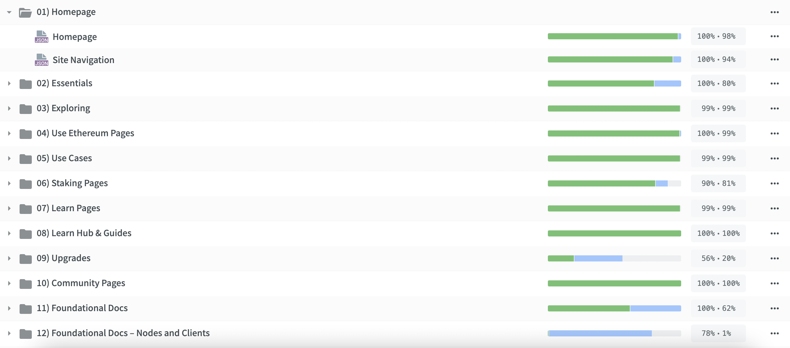
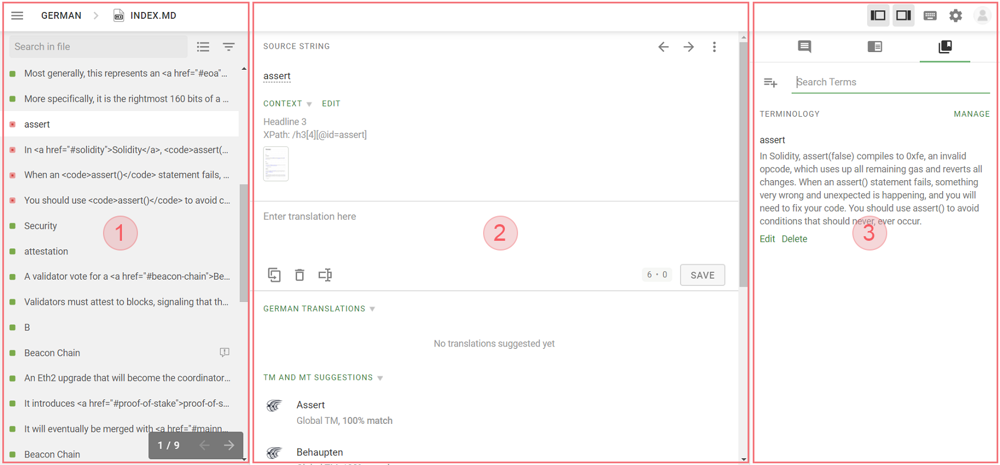

# How to translate {#how-to-translate}

## Visual guide {#visual-guide}

For more visual learners, watch Luka walk through getting set up with Crowdin. Alternatively, you can find the same steps in a written format in the next section.

<YouTube id="Ii7bYhanLs4" />

## Written guide {#written-guide}

### Join our project in Crowdin {#join-project}

You will need to log in to your Crowdin account or sign up if you don’t already have one. All that is required to sign up is an e-mail account and password.

<ButtonLink href="https://crowdin.com/project/ethereum-org/">
  Join project
</ButtonLink>

### Open your language {#open-language}

After logging in to Crowdin, you will see a project description and list of all available languages.
Each language also contains information on the total amount of translatable words and an overview of how much content has been translated and approved in a specific language.

Open the language you want to translate into to see the list of files, available for translation.

### Find a document to work on {#find-document}

The website content is divided into a number of documents and content buckets. You can check the progress of each document on the right – if translation progress is below 100%, please contribute!

Don't see your language listed? [Open an issue](https://github.com/ethereum/ethereum-org-website/issues/new/choose) or ask in our [Discord](/discord/)

A note on content buckets: we use 'content buckets' within Crowdin to get the highest priority content released first. When you check out a language, for example, [Filipino](https://crowdin.com/project/ethereum-org/fil#) you'll see folders for content bucket ("1. Homepage", "2. Essentials", "3. Exploring", etc.).

We encourage you to translate in this numerical order (1 → 2 → 3 → ⋯) to ensure the highest impact pages are translated first.

[Learn more about ethereum.org content buckets](/contributing/translation-program/content-buckets/)

### Translate {#translate}

After selecting the file you want to translate, it will open in the online editor. If you have never used Crowdin before, you can use this quick guide to go over the basics.

**_1 – Left sidebar_**

- Untranslated (red) – text that has not been worked on yet. These are the strings that you should be translating.
- Translated (green) – text that has already been translated, but not yet reviewed. You are welcome to suggest alternate translations, or vote on existing ones using the ‘’+’’ and ‘’-‘‘ buttons in the editor.
- Approved (check mark) – text that has already been reviewed and is currently live on the website.

You can also use the buttons on top to search for specific strings, filter them by status or change the view.

**_2 – Editor area_**

The main translation area – source text is displayed on top, with additional context and screenshots, if available.
To suggest a new translation, enter your translation in the ‘’Enter translation here’’ field and click Save.

You can also find existing translations of the string and translations into other languages in this section, as well as translation memory matches and machine translation suggestions.

**_3 – Right sidebar_**

This is where you can find comments, translation memory entries and glossary entries. The default view shows the comments and allows translators to communicate, raise issues or report incorrect translations.

By using the buttons on top, you can also switch to the Translation Memory, where you can search for existing translations, or to the Glossary, which contains descriptions and standard translations of key terms.

Want to learn more? Feel free to check out the [documentation on using the Crowdin online editor](https://support.crowdin.com/online-editor/)

### Review process {#review-process}

Once you've completed the translation (i.e. all files for a content bucket display 100%), our professional translation service will review (and potentially edit) the content. Once the review is complete (i.e. review progress is 100%), we will add it to the website.

<InfoBanner shouldCenter emoji=":warning:">
  Please do not use machine translation to translate the project. All the translations will be reviewed before being added to the website. If your suggested translations are found to be machine translated, they will be dismissed and contributors who use machine translation often will be removed from the project.
</InfoBanner>

### Get in touch {#get-in-touch}

Do you have any questions? Or want to collaborate with our team and other translators? Please post in the #translations channel of our [ethereum.org Discord server](/discord/)

You can also reach out to us at translations@ethereum.org

Thank you for your participation in the ethereum.org Translation Program!
