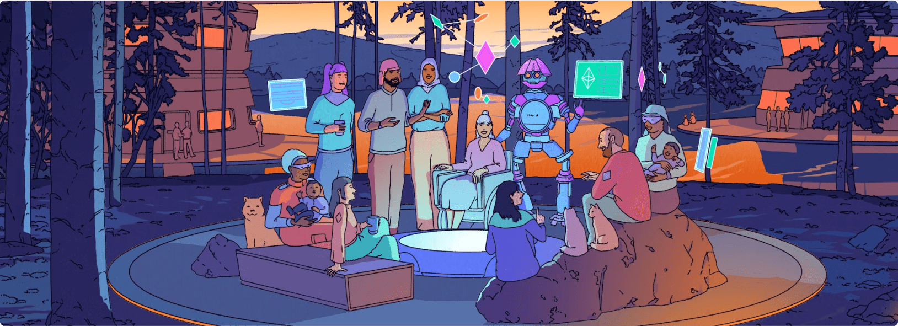

## Overview

The Translatathon brings together people from different expertise and cultures to collaborate on one goal: making Ethereum knowledge accessible in as many languages as possible. This year, with the support of local communities, we are bringing Translatathon Hubs to several cities worldwide, where people can get together, meet fellow Ethereum enthusiasts, and participate in the Translatathon.

<TwoColumnContent>
  <WhyWeDoItColumn>
    <h3>Why do we do it</h3>
    Translating is often a lonely task, but it doesn't have to be. By gathering participants in one place, they can enjoy the solitude of crafting the perfect translation while still taking breaks to socialize, have a coffee, and share the most challenging or funny terms they've encountered while translating.
  </WhyWeDoItColumn>
  <HowDoesItWorkColumn>
    <h3>How does it work</h3>
    Check the list of Translatathon Hubs to see if there's one happening in your city! Remember, the Translatathon is an online competition, so you can always participate from the comfort of your couch.
  </HowDoesItWorkColumn>
</TwoColumnContent>

## List of Translatathon Hubs

<LocalCommunitiesList />

<ApplyNow />