Since the launch of Uniswap in 2018, there have been hundreds of decentralized exchanges launched across dozens of different chains.
Many of these introduced new elements or added their own twist, but the interface has remained generally the same.

One reason for this is [Jakob’s Law](https://lawsofux.com/jakobs-law/):

> Users spend most of their time on other sites. This means that users prefer your site to work the same way as all the other sites they already know.

Thanks to early innovators like Uniswap, Pancakeswap, and Sushiswap, DeFi users have a collective idea of what a DEX looks like.
For this reason, something like “best practice” is now emerging. We see more and more design decisions being standardized across sites. You can see the evolution of DEXes as a giant example of testing it live. Things that worked stayed, things that didn’t, got tossed out. There’s still room for personality, but there are certain standards a DEX should conform to.

This article is a summary of:
- what to include
- how to make it as usable as possible
- the main ways to customize the design

All of the example wireframes were made specifically for this article, although they are all based on real projects.

The Figma kit is also included at the bottom - feel free to use it and speed up your own wireframes!

## Basic anatomy of a DEX {#basic-anatomy-of-a-dex}

The UI generally contains three elements:
1. Main form
2. Button
3. Details panel

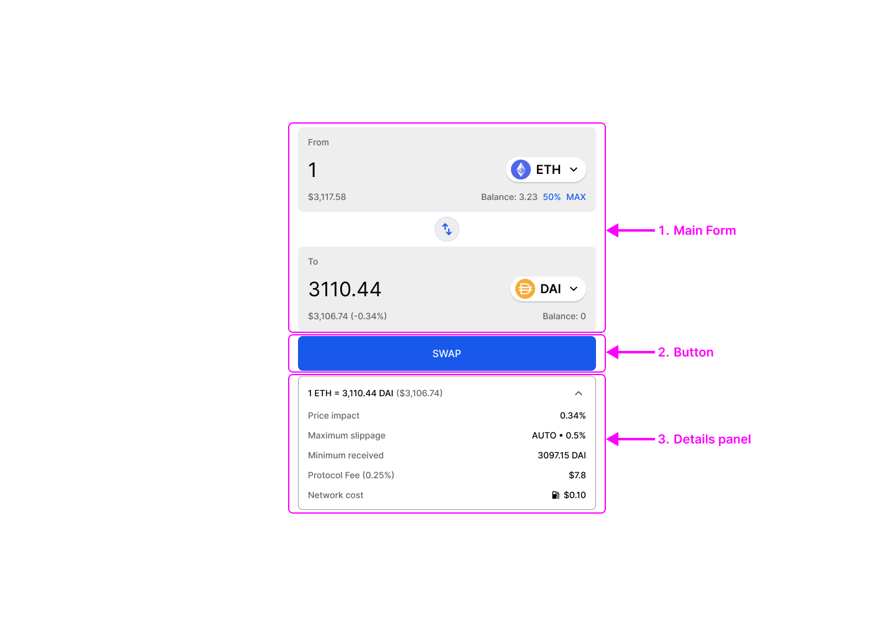

## Variations {#variations}

This will be a common theme in this article, but there are various different ways these elements can be organized. The “details panel” can be:
- Above the button
- Below the button
- Hidden in an accordion panel
- And/or on a “preview” modal
  
N.B. A “preview” modal is optional, but if you are showing very few details on the main UI, it becomes essential.

## Structure of the main form {#structure-of-the-main-form}

This is the box where you actually choose which token you want to swap. The component consists of an input field and a small button in a row.

DEXes typically display additional details in one row above and one row below, although this can be configured differently.

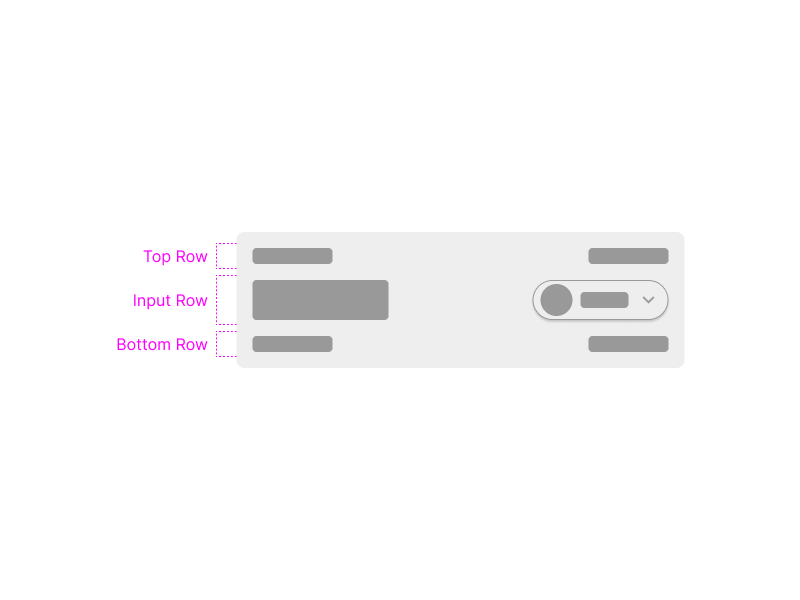

## Variations {#variations2}

Two UI variations are shown here; one without any borders, creating a very open design, and one where the input row has a border, creating a focus on that element.

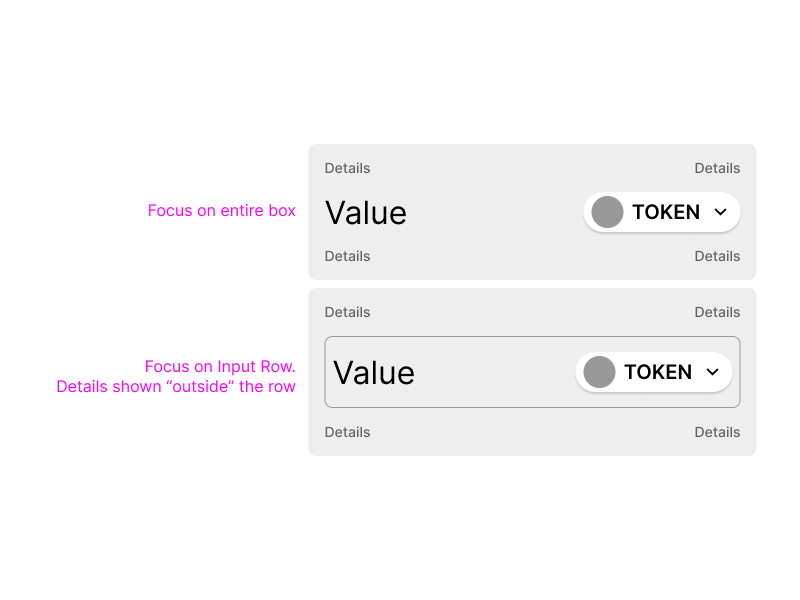

This basic structure allows **four key pieces of info** to be shown in the design: one in each corner. If there is only one top/bottom row, then there are only two spots.

During the evolution of DeFi, lots of different things have been included here.

## Key info to include {#key-info-to-include}

- Balance in wallet
- Max button
- Fiat equivalent
- Price impact on the “received” amount

In the early days of DeFi, the fiat equivalent was often missing. If you are building any sort of Web3 project, it is essential that a fiat equivalent is shown. Users still think in terms of local currencies, so in order to match real world mental models, this should be included.

On the second field (the one where you choose the token you are swapping to) you can also include the price impact next to the fiat currency amount, by calculating the difference between the input amount and estimated output amounts. This is quite a useful detail to include.

Percentage buttons (e.g. 25%, 50%, 75%) can be a useful feature, but they take up more space, add more call to actions, and add more mental load. Same with percentage sliders. Some of these UI decisions will depend on your brand and your user type.

Extra details can be shown below the main form. As this type of info is mostly for pro users, it makes sense to either:
- keep it as minimal as possible, or;
- hide it in an accordion panel

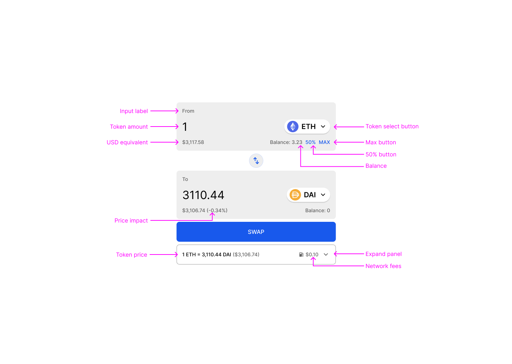

## Extra info to include {#extra-info-to-include}

- Token price
- Slippage
- Minimum received
- Expected output
- Price impact
- Gas cost estimate
- Other fees
- Order routing

Arguably, some of these details could be optional.

Order routing is interesting, but doesn’t make much difference to most users.

Some other details are simply restating the same thing in different ways. For example “minimum received” and “slippage” are two sides of the same coin. If you have slippage set at 1%, then the minimum you can expect to receive = expected output-1%. Some UIs will show expected amount, minimum amount, and slippage… Which is useful but possibly overkill. 

Most users will leave default slippage anyway.

“Price impact” is often shown in brackets next to the fiat equivalent in the “to” field. This is a great ux detail to add, but if it is shown here, does it really need to be shown again below? And then again on a preview screen?

Many users (especially those swapping small amounts) will not care about these details; they will simply enter a number and hit swap.

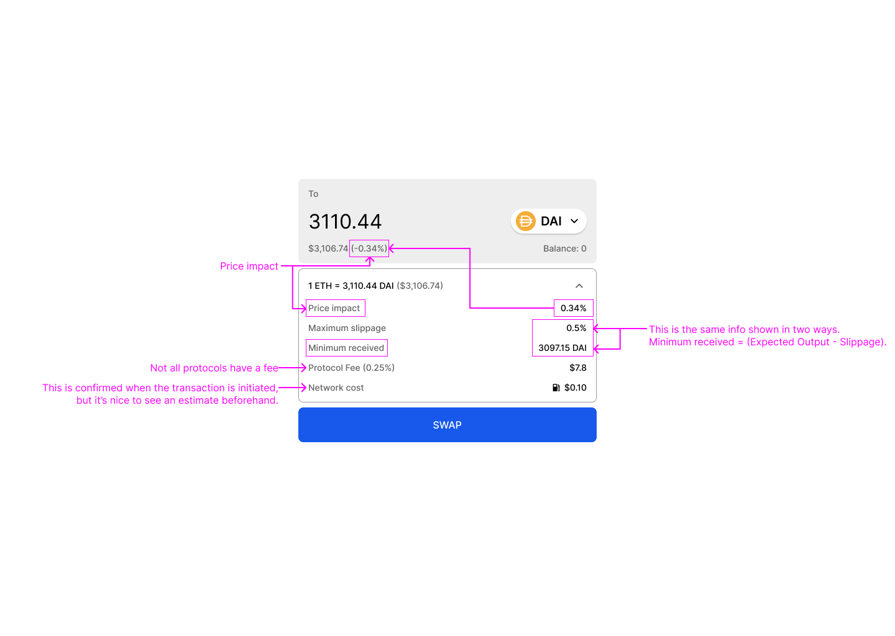

Exactly what details are shown will depend on your audience and what feel you want the app to have.

If you do include slippage tolerance in the details panel, you should also make it editable directly from here. This is a good example of an “accelerator”; a neat UX trick that can speed up experienced users’ flows, without impacting the general usability of the app.

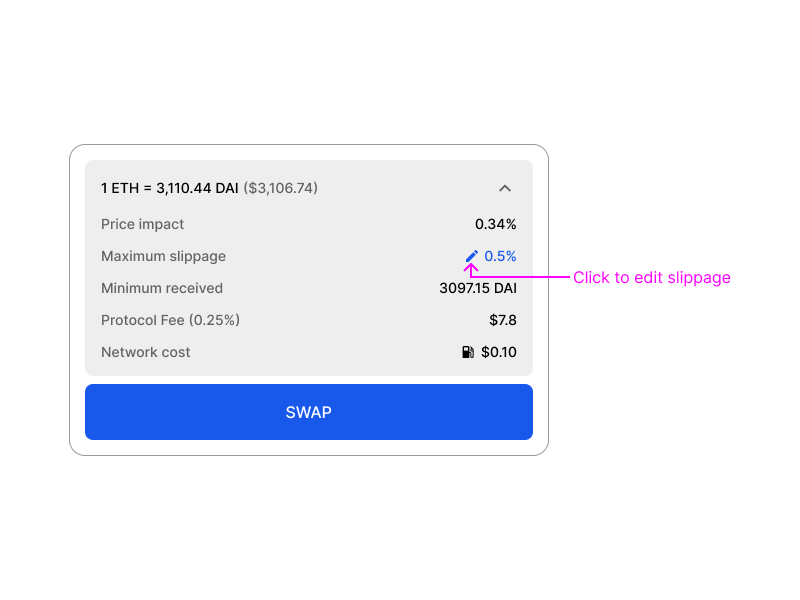

It’s a good idea to think carefully about not just one specific piece of information on one screen, but about the entire flow through:
Entering numbers in Main Form → Scanning Details → Clicking to Preview Screen (if you have a preview screen). 
Should the details panel be visible at all times, or does the user need to click it to expand?
Should you create friction by adding a preview screen? This forces the user to slow down and consider their trade, which can be useful. But do they want to see all the same info again? What is most useful to them at this point?

## Design options {#design-options}

As mentioned, a lot of this comes down to your personal style
Who is your user?
What is your brand?
Do you want a “pro” interface showing every detail, or do you want to be minimalist?
Even if you’re aiming for the pro users who want all info possible, you should still remember Alan Cooper’s wise words:

> No matter how beautiful, no matter how cool your interface, it would be better if there were less of it.

### Structure {#structure}

- tokens on the left, or tokens on the right
- 2 rows or 3
- details above or below the button
- details expanded, minimized, or not shown

### Component style {#component-style}

- empty
- outlined
- filled

From a pure UX point of view, UI style matters less than you think. Visual trends come and go in cycles, and a lot of preference is subjective.

The easiest way to get a feel for this - and think about the various different configurations - is to take a look at some examples and then do some experimenting yourself.

The included Figma kit contains empty, outlined and filled components.

Take a look at the below examples to see different ways you can put it all together:

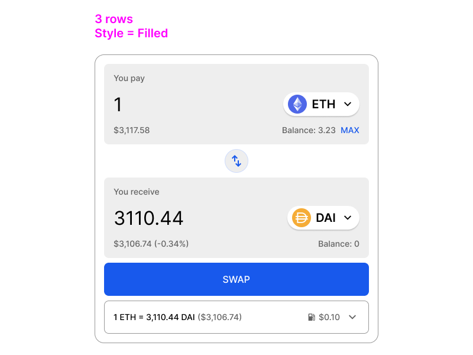

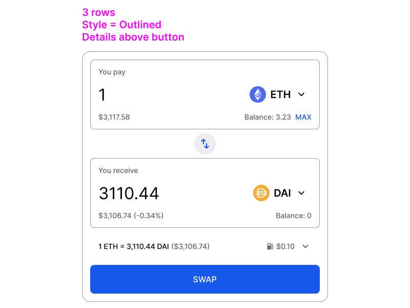

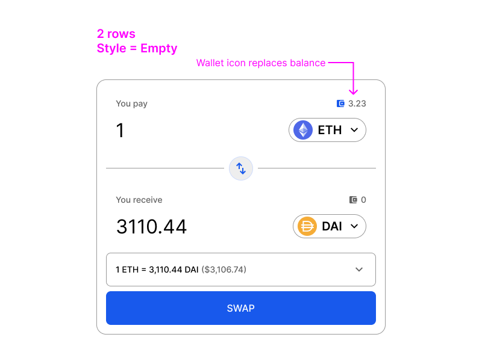

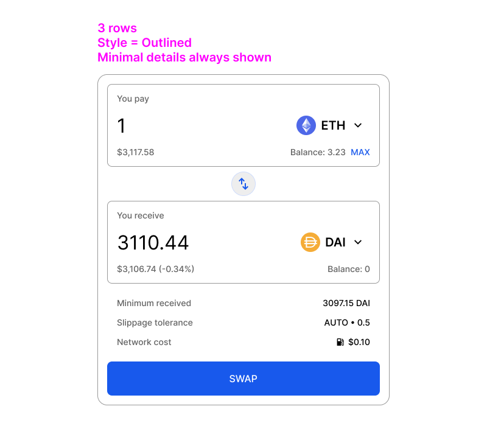

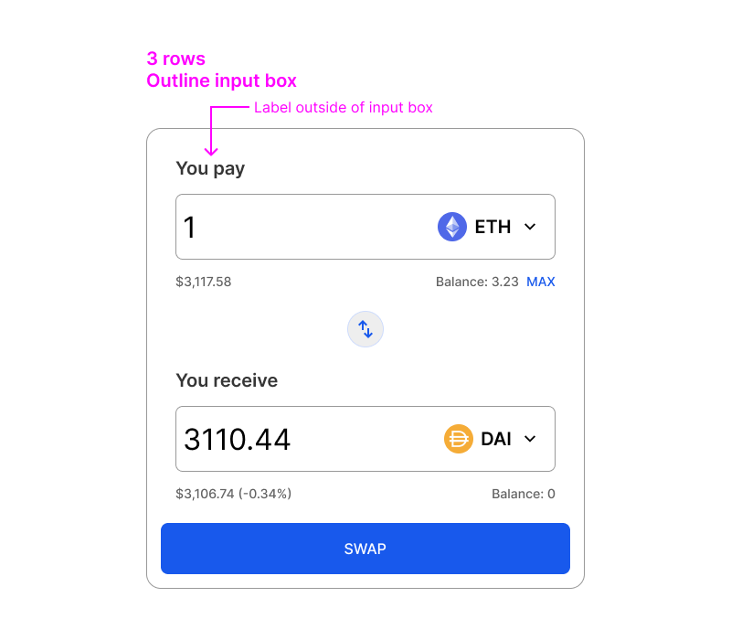

## But which side should the token go on? {#but-which-side-should-the-token-go-on}

The bottom line is that it probably doesn’t make a huge difference to usability. There are a few things to bear in mind, however, which might sway you one way or the other.

It’s been mildly interesting to see the fashion change with time. Uniswap initially had the token on the left, but has since moved it to the right. Sushiswap also made this change during a design upgrade. Most, but not all, protocols have followed suit.

Financial convention traditionally puts the currency symbol before the number, e.g. $50, €50, £50, but we *say* 50 dollars, 50 Euros, 50 pounds.

To the general user - especially someone who reads left to right, top to bottom - token on the right probably feels more natural.

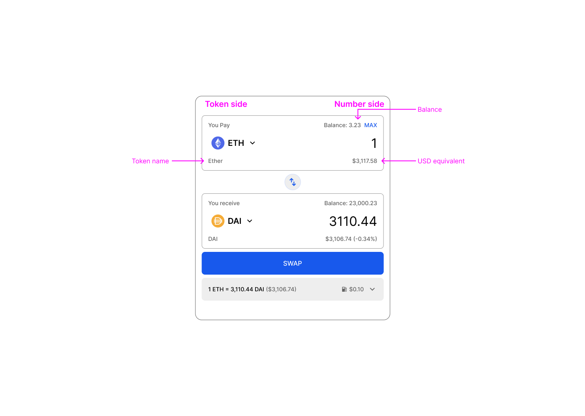

Putting the token on the left and all the numbers on the right looks pleasingly symmetrical, which is a plus, but there is another downside to this layout.

The law of proximity states that items that are close together are perceived as related. Accordingly, we want to place related items next to each other. The token balance is directly related to the token itself, and will change whenever a new token is selected. It therefore makes slightly more sense for the token balance to be next to the token select button. It could be moved underneath the token, but that breaks the symmetry of the layout.

Ultimately, there are pluses and minuses for both options, but it is interesting how the trend appears to be towards token on the right.

# Button behavior {#button-behavior}

Don’t have a separate button for Approve. Also don’t have a separate click for Approve. The user wants to Swap, so just say “swap” on the button and initiate the approval as the first step. A modal can show progress with a stepper, or a simple “tx 1 of 2 - approving” notification.

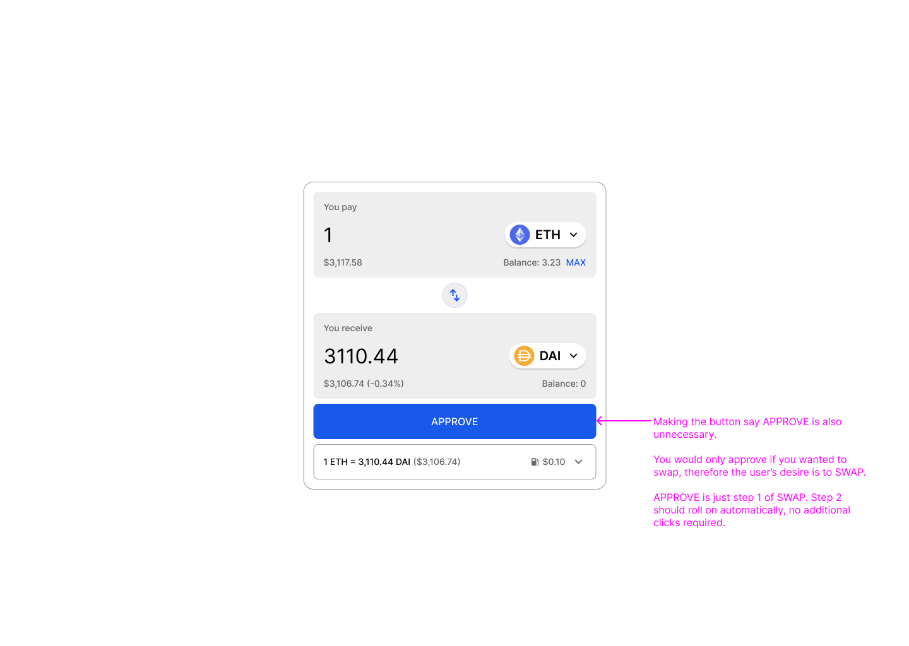

## Button as contextual help {#button-as-contextual-help}

The button can do double duty as an alert!

This is actually a fairly unusual design pattern outside of Web3, but has become standard within it. This is a good innovation as it saves space, and keeps attention focused.

If the main action - SWAP - is unavailable due to an error, the reason why can be explained with the button, e.g.:

- switch network
- connect wallet
- various errors

The button can also be **mapped to the action** that needs to be performed. For example, if the user cannot swap because they are on the wrong network, the button should say “switch to Ethereum”, and when the user clicks on the button, it should switch the network to Ethereum. This speeds up the user flow significantly.

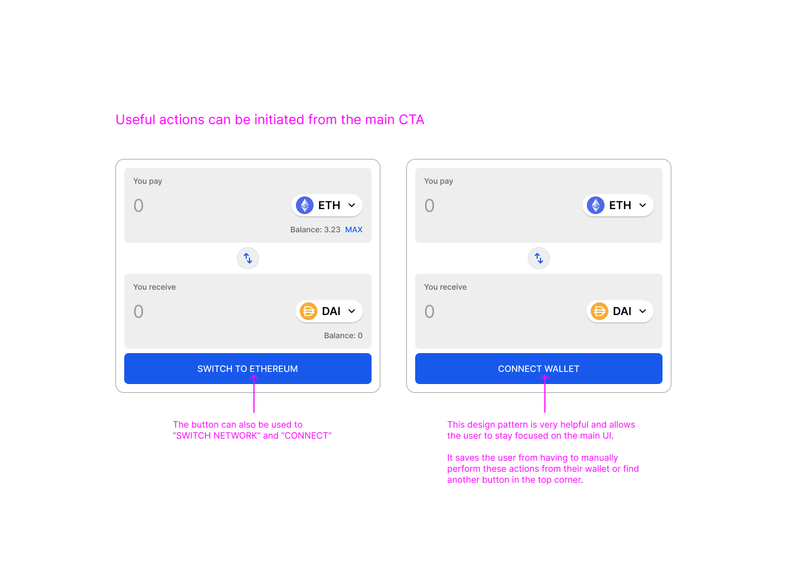

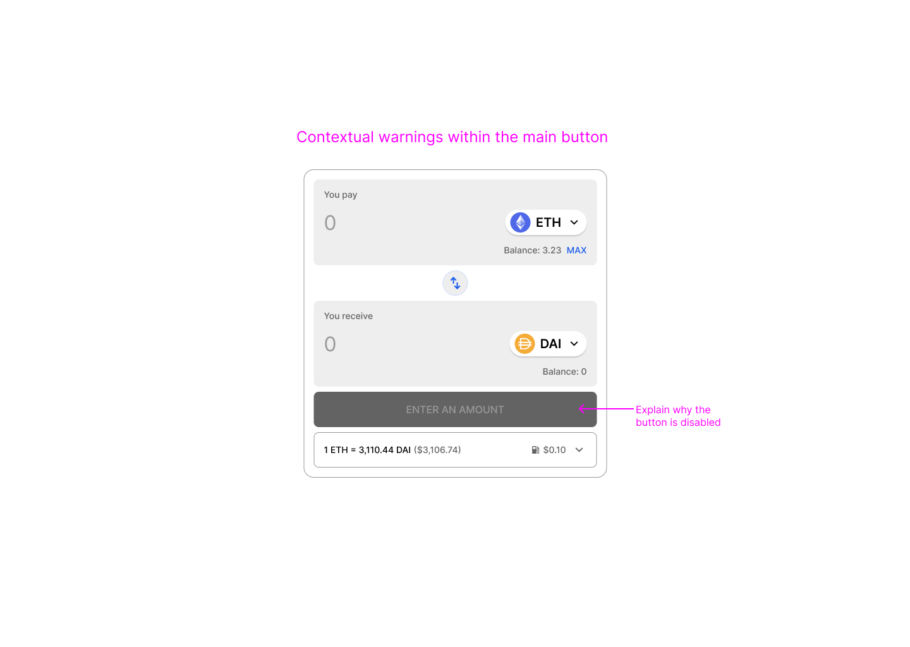

## Build your own with this figma file {#build-your-own-with-this-figma-file}

Thanks to the hard work of multiple protocols, DEX design has improved a lot. We know what info the user needs, how we should show it, and how to make the flow as smooth as possible.
Hopefully this article provides a solid overview of the UX principles. 

If you want to experiment, please feel free to use the Figma wireframe kit. It is kept as simple as possible, but has enough flexibility to build the basic structure in various ways.

[Figma wireframe kit](https://www.figma.com/community/file/1393606680816807382/dex-wireframes-kit)

DeFi will continue to evolve, and there is always room for improvement. 

Good luck!
