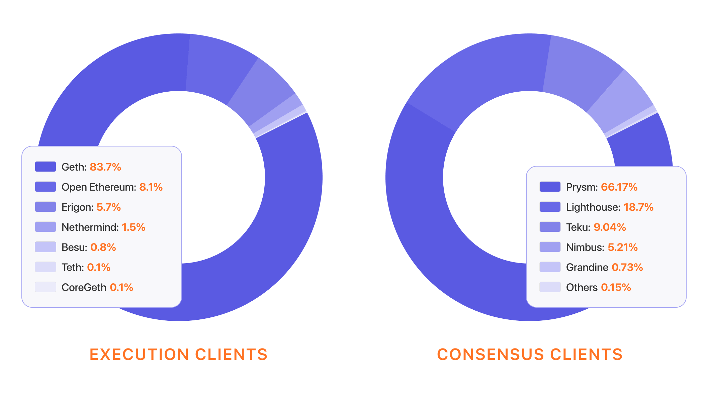

The behavior of an Ethereum node is controlled by the client software it runs. There are several production-level Ethereum clients, each one developed and maintained in different languages by separate teams. The clients are built to a common spec that ensures the clients seamlessly communicate with each other and have the same functionality and provide an equivalent user experience. However, at the moment the distribution of clients across nodes is not equal enough to realize this network fortification to its full potential. Ideally, users divide roughly equally across the various clients to bring as much client diversity as possible to the network.

## Prerequisites {#prerequisites}

If you don't already understand what nodes and clients are, check out [nodes and clients](/developers/docs/nodes-and-clients/). [Execution](/glossary/#execution-layer) and [consensus](/glossary/#consensus-layer) layers are defined in the glossary.

## Why are there multiple clients? {#why-multiple-clients}

Multiple, independently developed and maintained clients exist because client diversity makes the network more resilient to attacks and bugs. Multiple clients is a strength unique to Ethereum - other blockchains rely on the infallibility of a single client. However, it is not enough simply to have multiple clients available, they have to be adopted by the community and the total active nodes distributed relatively evenly across them.

## Why is client diversity important? {#client-diversity-importance}

Having many independently developed and maintained clients is vital for the health of a decentralized network. Let's explore the reasons why.

### Bugs {#bugs}

A bug in an individual client is less of a risk to the network when representing a minority of Ethereum nodes. With a roughly even distribution of nodes across many clients, the likelihood of most clients suffering from a shared issue is small, and as a result, the network is more robust.

### Resilience to attacks {#resilience}

Client diversity also offers resilience to attacks. For example, an attack that [tricks a particular client](https://twitter.com/vdWijden/status/1437712249926393858) onto a particular branch of the chain is unlikely to be successful because other clients are unlikely to be exploitable in the same way and the canonical chain remains uncorrupted. Low client diversity increases the risk associated with a hack on the dominant client. Client diversity has already proven to be an important defense against malicious attacks on the network, for example the Shanghai denial-of-service attack in 2016 was possible because attackers were able to trick the dominant client (Geth) into executing a slow disk i/o operation tens of thousands of times per block. Because alternative clients were also online which did not share the vulnerability, Ethereum was able to resist the attack and continue to operate while the vulnerability in Geth was fixed.

### Proof-of-stake finality {#finality}

A bug in a consensus client with over 33% of the Ethereum nodes could prevent the consensus layer from finalizing, meaning users could not trust that transactions would not be reverted or changed at some point. This would be very problematic for many of the apps built on top of Ethereum, particularly DeFi.

<Emoji text="🚨" className="me-4" /> Worse still, a critical bug in a client with a two-thirds majority could cause the chain to <a href="https://www.symphonious.net/2021/09/23/what-happens-if-beacon-chain-consensus-fails/" target="_blank">incorrectly split and finalize</a>, leading to a large set of validators getting stuck on an invalid chain. If they want to rejoin the correct chain, these validators face slashing or a slow and expensive voluntary withdrawal and reactivation. The magnitude of a slashing scales with the number of culpable nodes with a two-thirds majority slashed maximally (32 ETH).

Although these are unlikely scenarios, the Ethereum eco-system can mitigate their risk by evening out the distribution of clients across the active nodes. Ideally, no consensus client would ever reach a 33% share of the total nodes.

### Shared responsibility {#responsibility}

There is also a human cost to having majority clients. It puts excess strain and responsibility on a small development team. The lesser the client diversity, the greater the burden of responsibility for the developers maintaining the majority client. Spreading this responsibility across multiple teams is good for both the health of Ethereum's network of nodes and its network of people.

## Current client diversity {#current-client-diversity}

_Diagram data from [ethernodes.org](https://ethernodes.org) and [clientdiversity.org](https://clientdiversity.org/)_

The two pie charts above show snapshots of the current client diversity for the execution and consensus layers (at time of writing in January 2022). The execution layer is overwhelmingly dominated by [Geth](https://geth.ethereum.org/), with [Open Ethereum](https://openethereum.github.io/) a distant second, [Erigon](https://github.com/ledgerwatch/erigon) third and [Nethermind](https://nethermind.io/) fourth, with other clients comprising less than 1 % of the network. The most commonly used client on the consensus layer - [Prysm](https://prysmaticlabs.com/#projects) - is not as dominant as Geth but still represents over 60% of the network. [Lighthouse](https://lighthouse.sigmaprime.io/) and [Teku](https://consensys.net/knowledge-base/ethereum-2/teku/) make up ~20% and ~14% respectively, and other clients are rarely used.

The execution layer data were obtained from [Ethernodes](https://ethernodes.org) on 23-Jan-2022. Data for consensus clients was obtained from [Michael Sproul](https://github.com/sigp/blockprint). Consensus client data is more difficult to obtain because the consensus layer clients do not always have unambiguous traces that can be used to identify them. The data was generated using a classification algorithm that sometimes confuses some of the minority clients (see [here](https://twitter.com/sproulM_/status/1440512518242197516) for more details). In the diagram above, these ambiguous classifications are treated with an either/or label (e.g. Nimbus/Teku). Nevertheless, it is clear that the majority of the network is running Prysm. The data is a snapshot over a fixed set of blocks (in this case Beacon blocks in slots 2048001 to 2164916) and Prysm's dominance has sometimes been higher, exceeding 68%. Despite only being snapshots, the values in the diagram provide a good general sense of the current state of client diversity.

Up to date client diversity data for the consensus layer is now available at [clientdiversity.org](https://clientdiversity.org/).

## Execution layer {#execution-layer}

Until now, the conversation around client diversity has focused mainly on the consensus layer. However, the execution client [Geth](https://geth.ethereum.org) currently accounts for around 85% of all nodes. This percentage is problematic for the same reasons as for consensus clients. For example, a bug in Geth affecting transaction handling or constructing execution payloads could lead to consensus clients finalizing problematic or bugged transactions. Therefore, Ethereum would be healthier with a more even distribution of execution clients, ideally with no client representing more than 33% of the network.

## Use a minority client {#use-minority-client}

Addressing client diversity requires more than individual users to choose minority clients - it requires mining/validator pools and institutions like the major dapps and exchanges to switch clients too. However, all users can do their part in redressing the current imbalance and normalizing the use of all the available Ethereum software. After The Merge, all node operators will be required to run an execution client and a consensus client. Choosing combinations of the clients suggested below will help increase client diversity.

### Execution clients {#execution-clients}

[Besu](https://www.hyperledger.org/use/besu)

[Nethermind](https://downloads.nethermind.io/)

[Erigon](https://github.com/ledgerwatch/erigon)

[Go-Ethereum](https://geth.ethereum.org/)

### Consensus clients {#consensus-clients}

[Nimbus](https://nimbus.team/)

[Lighthouse](https://github.com/sigp/lighthouse)

[Teku](https://consensys.net/knowledge-base/ethereum-2/teku/)

[Lodestar](https://github.com/ChainSafe/lodestar)

[Prysm](https://docs.prylabs.network/docs/getting-started)

[Grandine](https://docs.grandine.io/)

Technical users can help accelerate this process by writing more tutorials and documentation for minority clients and encouraging their node-operating peers to migrate away from the dominant clients. Guides for switching to a minority consensus client are available on [clientdiversity.org](https://clientdiversity.org/).

## Client diversity dashboards {#client-diversity-dashboards}

Several dashboards give real-time client diversity statistics for the execution and consensus layer.

**Consensus layer:**

- [Rated.network](https://www.rated.network/)
- [clientdiversity.org](https://clientdiversity.org/)
  **Execution layer:**

- [supermajority.info](https://supermajority.info//)
- [Ethernodes](https://ethernodes.org/)

## Further reading {#further-reading}

- [Client diversity on Ethereum's consensus layer](https://mirror.xyz/jmcook.eth/S7ONEka_0RgtKTZ3-dakPmAHQNPvuj15nh0YGKPFriA)
- [Ethereum Merge: Run the majority client at your own peril!](https://dankradfeist.de/ethereum/2022/03/24/run-the-majority-client-at-your-own-peril.html) – _Dankrad Fiest, March 24 2022_
- [Importance of client diversity](https://our.status.im/the-importance-of-client-diversity/)
- [List of Ethereum node services](https://ethereumnodes.com/)
- ["Five Whys" of the client diversity problem](https://notes.ethereum.org/@afhGjrKfTKmksTOtqhB9RQ/BJGj7uh08)
- [Ethereum Diversity and How to Solve For It (YouTube)](https://www.youtube.com/watch?v=1hZgCaiqwfU)
- [clientdiversity.org](https://clientdiversity.org/)

## Related topics {#related-topics}

- [Run an Ethereum node](/run-a-node/)
- [Nodes and clients](/developers/docs/nodes-and-clients/)
