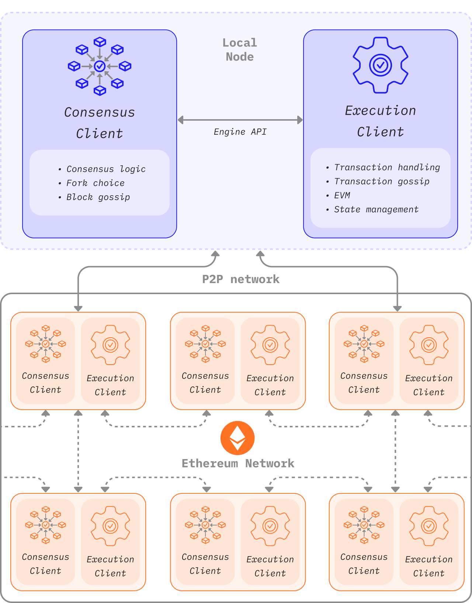

An Ethereum node is composed of two clients: an [execution client](/developers/docs/nodes-and-clients/#execution-clients) and a [consensus client](/developers/docs/nodes-and-clients/#consensus-clients).

When Ethereum was using [proof-of-work](/developers/docs/consensus-mechanisms/pow/), an execution client was enough to run a full Ethereum node. However, since implementing [proof-of-stake](/developers/docs/consensus-mechanisms/pow/), the execution client needs to be used alongside another piece of software called a [“consensus client”](/developers/docs/nodes-and-clients/#consensus-clients).

The diagram below shows the relationship between the two Ethereum clients. The two clients connect to their own respective peer-to-peer (P2P) networks. Separate P2P networks are needed as the execution clients gossip transactions over their P2P network, enabling them to manage their local transaction pool, whilst the consensus clients gossip blocks over their P2P network, enabling consensus and chain growth.

For this two-client structure to work, consensus clients must be able to pass bundles of transactions to the execution client. Executing the transactions locally is how the client validates that the transactions do not violate any Ethereum rules and that the proposed update to Ethereum’s state is correct. Likewise, when the node is selected to be a block producer the consensus client must be able to request bundles of transactions from Geth to include in the new block and execute them to update the global state. This inter-client communication is handled by a local RPC connection using the [engine API](https://github.com/ethereum/execution-apis/blob/main/src/engine/common.md).

## What does the execution client do? {#execution-client}

The execution client is responsible for transaction handling, transaction gossip, state management and supporting the Ethereum Virtual Machine ([EVM](/developers/docs/evm/)). However, it is **not** responsible for block building, block gossiping or handling consensus logic. These are in the remit of the consensus client.

The execution client creates execution payloads - the list of transactions, updated state trie, and other execution-related data. Consensus clients include the execution payload in every block. The execution client is also responsible for re-executing transactions in new blocks to ensure they are valid. Executing transactions is done on the execution client's embedded computer, known as the [Ethereum Virtual Machine (EVM)](/developers/docs/evm).

The execution client also offers a user interface to Ethereum through [RPC methods](/developers/docs/apis/json-rpc) that enable users to query the Ethereum blockchain, submit transactions and deploy smart contracts. It's common for RPC calls to be handled by a library like [Web3js](https://docs.web3js.org/), [Web3py](https://web3py.readthedocs.io/en/v5/), or by a user-interface such as a browser wallet.

In summary, the execution client is:

- a user gateway to Ethereum
- home to the Ethereum Virtual Machine, Ethereum's state and transaction pool.

## What does the consensus client do? {#consensus-client}

The consensus client deals with all the logic that enables a node to stay in sync with the Ethereum network. This includes receiving blocks from peers and running a fork choice algorithm to ensure the node always follows the chain with the greatest accumulation of attestations (weighted by validator effective balances). Similar to the execution client, consensus clients have their own P2P network through which they share blocks and attestations.

The consensus client does not participate in attesting to or proposing blocks - this is done by a validator, an optional add-on to a consensus client. A consensus client without a validator only keeps up with the head of the chain, allowing the node to stay synced. This enables a user to transact with Ethereum using their execution client, confident that they are on the correct chain.

## Validators {#validators}

Node operators can add a validator to their consensus clients by depositing 32 ETH in the deposit contract. The validator client comes bundled with the consensus client and can be added to a node at any time. The validator handles attestations and block proposals. They enable a node to accrue rewards or lose ETH via penalties or slashing. Running the validator software also makes a node eligible to be selected to propose a new block.

[More on staking](/staking/).

## Components of a node comparison {#node-comparison}

| Execution Client                                   | Consensus Client                                                 | Validator                    |
| -------------------------------------------------- | ---------------------------------------------------------------- | ---------------------------- |
| Gossips transactions over its p2p network          | Gossips blocks and attestations over its p2p network             | Proposes blocks              |
| Executes/re-executes transactions                  | Runs the fork choice algorithm                                   | Accrues rewards/penalties    |
| Verifies incoming state changes                    | Keeps track of the head of the chain                             | Makes attestations           |
| Manages state and receipts tries                   | Manages the Beacon state (contains consensus and execution info) | Requires 32 ETH to be staked |
| Creates execution payload                          | Keeps track of accumulated randomness in RANDAO                  | Can be slashed               |
| Exposes JSON-RPC API for interacting with Ethereum | Keeps track of justification and finalization                    |                              |

## Further reading {#further-reading}

- [Proof-of-stake](/developers/docs/consensus-mechanisms/pos)
- [Block proposal](/developers/docs/consensus-mechanisms/pos/block-proposal)
- [Validator rewards and penalties](/developers/docs/consensus-mechanisms/pos/rewards-and-penalties)
