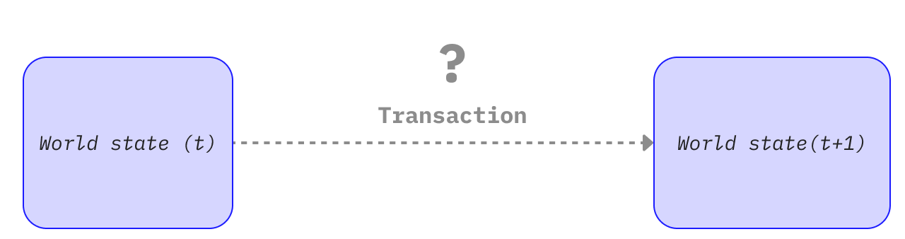
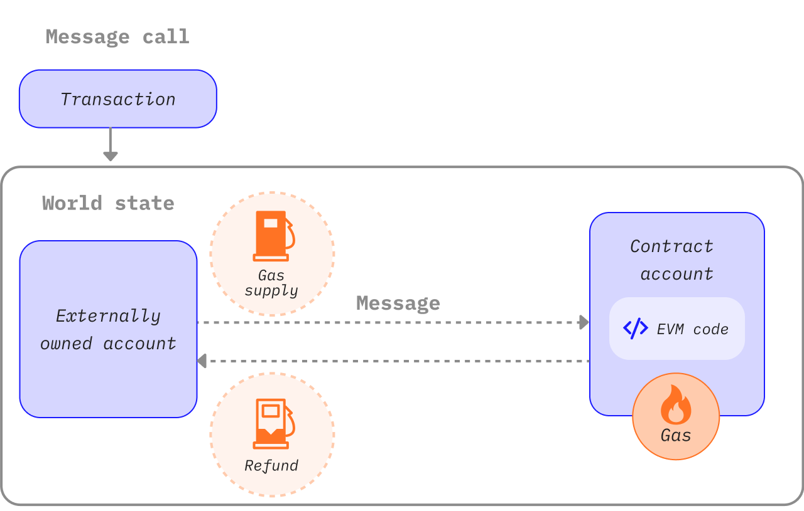

Transactions are cryptographically signed instructions from accounts. An account will initiate a transaction to update the state of the Ethereum network. The simplest transaction is transferring ETH from one account to another.

## Prerequisites {#prerequisites}

To help you better understand this page, we recommend you first read [Accounts](/developers/docs/accounts/) and our [introduction to Ethereum](/developers/docs/intro-to-ethereum/).

## What's a transaction? {#whats-a-transaction}

An Ethereum transaction refers to an action initiated by an externally-owned account, in other words an account managed by a human, not a contract. For example, if Bob sends Alice 1 ETH, Bob's account must be debited and Alice's must be credited. This state-changing action takes place within a transaction.


_Diagram adapted from [Ethereum EVM illustrated](https://takenobu-hs.github.io/downloads/ethereum_evm_illustrated.pdf)_

Transactions, which change the state of the EVM, need to be broadcast to the whole network. Any node can broadcast a request for a transaction to be executed on the EVM; after this happens, a validator will execute the transaction and propagate the resulting state change to the rest of the network.

Transactions require a fee and must be included in a validated block. To make this overview simpler we'll cover gas fees and validation elsewhere.

A submitted transaction includes the following information:

- `from` – the address of the sender, that will be signing the transaction. This will be an externally-owned account as contract accounts cannot send transactions
- `to` – the receiving address (if an externally-owned account, the transaction will transfer value. If a contract account, the transaction will execute the contract code)
- `signature` – the identifier of the sender. This is generated when the sender's private key signs the transaction and confirms the sender has authorized this transaction
- `nonce` - a sequentially incrementing counter which indicates the transaction number from the account
- `value` – amount of ETH to transfer from sender to recipient (denominated in WEI, where 1ETH equals 1e+18wei)
- `input data` – optional field to include arbitrary data
- `gasLimit` – the maximum amount of gas units that can be consumed by the transaction. The [EVM](/developers/docs/evm/opcodes) specifies the units of gas required by each computational step
- `maxPriorityFeePerGas` - the maximum price of the consumed gas to be included as a tip to the validator
- `maxFeePerGas` - the maximum fee per unit of gas willing to be paid for the transaction (inclusive of `baseFeePerGas` and `maxPriorityFeePerGas`)

Gas is a reference to the computation required to process the transaction by a validator. Users have to pay a fee for this computation. The `gasLimit`, and `maxPriorityFeePerGas` determine the maximum transaction fee paid to the validator. [More on Gas](/developers/docs/gas/).

The transaction object will look a little like this:

```js
{
  from: "0xEA674fdDe714fd979de3EdF0F56AA9716B898ec8",
  to: "0xac03bb73b6a9e108530aff4df5077c2b3d481e5a",
  gasLimit: "21000",
  maxFeePerGas: "300",
  maxPriorityFeePerGas: "10",
  nonce: "0",
  value: "10000000000"
}
```

But a transaction object needs to be signed using the sender's private key. This proves that the transaction could only have come from the sender and was not sent fraudulently.

An Ethereum client like Geth will handle this signing process.

Example [JSON-RPC](/developers/docs/apis/json-rpc) call:

```json
{
  "id": 2,
  "jsonrpc": "2.0",
  "method": "account_signTransaction",
  "params": [
    {
      "from": "0x1923f626bb8dc025849e00f99c25fe2b2f7fb0db",
      "gas": "0x55555",
      "maxFeePerGas": "0x1234",
      "maxPriorityFeePerGas": "0x1234",
      "input": "0xabcd",
      "nonce": "0x0",
      "to": "0x07a565b7ed7d7a678680a4c162885bedbb695fe0",
      "value": "0x1234"
    }
  ]
}
```

Example response:

```json
{
  "jsonrpc": "2.0",
  "id": 2,
  "result": {
    "raw": "0xf88380018203339407a565b7ed7d7a678680a4c162885bedbb695fe080a44401a6e4000000000000000000000000000000000000000000000000000000000000001226a0223a7c9bcf5531c99be5ea7082183816eb20cfe0bbc322e97cc5c7f71ab8b20ea02aadee6b34b45bb15bc42d9c09de4a6754e7000908da72d48cc7704971491663",
    "tx": {
      "nonce": "0x0",
      "maxFeePerGas": "0x1234",
      "maxPriorityFeePerGas": "0x1234",
      "gas": "0x55555",
      "to": "0x07a565b7ed7d7a678680a4c162885bedbb695fe0",
      "value": "0x1234",
      "input": "0xabcd",
      "v": "0x26",
      "r": "0x223a7c9bcf5531c99be5ea7082183816eb20cfe0bbc322e97cc5c7f71ab8b20e",
      "s": "0x2aadee6b34b45bb15bc42d9c09de4a6754e7000908da72d48cc7704971491663",
      "hash": "0xeba2df809e7a612a0a0d444ccfa5c839624bdc00dd29e3340d46df3870f8a30e"
    }
  }
}
```

- the `raw` is the signed transaction in [Recursive Length Prefix (RLP)](/developers/docs/data-structures-and-encoding/rlp) encoded form
- the `tx` is the signed transaction in JSON form

With the signature hash, the transaction can be cryptographically proven that it came from the sender and submitted to the network.

### The data field {#the-data-field}

The vast majority of transactions access a contract from an externally-owned account.
Most contracts are written in Solidity and interpret their data field in accordance with the [application binary interface (ABI)](/glossary/#abi).

The first four bytes specify which function to call, using the hash of the function's name and arguments.
You can sometimes identify the function from the selector using [this database](https://www.4byte.directory/signatures/).

The rest of the calldata is the arguments, [encoded as specified in the ABI specs](https://docs.soliditylang.org/en/latest/abi-spec.html#formal-specification-of-the-encoding).

For example, lets look at [this transaction](https://etherscan.io/tx/0xd0dcbe007569fcfa1902dae0ab8b4e078efe42e231786312289b1eee5590f6a1).
Use **Click to see More** to see the calldata.

The function selector is `0xa9059cbb`. There are several [known functions with this signature](https://www.4byte.directory/signatures/?bytes4_signature=0xa9059cbb).
In this case [the contract source code](https://etherscan.io/address/0xa0b86991c6218b36c1d19d4a2e9eb0ce3606eb48#code) has been uploaded to Etherscan, so we know the function is `transfer(address,uint256)`.

The rest of the data is:

```
0000000000000000000000004f6742badb049791cd9a37ea913f2bac38d01279
000000000000000000000000000000000000000000000000000000003b0559f4
```

According to the ABI specifications, integer values (such as addresses, which are 20-byte integers) appear in the ABI as 32-byte words, padded with zeros in the front.
So we know that the `to` address is [`4f6742badb049791cd9a37ea913f2bac38d01279`](https://etherscan.io/address/0x4f6742badb049791cd9a37ea913f2bac38d01279).
The `value` is 0x3b0559f4 = 990206452.

## Types of transactions {#types-of-transactions}

On Ethereum there are a few different types of transactions:

- Regular transactions: a transaction from one account to another.
- Contract deployment transactions: a transaction without a 'to' address, where the data field is used for the contract code.
- Execution of a contract: a transaction that interacts with a deployed smart contract. In this case, 'to' address is the smart contract address.

### On gas {#on-gas}

As mentioned, transactions cost [gas](/developers/docs/gas/) to execute. Simple transfer transactions require 21000 units of Gas.

So for Bob to send Alice 1 ETH at a `baseFeePerGas` of 190 gwei and `maxPriorityFeePerGas` of 10 gwei, Bob will need to pay the following fee:

```
(190 + 10) * 21000 = 4,200,000 gwei
--or--
0.0042 ETH
```

Bob's account will be debited **-1.0042 ETH** (1 ETH for Alice + 0.0042 ETH in gas fees)

Alice's account will be credited **+1.0 ETH**

The base fee will be burned **-0.00399 ETH**

Validator keeps the tip **+0.000210 ETH**



_Diagram adapted from [Ethereum EVM illustrated](https://takenobu-hs.github.io/downloads/ethereum_evm_illustrated.pdf)_

Any gas not used in a transaction is refunded to the user account.

### Smart contract interactions {#smart-contract-interactions}

Gas is required for any transaction that involves a smart contract.

Smart contracts can also contain functions known as [`view`](https://docs.soliditylang.org/en/latest/contracts.html#view-functions) or [`pure`](https://docs.soliditylang.org/en/latest/contracts.html#pure-functions) functions, which do not alter the state of the contract. As such, calling these functions from an EOA will not require any gas. The underlying RPC call for this scenario is [`eth_call`](/developers/docs/apis/json-rpc#eth_call).

Unlike when accessed using `eth_call`, these `view` or `pure` functions are also commonly called internally (i.e. from the contract itself or from another contract) which does cost gas.

## Transaction lifecycle {#transaction-lifecycle}

Once the transaction has been submitted the following happens:

1. A transaction hash is cryptographically generated:
   `0x97d99bc7729211111a21b12c933c949d4f31684f1d6954ff477d0477538ff017`
2. The transaction is then broadcasted to the network and added to a transaction pool consisting of all other pending network transactions.
3. A validator must pick your transaction and include it in a block in order to verify the transaction and consider it "successful".
4. As time passes the block containing your transaction will be upgraded to "justified" then "finalized". These upgrades make it much
   more certain that your transaction was successful and will never be altered. Once a block is "finalized" it could only ever be changed
   by a network level attack that would cost many billions of dollars.

## A visual demo {#a-visual-demo}

Watch Austin walk you through transactions, gas, and mining.

<YouTube id="er-0ihqFQB0" />

## Typed Transaction Envelope {#typed-transaction-envelope}

Ethereum originally had one format for transactions. Each transaction contained a nonce, gas price, gas limit, to address, value, data, v, r, and s. These fields are [RLP-encoded](/developers/docs/data-structures-and-encoding/rlp/), to look something like this:

`RLP([nonce, gasPrice, gasLimit, to, value, data, v, r, s])`

Ethereum has evolved to support multiple types of transactions to allow for new features such as access lists and [EIP-1559](https://eips.ethereum.org/EIPS/eip-1559) to be implemented without affecting legacy transaction formats.

[EIP-2718](https://eips.ethereum.org/EIPS/eip-2718) is what allows for this behavior. Transactions are interpreted as:

`TransactionType || TransactionPayload`

Where the fields are defined as:

- `TransactionType` - a number between 0 and 0x7f, for a total of 128 possible transaction types.
- `TransactionPayload` - an arbitrary byte array defined by the transaction type.

Based on the `TransactionType` value, a transaction can be classified as:

1. **Type 0 (Legacy) Transactions:** The original transaction format used since Ethereum's launch. They do not include features from [EIP-1559](https://eips.ethereum.org/EIPS/eip-1559) such as dynamic gas fee calculations or access lists for smart contracts. Legacy transactions lack a specific prefix indicating their type in their serialized form, starting with the byte `0xf8` when using [Recursive Length Prefix (RLP)](/developers/docs/data-structures-and-encoding/rlp) encoding. The TransactionType value for these transactions is `0x0`.

2. **Type 1 Transactions:** Introduced in [EIP-2930](https://eips.ethereum.org/EIPS/eip-2930) as part of Ethereum's [Berlin Upgrade](/history/#berlin), these transactions include an `accessList` parameter. This list specifies addresses and storage keys the transaction expects to access, helping to potentially reduce [gas](/developers/docs/gas/) costs for complex transactions involving smart contracts. EIP-1559 fee market changes are not included in Type 1 transactions. Type 1 transactions also include a `yParity` parameter, which can either be `0x0` or `0x1`, indicating the parity of the y-value of the secp256k1 signature. They are identified by starting with the byte `0x01`, and their TransactionType value is `0x1`.

3. **Type 2 Transactions**, commonly referred to as EIP-1559 transactions, are transactions introduced in [EIP-1559](https://eips.ethereum.org/EIPS/eip-1559), in Ethereum's [London Upgrade](/history/#london). They have become the standard transaction type on the Ethereum network. These transactions introduce a new fee market mechanism that improves predictability by separating the transaction fee into a base fee and a priority fee. They start with the byte `0x02` and include fields such as `maxPriorityFeePerGas` and `maxFeePerGas`. Type 2 transactions are now the default due to their flexibility and efficiency, especially favored during periods of high network congestion for their ability to help users manage transaction fees more predictably. The TransactionType value for these transactions is `0x2`.


## Further reading {#further-reading}

- [EIP-2718: Typed Transaction Envelope](https://eips.ethereum.org/EIPS/eip-2718)

_Know of a community resource that helped you? Edit this page and add it!_

## Related topics {#related-topics}

- [Accounts](/developers/docs/accounts/)
- [Ethereum virtual machine (EVM)](/developers/docs/evm/)
- [Gas](/developers/docs/gas/)
