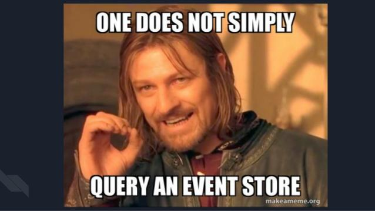
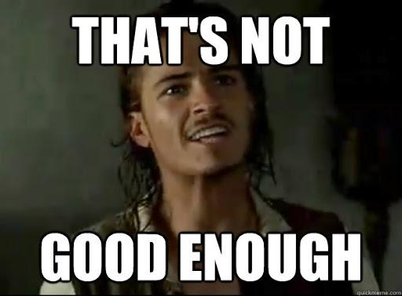
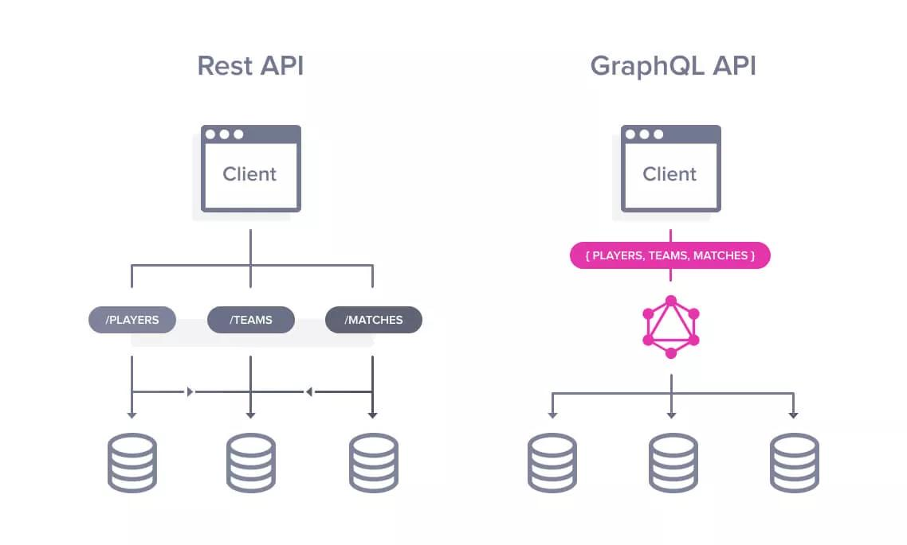
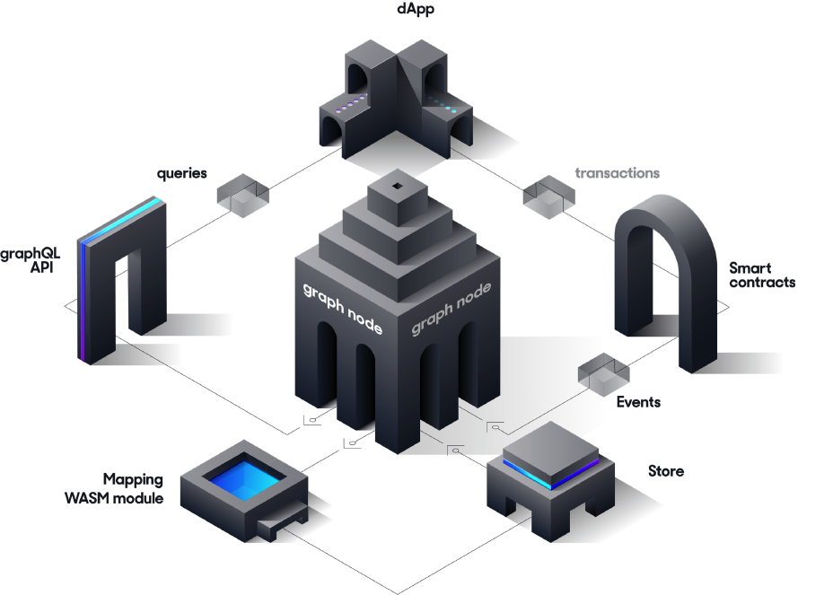
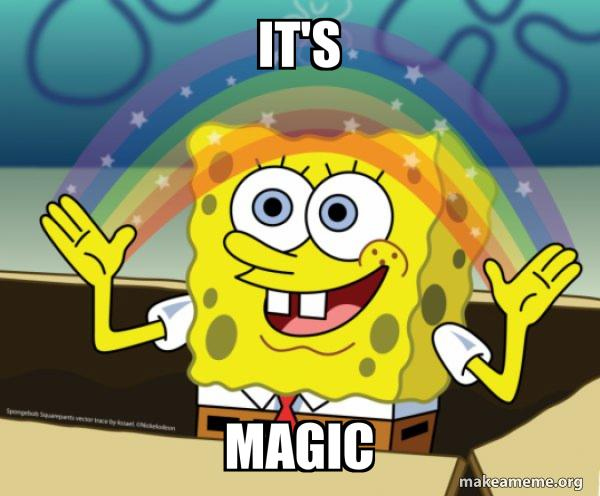
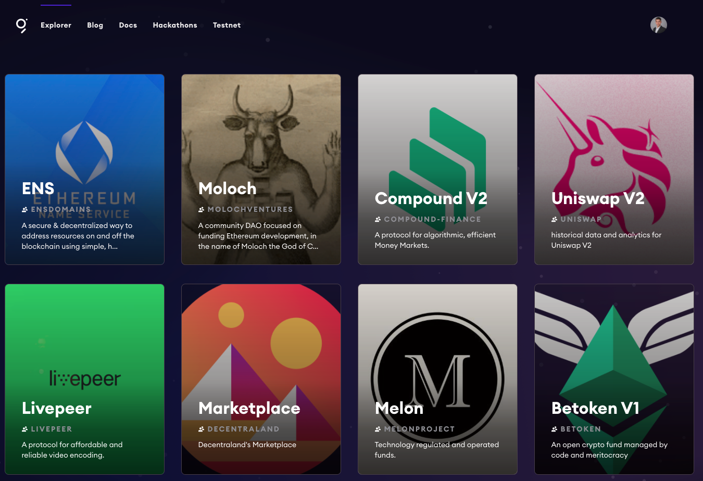

This time we will take a closer look at The Graph which essentially became part of the standard stack for developing dapps in the last year. Let's first see how we would do things the traditional way...

## Without The Graph... {#without-the-graph}

So let's go with a simple example for illustration purposes. We all like games, so imagine a simple game with users placing bets:

```solidity
pragma solidity 0.7.1;

contract Game {
    uint256 totalGamesPlayerWon = 0;
    uint256 totalGamesPlayerLost = 0;
    event BetPlaced(address player, uint256 value, bool hasWon);

    function placeBet() external payable {
        bool hasWon = evaluateBetForPlayer(msg.sender);

        if (hasWon) {
            (bool success, ) = msg.sender.call{ value: msg.value * 2 }('');
            require(success, "Transfer failed");
            totalGamesPlayerWon++;
        } else {
            totalGamesPlayerLost++;
        }

        emit BetPlaced(msg.sender, msg.value, hasWon);
    }
}
```

Now let's say in our dapp, we want to display total bets, the total games lost/won and also update it whenever someone plays again. The approach would be:

1. Fetch `totalGamesPlayerWon`.
2. Fetch `totalGamesPlayerLost`.
3. Subscribe to `BetPlaced` events.

We can listen to the [event in Web3](https://docs.web3js.org/api/web3/class/Contract#events) as shown on the right, but it requires handling quite a few cases.

```solidity
GameContract.events.BetPlaced({
    fromBlock: 0
}, function(error, event) { console.log(event); })
.on('data', function(event) {
    // event fired
})
.on('changed', function(event) {
    // event was removed again
})
.on('error', function(error, receipt) {
    // tx rejected
});
```

Now this is still somewhat fine for our simple example. But let's say we want to now display the amounts of bets lost/won only for the current player. Well we're out of luck, you better deploy a new contract that stores those values and fetch them. And now imagine a much more complicated smart contract and dapp, things can get messy quickly.



You can see how this is not optimal:

- Doesn't work for already deployed contracts.
- Extra gas costs for storing those values.
- Requires another call to fetch the data for an Ethereum node.



Now let's look at a better solution.

## Let me introduce you to GraphQL {#let-me-introduce-to-you-graphql}

First let's talk about GraphQL, originally designed and implemented by Facebook. You might be familiar with the traditional REST API model. Now imagine instead you could write a query for exactly the data that you wanted:




The two images pretty much capture the essence of GraphQL. With the query on the right we can define exactly what data we want, so there we get everything in one request and nothing more than exactly what we need. A GraphQL server handles the fetching of all data required, so it is incredibly easy for the frontend consumer side to use. [This is a nice explanation](https://www.apollographql.com/blog/graphql-explained-5844742f195e/) of how exactly the server handles a query if you're interested.

Now with that knowledge, let's finally jump into blockchain space and The Graph.

## What is The Graph? {#what-is-the-graph}

A blockchain is a decentralized database, but in contrast to what's usually the case, we don't have a query language for this database. Solutions for retrieving data are painful or completely impossible. The Graph is a decentralized protocol for indexing and querying blockchain data. And you might have guessed it, it's using GraphQL as query language.



Examples are always the best to understand something, so let's use The Graph for our GameContract example.

## How to create a Subgraph {#how-to-create-a-subgraph}

The definition for how to index data is called subgraph. It requires three components:

1. Manifest (`subgraph.yaml`)
2. Schema (`schema.graphql`)
3. Mapping (`mapping.ts`)

### Manifest (`subgraph.yaml`) {#manifest}

The manifest is our configuration file and defines:

- which smart contracts to index (address, network, ABI...)
- which events to listen to
- other things to listen to like function calls or blocks
- the mapping functions being called (see `mapping.ts` below)

You can define multiple contracts and handlers here. A typical setup would have a subgraph folder inside the Hardhat project with its own repository. Then you can easily reference the ABI.

For convenience reasons you also might want to use a template tool like mustache. Then you create a `subgraph.template.yaml` and insert the addresses based on the latest deployments. For a more advanced example setup, see for example the [Aave subgraph repo](https://github.com/aave/aave-protocol/tree/master/thegraph).

And the full documentation can be seen [here](https://thegraph.com/docs/en/developing/creating-a-subgraph/#the-subgraph-manifest).

```yaml
specVersion: 0.0.1
description: Placing Bets on Ethereum
repository: - GitHub link -
schema:
  file: ./schema.graphql
dataSources:
  - kind: ethereum/contract
    name: GameContract
    network: mainnet
    source:
      address: '0x2E6454...cf77eC'
      abi: GameContract
      startBlock: 6175244
    mapping:
      kind: ethereum/events
      apiVersion: 0.0.1
      language: wasm/assemblyscript
      entities:
        - GameContract
      abis:
        - name: GameContract
          file: ../build/contracts/GameContract.json
      eventHandlers:
        - event: PlacedBet(address,uint256,bool)
          handler: handleNewBet
      file: ./src/mapping.ts
```

### Schema (`schema.graphql`) {#schema}

The schema is the GraphQL data definition. It will allow you to define which entities exist and their types. Supported types from The Graph are

- Bytes
- ID
- String
- Boolean
- Int
- BigInt
- BigDecimal

You can also use entities as type to define relationships. In our example we define a 1-to-many relationship from player to bets. The ! means the value can't be empty. The full documentation can be seen [here](https://thegraph.com/docs/en/developing/creating-a-subgraph/#the-subgraph-manifest).

```graphql
type Bet @entity {
  id: ID!
  player: Player!
  playerHasWon: Boolean!
  time: Int!
}

type Player @entity {
  id: ID!
  totalPlayedCount: Int
  hasWonCount: Int
  hasLostCount: Int
  bets: [Bet]!
}
```

### Mapping (`mapping.ts`) {#mapping}

The mapping file in The Graph defines our functions that transform incoming events into entities. It is written in AssemblyScript, a subset of Typescript. This means it can be compiled into WASM (WebAssembly) for more efficient and portable execution of the mapping.

You will need to define each function named in the `subgraph.yaml` file, so in our case we need only one: `handleNewBet`. We first try to load the Player entity from the sender address as id. If it doesn't exist, we create a new entity and fill it with starting values.

Then we create a new Bet entity. The id for this will be `event.transaction.hash.toHex() + "-" + event.logIndex.toString()` ensuring always a unique value. Using only the hash isn't enough as someone might be calling the placeBet function several times in one transaction via a smart contract.

Lastly we can update the Player entity with all the data. Arrays cannot be pushed to directly, but need to be updated as shown here. We use the id to reference the bet. And `.save()` is required at the end to store an entity.

The full documentation can be seen here: https://thegraph.com/docs/en/developing/creating-a-subgraph/#writing-mappings. You can also add logging output to the mapping file, see [here](https://thegraph.com/docs/assemblyscript-api#api-reference).

```typescript
import { Bet, Player } from "../generated/schema"
import { PlacedBet } from "../generated/GameContract/GameContract"

export function handleNewBet(event: PlacedBet): void {
  let player = Player.load(event.transaction.from.toHex())

  if (player == null) {
    // create if doesn't exist yet
    player = new Player(event.transaction.from.toHex())
    player.bets = new Array<string>(0)
    player.totalPlayedCount = 0
    player.hasWonCount = 0
    player.hasLostCount = 0
  }

  let bet = new Bet(
    event.transaction.hash.toHex() + "-" + event.logIndex.toString()
  )
  bet.player = player.id
  bet.playerHasWon = event.params.hasWon
  bet.time = event.block.timestamp
  bet.save()

  player.totalPlayedCount++
  if (event.params.hasWon) {
    player.hasWonCount++
  } else {
    player.hasLostCount++
  }

  // update array like this
  let bets = player.bets
  bets.push(bet.id)
  player.bets = bets

  player.save()
}
```

## Using it in the Frontend {#using-it-in-the-frontend}

Using something like Apollo Boost, you can easily integrate The Graph in your React dapp (or Apollo-Vue). Especially when using React hooks and Apollo, fetching data is as simple as writing a single GraphQL query in your component. A typical setup might look like this:

```javascript
// See all subgraphs: https://thegraph.com/explorer/
const client = new ApolloClient({
  uri: "{{ subgraphUrl }}",
})

ReactDOM.render(
  <ApolloProvider client={client}>
    <App />
  </ApolloProvider>,
  document.getElementById("root")
)
```

And now we can write for example a query like this. This will fetch us

- how many times current user has won
- how many times current user has lost
- a list of timestamps with all his previous bets

All in one single request to the GraphQL server.

```javascript
const myGraphQlQuery = gql`
    players(where: { id: $currentUser }) {
      totalPlayedCount
      hasWonCount
      hasLostCount
      bets {
        time
      }
    }
`

const { loading, error, data } = useQuery(myGraphQlQuery)

React.useEffect(() => {
  if (!loading && !error && data) {
    console.log({ data })
  }
}, [loading, error, data])
```



But we're missing one last piece of the puzzle and that's the server. You can either run it yourself or use the hosted service.

## The Graph server {#the-graph-server}

### Graph Explorer: The hosted service {#graph-explorer-the-hosted-service}

The easiest way is to use the hosted service. Follow the instructions [here](https://thegraph.com/docs/en/deploying/deploying-a-subgraph-to-hosted/) to deploy a subgraph. For many projects you can actually find existing subgraphs in the [explorer](https://thegraph.com/explorer/).



### Running your own node {#running-your-own-node}

Alternatively you can run your own node. Docs [here](https://github.com/graphprotocol/graph-node#quick-start). One reason to do this might be using a network that's not supported by the hosted service. The currently supported networks [can be found here](https://thegraph.com/docs/en/developing/supported-networks/).

## The decentralized future {#the-decentralized-future}

GraphQL supports streams as well for newly incoming events. These are supported on the graph through [Substreams](https://thegraph.com/docs/en/substreams/) which are currently in open beta.

In [2021](https://thegraph.com/blog/mainnet-migration/) The Graph began its transition to a decentralized indexing network. You can read more about the architecture of this decentralized indexing network [here](https://thegraph.com/docs/en/network/explorer/).

Two key aspects are:

1. Users pay the indexers for queries.
2. Indexers stake Graph Tokens (GRT).
