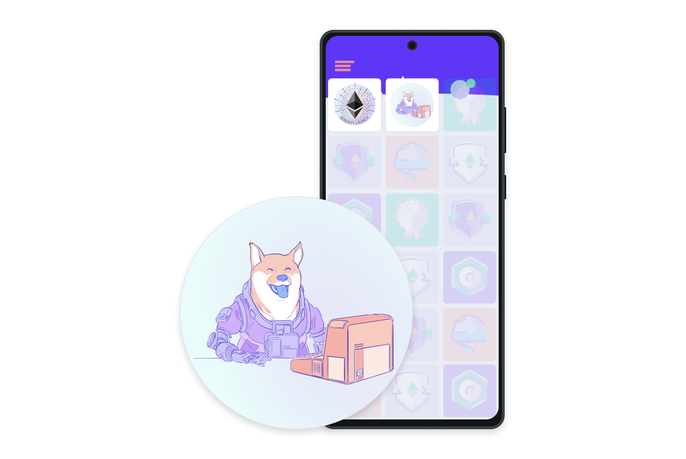

## What are NFTs? {#what-are-nfts}

NFTs are tokens that are **individually unique**. Each NFT has different properties (non-fungible) and is provably scarce. This is different from tokens such as [ETH](/glossary/#ether) or other Ethereum based tokens like USDC where every token is identical and has the same properties ('fungible'). You don't care which specific dollar bill (or ETH) you have in your wallet, because they are all identical and worth the same. However, you _do_ care which specific NFT you own, because they all have individual properties that distinguish them from others ('non-fungible').

The uniqueness of each NFT enables tokenization of things like art, collectibles, or even real estate, where one specific unique NFT represents some specific unique real world or digital item. Ownership of an asset is publicly verifiable on Ethereum [blockchain](/glossary/#blockchain).

<YouTube id="Xdkkux6OxfM" />

## The internet of assets {#internet-of-assets}

NFTs and Ethereum solve some of the problems that exist on the internet today. As everything becomes more digital, there's a need to replicate the properties of physical items like scarcity, uniqueness, and proof of ownership in a way that isn't controlled by a central organization. For example, with NFTs, you can own a music mp3 file across all Ethereum based apps and not be bound to one company's specific music app like Spotify or Apple Music. You can own a social media handle that you can sell or swap, but **can't be arbitrarily taken away from you** by a platform provider.

Here's how an internet of NFTs compared to the internet most of us use today looks...

### A comparison {#nft-comparison}

| An NFT internet                                                                                                         | The internet today                                                                                                                                     |
| ----------------------------------------------------------------------------------------------------------------------- | ------------------------------------------------------------------------------------------------------------------------------------------------------ |
| **You own your assets!** Only you can sell or swap them.                                                                    | **You rent an asset** from some organization and it can be taken away from you.                                                                            |
| NFTs are **digitally unique**, no two NFTs are the same.                                                                    | **A copy often cannot be distinguished** from the original.                                                                                   |
| Ownership of an NFT is stored on the blockchain for anyone to **verify publicly**.                                                   | The access to ownership records of digital items is **controlled by institutions** – you must take their word for it.                                 |
| NFTs are [smart contracts](/glossary/#smart-contract) on Ethereum. This means they **can easily be used in other smart contracts** and apps on Ethereum! | Companies with digital items usually **require their own "walled garden" infrastructure**.                                                                 |
| Content **creators can sell their work anywhere** and can access a global market.                                           | Creators rely on the infrastructure and distribution of the platforms they use. These are often subject to terms of use and **geographical restrictions**. |
| NFT creators **can retain ownership rights** over their own work, and program royalties directly into the NFT contract.     | Platforms, such as music **streaming services, retain the majority of profits from sales**.                                                                |

## What are NFTs used for? {#nft-use-cases}

NFTs are used for many things, including:

- proving that you attended an event
- certify that you completed a course
- ownable items for games
- digital art
- tokenizing real-world assets
- proving your online identity
- gating access to content
- ticketing
- decentralized internet domain names
- collateral in [decentralized finance](/glossary/#defi)

Maybe you are an artist that wants to share their work using NFTs, without losing control and sacrificing your profits to intermediaries. You can create a new contract and specify the number of NFTs, their properties and a link to some specific artwork. As the artist, **you can program into the smart contract the royalties** you should be paid (e.g. transfer 5% of the sale price to the contract owner each time an NFT is transferred). You can also always prove that you created the NFTs because you own the [wallet](/glossary/#wallet) that deployed the contract. Your buyers can easily prove that they own an **authentic NFT** from your collection because their wallet [address](/glossary/#address) is associated with a token in your smart contract. They can use it across the Ethereum ecosystem, confident in its authenticity.

<InfoBanner shouldSpaceBetween emoji=":eyes:" mt="8">
  
Explore, buy or create your own NFT art/collectibles...

  <ButtonLink href="/dapps/?category=collectibles#explore">
    Explore NFT art
  </ButtonLink>
</InfoBanner>

Or consider a ticket to a sporting event. Just as an **organizer of an event can choose how many tickets to sell**, the creator of an NFT can decide how many replicas exist. Sometimes these are exact replicas, such as 5000 General Admission tickets. Sometimes several are minted that are very similar, but each slightly different, such as a ticket with an assigned seat. These can be bought and sold peer-to-peer without paying ticket handlers and the buyer always with assurance of the ticket authenticity by checking the contract address.

On ethereum.org, **NFTs are used to demonstrate that people have meaningfully contributed** to our Github repository (programmed the website, written or modified an article...), translated our content, or attended our community calls, and we've even got our own NFT domain name. If you contribute to ethereum.org, you can claim a [POAP](/glossary/#poap) NFT. Some crypto meetups have used POAPs as tickets. [More on contributing](/contributing/#poap).

This website also has an alternative domain name powered by NFTs, **ethereum.eth**. Our `.org` address is centrally managed by a domain name system (DNS) provider, whereas ethereum`.eth` is registered on Ethereum via the Ethereum Name Service (ENS). And it's owned and managed by us. [Check our ENS record](https://app.ens.domains/name/ethereum.eth)

[More on ENS](https://app.ens.domains)

<Divider />

## How do NFTs work? {#how-nfts-work}

NFTs, like any digital items on the Ethereum blockchain, are created through a special Ethereum based computer program called a "smart contract". These contracts follow certain rules, like the [ERC-721](/glossary/#erc-721) or [ERC-1155](/glossary/#erc-1155) standards, which determine what the contract can do.

The NFT smart contract can do a few key things:

- **Create NFTs:** It can make new NFTs.
- **Assign Ownership:** It keeps track of who owns which NFTs by linking them to specific Ethereum addresses.
- **Give Each NFT an ID:** Each NFT has a number that makes it unique. Additionally, there's usually some information (metadata) attached to it, describing what the NFT represents.

When someone "creates" or "mints" an NFT, they're basically telling the smart contract to give them ownership of a particular NFT. This information is securely and publicly stored in the blockchain.

Furthermore, the creator of the contract can add extra rules. They might limit how many of a certain NFT can be made or decide that they should get a small royalty fee whenever the NFT changes hands.

### NFT security {#nft-security}

Ethereum's security comes from [proof-of-stake](/glossary/#pos). The system is designed to economically disincentivize malicious actions, making Ethereum tamper-proof. This is what makes NFTs possible. Once the [block](/glossary/#block) containing your NFT transaction becomes [finalized](/glossary/#finality) it would cost an attacker millions of ETH to change it. Anyone running Ethereum software would immediately be able to detect dishonest tampering with an NFT, and the bad actor would be economically penalized and ejected.

Security issues relating to NFTs are most often related to phishing scams, smart contract vulnerabilities or user errors (such as inadvertently exposing private keys), making good wallet security critical for NFT owners.

<ButtonLink href="/security/">
  More on security
</ButtonLink>

## Further reading {#further-reading}

- [A beginner's guide to NFTs](https://linda.mirror.xyz/df649d61efb92c910464a4e74ae213c4cab150b9cbcc4b7fb6090fc77881a95d) – _Linda Xie, January 2020_
- [EtherscanNFT tracker](https://etherscan.io/nft-top-contracts)
- [ERC-721 token standard](/developers/docs/standards/tokens/erc-721/)
- [ERC-1155 token standard](/developers/docs/standards/tokens/erc-1155/)
- [Popular NFT Apps and Tools](https://www.ethereum-ecosystem.com/blockchains/ethereum/nfts)

## Other resources {#other-resources}

- [NFTScan](https://nftscan.com/)

<Divider />

<QuizWidget quizKey="nfts" />
