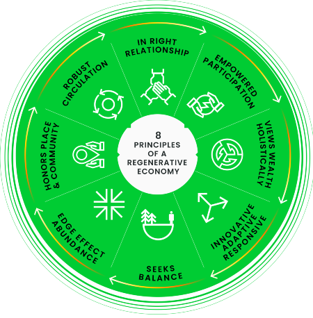

## What is ReFi? {#what-is-refi}

**Regenerative finance (ReFi)** is a set of tools and ideas built on top of [blockchains](/glossary/#blockchain), that aim to create economies which are regenerative, rather than extractive or exploitative. Eventually, extractive systems deplete the resources available and collapse; without regenerative mechanisms, they lack resilience. ReFi operates on the assumption that the creation of monetary value must be decoupled from the unsustainable extraction of resources from our planet and communities.

Instead, ReFi aims to solve environmental, communal, or social problems by creating regenerative cycles. These systems create value for participants while simultaneously benefiting ecosystems and communities.

One of the foundations of ReFi is the concept of regenerative economics pioneered by John Fullerton of the Capital Institute. He proposed [eight interconnected principles](https://capitalinstitute.org/8-principles-regenerative-economy/) that underlie systemic health:

ReFi projects realize these principles using [smart contracts](/glossary/#smart-contract) and [decentralized finance (DeFi)](/glossary/#defi) applications to incentivize regenerative behaviors, e.g. restoring degraded ecosystems, and facilitate large-scale collaboration on global issues such as climate change and biodiversity loss.

ReFi also overlaps with the [decentralized science (DeSci)](/desci/) movement, which uses Ethereum as a platform to finance, create, review, credit, store, and disseminate scientific knowledge. DeSci tools could become useful for developing verifiable standards and practices for implementing and monitoring regenerative activities like planting trees, removing plastic from the ocean, or restoring a degraded ecosystem.

<YouTube id="La52dDzBt2k" />

## Tokenization of carbon credits {#tokenization-of-carbon-credits}

The **[voluntary carbon market (VCM)](https://climatefocus.com/so-what-voluntary-carbon-market-exactly/)** is a mechanism for funding projects that make a verified positive impact on carbon emissions, either reducing ongoing emissions, or removing greenhouse gases already emitted from the atmosphere. These projects receive an asset called "carbon credits" after they are verified, which they can sell to individuals and organizations who want to support climate action.

In addition to the VCM, there are also several government-mandated carbon markets (‘compliance markets’) that aim to establish a carbon price via laws or regulations within a particular jurisdiction (e.g. country or region), controlling the supply of permits to be distributed. Compliance markets incentivize polluters within their jurisdiction to reduce emissions, but they are not capable of removing greenhouse gases which have already been emitted.

Despite its development over recent decades, the VCM continues to suffer from a variety of issues:

1. Highly fragmented liquidity
2. Opaque transaction mechanisms
3. High fees
4. Very slow trading speed
5. Lack of scalability

Transitioning the VCM to the new blockchain-based **digital carbon market (DCM)** might be an opportunity to upgrade the existing technology for validating, transacting and consuming carbon credits. Blockchains allow for publicly verifiable data, access for a broad range of users, and more liquidity.

ReFi projects employ blockchain technology to alleviate many of the problems of the traditional market:

- **Liquidity is concentrated in a small number of liquidity pools** that can be freely traded by anyone. Large organizations as well as individual users can use these pools without manual searches for sellers/buyers, participation fees, or prior registration.
- **All transactions are recorded on public blockchains**. The path each carbon credit takes due to trading activity is traceable forever as soon as it is made available in the DCM.
- **Transaction speed is nearly instant**. Securing large amounts of carbon credits via the legacy markets can take days or weeks, but this can be achieved in a few seconds in the DCM.
- **Trading activity occurs without intermediaries**, which charge high fees. Digital carbon credits represent a significant cost reduction compared to traditional credits.
- **The DCM is scalable** and can meet the demands of individuals and multinational corporations alike.

### Key components of the DCM {#key-components-dcm}

Four major components make up the current landscape of the DCM:

1. Registries such as [Verra](https://verra.org/project/vcs-program/registry-system/) and [Gold Standard](https://www.goldstandard.org/) make sure that projects creating carbon credits are reliable. They also operate the databases in which digital carbon credits originate and can be transferred or used up (retired).

There is a new wave of innovative projects being built on blockchains that are attempting to disrupt incumbents in this sector.

2. Carbon bridges, a.k.a. tokenizers, provide technology to represent or transfer carbon credits from traditional registries into the DCM. Notable examples include [Toucan Protocol](https://toucan.earth/), [C3](https://c3.app/), and [Moss.Earth](https://moss.earth/).
3. Integrated services offer carbon avoidance and/or removal credits to end-users so they can claim the environmental benefit of a credit and share their support of climate action with the world.

Some such as [Klima Infinity](https://www.klimadao.finance/infinity) and [Senken](https://senken.io/) offer a wide variety of projects developed by third parties and issued under established standards like Verra; others like [Nori](https://nori.com/) only offer specific projects developed under their own carbon credit standard, which they issue and for which they have their own dedicated marketplace.

4. The underlying rails and infrastructure that facilitate the scaling up of the impact and efficiency of the carbon market’s entire supply chain. [KlimaDAO](http://klimadao.finance/) supplies liquidity as a public good (allowing anyone to buy or sell carbon credits at a transparent price), incentivizes increased throughput of carbon markets and retirements with rewards, and provides user-friendly interoperable tooling to access data about, as well as acquire and retire, a wide variety of tokenized carbon credits.

## ReFi beyond carbon markets {#refi-beyond}

Although there is currently a strong emphasis on carbon markets in general and transitioning the VCM to the DCM in particular within the space, the term “ReFi” is not strictly limited to carbon. Other environmental assets beyond carbon credits can be developed and tokenized, which will mean other negative externalities can also be priced within the base layers of future economic systems. Moreover, the regenerative aspect of this economic model can be applied to other areas, such as the funding of public goods via quadratic funding platforms like [Gitcoin](https://gitcoin.co/). Organizations that are built on the idea of open participation and equitable distribution of resources empower everyone to funnel money to open-source software projects, as well as educational, environmental, and community-driven projects.

By shifting the direction of capital away from extractive practices toward a regenerative flow, projects and companies that provide social, environmental, or communal benefits—and which might fail to achieve funding in traditional finance—can get off the ground and generate positive externalities for society much more quickly and easily. Transitioning to this model of funding also opens the door to much more inclusive economic systems, where people of all demographics can become active participants rather than merely passive observers. ReFi offers a vision of Ethereum as a mechanism for coordinating action on existential challenges facing our species and all life on our planet—as the base layer of a new economic paradigm, enabling a more inclusive and sustainable future for centuries to come.

## Additional reading on ReFi

- [A high-level overview of carbon currencies and their place in the economy](https://www.klimadao.finance/blog/the-vision-of-a-carbon-currency)
- [The Ministry for the Future, a novel depicting the role of a carbon-backed currency in fighting climate change](https://en.wikipedia.org/wiki/The_Ministry_for_the_Future)
- [A detailed report by the Taskforce for Scaling Voluntary Carbon Markets](https://www.iif.com/Portals/1/Files/TSVCM_Report.pdf)
- [Kevin Owocki and Evan Miyazono’s CoinMarketCap Glossary entry on ReFi](https://coinmarketcap.com/alexandria/glossary/regenerative-finance-refi)
