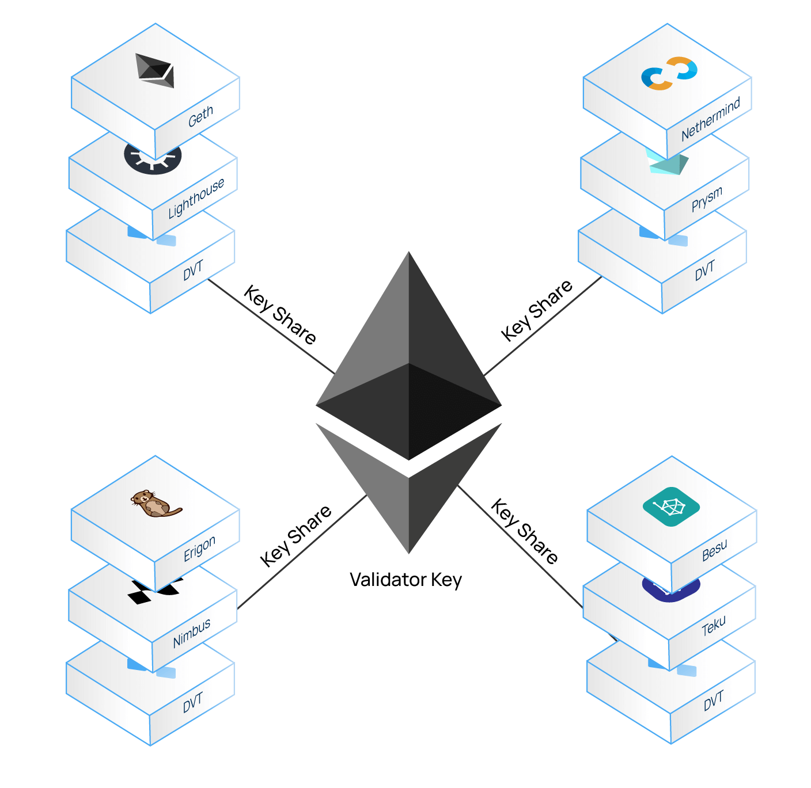

# Distributed validator technology {#distributed-validator-technology}

Distributed validator technology (DVT) is an approach to validator security that spreads out key management and signing responsibilities across multiple parties, to reduce single points of failure, and increase validator resiliency.

It does this by **splitting the private key** used to secure a validator **across many computers** organized into a "cluster". The benefit of this is that it makes it very difficult for attackers to gain access to the key, because it is not stored in full on any single machine. It also allows for some nodes to go offline, as the necessary signing can be done by a subset of the machines in each cluster. This reduces single points of failure from the network and makes the whole validator set more robust.

## Why do we need DVT? {#why-do-we-need-dvt}

### Security {#security}

Validators generate two public-private key pairs: validator keys for participating in consensus and withdrawal keys for accessing funds. While validators can secure withdrawal keys in cold storage, validator private keys must be online 24/7. If a validator private key is compromised, an attacker can control the validator, potentially leading to slashing or the loss of the staker's ETH. DVT can help mitigate this risk. Here's how:

By using DVT, stakers can participate in staking while keeping the validator private key in cold storage. This is achieved by encrypting the original, full validator key and then splitting it into key shares. The key shares live online and are distributed to multiple nodes which enable the distributed operation of the validator. This is possible because Ethereum validators use BLS signatures that are additive, meaning the full key can be reconstructed by summing their component parts. This allows the staker to keep the full, original 'master' validator key securely offline.

### No single points of failure {#no-single-point-of-failure}

When a validator is divided across multiple operators and multiple machines, it can withstand individual hardware and software failures without going offline. The risk of failures can also be reduced by using diverse hardware and software configurations across the nodes in a cluster. This resilience is not available to single-node validator configurations - it comes from the DVT layer.

If one of the components of a machine in a cluster goes down (for example, if there are four operators in a validator cluster and one uses a specific client that has a bug), the others ensure that the validator keeps running.

### Decentralization {#decentralization}

The ideal scenario for Ethereum is to have as many independently operated validators as possible. However, a few staking providers have become very popular and account for a substantial portion of the total staked ETH on the network. DVT can allow these operators to exist while preserving decentralization of stake. This is because the keys for each validator are distributed across many machines and it would take much greater collusion for a validator to turn malicious.

Without DVT, it's easier for staking providers to support only one or two client configurations for all their validators, increasing the impact of a client bug. DVT can be used to spread the risk across multiple client configurations and different hardware, creating resilience through diversity.

**DVT offers the following benefits to Ethereum:**

1. **Decentralization** of Ethereum's proof-of-stake consensus
2. Ensures the **liveness** of the network
3. Creates validator **fault tolerance**
4. **Trust minimized** validator operation
5. **Minimized slashing** and downtime risks
6. **Improves diversity** (client, data center, location, regulation, etc.)
7. **Enhanced security** of validator key management

## How does DVT work? {#how-does-dvt-work}

A DVT solution contains the following components:

- **[Shamir's secret sharing](https://medium.com/@keylesstech/a-beginners-guide-to-shamir-s-secret-sharing-e864efbf3648)** - Validators use [BLS keys](https://en.wikipedia.org/wiki/BLS_digital_signature). Individual BLS "key shares" ("key shares") can be combined into a single aggregated key (signature). In DVT, the private key for a validator is the combined BLS signature of each operator in the cluster.
- **[Threshold signature scheme](https://medium.com/nethermind-eth/threshold-signature-schemes-36f40bc42aca)** - Determines the number of individual key shares that are required for signing duties, e.g., 3 out of 4.
- **[Distributed key generation (DKG)](https://medium.com/toruslabs/what-distributed-key-generation-is-866adc79620)** - Cryptographic process that generates the key shares and is used to distribute the shares of an existing or new validator key to the nodes in a cluster.
- **[Multiparty computation (MPC)](https://messari.io/report/applying-multiparty-computation-to-the-world-of-blockchains)** - The full validator key is generated in secret using multiparty computation. The full key is never known to any individual operator—they only ever know their own part of it (their "share").
- **Consensus protocol** - The consensus protocol selects one node to be the block proposer. They share the block with the other nodes in the cluster, who add their key shares to the aggregate signature. When enough key shares have been aggregated, the block is proposed on Ethereum.

Distributed validators have built-in fault tolerance and can keep running even if some of the individual nodes go offline. This means that the cluster is resilient even if some of the nodes within it turn out to be malicious or lazy.

## DVT use cases {#dvt-use-cases}

DVT has significant implications for the broader staking industry:

### Solo stakers {#solo-stakers}

DVT also enables non-custodial staking by allowing you to distribute your validator key across remote nodes while keeping the full key completely offline. This means home stakers do not necessarily need to outlay for hardware, while distributing the key shares can help strengthen them against potential hacks.

### Staking as a service (SaaS) {#saas}

Operators (such as staking pools and institutional stakers) managing many validators can use DVT to reduce their risk. By distributing their infrastructure, they can add redundancy to their operations and diversify the types of hardware they use.

DVT shares responsibility for key management across multiple nodes, meaning some operational costs can also be shared. DVT can also reduce operational risk and insurance costs for staking providers.

### Staking pools {#staking-pools}

Due to standard validator setups, staking pools and liquid staking providers are compelled to have varying levels of single-operator trust since gains and losses are socialized throughout the pool. They are also reliant on operators to safeguard signing keys because, until now, there has been no other option for them.

Even though traditionally efforts are made to spread risk by distributing stakes across multiple operators, each operator still manages a significant stake independently. Relying on a single operator poses immense risks if they underperform, encounter downtime, get compromised, or act maliciously.

By leveraging DVT, the trust required from operators is significantly reduced. **Pools can enable operators to hold stakes without needing custody of validator keys** (as only key shares are utilized). It also allows managed stakes to be distributed between more operators (e.g., instead of having a single operator managing 1000 validators, DVT enables those validators to be collectively run by multiple operators). Diverse operator configurations will ensure that if one operator should go down, the others will still be able to attest. This results in redundancy and diversification that leads to better performance and resilience, while maximizing rewards.

Another benefit to minimizing single-operator trust is that staking pools can allow more open and permissionless operator participation. By doing this, services can reduce their risk and support Ethereum decentralization by using both curated and permissionless sets of operators, for example, by pairing home or more minor stakers with larger ones.

## Potential drawbacks of using DVT {#potential-drawbacks-of-using-dvt}

- **Additional component** - introducing a DVT node adds another part that can possibly be faulty or vulnerable. A way to mitigate this is to strive for multiple implementations of a DVT node, meaning multiple DVT clients (similarly as there are multiple clients for the consensus and execution layers).
- **Operational costs** - as DVT distributes the validator between multiple parties, there are more nodes required for operation instead of only a single node, which introduces increased operating costs.
- **Potentially increased latency** - since DVT utilizes a consensus protocol to achieve consensus between the multiple nodes operating a validator, it can potentially introduce increased latency.

## Further Reading {#further-reading}

- [Ethereum distributed validator specs (high level)](https://github.com/ethereum/distributed-validator-specs)
- [Ethereum distributed validator technical specs](https://github.com/ethereum/distributed-validator-specs/tree/dev/src/dvspec)
- [Shamir secret sharing demo app](https://iancoleman.io/shamir/)
