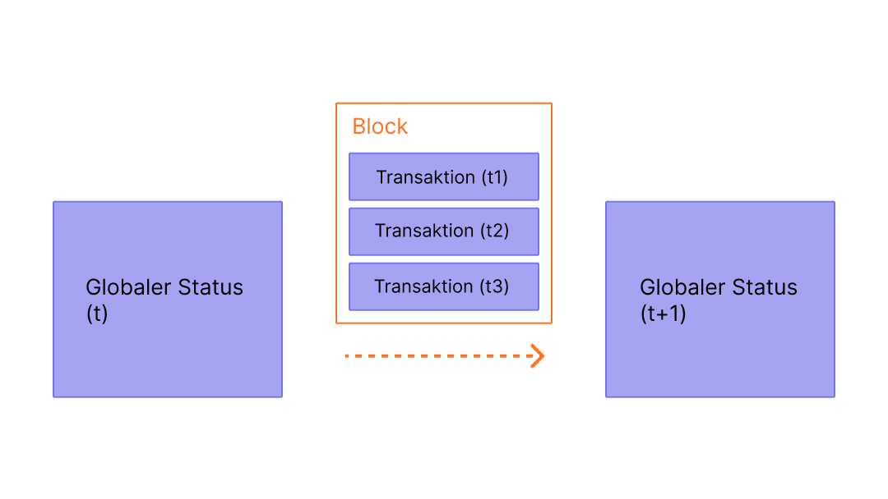

Blöcke sind Stapel von Transaktionen mit einem Hash des vorherigen Blocks in der Kette. Dies verbindet Blöcke (in einer Kette), weil Hashes kryptographisch aus den Blockdaten abgeleitet werden. Dies verhindert Betrug: Eine Änderung in irgendeiner Chronik würde alle nachfolgenden Blöcke ungültig machen, da sich alle nachfolgenden Hashes ändern und jeder, der die Blockchain ausführt, dies bemerken würde.

## Voraussetzungen {#prerequisites}

Blöcke sind ein sehr anfängerfreundliches Thema. Um dir jedoch zu helfen, diese Seite besser zu verstehen, empfehlen wir, zuerst [ Konten](/developers/docs/accounts/), [Transaktionen](/developers/docs/transactions/) und unsere [Einführung in Ethereum](/developers/docs/intro-to-ethereum/) zu lesen.

## Warum Blöcke? {#why-blocks}

Um sicherzustellen, dass alle Teilnehmer des Ethereum-Netzwerks einen synchronisierten Zustand beibehalten und sich über den genauen Verlauf der Transaktionen einig sind, fassen wir die Transaktionen in Blöcken zusammen. Das bedeutet, dass Dutzende (oder Hunderte) von Transaktionen in einem Durchgang übergeben, bestätigt und synchronisiert werden.

 _Diagramm angepasst von [Ethereum EVM illustriert](https://takenobu-hs.github.io/downloads/ethereum_evm_illustrated.pdf)_

Durch die zeitliche Verteilung der Commits geben wir allen Netzwerkteilnehmern genügend Zeit, einen Konsens zu erzielen: Obwohl Transaktionsanfragen dutzende Male pro Sekunde erfolgen, werden Blöcke auf Ethereum nur alle zwölf Sekunden erstellt und festgeschrieben.

## Wie Blöcke funktionieren {#how-blocks-work}

Um die Transaktionsgeschichte zu erhalten, sind Blöcke streng sortiert (jeder neu erstellte Block enthält einen Verweis auf den übergeordneten Block), und Transaktionen innerhalb von Blöcken sind ebenfalls streng geordnet. Außer in seltenen Fällen, zu einem bestimmten Zeitpunkt, sind sich alle Teilnehmer des Netzwerks über die genaue Anzahl und Geschichte der Blöcke einig und arbeiten daran, die aktuellen Live-Transaktionsanfragen in den nächsten Block zu integrieren.

Sobald ein Block von einem zufällig ausgewählten Validator im Netzwerk erstellt wird, wird er im gesamten Netzwerk verbreitet. Alle Knoten fügen diesen Block dann am Ende ihrer Blockchain hinzu und ein neuer Validator wird ausgewählt, um den nächsten Block zu erstellen. Der genaue Prozess der Blockzusammenstellung und Festlegung/Konsensbildung ist zurzeit in Ethereums Proof-of-Stake-Protokoll festgelegt.

## Proof-of-Stake-Protokoll {#proof-of-work-protocol}

Proof-of-Stake bedeutet Folgendes:

- Validierende Nodes müssen 32 ETH als Sicherheit gegen Fehlverhalten in einen Einzahlungsvertrag einlagern. Das dient dem Schutz des Netzwerks, da nachweislich unehrliches Verhalten zum anteiligen oder vollständigen Verlust des Einsatzes führt.
- In jedem Slot (zwölf Sekunden voneinander entfernt) wird zufällig ein Validator ausgewählt, um als Vorschlagender für einen Block zu agieren. Sie bündeln Transaktionen, führen sie aus und bestimmen einen neuen „Zustand“. Sie verpacken diese Informationen in einen Block und geben sie an andere Validatoren weiter.
- Andere Validatoren, die von dem neuen Block erfahren, führen die Transaktionen erneut aus, um sicherzustellen, dass sie der vorgeschlagenen Änderung des globalen Zustands zustimmen. In der Annahme, dass der Block gültig ist, fügen sie ihn zu ihrer eigenen Datenbank hinzu.
- Wenn ein Validator von zwei konkurrierenden Blöcken für denselben Slot erfährt, wählt er mit seinem Fork-Wahlalgorithmus den Block aus, der von den meisten eingesetzten ETH unterstützt wird.

[Mehr über Proof-of-Stake](/developers/docs/consensus-mechanisms/pos)

## Was enthält ein Block? {#block-anatomy}

Ein Block enthält viele verschiedene Informationen. Auf oberster Ebene enthält ein Block folgende Felder:

| Feld                | Beschreibung                                                |
|:------------------- |:----------------------------------------------------------- |
| `Zeitspanne (Slot)` | Der Slot, zu dem der Block gehört                           |
| `proposer_index`    | Die ID des Validators, der den Block vorschlägt             |
| `parent_root`       | Der Hash des vorausgehenden Blocks                          |
| `state_root`        | Der Stamm-Hash des Zustandsobjekts                          |
| `hauptteil`         | Ein Objekt, das mehrere Felder enthält, wie unten definiert |

Der `Body` eines Blocks enthält selbst mehrere Felder:

| Feld                 | Beschreibung                                                                     |
|:-------------------- |:-------------------------------------------------------------------------------- |
| `randao_reveal`      | Ein Wert, der zur Auswahl des nächsten Block-Vorschlagenden verwendet wird       |
| `eth1_data`          | Informationen zum Einzahlungsvertrag                                             |
| `graffiti`           | Beliebige Daten, die zum Markieren von Blöcken verwendet werden                  |
| `proposer_slashings` | Liste der zu streichenden Validatoren                                            |
| `attester_slashings` | Liste der Attestierer für Slashing                                               |
| `beglaubigungen`     | Liste der Bescheinigungen zugunsten des aktuellen Blocks                         |
| `einzahlungen`       | Liste der neuen Einlagen zum Einzahlungsvertrag                                  |
| `voluntary_exits`    | Liste der Validatoren, die das Netzwerk verlassen                                |
| `sync_aggregate`     | Teilmenge der Validatoren, die zur Bedienung von leichten Clients verwendet wird |
| `execution_payload`  | Vom Ausführungs-Client übergebene Transaktionen                                  |

Das Feld `attestations` enthält eine Liste aller Attestierungen im Block. Attestierungen haben ihren eigenen Datentyp der mehrere Datenteile enthält. Jede Attestierung enthält:

| Feld               | Beschreibung                                                              |
|:------------------ |:------------------------------------------------------------------------- |
| `aggregation_bits` | Eine Liste der Validatoren, die an dieser Attestierung teilgenommen haben |
| `daten`            | Ein Container mit mehreren Unterfeldern                                   |
| `signature`        | Kollektivsignatur aller bescheinigenden Validatoren                       |

Das Feld `data` in `attestation` enthält folgende Elemente:

| Feld                | Beschreibung                                                |
|:------------------- |:----------------------------------------------------------- |
| `Zeitspanne (Slot)` | Der Slot, auf den sich die Attestierung bezieht             |
| `Index`             | Indizes für die bescheinigenden Validatoren                 |
| `beacon_block_root` | Der Stamm-Hash des Beacon-Blocks, der dieses Objekt enthält |
| `quelle`            | Der letzte berechtigte Kontrollpunkt                        |
| `target`            | Der Grenzblock der neuesten Epoche                          |

Die Ausführung der Transaktionen in der `execution_payload` aktualisiert den globalen Zustand. Alle Clients führen die Transaktionen in der `execution_payload` erneut aus, um sicherzustellen, dass der neue Zustand dem Zustand im neuen Block im Feld `state_root` entspricht. Auf diese Weise stellen Clients sicher, dass ein neuer Block gültig und sicher ist, um ihn der Blockchain hinzuzufügen. Der `execution payload` selbst ist ein Objekt mit mehreren Feldern. Es gibt auch einen `execution_payload_header`, der wichtige zusammengefasste Informationen über die auszuführenden Daten enthält. Diese Datenstrukturen sind wie folgt organisiert:

Der `execution_payload_header` enthält die folgenden Felder:

| Feld                  | Beschreibung                                                                          |
|:--------------------- |:------------------------------------------------------------------------------------- |
| `übergeordneter_hash` | Hash des übergeordneten Blocks                                                        |
| `fee_recipient`       | Kontoadresse, an die die Transaktionsgebühren gezahlt werden                          |
| `state_root`          | Stamm-Hash für den globalen Zustand nach der Anwendung der Änderungen in diesem Block |
| `receipts_root`       | Hash des Transaktionsempfänger-Baums                                                  |
| `logs_bloom`          | Datenstruktur, die Ereignisprotokolle enthält                                         |
| `prev_randao`         | Verwendeter Wert in einer zufälligen Validatorauswahl                                 |
| `block_number`        | Die Nummer des aktuellen Blocks                                                       |
| `gas_limit`           | Maximales für diesen Block erlaubtes Gas                                              |
| `gas_used`            | Die eingesetzte Menge an Gas in diesem Block                                          |
| `Zeitstempel`         | Die Blockzeit                                                                         |
| `extra_data`          | Beliebige zusätzliche Daten als rohe Bytes                                            |
| `base_fee_per_gas`    | Der Basisgebührenwert                                                                 |
| `block_hash`          | Hash des ausführenden Blocks                                                          |
| `transactions_root`   | Stamm-Hash der Transaktionen in der Nutzlast                                          |
| `withdrawal_root`     | Stamm-Hash der Abhebungen in der Nutzlast                                             |

Die `execution_payload` selbst enthält Folgendes (das ist identisch zum Header, außer dass es anstatt des Stamm-Hash der Transaktionen die Liste der Transaktions- und Abhebungsinformationen enthält) :

| Feld                  | Beschreibung                                                                          |
|:--------------------- |:------------------------------------------------------------------------------------- |
| `übergeordneter_hash` | Hash des übergeordneten Blocks                                                        |
| `fee_recipient`       | Kontoadresse, an die die Transaktionsgebühren gezahlt werden                          |
| `state_root`          | Stamm-Hash für den globalen Zustand nach der Anwendung der Änderungen in diesem Block |
| `receipts_root`       | Hash des Transaktionsempfänger-Baums                                                  |
| `logs_bloom`          | Datenstruktur, die Ereignisprotokolle enthält                                         |
| `prev_randao`         | Verwendeter Wert in einer zufälligen Validatorauswahl                                 |
| `block_number`        | Die Nummer des aktuellen Blocks                                                       |
| `gas_limit`           | Maximales für diesen Block erlaubtes Gas                                              |
| `gas_used`            | Die eingesetzte Menge an Gas in diesem Block                                          |
| `Zeitstempel`         | Die Blockzeit                                                                         |
| `extra_data`          | Beliebige zusätzliche Daten als rohe Bytes                                            |
| `base_fee_per_gas`    | Der Basisgebührenwert                                                                 |
| `block_hash`          | Hash des ausführenden Blocks                                                          |
| `Transaktionen`       | Liste der Transaktionen, die ausgeführt werden sollen                                 |
| `abhebungen`          | Liste der Abhebungsobjekte                                                            |

Die Liste `withdrawals` enthält `withdrawal`-Objekte, die wie folgt strukturiert sind:

| Feld             | Beschreibung                                   |
|:---------------- |:---------------------------------------------- |
| `address`        | Kontoadresse, für die die Abhebung erfolgt ist |
| `Betrag`         | Abgehobener Betrag                             |
| `Index`          | Abhebungsindexwert                             |
| `validatorIndex` | Validatorindexwert                             |

## Blockzeit {#block-time}

Die Blockzeit bezieht sich auf die Zeit zwischen Blöcken. In Ethereum wird Zeit in Einheiten zu je zwölf Sekunden aufgeteilt. Diese heißen "Slots". In jedem Slot wird ein Validator ausgewählt, der einen Block vorschlägt. Geht man davon aus, dass alle Validatoren online und voll funktionsfähig sind, wird es in jedem Slot einen Block gegen. Die zugehörige Blockzeit beträgt dann 12 Sekunden. Es kann jedoch vorkommen, dass Validatoren offline sind, wenn sie dazu aufgerufen werden einen Block vorzuschlagen. Der zugehörige Slot bleibt dann leer.

Diese Implementierung unterscheidet sich von PoW-basierten Blockchain-Systemen, in denen die Erzeugung eines Blocks zu den probabilistischen Verfahren gehört, wodurch die Mining-Schwierigkeit des Protokolls ausgeglichen wird. Die [durchschnittliche Blockverbreitungszeit](https://etherscan.io/chart/blocktime) von Ethereum ist ein perfektes Beispiel für die Implementierung von Proof of Stake und damit für den Wechsel von Proof of Work (PoW) zu Proof of Stake (PoS), der durch eine weitere Anpassung der Blockverbreitungszeit auf 12 Sekunden ermöglicht wurde.

## Blockgröße {#block-size}

Ein finaler, wichtiger Hinweis ist, dass Blöcke selbst in ihrer Größe begrenzt sind. Jeder Block hat eine Zielgröße von 15 Millionen Gas, aber die Größe der Blöcke wird entsprechend der Netznachfrage erhöht oder verringert, bis zur Blockgrenze von 30 Millionen Gas (doppelte Zielblockgröße). Das Gas-Limit eines Blocks kann um den Faktor 1/1024 vom Gas-Limit des vorangegangenen Blocks nach oben oder unten justiert werden. Dadurch können Validatoren das Gas-Limit eines Blocks durch Konsens verändern. Die Gesamtmenge des von allen Transaktionen im Block verbrauchten Gases muss unter dem Blockgaslimit liegen. Das ist wichtig, weil dadurch sichergestellt wird, dass Blöcke nicht willkürlich groß sein können. Wenn Blöcke beliebig groß sein könnten, würden weniger leistungsstarke Knoten aufgrund von Platz- und Geschwindigkeitsanforderungen allmählich nicht mehr mit dem Netzwerk Schritt halten können. Je größer der Block, desto höher ist die erforderliche Verarbeitungsleistung, um den Block rechtzeitig für das nächste Zeitintervall zu berechnen. Das ist ein ganz zentraler Aspekt, der durch die Begrenzung der Blockgröße umgangen wird.

## Weiterführende Informationen {#further-reading}

_Sie kennen Community-Resourcen die Ihnen geholfen haben? Bearbeiten Sie diese Seite und fügen Sie sie hinzu!_

## Verwandte Themen {#related-topics}

- [Transaktionen](/developers/docs/transactions/)
- [Ressourcen](/developers/docs/gas/)
- [Proof-of-Stake](/developers/docs/consensus-mechanisms/pos)
