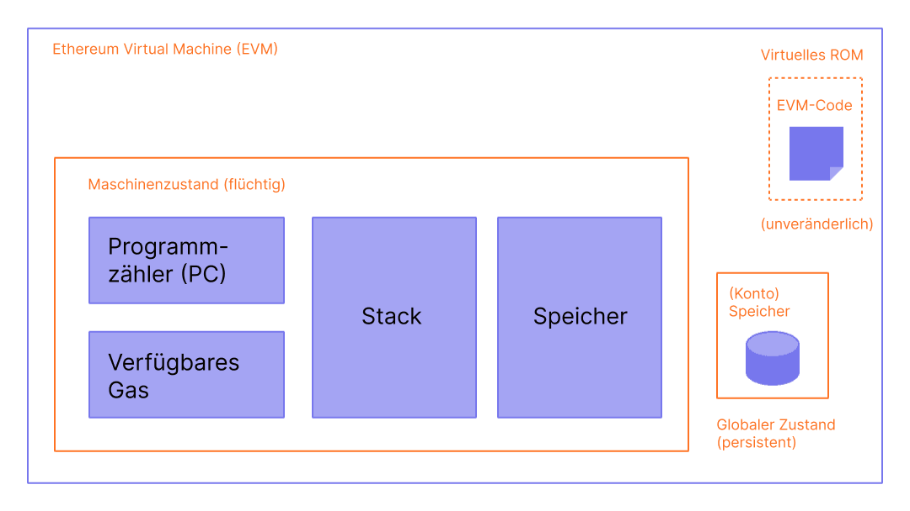
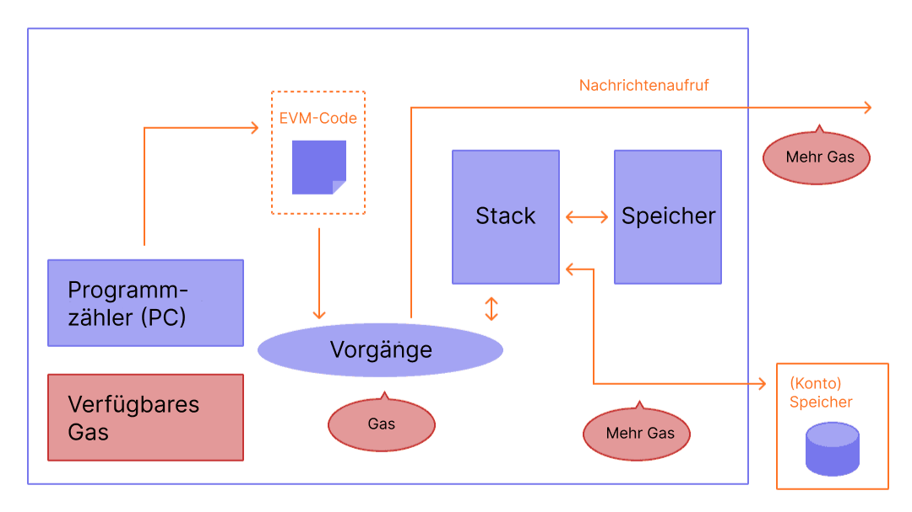

Die Ethereum Virtual Machine (EVM) ist eine dezentrale virtuelle Umgebung, die Code konsistent und sicher auf allen Ethereum-Knoten ausführt. Knoten führen die EVM aus, um Smart Contracts auszuführen, wobei sie "[Gas](/gas/)" verwenden, um den für [Operationen](/developers/docs/evm/opcodes/) erforderlichen Rechenaufwand zu messen, wodurch eine effiziente Ressourcenzuweisung und Netzwerksicherheit gewährleistet werden.

## Voraussetzungen {#prerequisites}

Um den EVM zu verstehen, sind ein paar grundlegende Kenntnisse der gängigen Informatikterminologie wie [Bytes](https://wikipedia.org/wiki/Byte), [Speicher](https://wikipedia.org/wiki/Computer_memory) und [Stack](https://wikipedia.org/wiki/Stack_(abstract_data_type)) notwendig. Es wäre auch hilfreich, wenn Sie sich mit Kryptografie-/Blockchain-Konzepten wie [Hash-Funktionen](https://wikipedia.org/wiki/Cryptographic_hash_function) und dem [Merkle-Baum](https://wikipedia.org/wiki/Merkle_tree) auskennen.

## Vom Ledger zur Zustandsmaschine {#from-ledger-to-state-machine}

Die Analogie eines 'verteilten Schalters' wird oft verwendet, um Blockchains wie Bitcoin zu beschreiben, die eine dezentrale Währung mit grundlegenden Tools der Kryptographie ermöglichen. Der Ledger führt eine Aufzeichnung von Aktivitäten, die sich an eine Reihe von Regeln halten müssen, die wiederum bestimmen, welche Aktionen erfolgen bzw. nicht erfolgen können, um den Ledger zu verändern. Zum Beispiel kann eine Bitcoin-Adresse nicht mehr Bitcoin ausgeben, als sie zuvor erhalten hat. Diese Regeln untermauern alle Transaktionen auf Bitcoin und vielen anderen Blockchains.

Während Ethereum seine eigene native Kryptowährung (Ether) hat, die fast genau den gleichen intuitiven Regeln folgt, ermöglicht es auch eine wesentlich leistungsfähigere Funktion: [Smart Contracts](/developers/docs/smart-contracts/). Für diese komplexere Funktion ist eine ausgeklügeltere Analogie erforderlich. Anstelle eines verteilten Ledgers ist Ethereum eine verteilte [Zustandsmaschine](https://wikipedia.org/wiki/Finite-state_machine). Ethereums Zustand ist eine große Datenstruktur, die nicht nur alle Konten und Kontostände enthält, sondern einen _Maschinenzustand_, der nach einer vordefinierten Reihe von Regeln von Block zu Block wechselt und beliebigen Maschinencode ausführen kann. Die spezifischen Regeln für das Ändern des Zustands von Block zu Block werden vom EVM definiert.

 _Diagramm angepasst von [Ethereum EVM illustriert](https://takenobu-hs.github.io/downloads/ethereum_evm_illustrated.pdf)_

## Ethereum-Zustandsübergangsfunktion {#the-ethereum-state-transition-function}

Die EVM verhält sich wie eine mathematische Funktion: Mit einer Eingabe, erzeugt sie eine deterministische Ausgabe. Folglich ist es sehr hilfreich, Ethereum formaler als eine **Zustandsübergangsfunktion** enthaltend zu beschreiben:

```
Y(S, T)= S'
```

Bei einem alten gültigen Zustand `(S)` und einem neuen Satz gültiger Transaktionen `(T)` erzeugt die Ethereum-Statusübergangsfunktion `Y(S, T)` einen neuen gültigen Ausgabezustand `S'`.

### Zustand {#state}

Im Rahmen von Ethereum ist der Zustand eine enorme Datenstruktur, die [ modifizierte Merkle-Patricia-Trie](/developers/docs/data-structures-and-encoding/patricia-merkle-trie/) genannt wird, die alle [Konten](/developers/docs/accounts/) durch Hashes verbunden hält und mit einem einzigen Stamm-Hash in der Blockchain abrufbar ist.

### Transaktionen {#transactions}

Transaktionen sind kryptographisch signierte Anweisungen von Konten. Es gibt zwei Arten von Transaktionen: solche, die zu Nachrichtenanrufen führen, und solche, die zur Erstellung von Verträgen führen.

Die Erstellung von Verträgen führt zur Erstellung eines neuen Vertragskontos mit zusammengestelltem [Smart-Contract](/developers/docs/smart-contracts/anatomy/)-Bytecode. Immer wenn ein anderes Konto einen Nachrichtenaufruf an diesen Vertrag stellt, führt es seinen Bytecode aus.

## EVM-Anweisungen {#evm-instructions}

Die EVM wird als [Stackmaschine](https://wikipedia.org/wiki/Stack_machine) mit einer Tiefe von 1024 Artikeln ausgeführt. Jedes Element ist ein 256-Bit-Wort, das für die einfache Verwendung mit 256-Bit-Kryptographie (wie Keccak-256-Hashes oder secp256k1-Signaturen) gewählt wurde.

Während der Ausführung behält die EVM einen transienten _-Speicher_ (als wortadressiertes Byte-Array), der zwischen Transaktionen nicht vorhanden ist.

Verträge enthalten jedoch eine Merkle-Patricia_-Speicher_-Trie (als wortadressierbares Wort-Array), mit der das betreffende Konto und ein Teil des globalen Zustands verbunden sind.

Kompilierter Smart-Contract-Bytecode wird als eine Anzahl von EVM-[Opcodes ausgeführt](/developers/docs/evm/opcodes), die standardmäßige Stackoperationen wie `XOR`, `UND`, `ADD`, `SUB` etc. ausführen. Die EVM implementiert auch eine Reihe von Blockchain-spezifischen Stack-Operationen, wie `ADDRESS`, `BALANCE`, `BLOCKHASH` usw.

 _Diagramm angepasst von [Ethereum EVM illustriert](https://takenobu-hs.github.io/downloads/ethereum_evm_illustrated.pdf)_

## EVM-Implementierungen {#evm-implementations}

Alle Implementierungen der EVM müssen sich nach der im Yellowpaper von Ethereum beschriebenen Spezifikation richten.

Während der siebenjährigen Geschichte von Ethereum hat die EVM mehrere Revisionen durchlaufen. Zudem gibt es mehrere Implementierungen der EVM in verschiedenen Programmiersprachen.

[Ethereum-Ausführungs-Clients](/developers/docs/nodes-and-clients/#execution-clients) enthalten eine EVM-Implementierung. Zusätzlich gibt es mehrere eigenständige Implementierungen, einschließlich:

- [Py-EVM](https://github.com/ethereum/py-evm) - _Python_
- [evmone](https://github.com/ethereum/evmone) - _C++_
- [ethereumjs-vm](https://github.com/ethereumjs/ethereumjs-vm) - _JavaScript_
- [revm](https://github.com/bluealloy/revm) – _Rust_

## Weiterführende Informationen {#further-reading}

- [Ethereum Yellowpaper](https://ethereum.github.io/yellowpaper/paper.pdf)
- [Jellopaper aka KEVM: Semantics of EVM in K](https://jellopaper.org/)
- [The Beigepaper](https://github.com/chronaeon/beigepaper)
- [Opcodes der virtuellen Maschine von Ethereum](https://www.ethervm.io/)
- [Betriebscodes für die Referenzdokumente für die virtuelle Ethereum-Maschine](https://www.evm.codes/)
- [Eine kurze Einführung in die Dokumentation von Solidity](https://docs.soliditylang.org/en/latest/introduction-to-smart-contracts.html#index-6)
- [Ethereum meistern – Die Ethereum Virtual Machine](https://github.com/ethereumbook/ethereumbook/blob/develop/13evm.asciidoc)

## Verwandte Themen {#related-topics}

- [Gas](/developers/docs/gas/)
