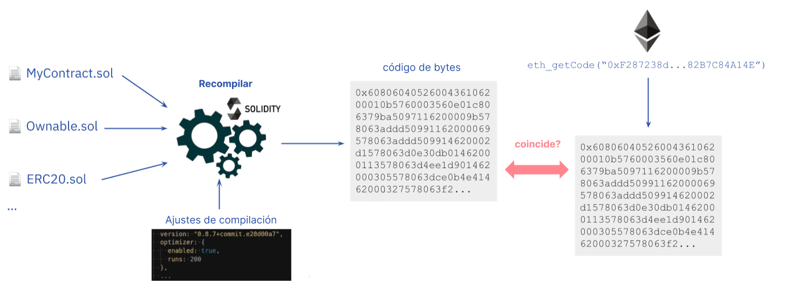

Los [contratos inteligentes](/developers/docs/smart-contracts/) están diseñados para ser "trustless", o sin confianza, lo que significa que los usuarios no deben tener que confiar en terceros (por ejemplo, desarrolladores y empresas) antes de interactuar con un contrato. Como requisito para esta no necesidad de confianza, los usuarios y otros desarrolladores deben poder verificar el código fuente de un contrato inteligente. La verificación del código fuente asegura a los usuarios y los desarrolladores que el código de contrato publicado es el mismo código que se ejecuta en la dirección del contrato en la cadena de bloques de Ethereum.

Es importante hacer la distinción entre "verificación del código fuente" y "[verificación formal](/developers/docs/smart-contracts/formal-verification/)". La verificación del código fuente, que se va a explicar en detalle a continuación, hace referencia a constatar que el código fuente proporcionado de un contrato inteligente en un lenguaje de alto nivel (por ejemplo, Solidity) se compila en el mismo bytecode que se va a ejecutar en la dirección del contrato. Por el otro lado, la verificación formal hace referencia a verificar la corrección de un contrato inteligente, lo que significa que el contrato se comporta según lo esperado. Aunque depende del contexto, generalmente la verificación de contratos se refiere a la verificación del código fuente.

## ¿Qué es la verificación del código fuente? {#what-is-source-code-verification}

Antes de implementar un contrato inteligente en la [Máquina virtual de Ethereum (EVM)](/developers/docs/evm/), los desarrolladores [compilan](/developers/docs/smart-contracts/compiling/) el código fuente del contrato, el cual consiste en instrucciones [escritas en Solidity](/developers/docs/smart-contracts/languages/) u otro lenguaje de programación de alto nivel, en bytecode. Dado que la EVM no puede interpretar instrucciones de alto nivel, es necesario compilar el código fuente a bytecode (es decir, instrucciones de bajo nivel para la máquina) para ejecutar la lógica del contrato en la EVM.

La verificación del código fuente implica comparar el código fuente de un contrato inteligente con el bytecode compilado utilizado durante la creación del contrato para detectar la existencia de cualquier diferencia. Verificar los contratos inteligentes es importante porque el código del contrato que se difunde puede ser diferente del que se ejecuta en la cadena de bloques.

La verificación de un contrato inteligente permite investigar lo que hace un contrato a través del lenguaje de alto nivel en el que está escrito, sin necesidad de leer código de máquina. Las funciones, los valores y generalmente los nombres de las variables y los comentarios suelen permanecer iguales en el código fuente original que se compila e implementa. Esto facilita mucho la lectura del código. La verificación del código fuente también permite la documentación del código, para que los usuarios finales sepan para qué está diseñado un contrato inteligente.

### ¿Qué es una verificación completa? {#full-verification}

Existen partes del código fuente que no afectan al bytecode compilado, como los comentarios o los nombres de variables. Eso significa que dos códigos fuente con nombres de variables diferentes y comentarios diferentes podrían verificar el mismo contrato. Con eso, un actor malicioso podría agregar comentarios engañosos o proporcionar nombres confusos a las variables dentro del código fuente y hacer que el contrato se verifique con un código fuente diferente al código fuente original.

Es posible evitarlo añadiendo datos adicionales al código de bytes para servir como una _garantía criptográfica_ de la exactitud del código fuente, y como una _huella digital_ de la información de compilación. La información necesaria se encuentra en los [metadatos del contrato en Solidity](https://docs.soliditylang.org/en/v0.8.15/metadata.html), y el hash de este archivo se agrega al bytecode de un contrato. Puede verlo en acción en el [playground de metadatos](https://playground.sourcify.dev).

El archivo de metadatos contiene información sobre la compilación del contrato, incluidos los archivos fuente y sus hashes. Esto significa que, si cambia cualquier configuración de compilación o incluso un byte en uno de los archivos fuente, el archivo de metadatos cambia. En consecuencia, el hash del archivo de metadatos, que se agrega al bytecode, también cambia. Esto quiere decir que, si el bytecode de un contrato y el hash de metadatos agregado coinciden con el código fuente y la configuración de compilación proporcionados, podemos estar seguros de que este es exactamente el mismo código fuente utilizado en la compilación original; ni siquiera un solo byte es diferente.

Este tipo de verificación que utiliza el hash de metadatos se denomina **"[verificación completa](https://docs.sourcify.dev/docs/full-vs-partial-match/)"** (también conocida como "verificación perfecta"). Si los hashes de los metadatos no coinciden o no se tienen en cuenta en la verificación, se trataría de una "coincidencia parcial", la cual actualmente es la forma más común de verificar contratos. De esta forma, sin la verificación completa, se corre el riesgo de que se [inserte código malicioso](https://samczsun.com/hiding-in-plain-sight/) que no se refleje en el código fuente verificado. La mayoría de los desarrolladores no son conscientes de la verificación completa y no guardan el archivo de metadatos de su compilación, por lo que hasta ahora la verificación parcial ha sido el método estándar para verificar contratos.

## ¿Por qué es importante la verificación del código fuente? {#importance-of-source-code-verification}

### No necesidad de confianza {#trustlessness}

La no necesidad de confianza ("truslessness") es posiblemente la premisa más importante para los contratos inteligentes y las [aplicaciones descentralizadas (dApps)](/developers/docs/dapps/). Los contratos inteligentes son "inmutables" y no pueden ser modificados; un contrato solo va a ejecutar la lógica comercial definida en el código en el momento de la implementación. Esto significa que los desarrolladores y las empresas no pueden manipular el código de un contrato luego de implementarlo en Ethereum.

Para que un contrato inteligente no necesite confianza, el código del contrato debe estar disponible para su verificación independiente. Si bien el bytecode compilado de cada contrato inteligente está disponible públicamente en la cadena de bloques, el lenguaje de bajo nivel es difícil de entender, tanto para los desarrolladores como para los usuarios.

Los proyectos disminuyen las suposiciones de confianza al hacer público el código fuente de sus contratos. Pero esto conlleva otro problema: es difícil verificar que el código fuente publicado coincida con el código de bytes del contrato. En este escenario, se pierde el valor de la no necesidad de confianza porque los usuarios deben confiar en que los desarrolladores no van a cambiar la lógica comercial de un contrato (es decir, cambiando el bytecode) antes de implementarlo en la cadena de bloques.

Las herramientas de verificación de código fuente proporcionan garantías de que los archivos de código fuente de un contrato inteligente coinciden con el código de emsamblaje. El resultado es un ecosistema sin confianza, donde los usuarios no confían ciegamente en terceros y en su lugar verifican el código antes de depositar fondos en un contrato.

### Seguridad del usuario {#user-safety}

Con los contratos inteligentes, generalmente hay mucho dinero en juego. Esto requiere garantías de seguridad más altas y la verificación de la lógica de un contrato inteligente antes de utilizarlo. El problema es que los desarrolladores inescrupulosos pueden engañar a los usuarios insertando código malicioso en un contrato inteligente. Sin verificación, los contratos inteligentes maliciosos pueden tener [puertas traseras](https://www.trustnodes.com/2018/11/10/concerns-rise-over-backdoored-smart-contracts), mecanismos de control de acceso controvertidos, vulnerabilidades explotables y otras cosas que ponen en riesgo la seguridad de los usuarios y que podrían pasar desapercibidas.

Publicar los archivos de código fuente de un contrato inteligente facilita que las personas interesadas, como los auditores, evalúen el contrato en busca de posibles vectores de ataque. Con múltiples partes verificando de manera independiente un contrato inteligente, los usuarios tienen garantías más sólidas de su seguridad.

## Cómo verificar el código fuente de los contratos inteligentes de Ethereum {#source-code-verification-for-ethereum-smart-contracts}

[Implementar un contrato inteligente en Ethereum](/developers/docs/smart-contracts/deploying/) requiere enviar una transacción con una carga útil de datos (código bytecode compilado) a una dirección especial. La carga útil de datos se genera compilando el código fuente, junto con los [argumentos constructor](https://docs.soliditylang.org/en/v0.8.14/contracts.html#constructor) de la instancia del contrato que se adjuntan a la carga útil de datos en la transacción. La compilación es determinista, lo que significa que siempre produce la misma salida (es decir, el bytecode del contrato) si se utilizan los mismos archivos fuente y ajustes de compilación (como por ejemplo la versión del compilador, el optimizador, etc).

Verificar un contrato inteligente básicamente consta de los siguientes pasos:

1. Ingresar en un compilador los archivos de origen y la configuración de compilación.

2. El compilador produce el bytecode del contrato.

3. Obtener el bytecode del contrato implementado en una dirección específica.

4. Comparar el bytecode implementado con el bytecode recompilado. Si los códigos coinciden, el contrato se verifica con el código fuente y la configuración de compilación proporcionados.

5. Además, si los hashes de metadatos al final del bytecode coinciden, la coincidencia será completa.

Tenga en cuenta que esta es una descripción simplificada de la verificación y existen muchas excepciones que no funcionarían de esta manera, como sería el caso de tener [variables inmutables](https://docs.sourcify.dev/docs/immutables/).

## Herramientas de verificación de código fuente {#source-code-verification-tools}

El proceso tradicional de verificar contratos puede ser complejo. Es por eso que tenemos herramientas para verificar el código fuente de los contratos inteligentes implementados en Ethereum. Estas herramientas automatizan gran parte de la verificación del código fuente y también curan contratos verificados en beneficio de los usuarios.

### Etherscan {#etherscan}

Aunque es mayormente conocido como un [explorador de cadena de bloques de Ethereum](/developers/docs/data-and-analytics/block-explorers/), Etherscan también ofrece un [servicio de verificación de código fuente](https://etherscan.io/verifyContract) para desarrolladores y usuarios de contratos inteligentes.

Etherscan le permite volver a compilar el bytecode del contrato a partir de la carga útil de datos original (código fuente, dirección de la biblioteca, configuración del compilador, dirección del contrato, etc). Si el bytecode recompilado está asociado con el bytecode (y a los parámetros constructor) del contrato en la cadena, [el contrato está verificado](https://info.etherscan.com/types-of-contract-verification/).

Una vez verificado, el código fuente de su contrato recibe una etiqueta de "Verificado" y se publica en Etherscan para que otros puedan auditarlo. También se agrega a la sección de [Contratos verificados](https://etherscan.io/contractsVerified/), que es un repositorio de contratos inteligentes con código fuente verificado.

Etherscan es la herramienta más utilizada para verificar contratos. Sin embargo, la verificación de contratos de Etherscan tiene una desventaja: no compara el **hash de metadatos** del bytecode en la cadena con el bytecode recompilado. Por lo tanto, las coincidencias en Etherscan son coincidencias parciales.

[Más información sobre la verificación de contratos en Etherscan](https://medium.com/etherscan-blog/verifying-contracts-on-etherscan-f995ab772327).

### Sourcify {#sourcify}

[Sourcify](https://sourcify.dev/#/verifier) es otra herramienta para verificar contratos que es de código abierto y descentralizada. Sourcify no es un explorador de bloques y solo verifica contratos en [distintas redes basadas en la Máquina virtual de Ethereum](https://docs.sourcify.dev/docs/chains). Sourcify actúa como una infraestructura pública sobre la cual otras herramientas pueden construir, y tiene como objetivo permitir interacciones con contratos más amigables para los humanos utilizando la [Interfaz Binaria de Aplicación (ABI, por sus siglas en inglés)](/developers/docs/smart-contracts/compiling/#web-applications) y comentarios [NatSpec](https://docs.soliditylang.org/en/v0.8.15/natspec-format.html) que se encuentran en el archivo de metadatos.

A diferencia de Etherscan, Sourcify admite coincidencias completas con el hash de metadatos. Los contratos verificados se alojan en su correspondiente [repositorio público](https://docs.sourcify.dev/docs/repository/) en HTTP y en [IPFS](https://docs.ipfs.io/concepts/what-is-ipfs/#what-is-ipfs), que es un almacenamiento descentralizado [cuya dirección es determinada por su contenido](https://web3.storage/docs/concepts/content-addressing/). Esto permite obtener el archivo de metadatos de un contrato a través de IPFS, ya que el hash de metadatos añadido es un hash de IPFS.

Además, también se pueden recuperar los archivos de código fuente a través de IPFS, ya que los hashes de IPFS de estos archivos también se encuentran en los metadatos. Un contrato puede ser verificado proporcionando el archivo de metadatos y los archivos de origen a través de su API o [Interfaz de Usuario (UI)](https://sourcify.dev/#/verifier), o utilizando complementos. La herramienta de monitoreo de Sourcify también escucha las creaciones de contratos en nuevos bloques e intenta verificar los contratos si sus metadatos y archivos de origen están publicados en IPFS.

[Más información sobre la verificación de contratos en Sourcify](https://blog.soliditylang.org/2020/06/25/sourcify-faq/).

### Antiguamente {#tenderly}

La plataforma [Tenderly](https://tenderly.co/) permite a los desarrolladores de Web3 crear, probar, monitorear y operar contratos inteligentes. Al combinar herramientas de depuración con observabilidad y bloques de construcción de infraestructura, Tenderly ayuda a los desarrolladores a acelerar el desarrollo de contratos inteligentes. Para habilitar por completo las funciones de Tenderly, los desarrolladores deben realizar la [verificación del código fuente](https://docs.tenderly.co/monitoring/contract-verification) utilizando varios métodos.

Es posible verificar un contrato de forma privada o pública. Si se verifica de forma privada, el contrato inteligente es visible solo para usted (y otros miembros de su proyecto). Verificar un contrato de manera pública lo hace visible para todos los usuarios de la plataforma Tenderly.

Puede verificar contratos utilizando el [Panel](https://docs.tenderly.co/monitoring/smart-contract-verification/verifying-a-smart-contract), el [plugin de Hardhat para Tenderly](https://docs.tenderly.co/monitoring/smart-contract-verification/verifying-contracts-using-the-tenderly-hardhat-plugin) o la [Línea de Comandos (CLI)](https://docs.tenderly.co/monitoring/smart-contract-verification/verifying-contracts-using-cli).

Cuando verifica contratos a través del Panel, necesita importar el archivo fuente o el archivo de metadatos generado por el compilador de Solidity, la dirección/red y la configuración del compilador.

Usar el complemento de Hardhat para Tenderly permite tener un mayor control sobre el proceso de verificación con menos esfuerzo, lo que permite elegir entre la verificación automática (sin código) y la verificación manual (basada en código).

## Más información {#further-reading}

- [Verificación del código fuente de un contrato](https://programtheblockchain.com/posts/2018/01/16/verifying-contract-source-code/)
