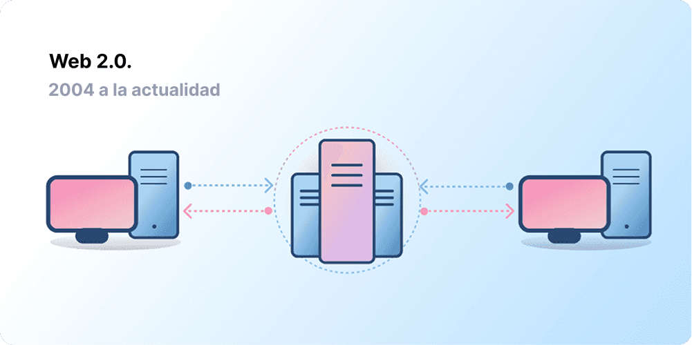
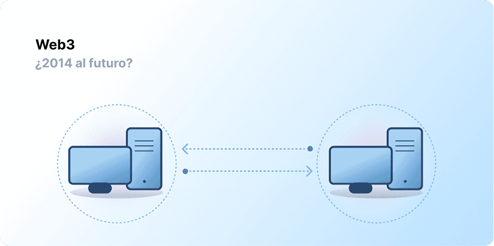

# Introducción a Web3 {#introduction}

La centralización ha ayudado a miles de millones de personas a conectarse a Internet y ha creado la infraestructura sólida y estable en la que vive. Al mismo tiempo, un grupúsculo de entidades centralizadas mantienen un férreo control de grandes extensiones de Internet, decidiendo unilateralmente qué se debe y qué no se debe permitir.

Web3 es la respuesta a este dilema. En vez de tener una Web monopolizada por las grandes compañías de tecnología, la Web3 adopta la descentralización y se construye, opera y permanece en propiedad de sus usuarios. Web3 pone el poder en manos de los usuarios y no de las grandes empresas. Antes de hablar de Web3, vamos a explorar cómo hemos llegado aquí.

<Divider />

## La Web en sus comienzos {#early-internet}

La mayoría de las personas concibe la Web como un pilar continuo de vida moderna, que fue inventado y ha existido desde entonces. Sin embargo, la Web que la mayoría de nosotros conocemos hoy en día es bastante diferente de la imaginada originalmente. Para comprender mejor esto, es útil dividir la breve historia de la Web en periodos: Web 1.0 y Web 2.0.

### Web 1.0: Solo Lectura (1990-2004) {#web1}

En 1989, en el CERN (en Ginebra, Suiza), Tim Berners-Lee estaba ocupado desarrollando los protocolos que se convertirían en el Internet de hoy en día. ¿Su idea? Hemos llegado aquí para crear protocolos abiertos y descentralizados que permitieran compartir información desde cualquier lugar de la Tierra.

La primera versión de Internet, ahora conocida como «Web 1.0», ocurrió aproximadamente entre 1990 y 2004. La Web 1.0 constaba principalmente de sitios web estáticos propiedad de empresas, y no había apenas interacción entre los usuarios —los individuos rara vez producían contenido— lo que llevó a que se la conociera como la web de solo lectura.

### Web 2.0: Lectura-Escritura (2004-actualidad) {#web2}

El período de la Web 2.0 comenzó en 2004 con la aparición de las plataformas de redes sociales. En lugar de ser solo de lectura, la web evolucionó para ser de lectura y escritura. En lugar de que las empresas proporcionen contenido a los usuarios, también comenzaron a proporcionar plataformas para compartir contenido generado por el usuario y participar en interacciones de usuario a usuario. A medida que más personas se conectaron, un puñado de las principales empresas comenzó a controlar una cantidad desproporcionada del tráfico y el valor generado en la Web. Web 2.0 también dio origen al modelo de ingresos impulsado por la publicidad. Si bien los usuarios podían crear contenido, no lo poseían ni se beneficiaban de su monetización.

<Divider />

## Web 3.0: Lectura-Escritura-Propiedad {#web3}

La premisa de Web 3.0 fue acuñada por el cofundador de [Ethereum](/what-is-ethereum/), Gavin Wood poco después de que Ethereum se lanzara en 2014. Gavin verbalizó una solución para un problema que muchos de los primeros usuarios de criptomonedas sintieron: la Web requería demasiada confianza. Es decir, que la mayor parte de la Web que la gente conoce y utiliza hoy en día se basa en confiar a un puñado de empresas privadas que actúen en beneficio del público.

### ¿Qué es la Web3? {#what-is-web3}

La Web3 se ha convertido en un término general para la visión de un Internet nuevo y mejor. En esencia, Web3 utiliza cadenas de bloques, criptomonedas y NFT para devolver el poder a los usuarios en forma de propiedad. [Una publicación de 2020 en Twitter](https://twitter.com/himgajria/status/1266415636789334016) captó mejor la esencia: Web 1.0 fue de solo lectura, Web 2.0 es de lectura-escritura, Web3 será de lectura-escritura-propiedad.

#### Ideas centrales de la Web3 {#core-ideas}

Aunque es difícil proporcionar una definición estática de lo que es la Web3, algunos principios básicos guían su creación.

- **Web3 está descentralizada:** en lugar de grandes extensiones de Internet controladas y apropiadas por entidades centralizadas, la propiedad se distribuye entre sus constructores y usuarios.
- **Web3 no tiene permisos:** todos tienen el mismo acceso para participar en la Web3, y nadie queda excluido.
- **Web3 tiene pagos nativos:** utiliza criptomonedas para gastar y enviar dinero en línea en lugar de depender de la infraestructura obsoleta de los bancos y procesadores de pagos.
- **Web3 no depende de la confianza:** opera utilizando incentivos y mecanismos económicos en lugar de depender de terceros de confianza.

### ¿Por qué es importante Web3? {#why-is-web3-important}

Aunque las características destacadas de Web3 no están aisladas y no encajan en categorías ordenadas, por simplicidad, hemos tratado de separarlas para que sean más fáciles de entender.

#### Propiedad {#ownership}

La Web3 le otorga la propiedad de sus activos digitales de una manera sin precedentes. Por ejemplo, supongamos que está jugando a un juego en Web2. Si compra un elemento del juego, se vinculará directamente a su cuenta. Si los creadores del juego eliminan su cuenta, perderá estos elementos. O, que si deja de jugar, pierde el valor que invirtió en los objetos del juego.

Web3 permite la propiedad directa a través de [tokens no fungibles (NFT)](/glossary/#nft). Nadie, ni siquiera los creadores del juego, tienen el poder de quitarle la propiedad. Y, si deja de jugar, puede vender o intercambiar sus objetos del juego en mercados abiertos y recuperar su valor.

<InfoBanner shouldSpaceBetween emoji=":eyes:">
  
Saber más sobre NFT

  <ButtonLink href="/nft/">
    Más información sobre NFT
  </ButtonLink>
</InfoBanner>

#### Resistencia a la censura {#censorship-resistance}

La dinámica de poder entre las plataformas y los creadores de contenidos está enormemente desequilibrada.

OnlyFans es un sitio de contenido para adultos generado por el usuario con más de 1 millón de creadores de contenidos, muchos de los cuales utilizan la plataforma como su principal fuente de ingresos. En agosto de 2021, OnlyFans anunció planes para prohibir contenido sexualmente explícito. El anuncio provocó indignación entre los creadores de la plataforma, que sintieron que les estaban robando un ingreso en una plataforma que ayudaron a crear. Después de la violenta reacción repentina, la decisión se revirtió rápidamente. A pesar de que los creadores ganaron esta batalla, destaca un problema para los creadores de la Web 2.0: se pierde la reputación y los seguidores acumulados si se abandona una plataforma.

En la Web3, sus datos viven en la cadena de bloques. Cuando decide abandonar una plataforma, su reputación le acompaña, conectándola a otra interfaz que se alinee más claramente con sus valores.

Web 2.0 requiere que los creadores de contenido confíen en las plataformas para no cambiar las reglas, pero la resistencia a la censura es una característica nativa de una plataforma Web3.

#### Organizaciones Autónomas Descentralizadas (DAO) {#daos}

Así como el conservar la propiedad de sus datos en la Web3, también puede ser propietario/a de la plataforma como parte de un colectivo, usando tokens que actuán como acciones en una empresa. Las DAO le permiten coordinar la posesión descentralizada de una plataforma y hacer decisiones sobre su futuro.

La definición técnica de DAO consiste en [contratos inteligentes](/glossary/#smart-contract) acordados que automatizan la toma de decisiones descentralizada sobre un conjunto de recursos (tokens). Los usuarios con tokens votan respecto a cómo se gastan los recursos, y el código calcula automáticamente los resultados de las votaciones.

Sin embargo, las personas definen muchas comunidades Web3 como si fueran DAO. Todas estas comunidades tienen diferentes niveles de descentralización y automatización mediante código. En la actualidad, estamos explorando qué son las DAO y cómo podrían evolucionar en el futuro.

<InfoBanner shouldSpaceBetween emoji=":eyes:">
  
Más información sobre las DAO

  <ButtonLink href="/dao/">
    Claves sobre las DAO
  </ButtonLink>
</InfoBanner>

### Identidad {#identity}

Tradicionalmente, se creaba una cuenta para cada plataforma que se utilizaba. Por ejemplo, se puede tener una cuenta de Twitter, de YouTube y de Reddit. ¿Quiere cambiar su nombre o foto de perfil? Pues entonces, tiene que cambiarlo en todas las cuentas. Puede usar inicios de sesión sociales en algunos casos, pero esto presenta un problema conocido: la censura. Con un solo clic, estas plataformas pueden bloquearlo de toda su vida en línea. Peor aún, muchas plataformas requieren que les confíe información de identificación personal para crear una cuenta.

Web3 resuelve estos problemas permitiéndole controlar su identidad digital con una dirección de Ethereum y un perfil de [Ethereum Name Service (ENS)](/glossary/#ens). El uso de una dirección de Ethereum proporciona un inicio de sesión único en todas las plataformas que es seguro, resistente a la censura y anónimo.

### Pagos nativos {#native-payments}

La infraestructura de pago de la Web 2 se basa en bancos y procesadores de pagos, excluyendo a las personas sin cuentas bancarias o a las que viven dentro de las fronteras del país equivocado. Web3 utiliza tokens como [ETH](/glossary/#ether) para enviar dinero directamente en el navegador y no requiere de terceros de confianza.

<ButtonLink href="/eth/">
  Más sobre ETH
</ButtonLink>

## Limitaciones de la Web3 {#web3-limitations}

A pesar de los numerosos beneficios de Web3 en su forma actual, todavía hay muchas limitaciones que el ecosistema debe abordar para que florezca.

### Accesibilidad {#accessibility}

Las características importantes de la Web 3, como el inicio de sesión con Ethereum, ya están disponibles para que cualquiera las use sin costo alguno. Pero, el coste relativo de las transacciones sigue siendo prohibitivo para muchos. Es menos probable que Web3 se utilice en países menos ricos, o en vías de desarrollo debido a las altas comisiones de las transacciones. En Ethereum, estos desafíos están siendo resueltos a través de la [hoja de ruta](/roadmap/) y las [soluciones de escalamiento de capa 2](/glossary/#layer-2). La tecnología está lista, pero necesitamos niveles más altos de adopción en la capa 2 para que Web3 sea accesible para todos.

### Experiencia de usuario {#user-experience}

La barrera técnica para iniciar el uso de Web3 es actualmente demasiado alta. Los usuarios deben solucionar los problemas de seguridad, desgranar la documentación técnica compleja y navegar por interfaces de usuario poco intuitivas. Los [proveedores de monederos](/wallets/find-wallet/), en particular, están trabajando para resolver esto, pero se necesita más progreso antes de que la Web3 sea adoptada en masa.

### Educación {#education}

Web3 introduce nuevos paradigmas que requieren aprender modelos mentales diferentes a los utilizados en Web 2.0. Un impulso educativo similar ocurrió cuando Web 1.0 estaba ganando popularidad a finales de la década de 1990; los defensores de la World Wide Web utilizaron una gran cantidad de técnicas educativas para educar al público, desde metáforas sencillas (la autopista de la información, exploradores, navegación por Internet) a [cadenas de televisión](https://www.youtube.com/watch?v=SzQLI7BxfYI). Web3 no es difícil, aunque sí es diferente. Las iniciativas educativas que informan a los usuarios de la Web2 de estos paradigmas de la Web 3 son vitales para su éxito.

Ethereum.org contribuye a la educación de Web3 a través de nuestro [Programa de traducción](/contributing/translation-program/), con el objetivo de traducir contenido importante de Ethereum a tantos idiomas como sea posible.

### Infraestructura centralizada {#centralized-infrastructure}

El ecosistema de la Web3 es joven y evoluciona rápidamente. Como resultado, este depende actual y principalmente de la infraestructura centralizada (GitHub, Twitter, Discord, etc.). Muchas empresas Web3 se apresuran a llenar estos vacíos, no obstante construir una infraestructura fiable y de alta calidad lleva tiempo.

## Un futuro descentralizado {#decentralized-future}

Web3 es un ecosistema joven y en evolución. Gavin Wood acuñó el término en 2014, pero muchas de estas ideas se han hecho realidad recientemente. Solo en el último año, ha habido un aumento considerable del interés por la criptomoneda, mejoras en las soluciones de escalabilidad de la capa 2, experimentos masivos con nuevas formas de gobernanza y revoluciones en la identidad digital.

Esto es solo el comienzo para crear un mejor Internet con Web3, y a medida que seguimos mejorando la infraestructura en la que se basará, el futuro de la Web parece prometedor.

## Cómo participar {#get-involved}

- [Obtener un monedero](/wallets/)
- [Encontrar una comunidad](/community/)
- [Explorar aplicaciones Web3](/dapps/)
- [Unirse a una DAO](/dao/)
- [Construir sobre Web3](/developers/)

## Para profundizar sobre el tema {#further-reading}

Web3 no está definida rígidamente. Varios participantes de la comunidad tienen diferentes opiniones al respecto. He aquí algunas de ellas:

- [¿Qué es la Web3? El Internet descentralizado del futuro explicado](https://www.freecodecamp.org/news/what-is-web3/) – _Nader Dabit_
- [Dar sentido a la Web3](https://medium.com/l4-media/making-sense-of-web-3-c1a9e74dcae) – _Josh Stark_
- [¿Por qué es Importante Web3?](https://future.a16z.com/why-web3-matters/) — _Chris Dixon_
- [¿Por qué es importante la Descentralización?](https://onezero.medium.com/why-decentralization-matters-5e3f79f7638e) - _Chris Dixon_
- [El paisaje de la Web3](https://a16z.com/wp-content/uploads/2021/10/The-web3-Readlng-List.pdf) – _a16z_
- [El debate de Web3](https://www.notboring.co/p/the-web3-debate?s=r) – _Packy McCormick_

<QuizWidget quizKey="web3" />
