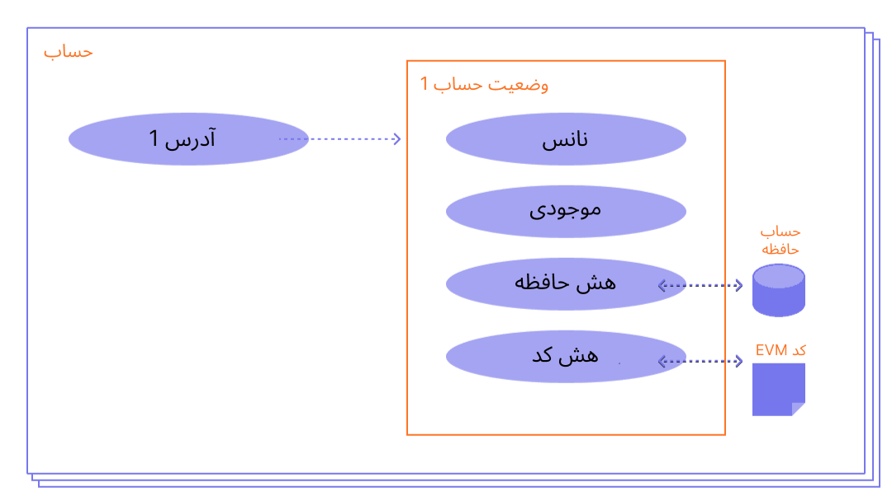

حساب اتریوم موجودیتی است شامل موجودی اتر (ETH) که می‌تواند در اتریوم تراکنش ارسال کند. حساب‌های کاربری می‌توانند توسط کاربر کنترل شوند یا به‌عنوان قرارداد هوشمند مورد استفاده قرار بگیرند.

## پیش‌نیازها {#prerequisites}

برای کمک به بهتر فهمیدن این صفحه، ایتدا خواندن [معرفی اتریوم](/developers/docs/intro-to-ethereum/) را توصیه می کنیم.

## نوع حساب‌ها {#types-of-account}

اتریوم، دو نوع اکانت دارد:

- حساب مالکیت خارجی (EOA) - توسط هر کسی که کلید خصوصی را دارد کنترل می شود
- حساب قرارداد - یک قرارداد هوشمند مستقر در شبکه که توسط کد کنترل می شود. درباره‌ی [قراردادهای هوشمند](/developers/docs/smart-contracts/) بیشتر بدانید

هر دو نوع حساب توانایی این را دارند که:

- می‌توانند اتر و توکن‌ها را دریافت کنند، نگه دارند، و ارسال کنند
- با قراردادهای هوشمند بکارگرفته‌شده تعامل کنند

### تفاوت‌های کلیدی {#key-differences}

**مالکیت خارجی**

- ساختن یک حساب هیچ هزینه‌ای ندارد
- می‌تواند تراکنش‌ها را آغاز کند
- تراکنش‌های مابین حساب‌هایی با مالکیت خارجی تنها می‌توانند به‌صورت انتقال توکن یا اتر باشند
- از یک جفت کلید رمزنگاری تشکیل شده است: کلیدهای عمومی و خصوصی که فعالیت های حساب را کنترل می کنند

**قرارداد**

- ساخت یک قرار داد به علت استفاده شما از حافظه‌ی شبکه دارای هزینه است
- تنها می‌توانند در پاسخ به دریافت یک تراکنش یک تراکنش بفرستند
- تراکنش‌های مابین یک حساب خارجی و یک حساب قراردادی می‌توانند کدی راه‌اندازی کنند که می‌تواند کار‌های مختلفی انجام دهد، از انتقال توکن‌ها گرفته تا ساخت قرارداد جدید
- حساب های قراردادی کلید خصوصی ندارند. در عوض، آنها با منطق کد قرارداد هوشمند کنترل می شوند

## بررسی یک حساب {#an-account-examined}

حساب‌های اتریوم دارای چهار فیلد هستند:

- `Nonce` – شمارنده ای که تعداد تراکنش ارسالی از هر حساب مالکیت-خارجی به شبکه یا تعداد قرارداد های ایجاد شده توسط هر حساب قراردادی را نشان میدهد. برای جلوگیری از حمله اجرای مجدد (reply attack) که در آن تراکنش های امضا شده به طور مکرر به شبکه ارسال و اجرا میشوند، با هر Nonce تنها یک تراکنش میتواند اجرا شود.
- `موجودی` - مقدار wei تحت مالکیت این آدرس wei واحد شمارش اتریوم است و هر اتریوم 10 به توان هجده wei است.
- `codeHash` – هش به _کد_ یک حساب موجود در ماشین مجازی اتریوم (EVM) اشاره دارد. حساب قرارداد دارای قطعه کدهای برنامه‌نویسی‌شده است که می‌توانند عملیات‌های متفاوتی را انجام دهند. این کد EVM در صورتی که حساب پیام تلفنی دریافت کند اجرا خواهد شد. برخلاف مابقی بخش‌های حساب، نمی‌توان آن را تغییر داد. تمام قطعات کد موجود تحت هش متناسب خود برای بازیابی‌های بعدی در دیتابیس قرار گرفته‎‌اند. مقدار این هش به عنوان codeHash شناخته می‌شود. برای حساب‌های مالکیت خارجی، فیلد این codeHash یک رشته خالی هش شده است.
- `storageRoot` - که به‌عنوان حافظه‌ی هش نیز شناخته می‌شود. یک هش 256 بیتی از گره ریشه‌ای از یک درختواره‌ی هش Merkle Patricia است که محتویات حافظه‌ی حساب را رمزگذاری می‌کند (نگاشتی میان مقادیر صحیح 256 بیتی)، که به‌صورت یک درختواره‌ی هش به‌عنوان نگاشتی از هش 256 بیتی Keccak از کلیدهای اعداد صحیح 256 بیتی بر روی کلیدهایی رمزنگاری‌شده است، با RLP با مقادیر صحیح 256 بیتی رمزنگاری می‌شود. این درختواره‌ی هش محتویات حافظه‌ی حساب را رمزنگاری می‌کند، و به‌صورت پیش‌فرض خالی است.

 _نمودار برگرفته از [Ethereum EVM illustrated](https://takenobu-hs.github.io/downloads/ethereum_evm_illustrated.pdf)_

## حساب‌های دارای مالکیت خارجی و جفت کلیدها {#externally-owned-accounts-and-key-pairs}

یک حساب کاربری از یک جفت کلید رمزنگاری تشکیل شده است: عمومی و خصوصی. به کمک این دو کلید می‌توان ثابت کرد که یک تراکنش از طریق فرستنده بوده و از جعل جلوگیری می‌کند. کلید خصوصی شما همان چیزی است که برای امضای تراکنش از آن استفاده می‌کنید، پس اختیار شما بر وجوه مرتبط با حسابتان را تأیید می‌کند. بنابراین در واقع شما رمزارزی نگهداری نمی‌کنید، شما کلید خصوصی را نگه می‌دارید - سرمایه‌ی شما همیشه در دفتر کل اتریوم نگهداری می‌شود.

و با این کار جلوی عاملان بداندیشی که می‌خواهند اطلاعات تقلبی بفرستند را می‌گیرد، زیرا شما می‌توانید اثبات کنید چه کسی فرستنده‌ی تراکنش بوده است.

اگر آلیس می‌خواهد به حساب باب اتر بفرستد، باید یک تراکنش ایجاد کند و آن را به شبکه بفرستد تا تأیید شود. استفاده از کلید عمومی رمزنگاری به آلیس این امکان را می‌دهد که اثبات کند او فرستنده‌ی این تراکنش بوده است. بدون استفاده از این مکانیزم، یک آدم بداندیش فرضی به اسم ایو می‌تواند به‌آسانی درخواستی شبیه «از حساب آلیس به حساب ایو 5 اتر ارسال شود» را منتشر کند، و هیجکس نمی‌تواند اثبات کند که این درخواست از طرف آلیس نبوده است.

## ساختن حساب {#account-creation}

هنگامی که می‌خواهید یک حساب بسازید، اکثر کتابخانه‌ها یک کلید خصوصی تصادفی برای شما تولید می کنند.

یک کلید خصوصی از 64 کاراکتر هگز تشکیل شده است که می‌تواند به وسیله‌ی یک گذرواژه رمزنگاری شود.

مثال:

`fffffffffffffffffffffffffffffffebaaedce6af48a03bbfd25e8cd036415f`

کلید عمومی با استفاده از [الگوریتم امضای دیجیتال منحنی بیضوی](https://wikipedia.org/wiki/Elliptic_Curve_Digital_Signature_Algorithm) از کلید خصوصی ساخته می‌شود. شما با حذف 20 بایت انتهایی هش keccak-256 کلید عمومی خود و افزودن `0X` در ابتدای آن یک آدرس عمومی برای حسابتان خواهید داشت.

این بدان معناست که یک حساب دارای مالکیت خارجی (EOA) دارای یک آدرس 42 کاراکتری است (بخش 20 بایتی که 40 کاراکتر هگزا دسیمال به اضافه پیشوند `0x` است).

مثال:

`0x5e97870f263700f46aa00d967821199b9bc5a120`

مثال زیر نحوه استفاده از ابزار امضا به نام [Clef](https://geth.ethereum.org/docs/tools/clef/introduction) را برای ایجاد یک حساب جدید نشان می دهد. Clef یک ابزار مدیریت و امضای حساب است که همراه با مشتری اتریوم، [Geth](https://geth.ethereum.org) ارائه می‌شود. دستور `clef newaccount` یک جفت کلید جدید ایجاد می کند و آنها را در یک فروشگاه کلید رمزگذاری شده ذخیره می کند.

```
> کلید حساب جدید --keystore <path>

لطفا یک رمز عبور برای ایجاد حساب جدید وارد کنید:
> <رمز عبور>

------------
INFO [10-28|16:19:09.156] کلید جدید شما ایجاد شد آدرس=0x5e97870f263700f46aa00d967821199b9bc5a120
WARN [10-28|16:19:09.306] لطفاً از مسیر فایل کلید خود نسخه پشتیبان تهیه کنید=/home/user/go-ethereum/data/keystore/UTC--2022-10-28T15-19-08.000825927Z--5e9737000f200f201b60b201b60b201b66b66b66b66b61b69b69b60b6b6b6b6b5b6b6b5b6b5b6b6b5b6b6b5b6b5b6b6b5b10b6b5b6b5b10b6b5b6b5b6b5b5b5b5b5b5b5b5b5bwd
هشدار [10-28|16:19:09.306] لطفا رمز عبور خود را به خاطر بسپارید!
حساب ایجاد شده 0x5e97870f263700f46aa00d967821199b9bc5a120
```

[مستندات Geth](https://geth.ethereum.org/docs)

شما می‌توانید از کلید خصوصی خود کلیدهای عمومی جدید به دست بیاورید، اما نمی‌توانید از کلیدهای عمومی کلید خصوصی به دست بیاورید. ایمن و همانطور که از نام آن پیداست یعنی **خصوصی** نگه داشتن کلیدهای خصوصی، حیاتی است.

شما برای امضای پیام‌ها و تراکنش‌هایی را که خروجی امضا دارند به کلید خصوصی نیاز دارید. دیگران متعاقباً می‌توانند امضای شما را دریافت کنند و به وسیله‌ی آن از کلید عمومی شما مشتق بگیرند، و نویسنده‌ی پیام را ثابت کنند. در برنامه‌تان، می توانید از کتابخانه جاوا اسکریپت برای ارسال تراکنش ها به شبکه استفاده کنید.

## حساب‌های قرارداد {#contract-accounts}

حساب‌های قرارداد نیز دارای یک آدرس حاوی 42 کاراکتر هگز هستند:

مثال:

`0x06012c8cf97bead5deae237070f9587f8e7a266d`

آدرس قرارداد معمولا وقتی داده می‌شود که قرارداد توسط زنجیره‌ی بلوکی اتریوم گسترش داده می‌شود. آدرس از طریق سازنده‌ی آدرس و عدد تراکنش آن آدرس («Nonce») می‌آید.

## کلیدهای اعتبار سنج {#validators-keys}

همچنین نوع دیگری از کلید در اتریوم وجود دارد که زمانی معرفی شد که اتریوم از اثبات کار به اجماع مبتنی بر اثبات سهام تغییر کرد. اینها کلیدهای 'BLS' هستند و برای شناسایی اعتبارسنج ها استفاده می شوند. این کلیدها را می توان به طور مؤثر جمع کرد تا پهنای باند مورد نیاز برای رسیدن به اجماع شبکه را کاهش دهد. بدون این تجمیع کلید، حداقل سهام برای یک اعتبارسنج بسیار بیشتر می‌شد.

[اطلاعات بیشتر در مورد کلیدهای اعتبارسنج](/developers/docs/consensus-mechanisms/pos/keys/).

## یادداشتی درباره‌ کیف پول‌ها {#a-note-on-wallets}

حساب با کیف پول متفاوت است. کیف‌پول یک رابط یا برنامه ای است که به شما امکان می دهد با حساب اتریوم خود، چه یک حساب خارجی یا یک حساب قراردادی، تعامل داشته باشید.

## یک نسخه‌ی آزمایشی تصویری {#a-visual-demo}

آستین را مشاهده کنید که توابع هش و جفت کلیدها را توضیح می‌‌دهد.

<YouTube id="QJ010l-pBpE" />

<YouTube id="9LtBDy67Tho" />

## بیشتر بخوانید {#further-reading}

- [درک حساب های اتریوم](https://info.etherscan.com/understanding-ethereum-accounts/) - etherscan

_آیا منبعی اجتماعی می‌شناسید که به شما کمک کرده باشد؟ این صفحه را ویرایش کنید و به آن اضافه کنید!_

## موضوعات مرتبط {#related-topics}

- [قرارداد‌های هوشمند](/developers/docs/smart-contracts/)
- [تراکنش‌ها](/developers/docs/transactions/)
