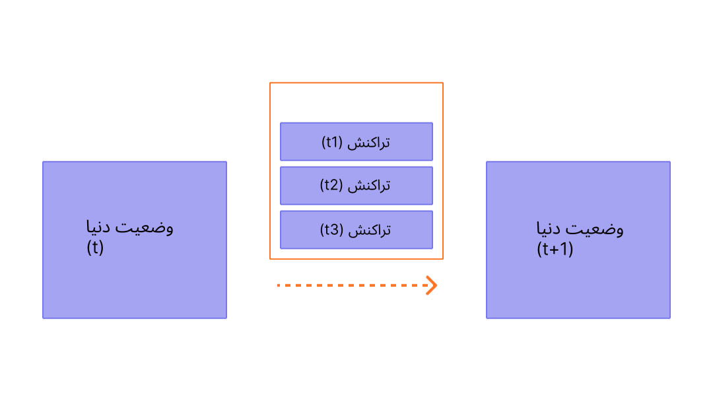

بلوک‌ها دسته‌هایی از تراکنش با یک هش به بلوک قبلی خود در زنجیره هستند. این کار بلوک‌ها را (در یک زنجیره) به هم متصل می‌کند، چون هش‌ها به‌صورت رمزنگاری‌شده از داده‌های بلوک‌ها به دست می‌آیند. این کار همچنین از تقلب جلوگیری می‌کند، چرا که یک تغییر کوچک در هر بلوکی در تاریخچه تمام بلوک‌های بعدی را از اعتبار خواهد انداخت چرا که تمام هش‌های متعاقب تغییر خواهند کرد و هر کسی که زنجیره‌ی بلوکی را اجرا می‌کند متوجه خواهد شد.

## پیش‌نیازها {#prerequisites}

فهم بلوک‌ها موضوعی ساده برای افراد مبتدی است. اما برای کمک به فهمیدن این صفحه، بهتر است [حساب‌ها](/developers/docs/accounts/) ،[تراکنش‌ها](/developers/docs/transactions/) و [مقدمه‌ای بر اتریوم](/developers/docs/intro-to-ethereum/) را مطالعه کنید.

## چرا بلوک‌ها؟ {#why-blocks}

برای اطمینان از این که تمام افرادی که در شبکه‌ی اتریوم مشارکت دارند در یک وضعیت مشترک هستند و بر یک تاریخچه‌ی مشترک از تراکنش‌های توافق دارند، ما تراکنش‌ها را به بلوک‌ها دسته‌بندی می‌کنیم. این یعنی ده ها (یا صدها) تراکنش به صورت یکجا انجام می‌شوند و مورد توافق قرار می گیرند و همزمان به زنجیره اضافه می شوند.

 _نمودار برگرفته از [Ethereum EVM illustrated](https://takenobu-hs.github.io/downloads/ethereum_evm_illustrated.pdf)_

با ایجاد فاصله زمانی بین هر بلاک، ما به همه شرکت‌کنندگان شبکه زمان کافی می دهیم که به اجماع ملحق شوند: این یعنی اگر ده ها درخواست ثبت عملیات جدید در ثانیه ارائه شود فقط هر دوازده ثانیه یک بار هر بلاک اتریوم به زنجیره اضافه می شود.

## بلوک‌ها چگونه کار می‌کنند {#how-blocks-work}

برای حفظ تاریخچه‌ی تراکنش‌ها، بلوک‌ها ترتیب کاملاً مشخصی دارند‌ (هر بلوک جدیدی که ساخته می‌شود شامل یک ارجاع به بلوک والد خود است)، و تراکنش‌های درون هر بلوک هم ترتیب کاملاً مشخصی دارند. جز در موارد نادر، همواره همه‌ی مشارکت‌کنندگان شبکه بر سر تعداد دقیق و تاریخچه‌ی بلوک‌ها توافق دارند و در حال کار بر روی درخواست‌های تراکنش در حال انجام فعلی برای بلوک بعدی هستند.

زمانی که یک بلاک توسط یک اعتبارسنج که رندم انتخاب شده است داخل شبکه گذاشته می‌شود، این به بقیه شبکه تکثیر می شود، همه گره‌ها این بلاک را به زنجیره خود اضافه می کنند و اعتبارسنج جدید برای بلاک بعدی انتخاب می شود. فرایند اضافه شدن بلاک و اجماع/تعهد در حال حاضر با پروتکل اثبات سهام اتریوم مشخص می شود.

## پروتکل اثبات سهام {#proof-of-work-protocol}

پروتکل اثبات سهام دارای معانی زیر می باشد:

- گره‌های اعتبارسنجی باید مقدار 32 اتر در یک قرارداد مشخص سهام‌گذاری کنند تا در برابر رفتارهای خطا به عنوان یک وثیقه عمل کند. این موضوع به امنیت شبکه کمک می کند چون اقدامات غیر صادقانه می تواند بخشی از دارایهای سهام‌گذاری شده یا تمام آن را از بین ببرد.
- در هر اسلات ( فاصله زمانی دوازده ثانیه بین هر بلاک) یک اعتبارسنج بصورت تصادفی به عنوان پیشنهاد دهنده بلاک انتخاب می شود. آنها تراکنشها را با یکدیگر جمع می کنند و آنها را اجرا می کنند و و یک «حالت» جدید را در زنجیره ایجاد می کنند. آنها این داده ها را داخل یک بلاک جمع می کنند و آن را برای دیگر اعتبارسنج‌ها انتقال می دهند.
- باقی اعتبارسنجها که این اطلاعات را دریافت کرده اند، خود آن بلاک را اجرا می کنند تا از صحت تغییرات اعمال شده به حالت کلی بلاک چین مطمئن شوند. با فرض این که یک بلاک درست است، آنها می توانند آن را به دیتا بیس خود اضافه کنند.
- اگر یک اعتبارسنج متوجه شود که دو بلاک همزمان در یک اسلات تایید شده اند از الگوریتم فورک استفاده می کنند و آن بلاکی را اضافه می کند که اتر بیشتری را سهام گذاری کرده است.

[اطلاعات بیشتر درباره‌ی اثبات سهام](/developers/docs/consensus-mechanisms/pos)

## چه چیزی در یک بلوک است؟ {#block-anatomy}

مقدار زیادی اطلاعات داخل یک بلوک می باشد. در بالاترین سطح، یک بلوک دارای فیلدهای زیر می باشد:

| میدان            | توضیح                                                                |
|:---------------- |:-------------------------------------------------------------------- |
| `اسلات`          | اسلاتی که بلوک به آن متعلق است                                       |
| `proposer_index` | شناسه اعتبارسنجی که بلاک را پیشنهاد می‌کند                           |
| `parent_root`    | هش بلاک قبلی                                                         |
| `state_root`     | هش ریشه موضوع حالت                                                   |
| `body`           | یک موضوع چندین فیلد را داخل خود ذخیره می کند که در زیر ارائه شده است |

`بدنه` بلاک که خود دارای چندین فیلد می باشد:

| میدان                | توضیح                                                                     |
|:-------------------- |:------------------------------------------------------------------------- |
| `randao_reveal`      | یک مقدار که برای تعیین پیشنهاددهنده بلاک بعدی استفاده می شود              |
| `eth1_data`          | اطلاعاتی در مورد قرارداد سپرده                                            |
| `graffiti`           | داده اختیاری که برای تگ بلاک‌ها استفاده می شود                            |
| `proposer_slashings` | لیست اعتبارسنجهایی که قرار است اسلش شوند                                  |
| `attester_slashings` | لیست گواهی‌دهندگانی که باید اسلش یا جریمه شوند                            |
| `تصدیق‌ها`           | لیست تصدیق‌هایی که بلاک فعلی را تایید می‌کنند                             |
| `سپرده`              | لیست سپرده‌های جدید مربوط به قرارداد سپرده                                |
| `voluntary_exits`    | لیست اعتبارسنج‌های در حال خروج از شبکه                                    |
| `sync_aggregate`     | زیر مجموعه ای از اعتبارسنج‌هایی که برای کاربرهای رقیق سرویس رسانی می کنند |
| `execution_payload`  | تراکنشهایی که از کاربرهای اجرایی عبور کرده اند                            |

فیلد `تصدیق ها` که در واقع لیستی از تمام تصدیق های بلاک می باشد. تصدیق ها دارای اطلاعات مربوط به خود هستند که چندین قطعه داده را داخل خود دارند. هر تصدیق دارای اطلاعات زیر می باشد:

| میدان              | توضیح                                               |
|:------------------ |:--------------------------------------------------- |
| `aggregation_bits` | لیستی از اعتبارسنج‌ها که در این تصدیق شرکت کرده اند |
| `داده‌‌ها`         | یک کانتینر که چند تا فیلد فرعی دارد                 |
| `امضا`             | یک امضا گروهی از تمام اعتبارسنج‌های تصدیق کننده     |

فیلد `داده‌` در `تصدیق` شامل موارد زیر می باشد:

| میدان               | توضیح                                                  |
|:------------------- |:------------------------------------------------------ |
| `اسلات`             | اسلات مربوط به تصدیق                                   |
| `index`             | شاخص‌های مربوط به اعتبارسنج‌های تصدیق                  |
| `beacon_block_root` | هش ریشه مربوط به بلاک بیکن که این موضوع را در خود دارد |
| `منبع`              | آخرین نقطه بازرسی تایید شده                            |
| `target`            | آخرین بلاک مرز ایپوک                                   |

اجرا کردن تراکنشها داخل `محل اجراها` باعث اپدیت شدن حالت کلی بلاکچین می شود. تمام کاربرها نراکنشهای مربوط به `محل اجرای` بلاکها را مجددا اجرا می کنند که مطمئن شوند که حالت جدید با فیلد `ریشه بلاک` همخوانی دارد. با این فرایند کاربرها می توانند اعلام کنند که یک بلاک معتبر است و برای اضافه شدن به بلاک چین آنها امنیت دارد. `محل اجراها` نیز خود داری چندین فیلد می باشد. همچنین یک تیتر با عنوان `محل اجرا` وجود دارد که خلاصه ای از داده‌های اجرا را در خود نگه می دارد. ساختارهای داده مطابق زیر سازماندهی می‌شوند:

`تیتر یا سربرگ محل اجرا` که فیلدهای زیر را دارد:

| میدان               | توضیح                                                   |
|:------------------- |:------------------------------------------------------- |
| `parent_hash`       | هش بلاک والد                                            |
| `fee_recipient`     | آدرس حسابی که قرار است کارمزد تراکنش به آن پرداخت شود   |
| `state_root`        | هش ریشه مربوط به حالت کلی بعد از اعمال تغییرات این بلاک |
| `receipts_root`     | هش رسیدهای تراکنش                                       |
| `logs_bloom`        | ساختار داده ها دارای گزارش‌های رویداد                   |
| `prev_randao`       | مقدار استفاده شده در انتخاب اعتبارسنج تصادفی            |
| `block_number`      | شماره بلاک فعلی                                         |
| `gas_limit`         | ماگزیمم گاز اجازه داده شده در این بلاک                  |
| `gas_used`          | مقدار واقعی گاز استفاده شده در این بلاک                 |
| `برچسب زمان`        | زمان بلاک                                               |
| `extra_data`        | اطلاعات اضافی دلخواه به عنوان بایت‌های خام              |
| `base_fee_per_gas`  | مقدار کارمزد پایه                                       |
| `block_hash`        | هش بلاک اجرایی                                          |
| `transactions_root` | هش ریشه تراکنشها داخل محل اجرا                          |
| `withdrawal_root`   | هش ریشه برداشت‌ها در محل اجرا                           |

`محل اجرا` نیز خود دارای موارد زیر است (توجه کنید که این با سربرگ یکی است، جز این که به جای هش ریشه تراکنشها، شامل لیست واقعی تراکنشها و اطلاعات برداشت است):

| میدان              | توضیح                                                   |
|:------------------ |:------------------------------------------------------- |
| `parent_hash`      | هش بلاک والد                                            |
| `fee_recipient`    | آدرس حسابی که قرار است کارمزد تراکنش به آن پرداخت شود   |
| `state_root`       | هش ریشه مربوط به حالت کلی بعد از اعمال تغییرات این بلاک |
| `receipts_root`    | هش رسیدهای تراکنش                                       |
| `logs_bloom`       | ساختار داده ها دارای گزارش‌های رویداد                   |
| `prev_randao`      | مقدار استفاده شده در انتخاب اعتبارسنج تصادفی            |
| `block_number`     | شماره بلاک فعلی                                         |
| `gas_limit`        | ماگزیمم گاز اجازه داده شده در این بلاک                  |
| `gas_used`         | مقدار واقعی گاز استفاده شده در این بلاک                 |
| `برچسب زمان`       | زمان بلاک                                               |
| `extra_data`       | اطلاعات اضافی دلخواه به عنوان بایت‌های خام              |
| `base_fee_per_gas` | مقدار کارمزد پایه                                       |
| `block_hash`       | هش بلاک اجرایی                                          |
| `تراکنش‌ها`        | لیست تراکنشهایی که باید اجرا شوند                       |
| `برداشت وجه`       | لیست موضوع‌های برداشت                                   |

لیست `برداشت‌ها` شامل موضوع‌های `برداشت` با ساختاربندی زیر:

| میدان            | توضیح                           |
|:---------------- |:------------------------------- |
| `آدرس`           | آدرس حسابی که که برداشت شده است |
| `مقدار`          | مقدار برداشت شده                |
| `index`          | مقدار شاخص برداشت               |
| `validatorIndex` | مقدار شاخص اعتبارسنج            |

## زمان بلوک {#block-time}

زمان بلاک، به بلاکهای جدا شده از هم با زمان اشاره دارد. در اتریوم، زمان به دوره های دوازده ثانیه به نام 'اسلات' تقسیم شده است. در هر اسلات یک اعتبارسنج برای پیشنهاد دادن بلاک انتخاب میشود. با فرض اینکه تمام اعتبارسنج‌ها آنلاین و کاملا آماده هستند، در هر اسلات یک بلوک به وجود می آید، و به این ترتیب زمان هر بلاک 12 ثانیه می شود. با این حال، گاهی اوقات اعتبار سنجی که قرار است بلاک را تایید کند آنلاین نیست تا بلاک را پیشنهاد دهد، در نتیجه اسلات بعضی اوقات خالی میماند.

این اجرا با سیستم‌های اثبات-کار که در آن طول زمانی بلوک ها احتمالی است و با سختی استخراج هدف پروتکل تغییر می کند متفاوت است. [زمان تقریبی هر بلاک](https://etherscan.io/chart/blocktime) در اتریوم مثال کاملی از این است که در آن گذار از اثبات کار به اثبات سهام می‌تواند به طور آشکار بر پایه هماهنگی زمان بلاک 12 ثانیه‌ای جدید استنتاج شود.

## اندازه‌ی بلوک {#block-size}

یک نکته‌ مهم نهایی این است که خود بلوک‌ها از نظر اندازه محدود هستند. هر بلوک یک اندازه‌ هدف به میزان 15 میلیون گاز دارد، اما اندازه‌ بلوک‌ها می‌تواند بسته به تقاضای شبکه‌ بیشتر یا کمتر شود و بیشترین حد آن 30 میلیون گاز است (2 برابر اندازه‌ هدف بلوک). حد گس بلوک را می‌توان با ضریب 1 به 1024 از حد گس بلوک قبلی به سمت بالا یا پایین تنظیم کرد. در نتیجه، اعتبار سنج‌ها می توانند حد گس بلوک را از طریق اجماع تغییر دهند. مجموع کل گاز خرج‌شده توسط همه تراکنش‌ها در بلوک باید کمتر از حد گاز بلوک باشد. این نکته‌ مهمی است، چون تضمین می‌کند که یک بلوک نمی‌تواند به‌اندازه‌ دلخواه بزرگ باشد. اگر بلوک‌ها بتوانند به اندازه‌ دلخواه بزرگ باشند، آن‌گاه گره‌های کاملی که اندکی قدرت کمتری دارند با توجه به سرعت و فضای مورد نیاز به تدریج نمی‌توانند با شبکه پیش بیایند. هر چه بلوک بزرگتر باشد، توان محاسبه بیشتری برای پردازش به موقع آن در بلوک بعدی لازم است. این یک نیروی متمرکز کننده است، که با محدود کردن سایز بلوک محدود می‌شود.

## بیشتر بدانید {#further-reading}

_می‌خواهید در مورد منابع جامعه که به شما کمک کرده بدانید؟ این صفحه را ویرایش و اضافه کنید!_

## موضوعات مرتبط {#related-topics}

- [تراکنش‌ها](/developers/docs/transactions/)
- [گاز](/developers/docs/gas/)
- [اثبات سهام](/developers/docs/consensus-mechanisms/pos)
