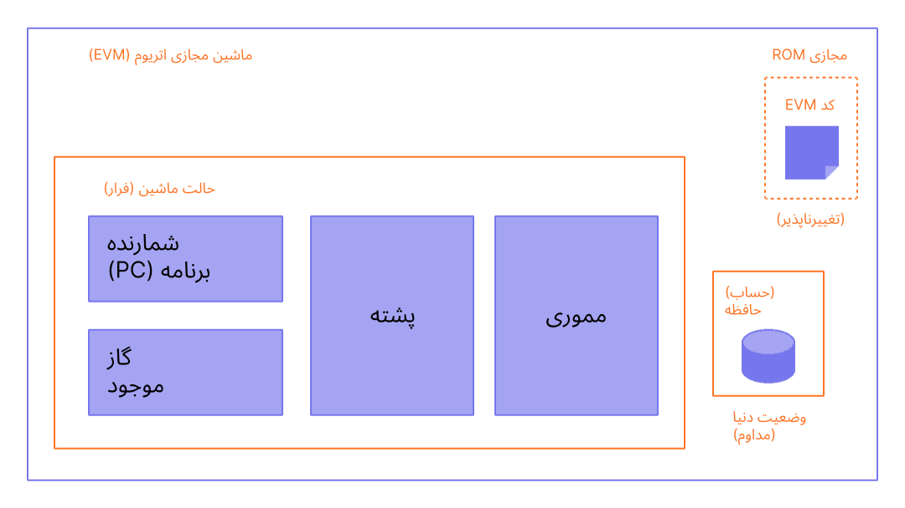

ماشین مجازی اتریوم (EVM) یک محیط مجازی غیرمتمرکز است که کد را به طور مداوم و ایمن در تمام گره‌های اتریوم اجرا می‌کند. گره‌ها، EVM را برای اجرای قراردادهای هوشمند، با استفاده از "[گس](/gas/)" برای اندازه گیری تلاش محاسباتی مورد نیاز برای [عملیات‌ها](/developers/docs/evm/opcodes/) اجرا می کنند و تخصیص کارآمد منابع و امنیت شبکه را تضمین می‌کنند.

## پیش‌نیازها {#prerequisites}

برای درک EVM آشنایی اولیه با اصطلاحات رایج در علوم کامپیوتر مانند [بایت](https://wikipedia.org/wiki/Byte)،‏ [حافظه](https://wikipedia.org/wiki/Computer_memory) و یک [پشته](https://wikipedia.org/wiki/Stack_(abstract_data_type)) ضروری است. همچنین راحت بودن با مفاهیم رمزنگاری/بلاکچین مانند [توابع هش](https://wikipedia.org/wiki/Cryptographic_hash_function) و مفید خواهد بود[درخت مرکل](https://wikipedia.org/wiki/Merkle_tree).

## از دفتر کل تا ماشین حالات متناهی {#from-ledger-to-state-machine}

تشبیه «دفتر کل توزیع‌شده» اغلب برای توصیف زنجیره‌های بلوکی مانند بیت‌کوین استفاده می‌شود که یک ارز غیرمتمرکز را با استفاده از ابزارهای بنیادین رمزنگاری امکان‌پذیر می‌سازد. دفتر کل سوابقی از فعالیت ها را حفظ می کند که باید به مجموعه ای از قوانین پایبند باشد که آنچه را که شخص می تواند و نمی تواند انجام دهد تا دفتر کل را اصلاح کند، تعیین می کنند. به عنوان مثال، یک آدرس بیت کوین نمی‌تواند بیت کوین بیشتری از آنچه قبلا دریافت کرده است خرج کند. این قوانین زیربنای تمامی تراکنش‌های بیت‌کوین و بسیاری از زنجیره‌های بلوکی دیگر است.

در حالی که اتریوم دارای رمزارز بومی خود (اتر) است که تقریباً به‌طور کامل از قوانین شهودی مشابهی پیروی می‌کند، کارکرد بسیار قدرتمندتری را نیز ممکن می‌سازد: [قراردادهای هوشمند](/developers/docs/smart-contracts/). برای این ویژگی پیچیده‌تر، قیاس پیچیده‌تری نیز لازم است. به جای یک دفتر کل توزیع شده، اتریوم یک [ماشین حالات متناهی](https://wikipedia.org/wiki/Finite-state_machine) توزیع‌شده است. وضعیت اتریوم یک ساختار داده‌ی بزرگ است که نه‌تنها همه حساب‌ها و موجودی‌ها را در خود نگه می‌دارد، بلکه _وضعیت ماشین_ را نیز در خود جای می‌دهد که می‌تواند طبق مجموعه‌ای از قوانین از پیش تعریف‌شده از بلوکی به بلوک دیگر تغییر کند و کد ماشینی دلخواه را اجرا کند. قوانین خاص تغییر حالت از بلوک به بلوک توسط EVM تعریف شده است.

 _نمودار برگرفته از[‏Ethereum EVM illustrated‏](https://takenobu-hs.github.io/downloads/ethereum_evm_illustrated.pdf)_

## تابع گذار حالت اتریوم {#the-ethereum-state-transition-function}

EVM مانند یک تابع ریاضی عمل می‌کند: با توجه به یک ورودی، یک خروجی قطعی تولید می‌کند. از این رو توصیف رسمی‌تر اتریوم به عنوان دارنده‌ی یک **تابع گذار وضعیت** بسیار مفید است:

```
Y(S, T)= S'
```

با توجه به یک وضعیت معتبر قدیمی `(S)` و مجموعه جدیدی از تراکنش‌های معتبر `(T)`، تابع گذار وضعیت اتریوم `Y(S, T)` یک وضعیت خروجی معتبر جدید `S'` ایجاد می‌کند

### وضعیت {#state}

در زمینه‌ی اتریوم، وضعیتْ یک ساختار داده‌ای عظیم به نام [درخت مارکل پاتریشیای اصلاح‌شده](/developers/docs/data-structures-and-encoding/patricia-merkle-trie/) است که همه‌ی [حساب‌ها](/developers/docs/accounts/) را با هش مرتبط نگه می‌دارد و به یک هش ریشه‌ای که در زنجیره‌ی بلوکی ذخیره‌شده قابل تقلیل است.

### تراکنش‌ها {#transactions}

تراکنش‌ها دستورالعمل‌هایی هستند که به صورت رمزنگاری از حساب‌ها امضا می‌شوند. دو نوع تراکنش وجود دارد: آن‌هایی که منجر به فراخوانی یک پیام می‌شوند و آن‌هایی که منجر به ایجاد یک قرارداد می‌شوند.

ایجاد قرارداد منجر به ایجاد یک حساب قرارداد جدید می‌شود که حاوی [قرارداد هوشمند](/developers/docs/smart-contracts/anatomy/) بایت‌کد کامپایل‌شده است. هر زمان که حساب دیگری یک پیام فراخوانی با آن قرارداد برقرار کند، بایت‌کد آن قرارداد را اجرا می‌کند.

## دستورالعمل‌های EVM {#evm-instructions}

EVM به صورت یک [ماشین پشته‌ای](https://wikipedia.org/wiki/Stack_machine) با عمق 1024 آیتم اجرا می‌شود. هر آیتم یک کلمه‌ی 256 بیتی است که برای سهولت استفاده با رمزنگاری 256 بیتی (مانند هش Keccak-256 یا امضاهای secp256k1) انتخاب شده است.

در طول اجرا، EVM یک _حافظه_ گذرا (به عنوان یک آرایه بایت آدرس‌دهی کلمه) را حفظ می‌کند که بین تراکنش‌ها باقی نمی‌ماند.

با این حال، قراردادها حاوی یک درخت _حافظه_ مرکل پاتریشیا (به‌عنوان یک آرایه کلمه قابل آدرس‌دهی به کلمه) هستند که با حساب موردنظر و بخشی از حالت همگانی مرتبط است.

بایت‌کد قرارداد هوشمند کامپایل‌شده به صورت تعدادی [کدگذاری‌های‏](/developers/docs/evm/opcodes) EVM اجرا می‌شود که عملیات‌های استاندارد پشته مانند `XOR‏`،‏ `AND‏ `، `ADD`،‏ `SUB` و غیره را انجام می‌دهد. EVM همچنین تعدادی عملیات پشته‌ی مخصوص زنجیره‌ی بلوکی را نیز اجرا می‌کند، مانند `ADDRESS`،‏ `BALANCE`،‏ `BLOCKHASH` و غیره.

 _نمودارها برگرفته از[‏Ethereum EVM illustrated‏](https://takenobu-hs.github.io/downloads/ethereum_evm_illustrated.pdf)_

## پیاده‌سازی EVM {#evm-implementations}

تمام پیاده‌سازی‌های EVM باید به مشخصاتی که در یلو پیپر اتریوم توضیح داده شده است پایبند باشند.

در تاریخ 9 ساله اتریوم، EVM دست‌خوش چندین بازنگری شده است و چندین اجرا و پیاده‌سازی از EVM در زبان های مختلف برنامه نویسی وجود دارد.

[کاربرهای اجرای اتریوم](/developers/docs/nodes-and-clients/#execution-clients) شامل یک اجرای EVM هستند. علاوه بر این، چندین اجرای مستقل وجود دارد، از جمله:

- [Py-EVM](https://github.com/ethereum/py-evm) ‏- _‏پایتون_
- [evmone](https://github.com/ethereum/evmone) ‏- _سی‌پلاس‌پلاس_
- [ethereumjs-vm](https://github.com/ethereumjs/ethereumjs-vm) ‏- _جاوا اسکریپت_
- [revm](https://github.com/bluealloy/revm) - _Rust_

## اطلاعات بیشتر {#further-reading}

- [یلو پیپر اتریوم](https://ethereum.github.io/yellowpaper/paper.pdf)
- [Jellopaper با نام مستعار KEVM: معناشناسی EVM در K](https://jellopaper.org/)
- [بژپیپر](https://github.com/chronaeon/beigepaper)
- [کدگذاری‌های ماشین مجازی اتریوم](https://www.ethervm.io/)
- [مرجع تعاملی کدگذاری های ماشین مجازی اتریوم](https://www.evm.codes/)
- [مقدمه‌ای کوتاه در مستندات Solidity](https://docs.soliditylang.org/en/latest/introduction-to-smart-contracts.html#index-6)
- [تسلط بر اتریوم - ماشین مجازی اتریوم](https://github.com/ethereumbook/ethereumbook/blob/develop/13evm.asciidoc)

## موضوعات مرتبط {#related-topics}

- [گاز](/developers/docs/gas/)
