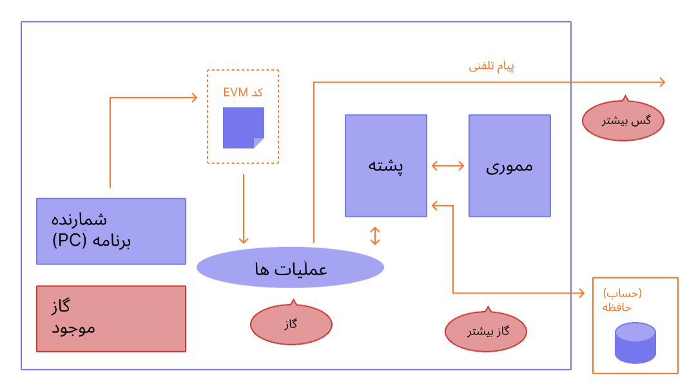
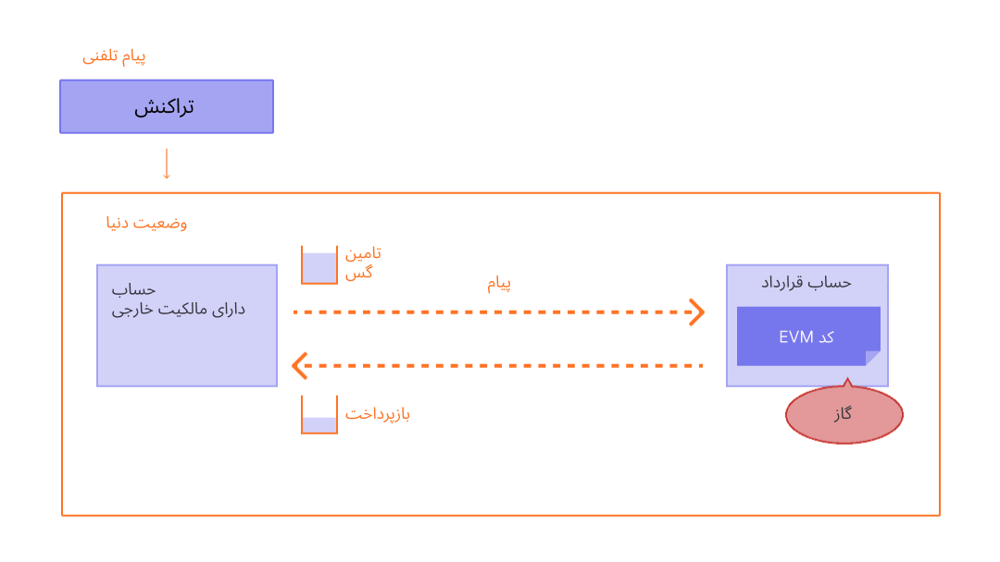

گاز برای شبکه‌ی اتریوم حیاتی است. سوختی است که به شبکه امکان کار کردن می‌دهد، همان‌طور که یک اتومبیل نیاز به بنزین دارد.

## پیش‌نیازها {#prerequisites}

برای درک بهتر این صفحه، توصیه می‌شود که ابتدا [تراکنش‌ها](/developers/docs/transactions/) و [ماشین مجازی اتریوم](/developers/docs/evm/) را مطالعه کنید.

## گاز چیست؟ {#what-is-gas}

گاز به واحدی گفته می‌شود که میزان زحمت محاسباتی موردنیاز را برای اجرای یک عمل خاص در شبکه‌ی اتریوم اندازه‌گیری می‌کند.

از آنجا که هر تراکنش اتریوم برای اجرا به منابع محاسباتی نیاز دارد، این منابع باید پرداخت شوند تا اطمینان حاصل شود که اتریوم در برابر اسپم آسیب پذیر نیست و نمی تواند در حلقه های محاسباتی نامحدود گیر کند. پرداخت برای محاسبه به شکل کارمزد گاز انجام می شود.

کارمزد گاز **مقدار گازی است که برای انجام عملیات استفاده می شود، ضربدر هزینه هر واحد گاز**. کارمزد صرف نظر از موفقیت یا شکست یک تراکنش پرداخت می شود.

 _نمودار برگرفته از [Ethereum EVM illustrated](https://takenobu-hs.github.io/downloads/ethereum_evm_illustrated.pdf)_

کارمزد گاز باید با ارز بومی اتریوم یعنی اتر (ETH) پرداخت شود. قیمت گاز معمولا برحسب Gwei، که یکی از شاخه های ETH است، بیان می شود. هر Gwei برابر با یک میلیاردم ETH است (0.000000001 ETH یا 10-9 ETH).

برای مثال به جای این که بگوییم گاز 0.000000001 اتر است، می‌توانید بگویید گاز به انداره‌ 1 gwei است.

کلمه 'Gwei' مخفف 'Giga-wei' است که به معنای 'میلیارد wei' است. یک Gwei برابر یک میلیارد wei است. Wei (نام‌گذاری شده از [wei Dai](https://wikipedia.org/wiki/Wei_Dai) سازنده‌ [b-money](https://www.investopedia.com/terms/b/bmoney.asp)) خود کوچکترین واحد اتر است.

## چگونه کارمزدهای گاز محاسبه می شوند؟ {#how-are-gas-fees-calculated}

می توانید مقدار گازی را که مایل به پرداخت آن هستید در هنگام ارائه یک تراکنش تنظیم کنید. با پیشنهاد مقدار مشخصی گاز، پیشنهاد می کنید که تراکنش شما در بلاک بعدی قرار گیرد. اگر مبلغ بسیار کمی پیشنهاد دهید، اعتبارسنج ها احتمال کمتری دارند که تراکنش شما را برای ورود انتخاب کنند، به این معنی که ممکن است تراکنش شما دیر انجام شود یا اصلا انجام نشود. اگر بیش از حد پیشنهاد دهید، ممکن است مقداری ETH را هدر دهید. بنابراین، چگونه می توانید بگویید که چقدر باید پرداخت کنید؟

مجموع گاز که پرداخت می کنید به دو بخش تقسیم می شود: `کارمزد پایه` و `کارمزد اولویت` (انعام).

`کارمزد پایه` توسط پروتکل تعیین می شود - شما باید حداقل این مبلغ را پرداخت کنید تا تراکنش شما معتبر تلقی شود. `کارمزد اولویت` انعامی است که شما به کارمزد پایه اضافه می کنید تا تراکنش شما برای اعتبارسنجان جذاب شود تا آنها آن را برای ورود به بلاک بعدی انتخاب کنند.

تراکنشی که تنها `کارمزد پایه` را پرداخت می کند، از نظر فنی معتبر است اما احتمال شامل شدن آن بعید به نظر می رسد زیرا هیچ انگیزه ای برای اعتبارسنجان وجود ندارد که آن را نسبت به تراکنش های دیگر انتخاب کنند. کارمزد `اولویت` "صحیح" با استفاده از شبکه در زمانی که تراکنش خود را ارسال می کنید تعیین می شود - اگر تقاضای زیادی وجود داشته باشد، ممکن است مجبور شوید کارمزد `اولویت` خود را بالاتر تنظیم کنید، اما وقتی تقاضای کمتری وجود داشته باشد، می توانید هزینه کمتری پرداخت کنید.

برای مثال، فرض کنید جردن باید 1 ETH به تیلور بپردازد. یک انتقال ETH به 21000 واحد گاز نیاز دارد و هزینه پایه 10 Gwei است. جردن 2 gwei را به‌عنوان انعام اضافه می‌کند.

حال هزینه کل برابر است با:

`واحدهای گاز مصرفی * (کارمزد پایه + کارمزد اولویت)`

که در آن `کارمزد پایه` مقداری است که توسط پروتکل تعیین می شود و `کارمزد اولویت` مقداری است که توسط کاربر به عنوان انعام به اعتبارسنج تعیین می شود.

یعنی `21,000 * (10 + 2) = 252,000 Gwei` (یا 0.000252 ETH).

زمانی که جردن پول را می‌فرستد، 1.000252 اتر از حساب جردن کم می‌شود. تیلور 1.0000 اتر دریافت می‌کند. اعتبارسنج انعام 0.000042 ETH را دریافت می کند. `هزینه پایه` به مقدار 0.00021 ETH سوزانده می شود.

### کارمزد پایه {#base-fee}

هر بلوک یک کارمزد پایه دارد که به‌عنوان قیمت ذخیره عمل می‌کند. جهت احراز شرایط برای گنجانده‌ شدن در بلوک، قیمت ارائه‌ شده برای گاز باید حداقل به اندازه‌ کارمزد پایه باشد. کارمزد پایه به‌طور مستقل از این بلوک محاسبه می‌شود و توسط بلوک‌های قبلی مشخص می‌شود - که باعث می‌شود کارمزدهای تراکنش برای کاربران پیش‌بینی‌پذیرتر باشند. هنگامی که بلوک ایجاد می شود این **هزینه پایه "سوزانده" می شود** و از گردش خارج می شود.

کارمزد پایه توسط فرمولی که اندازه‌ بلوک قبلی (مقدار گازی که توسط تمام تراکنش‌ها استفاده می‌شود) را با اندازه‌ هدف مقایسه می‌کند، محاسبه می‌شود. اگر اندازه‌ بلوک از اندازه‌ هدف بلوک بیشتر شود، کارمزد پایه حداکثر به اندازه‌ ‎12.5%‏ در هر بلوک افزایش می‌یابد. این رشد نمایی باعث می‌شود که از نظر اقتصادی به‌صرفه نباشد که اندازه‌ بلوک تا ابد بالا بماند.

| شماره‌ی بلوک | گاز لحاظ‌شده | افزایش کارمزد | کارمزد پایه‌ی فعلی |
| ------------ | ------------:| -------------:| ------------------:|
| 1            |    15 میلیون |            0% |           100 gwei |
| 2            |    30 میلیون |            0% |           100 gwei |
| 3            |    30 میلیون |         12.5% |         112.5 gwei |
| 4            |    30 میلیون |         12.5% |         126.6 gwei |
| 5            |    30 میلیون |         12.5% |         142.4 gwei |
| 6            |    30 میلیون |         12.5% |         160.2 gwei |
| 7            |    30 میلیون |         12.5% |         180.2 gwei |
| 8            |    30 میلیون |         12.5% |         202.7 gwei |

با توجه به جدول فوق - برای ثبت یک تراکنش در بلوک شماره‌ 9 یک کیف پول به کاربر اجازه می‌دهد که با قطعیت بداند که **حداکثر کارمزد پایه** که به بلوک بعدی اضافه می‌شود برابر با `کارمزد پایه‌ فعلی * ‎112.5%‏` یا `202.7 gwei * 112.5% = 228.1 gwei` خواهد بود.

همچنین باید خاطرنشان کرد احتمال اینکه بلوک‌های پر ادامه پیدا کنند، به دلیل سرعت بالا رفتن کارمزد پایه قبل از یک بلوک‌ پر، کم است.

| شماره‌ی بلوک | گاز لحاظ‌شده | افزایش کارمزد | کارمزد پایه‌ی فعلی |
| ------------ | ------------:| -------------:| ------------------:|
| 30           |    30 میلیون |         12.5% |        2705.6 gwei |
| ...          |          ... |         12.5% |                ... |
| 50           |    30 میلیون |         12.5% |       28531.3 gwei |
| ...          |          ... |         12.5% |                ... |
| 100          |    30 میلیون |         12.5% |    10302608.6 gwei |

### کارمزد اولویت (انعام) {#priority-fee}

کارمزد اولویت (انعام) اعتبارسنجان را تشویق می کند تا یک تراکنش را در بلوک بگنجانند. بدون انعام، برای اعتبارسنجان از نظر اقتصادی به صرفه است که بلوک‌های خالی را استخراج کنند چرا که همان میزان پاداش بلوک را دریافت می‌کنند. انعام های کم به اعتبارسنجان انگیزه حداقلی برای گنجاندن یک تراکنش می دهند. برای این که تراکنش‌ها ترجیحاً زودتر از بقیه‌ تراکنش‌ها در بلوک یکسان گنجانده شوند، انعام بیشتری می تواند اضافه شود تا از تراکنش های رقیب پیشی بگیرند.

### حداکثر کارمزد {#maxfee}

برای اجرای یک تراکنش در شبکه، کاربران می‌توانند برای پرداخت کارمزد تراکنششان سقف مشخص کنند. این پارامتر دلخواه به نام `maxFeePerGas` شناخته می‌شود. برای اجرای یک تراکنش، حداکثر کارمزد باید از مجموع کارمزد پایه و انعام بیشتر باشد. فرستنده‌ تراکنش تفاضل حداکثر کارمزد و مجموع کارمزد پایه و انعام را بازپس خواهد گرفت.

### اندازه‌ بلوک {#block-size}

هر بلوک اندازه‌ هدفی به اندازه‌ 15 میلیون گاز دارد اما سایز بلوک‌ها می‌تواند بسته به تقاضای شبکه‌ بیشتر یا کمتر شود و بیشترین حد آن 30 میلیون گاز است (2 برابر اندازه‌ بلوک). پروتکل از طریق فرایند _tâtonnement_ به‌طور میانگین به اندازه‌ بلوک متوازن 15 میلیون دست می‌یابد. این بدین معنا است که اگر اندازه‌ بلوک از اندازه‌ هدف بلوک بیشتر باشد، پروتکل کارمزد پایه‌ را برای بلوک بعدی بیشتر می‌کند. به صورتی مشابه، پروتکل زمانی که اندازه‌ بلوک از اندازه‌ هدف بلوک کمتر باشد کارمزد پایه‌ را کاهش می‌دهد. مقداری که کارمزد پایه با آن تنظیم می‌شود بستگی به فاصله‌ اندازه‌ بلوک از اندازه‌ هدف دارد. [اطلاعات بیشتر درباره‌ بلوک‌ها](/developers/docs/blocks/).

### محاسبه کارمزدهای گاز در عمل {#calculating-fees-in-practice}

می توانید به صراحت اعلام کنید که برای اجرای تراکنش خود حاضر به پرداخت چه مبلغی هستید. با این حال، اکثر ارائه دهندگان کیف پول به طور خودکار کارمزد تراکنش پیشنهادی (کارمزد پایه + کارمزد اولویت توصیه شده) را تنظیم خواهند کرد تا میزان پیچیدگی تحمیل شده بر کاربران خود را کاهش دهند.

## چرا کارمزد گاز وجود دارد؟ {#why-do-gas-fees-exist}

به طور خلاصه، کارمزد گاز به حفظ امنیت شبکه اتریوم کمک می‌کند. با درخواست کارمزد برای اجرای هر محاسبه روی شبکه، ما از اسپم کردن شبکه توسط خرابکاران جلوگیری می‌کنیم. برای جلوگیری از حلقه‌های بینهایت خواسته یا ناخواسته یا دیگر هدررفت‌های محاسباتی در کد، هر تراکنش لازم است مشخص کند که چند گام محاسباتی از اجرای کد را می‌تواند استفاده کند. واحد محاسباتی پایه «گاز» است.

هر چند که تراکنش حدی دارد، اما گاز استفاده نشده در یک تراکنش به کاربر بازگردانده می‌شود (یعنی `حداکثر کارمزد - (کارمزد پایه + انعام)` برگردانده می‌شود).

 _نمودار برگرفته از [Ethereum EVM illustrated](https://takenobu-hs.github.io/downloads/ethereum_evm_illustrated.pdf)_

## حد گاز چیست؟ {#what-is-gas-limit}

حد گاز به حداکثر میزان گازی که می‌خواهید برای یک تراکنش مصرف کنید گفته می‌شود. تراکنش‌های پیچیده‌تر شامل [قراردادهای هوشمند](/developers/docs/smart-contracts/) نیاز به کار محاسباتی بیشتر دارند، در نتیجه نسبت به یک پرداخت ساده نیاز به حد گاز بالاتری دارند. یک انتقال استاندارد اتر نیاز به حد گازی برابر با 21,0000 واحد گاز دارد.

برای مثال اگر حد گاز را برای یک انتقال ساده‌ اتر برابر با 50,000 قرار دهید، ماشین مجازی اتریوم 21,000 عدد را مصرف کرده و شما 29,000 عدد مانده را پس می‌گیرید. هر چند، اگر گاز بسیار پایینی مشخص کنید، برای مثال حد گاز برابر 20,000 برای یک انتقال ساده‌ اتر، ماشین مجازی اتریوم همه‌ 20,000 واحد گاز را مصرف می‌کند تا تراکنش را انجام دهد اما تراکنش کامل نخواهد شد. ماشین مجازی اتریوم همه‌ تغییرات را برمی‌گرداند اما از آنجا که اعتبارسنج به اندازه‌ 20,000 واحد گاز کار کرده‌ است، آن گاز مصرف می‌شود.

## چرا کارمزد گاز می‌تواند انقدر زیاد شود؟ {#why-can-gas-fees-get-so-high}

بالا بودن کارمزد گاز به دلیل محبوبیت اتریوم است. اگر تقاضای بیش از حد وجود داشته باشد، کاربران باید انعام بیشتری بدهند تا تلاش کنند از تراکنش‌های دیگر کاربران جلو بیفتند. انعام بیشتر می‌تواند باعث شود احتمال اینکه تراکنش در بلوک بعدی ثبت شود بیشتر شود. همچنین، اپلیکیشن های پیچیده‌تر قرارداد هوشمند ممکن است عملیات زیادی برای پشتیبانی از عملکردهای خود انجام دهند و باعث شوند آن ها گاز زیادی مصرف کنند.

## ابتکارها برای کاهش هزینه‌های گاز {#initiatives-to-reduce-gas-costs}

[ارتقاهای مقیاس‌پذیری](/roadmap/) اتریوم در نهایت باید به برخی از مسائل مربوط به کارمزد گاز رسیدگی کند، که به نوبه‌ خود، پلتفرم را قادر می‌سازد تا هزاران تراکنش را در ثانیه پردازش کند و در سطح جهانی مقیاس‌پذیر شود.

مقیاس‌پذیری لایه‌ 2 یک ابتکار اولیه برای بهبود هزینه‌ گاز، تجربه کاربری و مقیاس‌پذیری است. [اطلاعات بیشتر درباره‌ مقیاس‌پذیری لایه‌ 2](/developers/docs/scaling/#layer-2-scaling).

## نظارت بر کارمزدهای گس {#monitoring-gas-fees}

اگر می‌خواهید قیمت گاز را رصد کنید، تا بتوانید اترتان را با هزینه‌ کمتری بفرستید، می‌توانید از ابزارهای متفاوتی مثل موارد زیر استفاده کنید:

- [Etherscan](https://etherscan.io/gastracker) _تخمین‌زننده‌ی قیمت گاز تراکنش_
- [Blocknative ETH Gas Estimator](https://chrome.google.com/webstore/detail/blocknative-eth-gas-estim/ablbagjepecncofimgjmdpnhnfjiecfm) _افزونه‌ Chrome برای تخمین گاز با پشتیبانی تراکنش‌های نوع 0 میراث (Legacy) و تراکنش‌های نوع 2 EIP-1559‏._
- [ماشین حساب کارمزد گاز Cryptoneur](https://www.cryptoneur.xyz/gas-fees-calculator) _کارمزد گاز را برای انواع مختلف تراکنش در Mainnet و Arbitrum و Polygon به ارز محلی خود محاسبه کنید._

## ابزارهای مرتبط {#related-tools}

- [پلتفرم گاز Blocknative‏](https://www.blocknative.com/gas) _وب سرویس تخمین گاز تحت پشتیبانی پلفترم داده‌ استخر حافظه‌ جهانی Blocknative‏_

## بیشتر بخوانید {#further-reading}

- [توضیحی درباره‌ی گاز اتریوم](https://defiprime.com/gas)
- [کاهش مصرف گاز قراردادهای هوشمندتان](https://medium.com/coinmonks/8-ways-of-reducing-the-gas-consumption-of-your-smart-contracts-9a506b339c0a)
- [اثبات سهام در مقابل اثبات کار](https://blockgeeks.com/guides/proof-of-work-vs-proof-of-stake/)
- [استراتژی های بهینه‌سازی گاز برای توسعه دهندگان](https://www.alchemy.com/overviews/solidity-gas-optimization)
- [اسناد EIP-1559](https://eips.ethereum.org/EIPS/eip-1559).
- [منابع تیم بیکو درباره EIP-1559](https://hackmd.io/@timbeiko/1559-resources).
