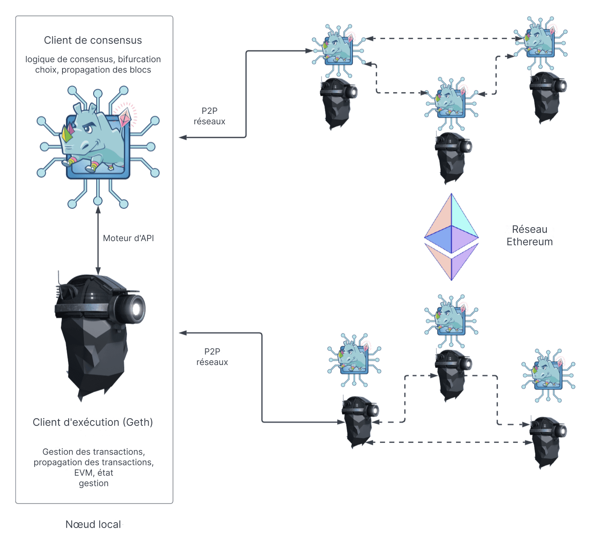

Un nœud Ethereum est composé de deux clients : un [client d'exécution](/developers/docs/nodes-and-clients/#execution-clients) et un [client de consensus](/developers/docs/nodes-and-clients/#consensus-clients).

Lorsque Ethereum utilisait la [preuve de travail](/developers/docs/consensus-mechanisms/pow/), un client d'exécution était suffisant pour exécuter un nœud Ethereum complet. Cependant, depuis la mise en œuvre de la [preuve d'enjeu](/developers/docs/consensus-mechanisms/pow/), le client d'exécution doit être utilisé en parallèle avec un autre logiciel appelé [« client de consensus »](/developers/docs/nodes-and-clients/#consensus-clients).

Le diagramme ci-dessous montre la relation entre les deux clients Ethereum. Les deux clients se connectent à leurs propres réseaux peer-to-peer (P2P) respectifs. Des réseaux P2P séparés sont nécessaires car les clients d'exécution propagent les transactions sur leur réseau P2P, leur permettant de gérer leur pool de transactions local, tandis que les clients de consensus propagent les blocs sur leur réseau P2P, permettant le consensus et l'accroissement de la chaîne.

Pour que cette structure à deux clients fonctionne, les clients de consensus doivent être en mesure de transmettre des paquets de transactions au client d'exécution. L'exécution locale des transactions permet au client de valider le fait que les transactions ne violent aucune règle d'Ethereum et que la mise à jour proposée de l'état d'Ethereum soit correcte. De même, lorsque le nœud est sélectionné pour être un producteur de blocs, le client de consensus doit être en mesure de demander à Geth des lots de transactions à inclure dans le nouveau bloc et de les exécuter pour mettre à jour l'état global. Cette communication inter-clients est gérée par une connexion RPC locale utilisant le [moteur API](https://github.com/ethereum/execution-apis/blob/main/src/engine/common.md).

## Que fait le client d'exécution ? {#execution-client}

Le client d'exécution est responsable de la gestion des transactions, de la propagation des transactions, de la gestion de l'état et du fonctionnement de la Machine Virtuelle Ethereum ([EVM](/developers/docs/evm/)). Cependant, il n'est **pas** responsable de la construction de blocs, de leur propagation ou de la gestion de la logique de consensus. Ces responsabilités relèvent du client de consensus.

Le client d'exécution crée des charges utiles d'exécution - la liste des transactions, la trie d'état mise à jour, et d'autres données liées à l'exécution. Les clients de consensus incluent la charge utile d'exécution dans chaque bloc. Le client d'exécution est également responsable de réexécuter les transactions dans les nouveaux blocs pour s'assurer qu'elles sont valides. L'exécution des transactions est effectuée sur l'ordinateur intégré du client d'exécution, connu sous le nom de [Machine Virtuelle Ethereum (EVM)](/developers/docs/evm).

Le client d'exécution offre également une interface utilisateur pour Ethereum via la [fonction RPC](/developers/docs/apis/json-rpc) qui permet aux utilisateurs de consulter la blockchain Ethereum, de soumettre des transactions et de déployer des contrats intelligents. Il est courant que les appels RPC soient gérés par une bibliothèque telle que [Web3js](https://docs.web3js.org/), [Web3py](https://web3py.readthedocs.io/en/v5/), ou par une interface utilisateur telle qu'un portefeuille de navigateur.

En résumé, le client d'exécution est :

- une passerelle utilisateur vers Ethereum
- le siège de la machine virtuelle Ethereum, de l'état d'Ethereum et du pool de transactions.

## Que fait le client de consensus ? {#consensus-client}

Le client de consensus s'occupe de toute la logique qui permet à un nœud de rester synchronisé avec le réseau Ethereum. Cela comprend la réception de blocs de pairs et l'exécution d'un algorithme de choix de fourche pour garantir que le nœud suive toujours la chaîne avec la plus grande accumulation d'attestations (pondérées par les soldes effectifs des validateurs). Semblable au client d'exécution, les clients de consensus ont leur propre réseau P2P à travers lequel ils partagent les blocs et les attestations.

Le client de consensus ne participe pas à l'attestation ou à la proposition de blocs - cela est fait par un validateur, un module complémentaire facultatif d'un client de consensus. Un client de consensus sans validateur ne suit que la tête de la chaîne, permettant au nœud de rester synchronisé. Cela permet à un utilisateur de réaliser des transactions avec Ethereum en utilisant son client d'exécution, en étant sûr qu'il se trouve sur la chaîne correcte.

## Validateurs {#validators}

Les opérateurs de nœuds peuvent ajouter un validateur à leurs clients de consensus en déposant 32 ETH dans le contrat de dépôt. Le client de validation inclut le client de consensus et peut être ajouté à un nœud à tout moment. Le validateur gère les attestations et les propositions de blocs. Ils permettent à un nœud d'accumuler des récompenses ou de perdre de l'ETH par des pénalités ou des sanctions. Exécuter le logiciel de validation rend également un nœud éligible pour être sélectionné afin de proposer un nouveau bloc.

[En savoir plus sur les mises](/staking/).

## Comparaison des composants d'un nœud {#node-comparison}

| Client d'exécution                                 | Client de consensus                                                        | Validateur                         |
| -------------------------------------------------- | -------------------------------------------------------------------------- | ---------------------------------- |
| Diffuse les transactions via son réseau p2p        | Diffuse les blocs et les attestations via son réseau p2p                   | Propose des blocs                  |
| Exécute/ré-exécute les transactions                | Exécute l'algorithme de choix de fourche                                   | Accumule des récompenses/pénalités |
| Vérifie les changements d'état entrants            | Assure le suivi de la tête de chaîne                                       | Émet des attestations              |
| Gère les essais d'état et les essais de reçus      | Gère l'état Beacon (contient les informations de consensus et d'exécution) | Nécessite 32 ETH mis en jeu        |
| Crée la charge utile d'exécution                   | Conserve une trace de l'accumulation de l'aléatoire dans RANDAO            | Peut être pénalisé                 |
| Expose l'API JSON-RPC pour interagir avec Ethereum | Suit la justification et la finalisation des blocs                         |                                    |

## Complément d'information {#further-reading}

- [Preuve d'enjeu](/developers/docs/consensus-mechanisms/pos)
- [Proposition de bloc](/developers/docs/consensus-mechanisms/pos/block-proposal)
- [Récompenses et pénalités du validateur](/developers/docs/consensus-mechanisms/pos/rewards-and-penalties)
