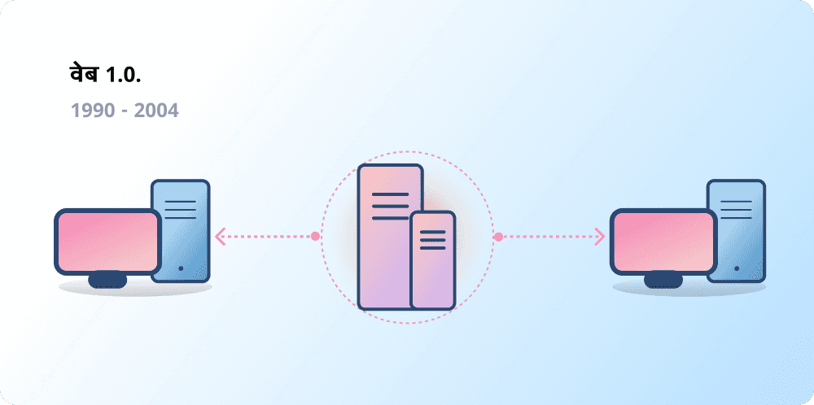
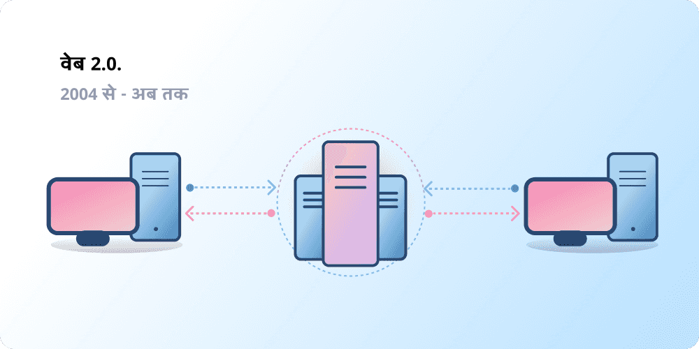
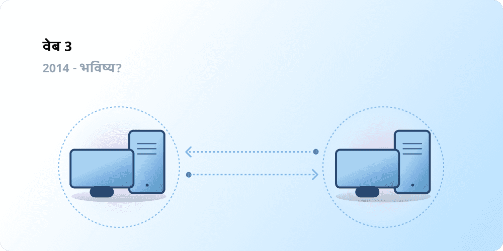

# Web3 का परिचय {#introduction}

केंद्रीकरण की मदद से अरबों लोग वर्ल्ड वाइड वेब से जुड़े है और इसके स्थिर, मजबूत बुनियादी ढांचे का निर्माण किया है जिस पर यह जीवित है। साथ ही, वर्ल्ड वाइड वेब के बड़े हिस्से पर कुछ केंद्रीकृत संस्थाओं का दबदबा है, जो एक तरफा निर्णय लेते हैं कि क्या अनुमति दी जानी चाहिए और क्या नहीं।

Web3 इस दुविधा का उत्तर है। बड़ी तकनीकी कंपनियों के एकाधिकार वाले वेब के बजाय, Web3 विकेंद्रीकरण को अपनाता है और इसका निर्माण, संचालन और स्वामित्व इसके उपयोगकर्ता द्वारा किया जाता है। Web3 सत्ता को निगमों के बजाय लोगो के हाथों में देता है। Web3 के बारे में बात करने के पहले, आइए जानें कि हम यहां तक कैसे पहुंचे।

<Divider />

## प्रारंभिक वेब {#early-internet}

जबसे इसका आविष्कार किया गया था और जब से यह मौजूद है - अधिकतर लोग वेब को आधुनिक जीवन का एक सतत स्तंभ सोचते है। हालाँकि, आज जिस वेब को हममें से अधिकतर लोग जानते है वह उसकी वास्तविक कल्पना से बिलकुल अलग है। इसे अच्छे से समझने के लिए, इसके संक्षिप्त इतिहास को चोटी अवधियों में तोड़ना मददगार होगा - वेब 1.0 और वेब 2.0।

### वेब 1.0: रीड-ऑनली (1990-2004) {#web1}

1989 में, CERN, जेनेवा में, टीम बर्नर्स-ली ऐसा प्रोटोकॉल विकसित करने में व्यस्त थे, जो वर्ल्ड वाइड वेब बना। उसका विचार? खुला, विकेंद्रीकृत प्रोटोकॉल का निर्माण करे, जिसे धरती से कही भी जानकारी साझा करने में सक्षम बनाए।

बर्नर्स-ली की रचना का पहला सूत्रपात, अब उसे "वेब 1.0" से जाना जाता है, लगभग 1990 से 2004 के बीच बनाया गया था। वेब 1.0 मुख्य तौर पर कंपनियों के स्वामित्व में स्थिर वेबसाइट थी, और उपयोगकर्ता के बीच न के बराबर बातचीत होती थी - व्यक्तियों ने शायद ही कोई कंटेंट बनाया होगा - इस कारणवश इसे रीड ऑनली के रूप में जाना जाने लगा।

### वेब 2.0: रीड-राईट (2004-अब तक) {#web2}

वेब 2.0 का समय 2004 में सोशल मीडिया प्लेटफार्म के साथ शुरू हुआ। वेब केवल-पढ़ने के बजाय पढ़ने-लिखने के रूप में विकसित हुआ। कंपनियों ने यूज़र को सामग्री प्रदान करने की बजाय, प्लेटफार्म प्रदान करने शुरू कर दिए जिसकी मदद से वह यूज़र द्वारा विकसित सामग्री साझा कर सके और यूज़र से यूज़र का विचार विमर्श बढ़ा सके। जैसे-जैसे अधिक लोग ऑनलाइन आए, कुछ कंपनियों ने वेब पर उत्पन्न अनुपातहीन ट्रैफ़िक और मुनाफे की मात्रा को नियंत्रित करना शुरू कर दिया। वेब 2.0 ने विज्ञापन-संचालित आय के मॉडल को भी जन्म दिया। हालाँकि उपयोगकर्ता सामग्री बना सकते थे, लेकिन उनके पास इसका स्वामित्व नहीं था और उन्हें इसके मुद्रीकरण से लाभ नहीं हो रहा था।

<Divider />

## वेब 3.0: रीड-राईट-स्वामित्व रखे {#web3}

'Web 3.0' का आधार 2014 में [इथेरियम](/what-is-ethereum/) के लॉन्च होने के तुरंत बाद इथेरियम के सह-संस्थापक गेविन वुड द्वारा तैयार किया गया था। गेविन ने उस समस्या के समाधान को शब्दों में व्यक्त किया जिसे कई शुरुआती क्रिप्टो अपनाने वालों ने महसूस भी किया था: वेब को बहुत अधिक विश्वास की आवश्यकता थी। अर्थात्, ज्यादातर लोग आज जिस वेब को जानते हैं और उपयोग करते हैं, वह लोगो के सर्वोत्तम हित में कार्य करने के लिए कुछ निजी कंपनियों पर भरोसा करने पर निर्भर करता है।

### Web3 क्या है? {#what-is-web3}

Web3 एक नए एवं बेहतर इंटरनेट के दृष्टिकोण का एक सर्वव्यापी शब्द बन गया है। मूलतः, Web3 उपयोगकर्ताओं को स्वामित्व की शक्ति वापस देने के लिए ब्लॉकचेन, क्रिप्टोकरेंसी और NFT का उपयोग करता है। [2020 की एक Twitter पोस्ट में](https://twitter.com/himgajria/status/1266415636789334016) इसे सर्वोत्तम तरीके से बताया गया: Web1 केवल पढ़ने के लिए था, Web2 पढ़ने एवं लिखने के लिए है, Web3 पढ़ने-लिखने एवं स्वमित्व रखने के लिए है।

#### Web3 के मूल विचार {#core-ideas}

हालाँकि Web3 क्या है इसकी एक सटीक परिभाषा सुनिश्चित करना चुनौतीपूर्ण है, कुछ मुख्य सिद्धांत इसके निर्माण को मार्गदर्शित करते हैं।

- **Web3 विकेंद्रीकृत है:** केंद्रीकृत संस्थाओं द्वारा नियंत्रित और स्वामित्व वाले इंटरनेट के बड़े हिस्से के बजाय, स्वामित्व इसके बिल्डरों और यूज़र के बीच वितरित हो जाता है।
- **Web3 अनुमति रहित है:** सभी को Web3 में भाग लेने के लिए समान पहुंच प्राप्त है, और किसी को भी इससे बाहर नहीं रखा गया है।
- **Web3 में मूल भुगतान की सुविधा:** यह ऑनलाइन पैसे भेजने और खर्च करने के लिए क्रिप्टोकरेंसी का इस्तेमाल करता है, न की कई पुराने ढांचों वाले बैंक और भुगतान प्रोसेसर का।
- **Web3 विश्वासहीन है:** यह विश्वसनीय तृतीय-पक्षों पर भरोसा करने के बजाय प्रोत्साहन और आर्थिक तंत्र का उपयोग करके संचालित होता है।

### Web3 महत्वपूर्ण क्यों है? {#why-is-web3-important}

हालाँकि Web3 की सबसे बेहतरीन विशेषताएं कुछ खास नहीं है और साफ-सुथरी श्रेणी में फिट नहीं होती, बस सरलता के लिए हमने आसानी से समझने हेतु उन्हें अलग करने का प्रयास किया।

#### स्वामित्व {#ownership}

Web3 आपको अद्वितीय तरीके से अपनी डिजिटल संपत्तियों का स्वामित्व देता है। उदाहरण के लिए, मान लेते है की आप एक web2 गेम खेल रहे है। अगर आप कोई इन गेम वस्तु खरीदते है तो यह सीधे आपके खाते से बंध जाती है। अगर गेम के निर्माता आपका खाता मिटा दे, तो आप इन वस्तुओं को खो दोगे। या, फिर अगर आप गेम खेलना छोड़ दे, तो आप उन मूल्य को खो देंगे जो इन गेम वस्तुओं में निवेश किया है।

Web3 [अपूरणीय टोकन (NFT)](/glossary/#nft) के माध्यम से सीधे स्वामित्व की अनुमति देता है। गेम के निर्माता या कोई भी, आपके स्वामित्व को हटाने के शक्ति नहीं रखते है। और, अगर आप गेम खेलना छोड़ दे तो आप खुले बाजार में अपनी इन गेम वस्तुओं को बेच या ट्रेड कर सकते है और अपना मूल्य वापस हासिल कर सकते है।

<InfoBanner shouldSpaceBetween emoji=":eyes:">
  
NFT के बारे में अधिक जानें

  <ButtonLink href="/nft/">
    NFT पर अधिक जानकारी
  </ButtonLink>
</InfoBanner>

#### सेंसरशिप प्रतिरोध {#censorship-resistance}

प्लेटफार्म और सामग्री निर्माताओं के बीच शक्ति की क्रियाशीलता बड़े पैमाने पर असंतुलित होती है।

OnlyFans एक यूज़र-जनित वयस्क सामग्री की साइट है जिस पर 1 मिलियन से भी ऊपर की संख्या में सामग्री निर्माता है, जिनमे से अधिकतर प्लेटफार्म का उपयोग अपनी प्राथमिक आय का स्त्रोत के रूप में करते है। अगस्त 2021 में, OnlyFans ने यौन रूप से स्पष्ट सामग्री पर प्रतिबंध लगाने की योजना घोषित कर दी। इस घोषणा से प्लेटफार्म पर निर्माताओं के बीच आक्रोश फैल गया, उन्होंने महसूस किया की जिस प्लेटफार्म के निर्माण में मदद करी है उस पर उनकी आय लूटी जा रही है। प्रतिक्रिया के बाद, तुरंत फैसला पलट दिया गया। बावजूद इसके की निर्माताओं ने यह लड़ाई जीत ली है, यह वेब 2.0 के निर्माताओं के लिए एक समस्या पर प्रकाश डालता है: अगर आप प्लेटफार्म छोड़ देते है तो आपने जो प्रतिष्ठा और यदि आप कोई प्लेटफ़ॉर्म छोड़ते हैं तो आपका अनुसरण अर्जित होता है।

Web3 पर, आपका डाटा ब्लॉकचेन में रहता है। जब आप किसी प्लेटफार्म को छोड़ने का निर्णय लेते है, तब आप अपनी प्रतिष्ठा का उपयोग कर सकते है, किसी दूसरे अन्य इंटरफेस से जुड़ सकते है जो आपके मूल्यों के साथ ज्यादा स्पष्ट रूप से संरेखित करता हैं।

वेब 2.0 के लिए सामग्री निर्माताओं को नियमों में बदलाव न करने के लिए प्लेटफार्म पर विश्वास करने की आवश्यकता है, लेकिन सेंसरशिप प्रतिरोध Web3 प्लेटफार्म की मूल सुविधा है।

#### विकेन्द्रीकृत स्वायत्त संगठन (DAO) {#daos}

Web3 में अपने डेटा के मालिक बनने के साथ ही, आप समूह के रूप में प्लेटफ़ॉर्म के मालिक भी बन सकते हैं, जहाँ टोकन उसी तरह से काम करते हैं जैसे कि किसी कंपनी के शेयर। DAO आपको एक मंच के विकेंद्रीकृत स्वामित्व का समन्वय करने और उसके भविष्य के बारे में निर्णय लेने देते हैं।

डीएओ को तकनीकी रूप से सहमत [स्मार्ट अनुबंध](/glossary/#smart-contract) के रूप में परिभाषित किया गया है जो संसाधनों के एक पूल (टोकन) पर विकेंद्रीकृत निर्णय लेने को स्वचालित करता है। टोकन वाले उपयोगकर्ता इस पर वोट करते हैं कि संसाधन कैसे खर्च किए जाते हैं, और कोड स्वचालित रूप से वोटिंग परिणाम निष्पादित करता है।

हालांकि, लोग Web3 समुदायों को भी बहुत से DAO के रूप में परिभाषित करते हैं। इन सभी समुदायों में कोड द्वारा विकेंद्रीकरण और स्वचालन के विभिन्न स्तर हैं। वर्तमान में, हम यह पता लगा रहे हैं कि DAO क्या हैं और वे भविष्य में कैसे विकसित हो सकते हैं।

<InfoBanner shouldSpaceBetween emoji=":eyes:">
  
डीएओ के बारे में अधिक जानें

  <ButtonLink href="/dao/">
    ड़ाओ पर अधिक
  </ButtonLink>
</InfoBanner>

### पहचान {#identity}

परंपरागत रूप से, आप अपने द्वारा उपयोग किए जाने वाले प्रत्येक प्लेटफ़ॉर्म के लिए एक खाता बनाएंगे। उदाहरण के लिए, आपके पास एक Twitter खाता, एक YouTube खाता और एक Reddit खाता हो सकता है। क्या आप अपना प्रदर्शन नाम या प्रोफ़ाइल चित्र बदलना चाहते हैं? आपको इसे हर खाते में करना होगा। कुछ मामलों में आप सामाजिक साइन-इन का उपयोग कर सकते हैं, लेकिन यह एक जानी-मानी समस्या को उत्पन्न करता है—सेंसरशिप। एक क्लिक में, ये प्लेटफ़ॉर्म आपको आपके पूरे ऑनलाइन जीवन से बाहर कर सकते हैं। और बुरा यह है कि कई प्लेटफ़ॉर्म को आपको खाता बनाने के लिए व्यक्तिगत पहचान सूचना के साथ उन पर विश्वास करने की जरूरत होती है।

Web3 आपको एथेरियम पते और [एथेरियम नाम सेवा (ENS)](/glossary/#ens) प्रोफ़ाइल के साथ अपनी डिजिटल पहचान को नियंत्रित करने की अनुमति देकर इन समस्याओं को हल करता है। इथेरियम पते का उपयोग करने से सभी प्लेटफार्मों पर एक ही लॉगिन मिलता है जो सुरक्षित, सेंसरशिप-प्रतिरोधी और गुमनाम होता है।

### मूल भुगतान {#native-payments}

Web2 का भुगतान बुनियादी ढांचा बैंकों और भुगतान प्रोसेसरों पर निर्भर करता है, इसमें बिना बैंक खाते वाले लोगों या गलत देश की सीमाओं के भीतर रहने वाले लोगों को शामिल नहीं किया गया है। Web3, [ETH](/glossary/#ether) जैसे टोकन का उपयोग ब्राउज़र में सीधे पैसे भेजने के लिए किया जाता है और इसके लिए कोई विश्वसनीय तीसरे पक्ष की आवश्यकता नहीं होती।

<ButtonLink href="/eth/">
  ETH के बारे में अधिक जानकारी
</ButtonLink>

## Web3 सीमाएँ {#web3-limitations}

वर्तमान में Web3 के स्वरुप के असंख्य लाभों के बावजूद, अभी भी इसमें कई सीमाएँ हैं जिन्हें फलने-फूलने के लिए पारिस्थितिकी तंत्र से अवगत रहना होगा।

### पहुँच {#accessibility}

Web3 की महत्वपूर्ण सुविधाएँ, जैसे इथेरियम के साथ साइन-इन, किसी के भी उपयोग के लिए शून्य लागत पर पहले से ही उपलब्ध हैं। लेकिन, इसमें लेन-देन की तुलनात्मक लागत अभी भी कई लोगों के लिए निषेधात्मक है। अधिक लेनदेन शुल्क के कारण Web3 का उपयोग कम अमीर एवं विकासशील देशों में कम किये जाने की सम्भावना है। एथेरियम पर, इन चुनौतियों को [रोडमैप](/roadmap/) और [परत 2 स्केलिंग समाधानो](/glossary/#layer-2) के माध्यम से हल किया जा रहा है। यह तकनीक तो तैयार है, लेकिन Web3 को सभी की पहुँच में लाने के लिए हमें परत 2 पर उच्च स्तर को अपनाने की आवश्यकता है।

### यूज़र का अनुभव {#user-experience}

Web3 के उपयोग पर प्रवेश करने में वर्तमान में बहुत अधिक तकनीकी बाधाएं हैं। यूज़र को सुरक्षा मामलों, जटिल तकनीकी दस्तावेजों को, और असहज यूज़र इंटरफ़ेस को नेविगेट करना समझना चाहिए। [वॉलेट प्रदाता](/wallets/find-wallet/), विशेष रूप से, इसके समाधान पर काम कर रहे हैं, लेकिन Web3 को सामूहिक रूप से अपनाए जाने से पहले और अधिक प्रगति की आवश्यकता है।

### शिक्षा {#education}

Web3 नए उदाहरण प्रस्तुत करता है जिनके लिए Web2.0 में उपयोग किए गए मानसिक मॉडलों से अलग मॉडल सीखने की आवश्यकता होती है। 1990 के दशक के अंत में जब Web1.0 लोकप्रियता हासिल कर रहा था तब एक इसी तरह का शिक्षा अभियान भी शुरू हुआ; वर्ल्ड वाइड वेब के समर्थकों ने जनता को सरल रूपकों (सूचना राजमार्ग, ब्राउज़र, वेब सर्फिंग) से लेकर [टेलीविजन प्रसारण](https://www.youtube.com/watch?v=SzQLI7BxfYI) तक शिक्षित करने के लिए कई शैक्षिक तकनीकों का उपयोग किया। Web3 कठिन नहीं है, लेकिन यह अलग है। Web2 यूज़र को इन Web3 उदाहरणों के बारे में सूचित करने वाली शैक्षिक पहल इसकी सफलता के लिए महत्वपूर्ण हैं।

Ethereum.org हमारे [अनुवाद कार्यक्रम](/contributing/translation-program/), के माध्यम से Web3 शिक्षा में योगदान देता है, जिसका लक्ष्य महत्वपूर्ण इथेरियम सामग्री को अधिक से अधिक भाषाओं में अनुवाद करना है।

### केंद्रीकृत का बुनियादी ढांचा {#centralized-infrastructure}

Web3 पारिस्थितिकी तंत्र नया है और तेजी से विकसित हो रहा है। परिणामस्वरूप, अभी यह मुख्य रूप से केंद्रीकृत बुनियादी ढांचों (GitHub, Twitter, Discord, आदि) पर निर्भर करता है। कई Web3 कंपनियाँ इन फ़ासलो को भरने के लिए कार्य कर रही हैं, लेकिन उच्च-गुणवत्ता, विश्वसनीय बुनियादी ढाँचे के निर्माण में समय लगता है।

## एक विकेन्द्रीकृत भविष्य {#decentralized-future}

Web3 एक युवा और विकासशील पारिस्थितिकी तंत्र है। गेविन वुड ने 2014 में यह शब्द अंकित किया था, लेकिन इनमें से कई विचार हाल ही में ही वास्तविकता बन सके हैं। सिर्फ पिछले वर्ष में, क्रिप्टोकरेंसी की रुचि में काफी वृद्धि हुई है, परत 2 स्केलिंग समाधानों में सुधार, शासन के नए रूपों के साथ बड़े पैमाने पर प्रयोग और डिजिटल पहचान में क्रांतियां हुई हैं।

हम Web3 के साथ एक बेहतर वेब बनाने की शुरुआत में ही हैं, लेकिन जैसे-जैसे हम इसके समर्थक बुनियादी ढांचे में सुधार करेंगे, वैसे-वैसे वेब का भविष्य उज्ज्वल दिखता चलेगा।

## मैं कैसे शामिल हो सकता हूं {#get-involved}

- [एक वॉलेट प्राप्त करें](/wallets/)
- [समुदाय खोजें](/community/)
- [Web3 एप्लीकेशन को एक्सप्लोर करें](/dapps/)
- [डीएओ में शामिल हों](/dao/)
- [एक Web3 निर्मित करे](/developers/)

## अग्रिम पठन {#further-reading}

Web3 सटीकता से परिभाषित नहीं है। विभिन्न समुदाय के प्रतिभागियों के पास इस पर अलग-अलग दृष्टिकोण है। यहां उनमें से कुछ हैं:

- [Web3 क्या है? भविष्य के विकेंद्रीकृत इंटरनेट की व्याख्या](https://www.freecodecamp.org/news/what-is-web3/) – _नादेर डेबिट_
- [Web 3 की समझ बनाना](https://medium.com/l4-media/making-sense-of-web-3-c1a9e74dcae) – _जोश स्टार्क_
- [Web3 क्यों मायने रखता है](https://future.a16z.com/why-web3-matters/) — _क्रिस डिक्सॉन_
- [विकेंद्रीकरण क्यों मायने रखता है](https://onezero.medium.com/why-decentralization-matters-5e3f79f7638e) - _क्रिस डिक्सॉन_
- [Web3 लैंडस्केप](https://a16z.com/wp-content/uploads/2021/10/The-web3-Readlng-List.pdf) – _a16z_
- [Web3 बहस](https://www.notboring.co/p/the-web3-debate?s=r) – _पैकी मक्कॉर्मिक_

<QuizWidget quizKey="web3" />
