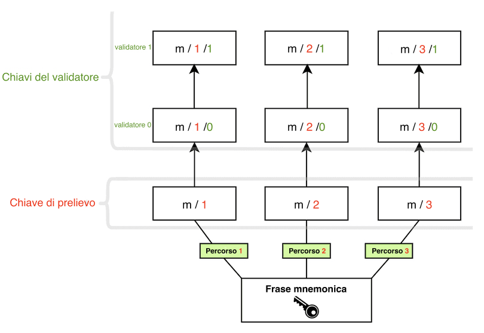

Ethereum protegge le risorse degli utenti utilizzando la crittografia a chiave pubblica-privata. La chiave pubblica è utilizzata come base per un indirizzo di Ethereum, ossia, è visibile al pubblico generale ed è utilizzata come un identificativo univoco. La chiave privata (o 'segreta') dovrebbe essere accessibile soltanto al proprietario di un conto. La chiave privata è utilizzata per 'firmare' le transazioni e i dati, così che la crittografia possa provare che il detentore approva determinate azioni di una chiave privata specifica.

Le chiavi di Ethereum sono generate utilizzando la [crittografia a curva ellittica](https://en.wikipedia.org/wiki/Elliptic-curve_cryptography).

Tuttavia, quando Ethereum è passato dal [proof-of-work](/developers/docs/consensus-mechanisms/pow) al [proof-of-stake](/developers/docs/consensus-mechanisms/pos), è stato aggiunto un nuovo tipo di chiave. Le chiavi originali funzionano esattamente come prima, non ci sono state modifiche alle chiavi basate sulla curva ellittica che proteggono i conti. Tuttavia, gli utenti necessitavano di un nuovo tipo di chiave per partecipare al proof-of-stake mettendo gli ETH in staking ed eseguire i validatori. Questa esigenza è sorta dalle sfide di scalabilità associate al passaggio di molti messaggi tra grandi quantità di validatori, il che richiede un metodo crittografico facilmente aggregabile per ridurre la quantità di comunicazioni necessarie perché la rete raggiunga il consenso.

Questo nuovo tipo di chiave utilizza lo [schema di firma **Boneh-Lynn-Shacham (BLS)**](https://wikipedia.org/wiki/BLS_digital_signature). BLS consente un'aggregazione molto efficiente delle firme, ma consente anche di sottoporre a ingegneria inversa le chiavi dei singoli validatori aggregati ed è ideale per gestire le azioni tra validatori.

## I due tipi di chiavi del validatore {#two-types-of-keys}

Prima del passaggio al proof-of-stake, gli utenti di Ethereum avevano soltanto una chiave privata basata sulla curva ellittica per accedere ai propri fondi. Con l'introduzione del proof-of-stake, gli utenti che desideravano essere staker in autonomia necessitavano anche di una **chiave del validatore** e di una **chiave di prelievo**.

### La chiave del validatore {#validator-key}

La chiave di firma del validatore consiste in due elementi:

- Chiave **privata** del validatore
- Chiave **pubblica** del validatore

Lo scopo della chiave privata del validatore è firmare le operazioni sulla catena, quali proposte e attestazioni dei blocchi. Per questo, queste chiavi devono essere tenute in un portafoglio "caldo".

Questa flessibilità ha il vantaggio di spostare molto rapidamente le chiavi di firma del validatore da un dispositivo a un altro, però se vengono perse o rubate un ladro potrebbe **agire malevolmente** in alcuni modi:

- Far tagliare il validatore:
  - Facendo il propositore e firmando due blocchi Beacon differenti per lo stesso slot
  - Facendo l'attestatore e firmando un'attestazione che ne "circonda" un'altra
  - Facendo l'attestatore e firmando due attestazioni differenti aventi la stessa destinazione
- Forzare un'uscita volontaria, che impedisce al validatore di mettere in staking e concede l'accesso al suo saldo di ETH al proprietario della chiave di prelievo

La **chiave pubblica del validatore** è inclusa nei dati della transazione quando un utente deposita gli ETH al contratto di deposito di staking. Questi sono noti come _dati di deposito_ e consentono a Ethereum di identificare il validatore.

### Credenziali di prelievo {#withdrawal-credentials}

Ogni validatore ha una proprietà nota come _credenziali di prelievo_. Questo campo di 32 byte inizia con uno `0x00`, che rappresenta le credenziali di prelievo BLS, o uno `0x01`, che rappresenta le credenziali che puntano a un indirizzo di esecuzione.

I validatori con le chiavi BLS `0x00` devono aggiornare tali credenziali affinché puntino a un indirizzo di esecuzione per poter attivare i pagamenti del saldo in eccesso o il prelievo completo dallo staking. Ciò può essere fatto fornendo un indirizzo di esecuzione nei dati di deposito durante la generazione iniziale della chiave, _O_ utilizzando la chiave di prelievo in un momento successivo per firmare e trasmettere un messaggio `BLSToExecutionChange`.

### La chiave di prelievo {#withdrawal-key}

La chiave di prelievo sarà necessaria per aggiornare le credenziali di prelievo affinché puntino a un indirizzo di esecuzione, se non impostato durante il deposito iniziale. Questo consentirà di iniziare a elaborare i pagamenti del saldo in eccesso, nonché di prelevare interamente i propri ETH in staking.

Proprio come le chiavi del validatore, le chiavi di prelievo consistono in due componenti:

- Chiave di prelievo **privata**
- Chiave di prelievo **pubblica**

Perdere questa chiave prima di aggiornare le credenziali di prelievo al tipo `0x01` significa perdere l'accesso al saldo del validatore. Il validatore può ancora firmare le attestazioni e i blocchi poiché queste azioni richiedono la chiave privata del validatore, tuttavia vi è poco o nessun incentivo se le chiavi di prelievo vengono perse.

Separare le chiavi del validatore dalle chiavi del conto di Ethereum consente a più validatori di essere eseguiti da un singolo utente.


## Derivare le chiavi da una frase di seed {#deriving-keys-from-seed}

Se ogni 32 ETH in staking richiedessero una nuova serie di 2 chiavi completamente indipendenti, la gestione delle chiavi diverrebbe rapidamente scomoda, specialmente per gli utenti che eseguono più validatori. Invece, più chiavi del validatore sono derivabili da un'unica frase segreta comune e memorizzare tale singola frase segreta consente l'accesso a più chiavi del validatore.

Le [frasi mnemoniche](https://en.bitcoinwiki.org/wiki/Mnemonic_phrase) e i percorsi sono funzionalità prominenti che gli utenti incontrano spesso quando [accedono](https://ethereum.stackexchange.com/questions/19055/what-is-the-difference-between-m-44-60-0-0-and-m-44-60-0) ai propri portafogli. La frase mnemonica è una sequenza di parole che agisce da seed iniziale per una chiave privata. Combinandola con dei dati aggiuntivi, la frase mnemonica genera un hash noto come la 'chiave principale'. Questa può essere vista come la radice di un albero. I rami da questo albero sono derivabili utilizzando un percorso gerarchico così che i nodi figli possano esistere come combinazioni dell'hash del loro nodo genitore e del loro indice nell'albero. Leggi informazioni sugli standard [BIP-32](https://github.com/bitcoin/bips/blob/master/bip-0032.mediawiki) e [BIP-19](https://github.com/bitcoin/bips/blob/master/bip-0039.mediawiki) per la generazione di chiavi basate sulla frase mnemonica.

Questi percorsi hanno la seguente struttura, che risulterà familiare agli utenti che hanno interagito con portafogli hardware:

```
m/44'/60'/0'/0`
```

Gli slash in questo percorso separano i componenti della chiave privata come segue:

```
master_key / purpose / coin_type / account / change / address_index
```

Questa logica consente agli utenti di collegare quanti più validatori possibili a una singola **frase mnemonica**, poiché la radice dell'albero può essere comune e la differenziazione può verificarsi a livello dei rami. L'utente può **derivare qualsiasi numero di chiavi** dalla frase mnemonica.

```
      [m / 0]
     /
    /
[m] - [m / 1]
    \
     \
      [m / 2]
```

Ogni ramo è separato da uno `/`, quindi `m/2` significa iniziare con la chiave principale e seguire il ramo 2. Nello schema seguente, una singola frase mnemonica è utilizzata per memorizzare tre chiavi di prelievo, ognuna con due validatori associati.



## Lettura consigliate {#further-reading}

- [Post del blog della Ethereum Foundation di Carl Beekhuizen](https://blog.ethereum.org/2020/05/21/keys/)
- [Generazione delle chiavi BLS12-381 dell'EIP-2333](https://eips.ethereum.org/EIPS/eip-2333)
