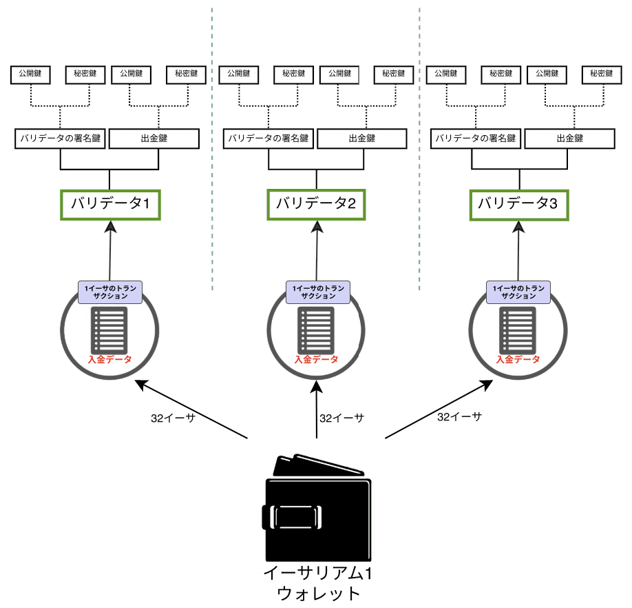
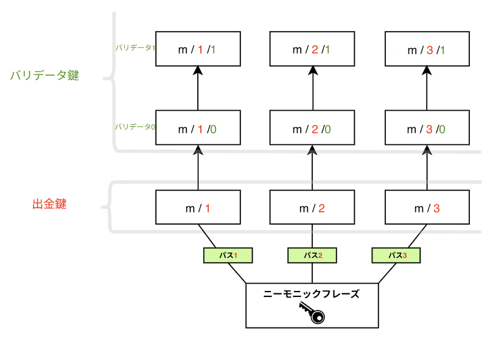

イーサリアムでは、公開鍵と秘密鍵による暗号化を用いてユーザーの資産を保護しています。 公開鍵は、イーサリアムアドレスの基盤として使用されるもので、誰もが見ることができ、一意の識別子として使用されます。 一方で、プライベートキー(すなわち「秘密鍵」)はアカウント所有者以外はアクセスできないものでなければなりません。 秘密鍵は、トランザクションおよびデータに「署名」するために用いられ、特定の秘密鍵の所有者がその鍵のアクションを承認したことを暗号化によって証明できるものです。

イーサリアムの鍵は、[楕円曲線暗号](https://en.wikipedia.org/wiki/Elliptic-curve_cryptography)を用いて生成されます。

ただし、イーサリアムにおける[プルーフ・オブ・ワーク](/developers/docs/consensus-mechanisms/pow)から[プルーフ・オブ・ステーク](/developers/docs/consensus-mechanisms/pos)への移行に伴い、新たな種類の鍵が追加されています。 従来の鍵も、これまでとまったく同様に機能し、楕円曲線暗号を用いて生成された鍵により保護されるアカウントは従来とまったく変更されません。 しかし、イーサのステーキングやバリデータの実行によりプルーフ・オブ・ステークに参加するには、新しい種類の鍵が必要になります。 この新しい種類の鍵は、暗号化の手段を必要とする非常に多くのバリデータ間におけるメッセージのやりとりが必要であるというスケーラビリティの課題を克服するために導入されたもので、メッセージを集約することで、ネットワークがコンセンサスを実現するために必要なコミュニケーションの規模を縮小することができます。

この新しい種類の鍵では、 [**Boneh-Lynn-Shacham (BLS)**署名スキーム](https://wikipedia.org/wiki/BLS_digital_signature)を使用します。 BLSは、署名を非常に効率的に集約できるだけでなく、集約された個々のバリデータの鍵に対してリバースエンジニアリングを実行することも可能であり、バリデータ間のアクションを管理する上で理想的なソリューションです。

## バリデータ向けの2種類の鍵 {#two-types-of-keys}

イーサリアムでは、プルーフ・オブ・ステークへの移行前は、楕円曲線ベースの秘密鍵だけを用いて資金にアクセスしていました。 プルーフ・オブ・ステークの導入により、ソロステークの実行を希望するユーザーは、**バリデータ鍵**と**引き出し鍵**の両方が必要になりました。

### バリデータ鍵 {#validator-key}

バリデータの署名鍵は、以下の2つの要素で構成されます：

- バリデータ**秘密**鍵
- バリデータ**公開**鍵

バリデータ秘密鍵は、ブロックの提案やアテステーションといったオンチェーンの操作を行うために使用します。 このため、バリデータ秘密鍵は常にホットウォレットで管理しなければなりません。

バリデータ秘密鍵におけるこの柔軟性は、ひとつの端末から他の端末に移動させるのが容易であるという利点がありますが、紛失／盗難時には、以下のような**悪意の行為**の被害を受ける可能性があります：

- 以下の行為に対して、バリデータの資産がスラッシングされうる：
  - 提案者となり、同一スロットにおいて2つの異なるビーコンブロックに署名してしまう
  - アテスターとなり、他のアテステーションを「取り囲む」アテステーションに署名してしまう
  - アテスターとなり、同一のターゲットに対して2つの異なるアテステーションを署名する場合
- 自発的な退出を強制して、当該のバリデータがステーキングを行えなくし、出金鍵の所有者がバリデータのETH残高にアクセスできるようにする場合

**バリデータ公開鍵**は、ユーザーがステーキング入金コントラクトにETHを入金する際のトランザクションデータに含まれています。 これは、_入金データ_と呼ばれ、イーサリアムがバリデータを特定するために用いられます。

### 引出における認証情報 {#withdrawal-credentials}

すべてのバリデータは、_出金の認証情報_と呼ばれるプロパティを持ちます。 この32バイトのフィールドは、BLSによる出金の認証情報を表す`0x00`か、実行アドレスを示す認証情報を表す`0x01`のどちらかで始まります。

`0x00`のBLS キーを持つバリデータは、超過残高の支払いを実行したり、ステーキングした資金を全額出金したい場合、実行アドレスを示すこれらの認証情報を更新する必要があります。 具体的には、鍵を最初に生成する際において入金データに含まれていた実行アドレスを提供するか、_あるいは_事後的に出金鍵を用いて署名し、` BLSToExecutionChange`のメッセージをブロードキャストする必要があります。

### 出金鍵 {#withdrawal-key}

出金鍵は、最初の入金時において設定していない場合、実行アドレスを示す出金の認証情報を更新する際に必要になります。 これにより、超過残高の支払いプロセスを開始できるだけでなく、ユーザーはステークしたETH全額を出金できるようになります。

出金鍵は、バリデータ鍵と同様に、以下の2つの要素で構成されます：

- 出金用**秘密**鍵
- 出金用**公開**鍵

出金の認証情報を`0x01`タイプに更新する前にこの鍵を紛失してしまうと、バリデータは残高にアクセスできなくなります。 ブロックや署名に必要なのはバリデータの秘密鍵であるため、この場合でも、バリデータはアテステーションやブロックに署名を行うことができますが、出金鍵を紛失してしまった場合、バリデータが署名を行う理由はほぼ／まったくなくなります。

イーサリアムのアカウント鍵とバリデータ鍵を分離することで、1人のユーザーが複数のバリデータを実行することが可能になります。



## シードフレーズから鍵を導出するには {#deriving-keys-from-seed}

ユーザーが32ETHをステークするには、相互に完全に独立した2つの鍵セットが新たに必要になるため、特に複数のバリデータを実行するユーザーにとっては鍵の管理がとても煩雑になります。 この状況を回避するため、1つの共通のシークレットから複数のバリデータ鍵を導出できるようになっており、この1つのシークレットを保存することで、複数のバリデータ鍵へのアクセスが可能になります。

ユーザーが各自のウォレットに[アクセス](https://ethereum.stackexchange.com/questions/19055/what-is-the-difference-between-m-44-60-0-0-and-m-44-60-0)する際には、[ニーモニック](https://en.bitcoinwiki.org/wiki/Mnemonic_phrase)やパスの機能が目に入るでしょう。 ニーモニックとは、特定の秘密鍵に対する当初のシードとして機能する単語のつらなりです。 ニーモニックは、追加のデータと結合することで、「マスター鍵」と呼ばれるハッシュを生成できます。 マスター鍵は、特定のツリーにおけるルートだと考えればよいでしょう。 このルートから派生したブランチについては、階層的なパスを用いて導出できるので、子ノードは親ノードのハッシュとツリー上のインデックスを結合したものとして存在することになります。 ニーモニックによる鍵の生成については、[BIP-32](https://github.com/bitcoin/bips/blob/master/bip-0032.mediawiki)標準と[BIP-19](https://github.com/bitcoin/bips/blob/master/bip-0039.mediawiki)標準をご覧ください。

パスは、以下のような構造を持ちます。ハードウェアのウォレットを使用したことがあるユーザーにとっては、おなじみでしょう。

```
m/44'/60'/0'/0`
```

このパスでは、秘密鍵の各要素をスラッシュで区切っています：

```
master_key / purpose / coin_type / account / change / address_index
```

このロジックにより、ツリーの共通ルートから異なるブランチをいくつでも設定できるため、ユーザーは1つの**ニーモニックフレーズ**にいくつでもバリデータを追加することができます。 ユーザーは、ニーモニックフレーズを用いて、**鍵をいくつでも導出**することができます。

```
      [m / 0]
     /
    /
[m] - [m / 1]
    \
     \
      [m / 2]
```

各ブランチは、`/`で区切られるため、`m/2`は、マスター鍵で開始され、ブランチ2に従うことを意味します。 以下の図の場合、1つのニーモニックフレーズを用いて3つの出金鍵が保存され、それぞれに2つのバリデータが関連付けられています。



## 参考文献 {#further-reading}

- [カール・ベークハイゼンによるイーサリアム・ファウンデーションのブログ記事](https://blog.ethereum.org/2020/05/21/keys/)
- [EIP-2333 BLS12-381 鍵の生成](https://eips.ethereum.org/EIPS/eip-2333)
