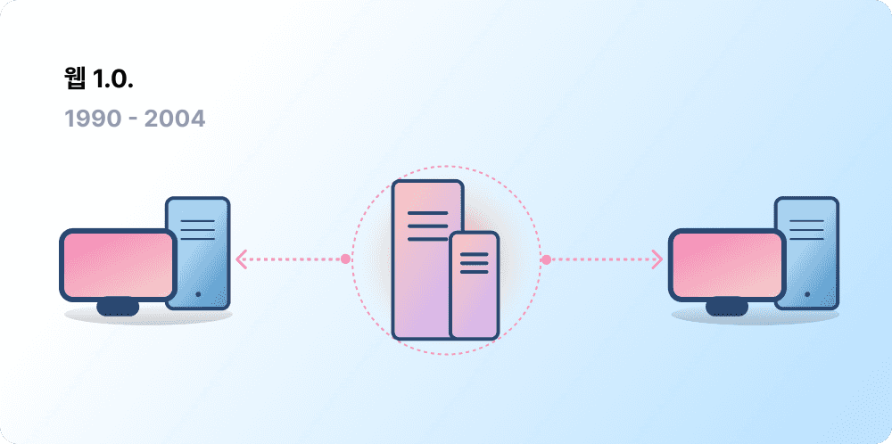
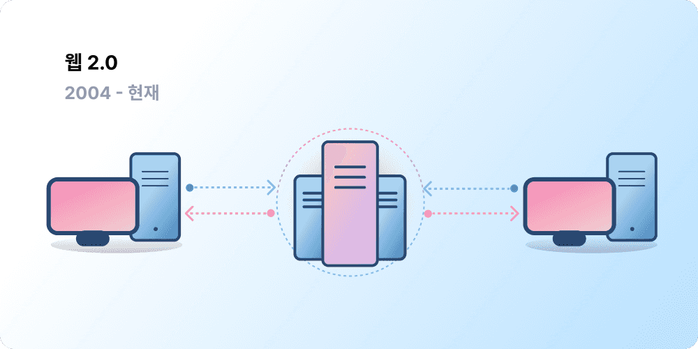
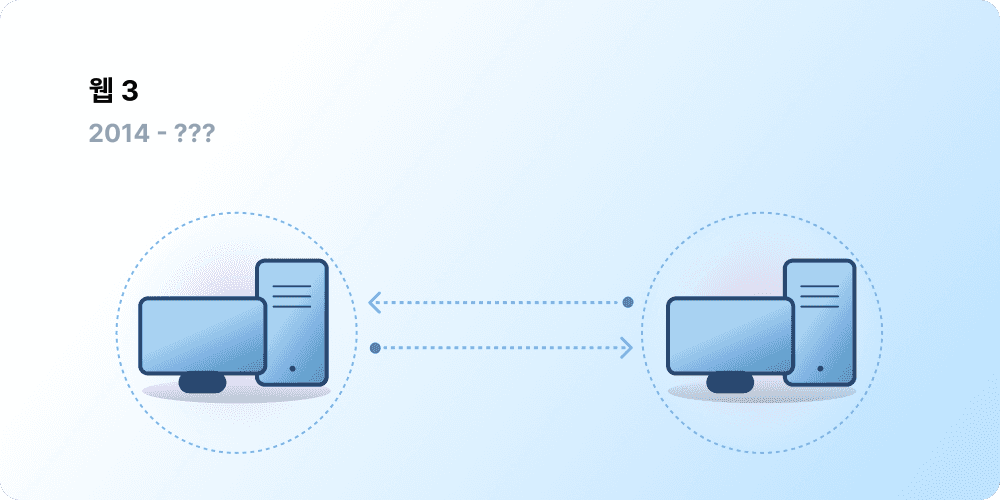

# 웹3에 대한 소개 {#introduction}

중앙화 방식은 수많은 사람이 웹을 사용할 수 있게 도와주었고, 안정적이고 거대한 인프라를 만들 수 있었습니다. 동시에 소수의 중앙화된 기관들은 허용되어야 하는 작업을 결정하는 데 있어 일방적으로 정보를 통제하기도 합니다.

웹3로 바로 이 문제를 해결할 수 있습니다. 웹3에서는 거대 테크 기업들이 일괄적으로 관리되지 않고, 탈중앙화 방식을 통해 사용자가 직접 시스템을 만들고, 운영, 소유합니다. 웹3는 거대 기업이 아닌 개인들에게 권력을 분산합니다. 웹3에 대해 알아보기 전에 먼저 어떤 과정이 있었는지 알아보겠습니다.

<Divider />

## 초기 웹 {#early-internet}

많은 사람들은 웹이 발명된 이후 현재까지 그대로 이어져 온 현대화의 산물이라고 생각합니다. 하지만 오늘날 우리가 알고 있는 웹은 초기에 기획되었던 것과 많이 다릅니다. 웹 1.0과 웹 2.0의 역사에 대해 간략하게 알아보면 이를 이해하는 데 유용할 것입니다.

### 웹 1.0: 읽기 전용 (1990-2004) {#web1}

1989년 당시, 제네바에 위치한 CERN에서 근무하는 Tim Berners-Lee는 현재 WWW라고 하는 프로토콜 개발에 몰두하고 있었습니다. 그의 아이디어는 무엇이었을까요? 바로, 전 세계에서 정보를 공유할 수 있는 개방되고 분산된 방식의 프로토콜을 만드는 것이었습니다.

현재 '웹1'이라고 알려진 Berners-Lee의 첫 번째 결과물은 약 1990년에서 2004년 사이에 탄생했습니다. 웹1.0은 기업 소유의 정적인 웹사이트이었던 경우가 대부분이어서 사용자가 콘텐츠를 생산하는 경우는 드물었고 서로 상호 작업하는 경우가 거의 없었습니다. 즉, 이는 읽기 전용 웹이라고 보는 게 정확할 것입니다.

### 웹 2.0: 읽기와 쓰기 (2004-현재) {#web2}

웹 2.0 시기는 2004년, 소셜 미디어 플랫폼의 등장과 함께 시작되었습니다. 웹은 읽기만 가능했던 형태에서 읽고 쓰기가 가능한 형태로 진화했습니다. 사용자에게 콘텐츠를 제공하는 회사 대신, 사용자들이 생성한 콘텐츠를 공유하고 사용자 간 상호 작업에 참여할 수 있는 플랫폼이 제공되기 시작했습니다. 더 많은 사용자가 온라인에서 활동함에 따라, 소수의 기업이 웹에서 생산되는 대부분의 트래픽과 가치를 제어하게 되었습니다. 웹 2.0은 또한 광고 기반 수익 모델을 탄생시켰습니다. 콘텐츠는 사용자들이 만들었으나, 해당 사용자가 콘텐츠를 소유하거나 여기에서 발생하는 이익을 나눠 받지 못했습니다.

<Divider />

## 웹 3.0: 읽기, 쓰기, 그리고 소유 {#web3}

웹 3.0'이라는 용어는 [이더리움](/what-is-ethereum/) 공동 창립자인 개빈 우드가 이더리움을 런칭한 직후인 2014년에 제안하였습니다. 개빈은 이 용어에 초기 암호화폐 사용자들이 공통적으로 느꼈던 문제를 담았습니다. 즉, 현재의 웹은 특정 주체에 대한 지나친 신뢰를 기반으로 한다는 것이었습니다. 오늘날 알려진 대부분의 웹 서비스는 몇 개의 사기업들이 공공의 이익을 위해서 행동할 것이라는 믿음 하에 사용되고 있습니다.

### 웹3는 무엇인가요? {#what-is-web3}

웹3는 새롭고 더 나은 인터넷의 비전을 포괄하는 용어가 되었습니다. 웹3의 핵심은 블록체인, 암호화폐, NFT를 사용하여 사용자에게 소유권이라는 형태로 권한을 다시 돌려준다는 점입니다. [2020년, 한 트위터 글](https://twitter.com/himgajria/status/1266415636789334016)이 이를 가장 잘 설명합니다. 웹1은 읽기 전용, 웹2는 읽기와 쓰기, 웹3는 읽기, 쓰기 그리고 소유라는 것입니다.

#### 웹3의 핵심 아이디어 {#core-ideas}

웹3의 정확하고 유일한 정의를 내리는 것은 어렵지만, 몇 개의 핵심 원칙이 이를 잘 설명합니다.

- **웹3는 탈중앙화되어 있습니다:** 중앙화된 주체에 의해 인터넷의 대부분이 소유 및 제어되는 것이 아닌, 창작자와 사용자에게 소유권이 분배되는 형태입니다.
- **웹3는 허가라는 개념이 없습니다:** 웹3에서 모두가 동등한 참가 권한을 지니며, 누구도 배제되지 않습니다.
- **웹3는 기반 화폐가 있습니다:** 은행 및 결제 서비스의 오래된 인프라에 의존하지 않고도 온라인 결제 및 송금이 가능한 암호화폐를 사용합니다.
- **웹3는 특정 주체에 대한 신뢰를 필요로 하지 않습니다:** 제3자를 신뢰하는 대신, 인센티브와 경제 메커니즘을 통해 작동합니다.

### 웹3가 왜 중요한가요? {#why-is-web3-important}

웹3의 혁신적인 특징은 서로 연관되어 있고 깔끔하게 범주화되지는 않지만, 보다 쉬운 설명을 위해 최대한 아래와 같이 나누어 보았습니다.

#### 소유권 {#ownership}

웹3는 디지털 자산에 대한 소유권을 과거엔 없었던 방식으로 제공합니다. 예를 들어, 웹2 게임을 즐기고 있다고 가정해 봅시다. 게임 상에서 아이템을 구매하는 경우, 이는 당신 계정에 직접 묶이게 됩니다. 게임 창작자가 귀하의 계정을 삭제한다면 해당하는 아이템을 모두 잃게 됩니다. 또는 게임을 중지하는 경우, 그동안 투자해서 얻은 게임 내의 아이템의 가치를 잃게 됩니다.

웹3는 [대체 불가 토큰(NFT)](/glossary/#nft)을 통해 직접적인 소유가 가능하게 합니다. 아무도, 설령 게임 창작자일지라도, 귀하의 소유권을 가져갈 수 없습니다. 또한 게임을 더 이상 안 하더라도 게임 상의 아이템들을 오픈마켓에서 판매하거나 교환함으로써 가치를 활용할 수 있습니다.

<InfoBanner shouldSpaceBetween emoji=":eyes:">
  
NFT에 대해 자세히 알아보기

  <ButtonLink href="/nft/">
    NFT 이해하기
  </ButtonLink>
</InfoBanner>

#### 검열 저항력 {#censorship-resistance}

플랫폼과 콘텐츠 창작자 간의 권력 구도는 매우 불균형한 상태입니다.

OnlyFan은 사용자가 생성한 성인물 사이트로, 100만 명이 넘는 창작자들이 플랫폼에서의 수익을 주요 수익원으로 하고 있습니다. 그런데 2021년 8월, OnlyFan은 선정적인 콘텐츠를 차단하는 방안을 발표했습니다. 이 발표는 플랫폼에서 콘텐츠를 통한 수익을 빼앗았다는 인식을 줌으로써 수많은 창작자들의 공분을 샀습니다. 큰 반발 이후에, 결국 해당 발표는 취소되었습니다. 이 싸움에서 창작자들이 이기기는 했지만, 이는 웹 2.0의 문제를 보여줬습니다. 즉, 특정 플랫폼을 떠나는 경우엔 그동안 쌓은 명성과 팔로잉을 잃게 된다는 것입니다.

웹3에서는 당신의 데이터가 블록체인 상에 존재하게 됩니다. 한 플랫폼을 떠나더라도 귀하의 명성을 유지할 수 있으며, 원하는 가치와 더 잘 맞는 다른 플랫폼에서 이를 그대로 사용할 수 있습니다.

웹 2.0에서 콘텐츠 창작자들은 플랫폼이 규칙을 바꾸지 않으리라고 신뢰해야 하는 반면, 검열 저항력은 웹3 플랫폼의 본질적인 특징입니다.

#### 탈중앙화 자율 조직(DAO) {#daos}

웹3에서는 데이터를 소유하는 것 이외에도, 마치 주식을 통해 회사를 소유하는 것처럼 토큰을 이용하여 플랫폼을 소유할 수 있습니다. DAO는 플랫폼의 분산화된 소유권을 조정하고 미래에 대한 결정을 내릴 수 있게 합니다.

DAO는 기술적으로 리소스 풀(토큰)을 통해 탈중앙화된 의사 결정을 자동화하는 합의된 [스마트 계약](/glossary/#smart-contract)으로 정의됩니다. 토큰을 소유한 사용자는 리소스가 어떻게 쓰여야 하는지 투표할 수 있으며, 코드는 투표 결과를 자동으로 실행합니다.

하지만 사람들은 많은 웹3 커뮤니티를 DAO라고 정의합니다. 이러한 커뮤니티의 탈중앙화 및 코드 자동화가 이루어지는 정도는 서로 다릅니다. 현재 우리는 DAO가 무엇이며 미래에 어떻게 진화해 나갈지 논의하고 있습니다.

<InfoBanner shouldSpaceBetween emoji=":eyes:">
  
DAO에 대해 자세히 알아보기

  <ButtonLink href="/dao/">
    DAO 이해하기
  </ButtonLink>
</InfoBanner>

### 신원 증명 {#identity}

오늘날까지 사용하는 플랫폼마다 계정을 새로 만들어 왔을 것입니다. 예를 들어, 트위터 계정, 유튜브 계정, 레딧 계정을 각각 사용하고 있을 것입니다. 표시 이름이나 프로필 사진을 바꾸고 싶을 때는 어떻게 합니까? 모든 계정을 각각 바꾸어 주어야 합니다. 어떨 때는 소셜 로그인을 사용할 수도 있겠지만, 이는 흔히 말하는 검열 문제를 야기할 수 있습니다. 클릭 한 번으로, 이들 플랫폼은 귀하의 온라인 생활을 단번에 끊을 수도 있습니다. 더욱이, 많은 플랫폼에서 계정을 만들기 위해 개인 식별 정보를 다루고 귀하가 해당 플랫폼을 신뢰하도록 요구합니다.

웹3는 귀하가 이더리움 주소 및 [이더리움 네임 서비스(ENS)](/glossary/#ens) 프로필을 통해 디지털 신원을 제어할 수 있게 허용하여 이러한 문제를 해결합니다. 이더리움 주소를 통해 안전하고, 검열 저항력을 지니며, 익명성이 보증되는 단일 로그인 방식을 다양한 플랫폼에서 사용할 수 있습니다.

### 기본 결제 방식 {#native-payments}

웹2의 결제 인프라는 은행이나 결제 서비스 업체에 의존하기 때문에 은행 계좌가 없거나 다른 나라에 사는 사람들은 배제됩니다. 웹3는 [ETH](/glossary/#ether)와 같은 토큰을 사용하여 브라우저에서 직접 돈을 보내며, 제3자에 의존하지 않습니다.

<ButtonLink href="/eth/">
  ETH에 대해 자세히 알아보기
</ButtonLink>

## 웹3의 제한 사항 {#web3-limitations}

웹3는 이미 많은 장점을 가지고 있지만, 한계점 또한 아직 많으며 더 번창하기 위해서는 생태계가 해당 문제를 해결해야 합니다.

### 접근성 {#accessibility}

이더리움 로그인과 같은 중요한 웹3 기능은 이미 무료로 누구나 사용할 수 있습니다. 하지만 트랜잭션의 경우 거래 수수료로 인해 아직 접근성이 떨어집니다. 웹3는 높은 거래 수수료로 인해 덜 부유한 개발도상국의 경우엔 활용성이 떨어집니다. 이더리움에서는 [로드맵](/roadmap/)과 [레이어 2 확장 솔루션](/glossary/#layer-2)을 통해 이러한 과제들을 해결하고 있습니다. 기술 자체는 준비가 되었지만, 더 많은 사람이 웹3에 액세스할 수 있도록 레이어 2의 개선이 필요한 상황입니다.

### 사용자 환경 {#user-experience}

웹3를 사용하기 위한 기술 진입 장벽은 여전히 높습니다. 사용자는 보안 문제, 복잡한 기술 문서를 이해하고, 직관성이 떨어지는 사용자 인터페이스를 사용해야 합니다. 특히 [지갑 제공 업체](/wallets/find-wallet/)에서 본 문제를 해결하려고 노력하고 있으며, 웹3가 대중화되기까지는 많은 발전이 필요합니다.

### 교육 {#education}

웹3는 웹2.0을 사용한 경우와는 다른 방식의 멘탈 모델을 이해하도록 요구하는 새로운 패러다임을 소개합니다. 웹1.0이 1990년대 후반 인기를 얻기 시작했을 때에도 유사한 교육 방식의 소개가 있었습니다. www(world wide web)의 지지자들은 [텔레비전 방송](https://www.youtube.com/watch?v=SzQLI7BxfYI)에 간단한 비유(정보 고속도로, 브라우저, 웹 서핑 등)를 적용하는 등의 방식으로 교육을 진행하였습니다. 웹3는 어려운 것이 아니며, 그저 다른 것일 뿐입니다. 웹2의 사용자에게 웹3 패러다임을 설명하는 교육 이니셔티브는 웹3의 성공에 필수적인 부분입니다.

Ethereum.org는 중요한 이더리움 콘텐츠를 가능한 많은 언어로 번역하는 [번역 프로그램](/contributing/translation-program/)을 통해 웹3 교육에 기여하고 있습니다.

### 중앙화된 인프라 {#centralized-infrastructure}

웹3 생태계는 젊고 빠르게 진화합니다. 그 결과, 현재는 중앙화된 인프라(GitHub, Twitter, Discord 등)에 의존하고 있습니다. 수많은 웹3 회사가 이 격차를 줄이려고 서두르고 있지만, 안정적인 고품질 인프라를 구축하는 데에는 많은 시간이 필요합니다.

## 분산화된 미래 {#decentralized-future}

웹3는 젊고 계속해서 진화하고 있는 생태계입니다. 개빈 우드가 2014년에 제안하였지만, 이 중 많은 아이디어는 오늘에 와서야 구현이 가능해졌습니다. 암호화폐, 레이어 2 확장 솔루션의 발전, 운영 방식의 새로운 형태에 대한 거대한 실험, 디지털 신원 인증의 혁신 등에 대한 관심은 작년에 급격하게 증가하였습니다.

우리는 아직 웹3의 시작점에 서 있지만, 이를 위한 인프라를 계속 발전시켜나갈 것이기에 웹의 미래는 밝습니다.

## 어떻게 참여하나요? {#get-involved}

- [지갑 만들기](/wallets/)
- [커뮤니티 찾기](/community/)
- [웹3 애플리케이션 살펴보기](/dapps/)
- [DAO 가입하기](/dao/)
- [웹3 빌드하기](/developers/)

## 더 읽을거리 {#further-reading}

웹3는 한 문장으로 정의되지 않습니다. 다양한 커뮤니티 참가자들은 웹3에 대해 서로 다른 관점을 갖고 있습니다. 다음은 그 중 몇 가지입니다.

- [ 웹3란? 미래의 분산화된 인터넷 살펴보기](https://www.freecodecamp.org/news/what-is-web3/) – _Nader Dabit_
- [웹3 이해하기](https://medium.com/l4-media/making-sense-of-web-3-c1a9e74dcae) – _Josh Stark_
- [웹3가 중요한 이유](https://future.a16z.com/why-web3-matters/) — _Chris Dixon_
- [탈중앙화가 중요한 이유](https://onezero.medium.com/why-decentralization-matters-5e3f79f7638e) - _Chris Dixon_
- [웹3의 전망](https://a16z.com/wp-content/uploads/2021/10/The-web3-Readlng-List.pdf) – _a16z_
- [웹3에 대해 토론하기](https://www.notboring.co/p/the-web3-debate?s=r) – _Packy McCormick_

<QuizWidget quizKey="web3" />
