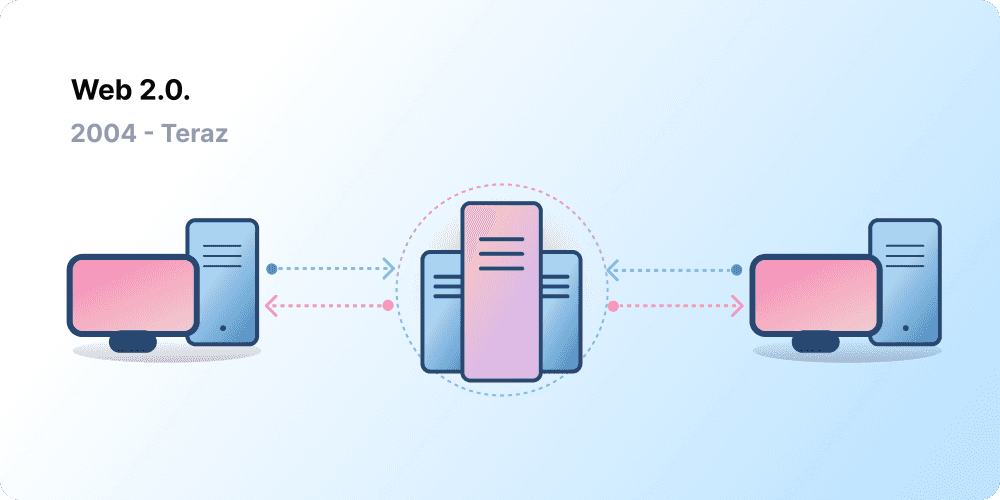
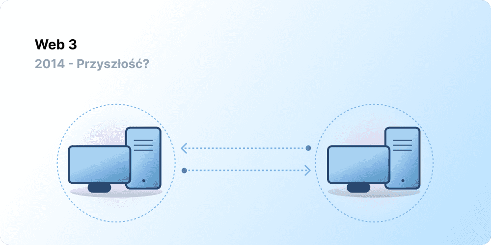

# Wprowadzenie do Web3 {#introduction}

Centralizacja pomogła miliardom ludzi wejść do sieci World Wide Web i stworzyła stabilną, niezawodną infrastrukturę, na której się opiera. Jednocześnie garstka scentralizowanych podmiotów kontroluje duże obszary sieci World Wide Web, jednostronnie decydując, co powinno, a co nie powinno być dozwolone.

Web3 jest odpowiedzią na ten dylemat. Zamiast sieci zmonopolizowanej przez duże firmy technologiczne, Web3 jest zdecentralizowany i jest tworzony, obsługiwany i jest własnością użytkowników. Web3 oddaje władzę w ręce osób indywidualnych, a nie korporacji. Zanim porozmawiamy o Web3, dowiedzmy się, jak się tu znaleźliśmy.

<Divider />

## Wczesna sieć {#early-internet}

Większość ludzi myśli o sieci jak o ciągłym filarze współczesnego życia — została wynaleziona i od tego czasu po prostu istnieje. Jednak sieć, którą większość z nas zna dzisiaj, znacznie różni się od pierwotnych wyobrażeń. Aby lepiej to zrozumieć, warto podzielić krótką historię sieci na kilka okresów — Web 1.0 i Web 2.0.

### Web 1.0: Tylko odczyt (1990-2004) {#web1}

W 1989 roku, w CERN w Genewie, Tim Berners-Lee był zajęty opracowywaniem protokołów, które miały stać się World Wide Web. Jego pomysł? Stworzenie otwartych, zdecentralizowanych protokołów umożliwiających wymianę informacji z dowolnego miejsca na Ziemi.

Pierwsza odsłona dzieła Bernersa-Lee, obecnie znanego jako „Web 1.0”, miała miejsce mniej więcej w latach 1990-2004. Web 1.0 było głównie statycznymi stronami internetowymi należącymi do firm, a interakcja między użytkownikami była bliska zeru — osoby rzadko tworzyły treści — co doprowadziło do tego, że było znane jako sieć tylko do odczytu.

### Web 2.0: Odczyt i zapis (2004-teraz) {#web2}

Okres Web 2.0 rozpoczął się w 2004 roku wraz z pojawieniem się platform mediów społecznościowych. Zamiast tylko do odczytu, sieć ewoluowała do odczytu i zapisu. Zamiast dostarczać treści użytkownikom, firmy zaczęły również dostarczać platformy do udostępniania treści wygenerowanych przez użytkowników i angażowania się w interakcje między użytkownikami. W miarę coraz większej ilości korzystającej z Internetu garstka czołowych firm zaczęła kontrolować nieproporcjonalnie dużą część ruchu i wartości generowanej w sieci. Web 2.0 zapoczątkował również model przychodów oparty na reklamach. Podczas gdy użytkownicy mogli tworzyć treści, nie byli ich właścicielami ani nie czerpali korzyści z ich monetyzacji.

<Divider />

## Web 3.0: Odczyt, zapis i posiadanie {#web3}

Założenie „Web 3.0” zostało wymyślone przez współzałożyciela [Ethereum](/what-is-ethereum/) Gavina Wooda wkrótce po uruchomieniu Ethereum w 2014 roku. Gavin przedstawił rozwiązanie problemu, który odczuwało wielu wczesnych użytkowników kryptowalut: sieć wymagała zbyt dużego zaufania. Oznacza to, że większość sieci, którą ludzie znają i używają dzisiaj, opiera się na zaufaniu garstce prywatnych firm, które działają w najlepszym interesie publicznym.

### Co to jest Web3? {#what-is-web3}

Web3 stał się terminem określającym wizję nowego, lepszego Internetu. U podstaw, Web3 wykorzystuje blockchainy, kryptowaluty i NFT, aby oddać władzę użytkownikom w formie własności. [Post z 2020 roku na Twitterze](https://twitter.com/himgajria/status/1266415636789334016) ujął to najlepiej: Web1 był tylko do odczytu, Web2 jest do odczytu i zapisu, Web3 będzie do odczytu, zapisu i posiadania.

#### Główne założenia Web3 {#core-ideas}

Chociaż trudno jest podać dokładną definicję tego, czym jest Web3, kilka podstawowych zasad kieruje jego tworzeniem.

- **Web3 jest zdecentralizowane:** zamiast kontrolowania i posiadania dużych obszarów Internetu przez scentralizowane podmioty, własność jest rozdzielana między jego twórców i użytkowników.
- **Web3 nie wymaga uprawnień:** każdy ma jednakowy dostęp do udziału w Web3 i nikt nie zostaje wykluczany.
- **Web3 ma natywne płatności:** wykorzystuje kryptowaluty do wydawania i wysyłania pieniędzy online, zamiast polegać na przestarzałej infrastrukturze banków i przetwórców płatności.
- **Web3 nie wymaga zaufania:** działa przy użyciu bodźców i mechanizmów ekonomicznych, zamiast polegać na zaufanych stronach trzecich.

### Dlaczego Web3 jest ważne? {#why-is-web3-important}

Chociaż zabójcze funkcje Web3 nie są odizolowane i nie pasują do oddzielnych kategorii, dla uproszczenia staraliśmy się je rozdzielić, aby ułatwić ich zrozumienie.

#### Własność {#ownership}

Web3 daje Ci prawo własności do Twoich zasobów cyfrowych w bezprecedensowy sposób. Załóżmy na przykład, że grasz w grę web2. Jeśli kupisz przedmiot w grze, jest on powiązany bezpośrednio z Twoim kontem. Jeśli twórcy gry usuną Twoje konto, stracisz te przedmioty. Lub, jeśli przestaniesz grać w grę, stracisz wartość zainwestowaną w przedmioty w grze.

Web3 pozwala na bezpośrednią własność poprzez [niewymienialne tokeny (NFT)](/glossary/#nft). Nikt, nawet twórcy gry, nie ma prawa odebrać ci Twoich własności. A jeśli przestaniesz grać, możesz sprzedać lub wymienić swoje przedmioty w grze na otwartych rynkach i odzyskać ich wartość.

<InfoBanner shouldSpaceBetween emoji=":eyes:">
  
Dowiedz się więcej o NFT

  <ButtonLink href="/nft/">
    Więcej o NFT
  </ButtonLink>
</InfoBanner>

#### Odporność na cenzurę {#censorship-resistance}

Dynamika władzy między platformami a twórcami treści jest bardzo nierówna.

OnlyFans to strona z generowanymi przez użytkowników treściami dla dorosłych z ponad milionem twórców treści, z których wielu wykorzystuje platformę jako główne źródło dochodu. W sierpniu 2021 r. OnlyFans ogłosiło plany zakazania treści o charakterze jednoznacznie seksualnym. Ogłoszenie to wywołało oburzenie wśród twórców na platformie, którzy uważali, że zostali okradzeni z dochodów na platformie, którą pomogli stworzyć. Po negatywnym odzewie decyzja została szybko cofnięta. Pomimo tego, że twórcy wygrali tę bitwę, podkreśla to problem dla twórców Web 2.0: tracisz reputację i zwolenników, jeśli opuścisz platformę.

W Web3 dane użytkownika znajdują się w blockchainie. Kiedy zdecydujesz się opuścić platformę, możesz zabrać swoją reputację ze sobą, podłączając ją do innego interfejsu, który jest bardziej zgodny z Twoimi wartościami.

Web 2.0 wymaga od twórców treści zaufania platformom, że nie zmienią zasad, ale odporność na cenzurę jest natywną cechą platformy Web3.

#### Zdecentralizowane autonomiczne organizacje (DAO) {#daos}

Oprócz posiadania swoich danych, w Web3 możesz być właścicielem platformy jako grupy, używając tokenów, które działają jak udziały w firmie. DAO pozwalają koordynować zdecentralizowaną własność platformy i podejmować decyzje dotyczące jej przyszłości.

DAO są technicznie definiowane jako z góry uzgodnione [inteligentne kontrakty](/glossary/#smart-contract), które automatyzują zdecentralizowane podejmowanie decyzji w odniesieniu do puli zasobów (tokenów). Użytkownicy z tokenami głosują na sposób wydawania zasobów, a kod automatycznie wykonuje wynik głosowania.

Ludzie jednak definiują wiele społeczności Web3 jako DAO. Wszystkie te społeczności mają różne poziomy decentralizacji i automatyzacji za pomocą kodu. Obecnie badamy, czym są DAO i jak mogą ewoluować w przyszłości.

<InfoBanner shouldSpaceBetween emoji=":eyes:">
  
Dowiedz się więcej o DAO

  <ButtonLink href="/dao/">
    Więcej informacji o: DAO
  </ButtonLink>
</InfoBanner>

### Tożsamość {#identity}

Tradycyjnie należałoby utworzyć konto dla każdej używanej platformy. Na przykład, możesz mieć konto na Twitterze, konto na YouTubie i konto na Reddit. Chcesz zmienić wyświetlaną nazwę lub zdjęcie profilowe? Musisz to zrobić na każdym koncie. W niektórych przypadkach można korzystać z logowania społecznościowego, ale wiąże się to z dobrze znanym problemem — cenzurą. Za pomocą jednego kliknięcia platformy te mogą zablokować dostęp do całego Twojego życia online. Co gorsza, wiele platform wymaga od użytkownika zaufania do nich i podania danych osobowych w celu utworzenia konta.

Web3 rozwiązuje te problemy, umożliwiając kontrolowanie cyfrowej tożsamości za pomocą adresu Ethereum i profilu [Ethereum Name Service (ENS)](/glossary/#ens). Korzystanie z adresu Ethereum zapewnia pojedynczy login na różnych platformach, który jest bezpieczny, odporny na cenzurę i anonimowy.

### Natywne płatności {#native-payments}

Infrastruktura płatności Web2 opiera się na bankach i przetwórcach płatności, wykluczając osoby bez kont bankowych lub te, które mieszkają w granicach niewłaściwego kraju. Web3 wykorzystuje takie tokeny jak [ETH](/glossary/#ether) do wysyłania pieniędzy bezpośrednio w przeglądarce i nie wymaga zaufanej strony trzeciej.

<ButtonLink href="/eth/">
  Więcej na temat ETH
</ButtonLink>

## Ograniczenia sieci Web3 {#web3-limitations}

Pomimo licznych zalet Web3 w jego obecnej formie, nadal istnieje wiele ograniczeń, które ekosystem musi rozwiązać, aby mógł on się rozwijać.

### Dostępność {#accessibility}

Ważne funkcje Web3, takie jak logowanie za pomocą Ethereum, są już dostępne dla każdego bez ponoszenia żadnych kosztów. Jednak względny koszt transakcji jest nadal zbyt wysoki dla wielu osób. Jest mniej prawdopodobne, że Web3 będzie wykorzystywany w mniej zamożnych, rozwijających się krajach ze względu na wysokie opłaty transakcyjne. W Ethereum wyzwania te rozwiązywane są poprzez [plan działania](/roadmap/) i [rozwiązania do skalowania warstwy 2](/glossary/#layer-2). Technologia jest gotowa, ale potrzebujemy wyższego poziomu wykorzystania warstwy 2, aby Web3 był dostępny dla każdego.

### Doświadczenie użytkownika {#user-experience}

Techniczna bariera wejścia do korzystania z Web3 jest obecnie zbyt wysoka. Użytkownicy muszą zrozumieć kwestie bezpieczeństwa, zrozumieć złożoną dokumentację techniczną i poruszać się po nieintuicyjnych interfejsach użytkownika. W szczególności [dostawcy portfeli](/wallets/find-wallet/) pracują nad rozwiązaniem tego problemu, ale potrzebne są dalsze postępy, zanim Web3 zostanie masowo przyjęty.

### Edukacja {#education}

Web3 wprowadza nowe standardy, które wymagają uczenia się innych modeli mentalnych niż te używane w Web2.0. Podobna akcja edukacyjna miała miejsce, gdy Web1.0 zyskiwał popularność pod koniec lat 90. ; zwolennicy sieci WWW wykorzystali mnóstwo technik edukacyjnych, aby edukować społeczeństwo, od prostych metafor (infostrady, przeglądarki, surfowanie po sieci) po [transmisje telewizyjne](https://www.youtube.com/watch?v=SzQLI7BxfYI). Web3 nie jest trudny, ale jest inny. Inicjatywy edukacyjne informujące użytkowników Web2 o tych modelach Web3 są niezbędne dla jego sukcesu.

Ethereum.org przyczynia się do edukacji Web3 poprzez nasz [Program Tłumaczeń](/contributing/translation-program/), mający na celu przetłumaczenie ważnych treści Ethereum na jak najwięcej języków.

### Scentralizowana infrastruktura {#centralized-infrastructure}

Ekosystem Web3 jest nowy i szybko się rozwija. W rezultacie obecnie zależy on głównie od scentralizowanej infrastruktury (GitHub, Twitter, Discord itp.). Wiele firm Web3 spieszy się, aby wypełnić te luki, ale budowanie wysokiej jakości, niezawodnej infrastruktury wymaga czasu.

## Zdecentralizowana przyszłość {#decentralized-future}

Web3 jest nowym i rozwijającym się ekosystemem. Gavin Wood stworzył ten termin w 2014 roku, ale wiele z tych pomysłów dopiero niedawno stało się rzeczywistością. Tylko w ciągu ostatniego roku nastąpił znaczny wzrost zainteresowania kryptowalutami, ulepszeniami rozwiązań skalowania warstwy 2, masowymi eksperymentami z nowymi formami zarządzania i rewolucjami w zakresie cyfrowej tożsamości.

Jesteśmy dopiero na początku tworzenia lepszej sieci z Web3, ale ponieważ nadal ulepszamy infrastrukturę, która będzie ją wspierać, przyszłość sieci wygląda optymistycznie.

## Jak mogę się zaangażować {#get-involved}

- [Wybierz portfel](/wallets/)
- [Znajdź społeczność](/community/)
- [Odkryj aplikacje Web3](/dapps/)
- [Dołącz do DAO](/dao/)
- [Buduj na Web3](/developers/)

## Dodatkowo przeczytaj {#further-reading}

Web3 nie jest jednoznacznie zdefiniowany. Różni uczestnicy społeczności mają na to różne spojrzenia. Oto kilka z nich:

- [Czym jest Web3? Wyjaśnienie zdecentralizowanego Internetu przyszłości](https://www.freecodecamp.org/news/what-is-web3/) — _Nader Dabit_
- [Zrozumieć Web3](https://medium.com/l4-media/making-sense-of-web-3-c1a9e74dcae) — _Josh Stark_
- [Dlaczego Web3 ma znaczenie](https://future.a16z.com/why-web3-matters/) — _Chris Dixon_
- [Dlaczego decentralizacja ma znaczenie](https://onezero.medium.com/why-decentralization-matters-5e3f79f7638e) — _Chris Dixon_
- [Wygląd Web3](https://a16z.com/wp-content/uploads/2021/10/The-web3-Readlng-List.pdf) — _a16z_
- [Debata o Web3](https://www.notboring.co/p/the-web3-debate?s=r) — _Packy McCormick_

<QuizWidget quizKey="web3" />
