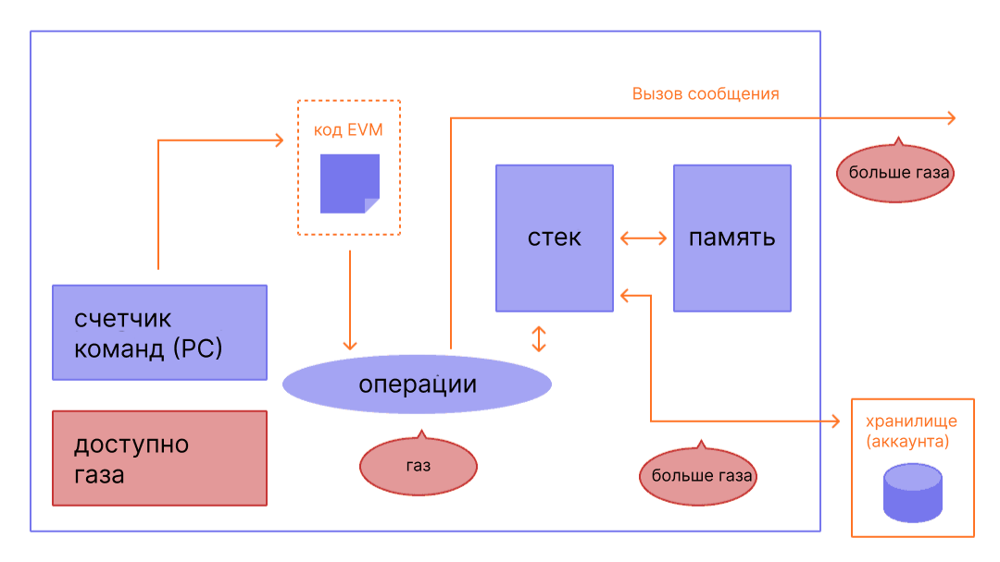
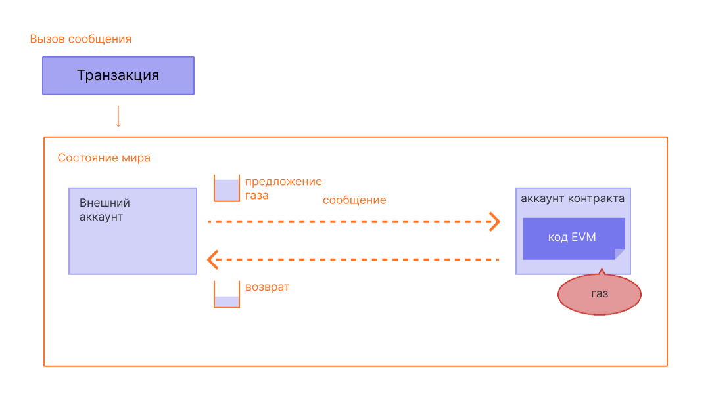

Газ необходим сети Ethereum. Это топливо, которое поддерживает его работу, словно бензин для автомобиля.

## Прежде чем начать {#prerequisites}

Чтобы лучше понять эту страницу, мы рекомендуем вам сначала ознакомиться с [транзакциями](/developers/docs/transactions/) и [EVM](/developers/docs/evm/).

## Что такое газ? {#what-is-gas}

Газ — это единица для измерения объема вычислительных усилий, необходимых для выполнения определенных операций в сети Ethereum.

Поскольку каждая транзакция в Ethereum требует вычислительных ресурсов для исполнения, эти ресурсы должны быть оплачены, чтобы убедиться, что Ethereum устойчив к спаму и не застрянет в бесконечном цикле вычислений. Плата за вычисления происходит в виде комиссии за газ.

Комиссия за газ — это **количество газа, необходимое для выполнения операции, умноженное на стоимость единицы газа**. Комиссия платится независимо от того, состоится транзакция или провалится.

 _Источник адаптированной диаграммы: [Ethereum EVM illustrated](https://takenobu-hs.github.io/downloads/ethereum_evm_illustrated.pdf)_

Газ должен оплачиваться базовой валютой в Ethereum — эфиром (ETH). Зачастую цена газа называется в gwei, что является деноминацией ETH. Одна единица gwei — это одна миллиардная часть от целого ETH (0,000000001 ETH, 10-9 ETH).

Например, вместо того, чтобы говорить, что ваш газ стоит 0,000000001 эфира, вы можете сказать, что ваш газ стоит 1 gwei.

Слово gwei происходит от слова giga-wei, то есть «миллиард wei». Один gwei равен миллиарду wei. Сам wei (названный в честь [Вэй Дая](https://wikipedia.org/wiki/Wei_Dai), создателя [b-money](https://www.investopedia.com/terms/b/bmoney.asp)) является самой маленькой единицей ETH.

## Как вычислить комиссию за газ? {#how-are-gas-fees-calculated}

Вы можете указать количество газа, который хотите заплатить, когда отправляете транзакцию. Предлагая определенное количество газа, вы делаете ставку на то, что ваша транзакция будет включена в следующий блок. Если вы предложите слишком мало, валидаторы с малой долей вероятности предпочтут включать эту транзакцию в блок, так что она может быть включена позже или даже никогда. Если вы предложите слишком много, то потратите какое-то количество ETH зря. Так как же узнать, сколько нужно заплатить?

Общее количество выплачиваемого газа делится на два компонента: `base fee` (базовая комиссия) и `priority fee` (приоритетная комиссия, чаевые).

Величина `base fee` устанавливается протоколом — вы должны оплатить газ как минимум в этом количестве, чтобы ваша транзакция считалась действительной. Значение `priority fee` — это чаевые, которые вы прибавляете к базовой комиссии, чтобы сделать транзакцию привлекательной для валидаторов, а они в первую очередь стремились включить ее в следующий блок.

Транзакция, при которой выплачивается только `base fee`, технически действительна, но ее включение в блок маловероятно, потому что валидаторы будут выбирать ее в самую последнюю очередь. Правильно посчитать `priority fee` можно, глядя на загруженность сети в момент отправки транзакции. Если спрос большой, рекомендуется поднять `priority fee` повыше, а когда спрос маленький — добавлять можно меньше.

Например, Джордан хочет отправить Тэйлору 1 ETH. Трансфер ETH занимает в блоке 21 000 единиц газа, а базовая комиссия за газ — 10 gwei. Джордан добавляет чаевые в виде 2 gwei.

В итоге комиссия будет рассчитана таким образом:

`количество использованного газа * (базовая комиссия + приоритетная комиссия),`

где `base fee` — это значение, установленное протоколом, а `priority fee` — значение, установленное пользователем в качестве чаевых валидатору.

Например, `21 000 * (10 + 2) = 252 000 gwei` (0,000252 ETH).

Когда Джордан отправляет деньги, 1,000252 ETH будет списано со счета Джордана. Тэйлору будет начислено 1,0000 ETH. Валидатор получит чаевые в размере 0,000042 ETH. Базовая комиссия `base fee` в размере 0,00021 ETH будет сожжена.

### Базовая комиссия {#base-fee}

У каждого блока есть базовая комиссия, которая действует как стартовая цена. Чтобы иметь право на включение в блок, предлагаемая цена за газ должна быть по крайней мере равна базовой комиссии. Базовая комиссия рассчитывается независимо от текущего блока, вместо этого она определяется предыдущими блоками, что делает комиссии за транзакции более предсказуемыми для пользователей. Когда создается блок, **базовая комиссия «сжигается»** и исключается из обращения.

Базовая комиссия рассчитывается по формуле, которая сравнивает размер предыдущего блока (количество газа, использованного для всех транзакций) с целевым размером. Базовая комиссия увеличится максимум на 12,5 % за блок, если размер целевого блока превышен. Этот экспоненциальный рост делает экономически нецелесообразным, чтобы размер блока оставался высоким на неопределенный срок.

| Номер блока | Включенный газ | Увеличение комиссии | Текущая базовая комиссия |
| ----------- | --------------:| -------------------:| ------------------------:|
| 1           |         15 млн |                 0 % |                 100 gwei |
| 2           |         30 млн |                 0 % |                 100 gwei |
| 3           |         30 млн |              12,5 % |               112,5 gwei |
| 4           |         30 млн |              12,5 % |               126,6 gwei |
| 5           |         30 млн |              12,5 % |               142,4 gwei |
| 6           |         30 млн |              12,5 % |               160,2 gwei |
| 7           |         30 млн |              12,5 % |               180,2 gwei |
| 8           |         30 млн |              12,5 % |               202,7 gwei |

Согласно приведенной выше таблице для создании транзакции в блоке номер 9 кошелек позволит пользователю понять, что максимальная базовая комиссия **maximum base fee**, которая будет добавлена ​​к следующему блоку, составляет текущую базовую комиссию `current base fee * 112,5 %`, или `202,7 gwei * 112,5 % = 228,1 gwei`.

Также важно отметить, что сильные всплески серий полных блоков маловероятны из-за скорости, с которой базовая комиссия увеличивается перед полным блоком.

| Номер блока | Включенный газ | Увеличение комиссии | Текущая базовая комиссия |
| ----------- | --------------:| -------------------:| ------------------------:|
| 30          |         30 млн |              12,5 % |              2705,6 gwei |
| ...         |            ... |              12,5 % |                      ... |
| 50          |         30 млн |              12,5 % |             28531,3 gwei |
| ...         |            ... |              12,5 % |                      ... |
| 100         |         30 млн |              12,5 % |          10302608,6 gwei |

### Приоритетная комиссия (чаевые) {#priority-fee}

Приоритетная комиссия (чаевые) мотивирует валидаторов включить транзакцию в блок. Без чаевых валидаторы сочтут экономически выгодным создавать пустые блоки, потому что они все равно будут получать награду того же размера. Небольшие чаевые дают валидаторам минимальный стимул включить транзакцию. Для транзакций, которые нуждаются в приоритетном исполнении перед другими в том же блоке, можно добавить повышенные чаевые, чтобы попробовать обойти конкурирующие транзакции.

### Максимальная комиссия {#maxfee}

Чтобы исполнить транзакцию в сети, пользователи могут указать максимальный лимит, который они готовы заплатить за исполнение своей транзакции. Этот необязательный параметр называется максимальной комиссией за газ — `maxFeePerGas`. Для исполнения транзакции максимальная комиссия должна превышать сумму базовой комиссии и чаевых. Отправителю транзакции возвращается разница между максимальной комиссией и совокупностью базовой комиссии и чаевых.

### Размер блоков {#block-size}

Каждый блок имеет целевой размер 15 миллионов газа, но размер блоков будет увеличиваться или уменьшаться в соответствии со спросом в сети вплоть до предела блока в 30 миллионов газа (в 2 раза больше целевого размера блока). Протокол достигает равновесного размера блока в 15 миллионов в среднем через процесс _tâtonnement_. Это означает, что если размер блока больше, чем целевой, протокол увеличит базовую комиссию для следующего блока. Аналогичным образом протокол уменьшит базовую комиссию, если размер блока меньше, чем целевой. Сумма, на которую корректируется базовая комиссия, пропорциональна тому, насколько текущий размер блока отличается от целевого. [Подробнее о блоках](/developers/docs/blocks/).

### Расчет стоимости газа на практике {#calculating-fees-in-practice}

Вы можете точно установить, сколько хотите заплатить за выполнение вашей транзакции. Однако многие поставщики кошельков автоматически устанавливают рекомендованную комиссию за транзакцию (базовая + рекомендованная приоритетная комиссия), чтобы упростить жизнь своим пользователям.

## Зачем нужны комиссии за газ? {#why-do-gas-fees-exist}

Если коротко, комиссия за газ помогает поддерживать безопасность сети Ethereum. Требуя плату за каждое вычисление, выполняемое в сети, мы не позволяем злоумышленникам рассылать по ней спам. Чтобы избежать случайных или умышленных бесконечных циклов и других вычислительных потерь в коде, каждой транзакции требуется установить ограничение на количество вычислительных шагов выполнения кода, которые она может использовать. Основной единицей вычислений является «газ».

Хотя транзакция включает лимит, любой газ, не использованный в транзакции, возвращается пользователю (т. е. возвращается `максимальная комиссия – (базовая комиссия + чаевые)`).

 _Источник адаптированной диаграммы: [Ethereum EVM illustrated](https://takenobu-hs.github.io/downloads/ethereum_evm_illustrated.pdf)_

## Что такое лимит газа? {#what-is-gas-limit}

Лимит газа — это максимальное количество газа, которое вы хотите израсходовать на транзакцию. Более сложные транзакции с использованием [смарт-контрактов](/developers/docs/smart-contracts/) требуют больше вычислительной работы, поэтому им требуется более высокий лимит газа, чем простому платежу. Для стандартного перевода ETH предусматривается лимит в 21 000 единиц газа.

Например, если вы установите лимит газа в 50 000 для простого перевода ETH, EVM использует 21 000, а вам вернутся оставшиеся 29 000. Однако если вы укажете слишком мало газа, например лимит в 20 000 для простого перевода ETH, EVM израсходует ваши 20 000 единиц газа при попытке выполнить транзакцию, но не завершит ее. EVM отменит все изменения, но так как валидатор уже использовал 20 тысяч единиц газа для работы, этот газ будет считаться потраченным.

## Почему комиссия за газ может быть такой высокой? {#why-can-gas-fees-get-so-high}

Высокая комиссия за газ связана с популярностью Ethereum. Если спрос слишком высок, пользователи могут предложить большие чаевые, чтобы попытаться обойти транзакции других пользователей в очереди. Чем выше чаевые, тем выше вероятность того, что ваша транзакция попадет в следующий блок. Кроме того, более сложные приложения со смарт-контрактами требуют проводить множество операций для выполнения своих функций, что делает их крупными потребителями газа.

## Инициативы по снижению затрат газа {#initiatives-to-reduce-gas-costs}

[Обновления масштабируемости](/roadmap/) Ethereum должны в конечном итоге решить некоторые проблемы с платой за газ, что, в свою очередь, позволит платформе обрабатывать тысячи транзакций в секунду и глобально масштабироваться.

Масштабирование на слое 2 — это основная инициатива, направленная на значительное снижение затрат газа, удобство работы пользователей и масштабируемость. [Подробнее о масштабировании на слое 2](/developers/docs/scaling/#layer-2-scaling).

## Отслеживание комиссий за газ {#monitoring-gas-fees}

Если вы хотите отслеживать цены на газ, чтобы отправлять ETH дешевле, то можете использовать множество различных инструментов, включая следующее:

- [Etherscan](https://etherscan.io/gastracker) — _средство оценки газовых цен на транзакции._
- [Blocknative ETH Gas Estimator](https://chrome.google.com/webstore/detail/blocknative-eth-gas-estim/ablbagjepecncofimgjmdpnhnfjiecfm) — _расширение Chrome для оценки газа, поддерживающее как устаревшие транзакции типа 0, так и транзакции типа 2 EIP-1559._
- [Калькулятор комиссий за газ Cryptoneur](https://www.cryptoneur.xyz/gas-fees-calculator) — _рассчитывает комиссии за газ в местной валюте для различных типов транзакций в основной сети, Arbitrum и Polygon._

## Сопутствующие инструменты {#related-tools}

- [Газовая платформа Blocknative](https://www.blocknative.com/gas) — _API для оценки газа на основе глобальных данных мемпула Blocknative._

## Дополнительная литература {#further-reading}

- [Объяснение газа в Ethereum](https://defiprime.com/gas)
- [Снижение потребления газа в ваших умных контрактах](https://medium.com/coinmonks/8-ways-of-reducing-the-gas-consumption-of-your-smart-contracts-9a506b339c0a)
- [Доказательство владения и доказательство работы](https://blockgeeks.com/guides/proof-of-work-vs-proof-of-stake/)
- [Стратегии оптимизации газа для разработчиков](https://www.alchemy.com/overviews/solidity-gas-optimization)
- [Документация EIP-1559](https://eips.ethereum.org/EIPS/eip-1559)
- [Ресурсы по EIP-1559 от Тима Бейко](https://hackmd.io/@timbeiko/1559-resources)
