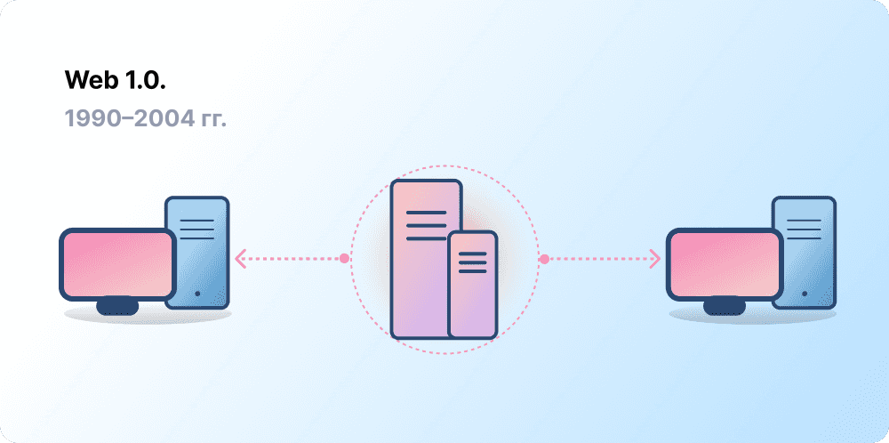
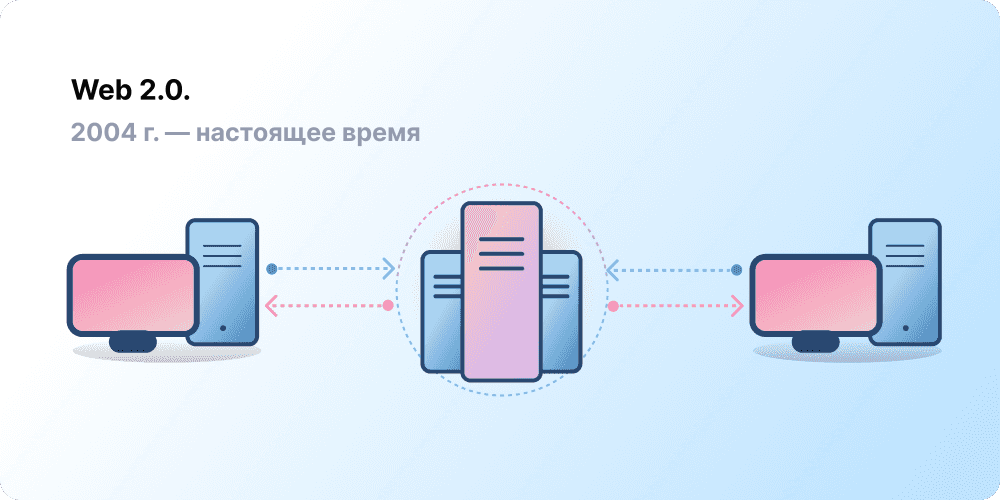
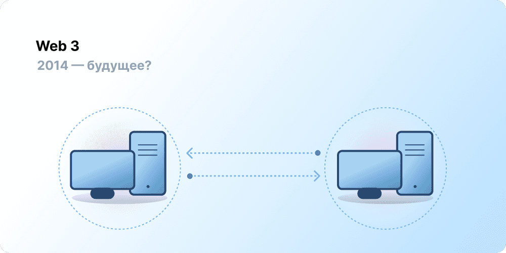

# Введение в Web3 {#introduction}

Централизация помогла миллиардам людей подключиться к всемирной сети и создать устойчивую инфраструктуру, благодаря которой она существует. В то же время горстка централизованных организаций контролирует целые сегменты всемирной сети и пользуются своим влиянием, чтобы решать, чему быть, а чему — нет.

Web3 — ответ на такое положение вещей. Вместо монополизированной сети крупных технологических компаний Web3 использует децентрализацию, принадлежит своим пользователям, создается и управляется ими. Web3 дает власть в руки личностям, а не корпорациям. Прежде чем говорить о Web3, давайте поймем, как мы оказались там, где мы есть.

<Divider />

## Сеть на ранних этапах {#early-internet}

Большинство представляет всемирную сеть неизменной основой современной жизни: она была изобретена и с тех пор просто существует. Однако сеть, которую большинство из нас знают сегодня, сильно отличается от первоначально представляемой. Чтобы лучше в этом разобраться, полезно разбить краткую историю Интернета на ориентировочные периоды: Web 1.0 и Web 2.0.

### Web 1.0: только чтение (1990–2004 гг.) {#web1}

В 1989 году в ЦЕРН (Женева) Тим Бернерс-Ли был занят разработкой протоколов, которые станут всемирной сетью. В чем идея? В том, чтобы создать открытые, децентрализованные протоколы, которые позволяют распространять информацию из любой точки земного шара.

Первая версия творения Бернерса-Ли, сейчас известная как Web 1.0, существовала примерно между с 1990 по 2004 год. Сеть Web 1.0 представляла собой в основном статичные сайты, принадлежащие компаниям, и взаимодействие между пользователями было практически нулевым. Отдельные люди редко создавали контент, поэтому эта версия стала известен как «Интернет только для чтения».

### Web 2.0: чтение и запись (с 2004 г. по сей день) {#web2}

Период Web 2.0 начался в 2004 г. с появлением социальных сетей. От модели «только для чтения» перешли к модели «чтение и запись». Компании начали предоставлять платформы для распространения контента, сгенерированного самими пользователями, и вовлекать пользователей в прямое взаимодействие друг с другом. По мере того как больше человек приходило в онлайн, горстка самых могущественных компаний начала контролировать непропорциональное количество трафика и прибыли, возникающей в сети. Модель Web 2.0 также породила модель доходов, основанную на рекламе. Несмотря на то, что пользователи могут создавать контент, они напрямую не владеют ни контентом, ни доходами от его монетизации.

<Divider />

## Web 3.0: чтение, запись и владение {#web3}

Концепт Web 3.0 был придуман сооснователем [Ethereum](/what-is-ethereum/) Гэвином Вудом вскоре после запуска Ethereum в 2014 г. Гэвин сформулировал решение проблемы, с которой сталкивались многие ранние криптоэнтузиасты: Интернет требовал слишком большого доверия. Иными словами, чтобы иметь возможность действовать в интересах общества, большая часть сети, которую люди знают и используют сегодня, опирается на доверие к горстке крупных частных кампаний.

### Что такое Web3? {#what-is-web3}

Web3 — это концепция нового, лучшего Интернета. Web3 основан на блокчейнах, криптовалютах и NFT, чтобы отдать власть обратно пользователям в форме владения. [Пост в Твиттере от 2021 года](https://twitter.com/j1mmyeth/status/1459003044067258370) объяснил все это лучше всего: модель Web1 была только для чтения, Web2 — для чтения и записи, а Web3 будет для чтения, записи и владения.

#### Ключевые идеи Web3 {#core-ideas}

Тяжело дать четкое определение для Web3, но есть несколько ключевых принципов.

- **Сеть Web3 децентрализована:** вместо больших сегментов Интернета, контролируемых и управляемых централизованными организациями, владение будет распределено между создателями и пользователями.
- **Web3 не регулируется:** все принимают участие на равных правах, и никто не исключается.
- **Платежи встроены в Web3:** для оплаты и переводов здесь используется криптовалюта, нет необходимости в устаревшей инфраструктуре банков и платежных систем.
- **Web3 не требует доверия:** все работает через экономические механизмы и не требует доверять какой-либо третьей стороне.

### Почему Web3 — это важно? {#why-is-web3-important}

Ключевые функции Web3 не изолированы и не вмещаются в четкие категории, но для простоты мы попытались разделить их и таким образом сделать проще для понимания.

#### Владение {#ownership}

Web3 дает вам беспрецедентное владение вашими цифровыми активами. Например, вы хотите поиграть в web2-игру. Если вы покупаете внутриигровой предмет, он привязывается напрямую к вашему аккаунту. Если создатели игры удалят ваш аккаунт, вы потеряете ваши предметы. И если вы прекратите играть, то потеряете все, что вложено во внутриигровые предметы.

Web3 позволяет непосредственно владеть активами благодаря [невзаимозаменяемым токенам (NFT)](/glossary/#nft). Никто, даже создатели игры, не могут забрать у вас вашу собственность. Если вы прекратите играть, то сможете продать ваши предметы на открытых рынках и окупить их стоимость.

<InfoBanner shouldSpaceBetween emoji=":eyes:">
  
Подробнее об NFT

  <ButtonLink href="/nft/">
    Подробнее об NFT
  </ButtonLink>
</InfoBanner>

#### Устойчивость к цензуре {#censorship-resistance}

Распределение власти между платформами и создателями контента лишено всякого баланса.

OnlyFans — это платформа для хранения авторского контента для взрослых с более чем миллионом создателей контента, для большинства из которых платформа — основной источник дохода. В августе 2021 г. платформа OnlyFans анонсировала планы запретить контент откровенно сексуального характера. Анонс вызвал недовольство авторов контента, посчитавших себя ограбленными платформой, которую они помогли создать. После скандала решение было быстро отменено. Cоздатели контента выиграли эту битву, но прецедент осветил проблему авторства в среде Web 2.0: вы потеряете репутацию и все накопленное, если покинете платформу.

В Web3 ваши данные находятся в блокчейне. Когда вы принимаете решение покинуть платформу, вы можете забрать репутацию с собой и перенести ее в другой интерфейс, который больше соответствует вашим ценностям.

Web 2.0 требует от создателей контента верить платформам, что те не поменяют правила, в то время как в Web3 устойчивость к цензуре заложена в основу.

#### Децентрализованные автономные организации (DAO) {#daos}

Помимо владения своими данными в Web3, вы можете владеть платформой как коллектив, используя токены, которые действуют как акции компании. DAO позволяют вам координировать децентрализованное право собственности на платформу и принимать решения о ее будущем.

С технической точки зрения, DAO — это согласованные [смарт-контракты](/glossary/#smart-contract), которые автоматизируют децентрализованное принятие решений по пулу ресурсов (токенов). Пользователи с токенами голосуют за то, как ресурсы будут расходоваться, а код автоматически выполняет результаты голосования.

Однако многие сообщества Web3 считаются организациями DAO. Все эти сообщества имеют разные уровни децентрализации и автоматизации по коду. В настоящее время мы изучаем, что такое DAO и как они могут развиваться в будущем.

<InfoBanner shouldSpaceBetween emoji=":eyes:">
  
Подробнее о DAO

  <ButtonLink href="/dao/">
    Больше о DAO
  </ButtonLink>
</InfoBanner>

### Идентичность {#identity}

Обычно вы создаете учетную запись на каждой платформе, которой пользуетесь. Например, у вас могут быть аккаунты Twitter, YouTube и Reddit. Хотите поменять отображаемое имя или картинку профиля? Нужно зайти в каждый аккаунт и сделать это. В некоторых случаях можно регистрироваться на платформах с помощью аккаунтов в соцсетях, но здесь есть та же самая проблема — цензура. Эти платформы могут одним щелчком перекрыть доступ ко всей вашей онлайн-жизни. Хуже того, многие платформы требуют чтобы им доверяли персональную информацию, и без этого не создают учетные записи.

Web3 решает эти проблемы, позволяя вам контролировать свой цифровой профиль с помощью адреса Ethereum и профиля [Ethereum Name Service (ENS)](/glossary/#ens). Использование адреса Ethereum предоставляет единый вход на многих платформах: безопасный, устойчивый к цензуре и анонимный.

### Встроенные платежи {#native-payments}

Платежная инфраструктура Web2 зависит от банков и платежных систем, исключая из экономики людей без банковских счетов и тех, кто живет в некой неугодной стране. Web3 использует такие токены, как [ETH](/glossary/#ether), чтобы отправлять деньги напрямую из браузера, и не требует доверенного посредника.

<ButtonLink href="/eth/">
  Подробнее об ETH
</ButtonLink>

## Ограничения Web3 {#web3-limitations}

Несмотря на множество преимуществ сети Web3 в ее текущей форме, по-прежнему есть много ограничений, которые экосистеме необходимо преодолеть для дальнейшего процветания.

### Доступность {#accessibility}

Важные преимущества Web3, такие как вход через Ethereum, уже доступны любому бесплатно. Но относительная цена транзакций остается помехой для многих. Web3 вряд ли будет активно использоваться в развивающихся странах из-за больших комиссий. В Ethereum эти проблемы решаются с помощью [дорожной карты](/roadmap/) и [решений Layer 2](/glossary/#layer-2). Технология готова, но необходимо более широкое внедрение решений слоя 2, чтобы сделать модель Web3 доступной для каждого.

### Пользовательский опыт {#user-experience}

Технический барьер входа в Web3 на данный момент слишком высок. Пользователи должны быть компетентны в компьютерной безопасности, понимать сложную техническую документацию и использовать неинтуитивные интерфейсы. [Поставщики кошельков](/wallets/find-wallet/), в частности, работают над решением, но предстоит еще многое сделать для того, чтобы модель Web3 стала доступна массам.

### Обучение {#education}

Web3 вводит новые парадигмы, которые требуют учиться новым ментальным моделям, отличающимся от Web 2.0. Подобный процесс обучения уже происходил в конце 1990-х, когда сеть Web 1.0 набирала популярность. Тогда сторонники всемирной сети использовали множество образовательных методов для просвещения общественности, от простых метафор (информационная магистраль, обозреватели, веб-серфинг) до [телевизионных передач](https://www.youtube.com/watch?v=SzQLI7BxfYI). Сеть Web3 не сложна, просто она другая. Образовательные инициативы, направленные на разъяснение концепций Web3 пользователям Web2, жизненно важны для ее успеха.

Ethereum.org вносит свой вклад в обучение использованию сети Web3 с помощью нашей [Программы перевода](/contributing/translation-program/), нацеленной на перевод важного контента об Ethereum на максимально возможное количество языков.

### Централизованная инфраструктура {#centralized-infrastructure}

Инфраструктура Web3 молода и быстро развивается. В результате сейчас Web3 в значительной степени зависит от централизованной инфраструктуры (GitHub, Twitter, Discord и т. д.). Множество Web3-компаний прикладывают все усилия, чтобы закрыть эти бреши, но построение высококачественной функциональной инфраструктуры требует времени.

## Децентрализованное будущее {#decentralized-future}

Web3 — это молодая и развивающаяся экосистема. Гэвин Вуд придумал этот термин в 2014 г., но многие идеи только недавно стали реальностью. Только за прошлый год мы наблюдали значительный всплеск интереса к криптовалютам, улучшения в решениях для масштабирования уровня 2, эксперименты в области новых форм управления и революции в области цифровой идентификации.

Мы находимся только в начале пути создания лучшей сети с помощью Web3. Но по мере того, как мы улучшаем инфраструктуру, которая будет ее поддерживать, будущее сети выглядит все более светлым.

## Как принять участие {#get-involved}

- [Создать кошелек](/wallets/)
- [Найти сообщество](/community/)
- [Изучить приложения Web3](/dapps/)
- [Присоединиться к DAO](/dao/)
- [Создавать в Web3](/developers/)

## Дополнительные ресурсы {#further-reading}

У Web3 нет строгого определения. Разные участники сообщества смотрят на эту модель по-разному. Вот некоторые из них:

- [ Что такое Web3? Объяснение децентрализованного Интернета будущего](https://www.freecodecamp.org/news/what-is-web3/) — _Nader Dabit_
- [Разбираемся в Web 3](https://medium.com/l4-media/making-sense-of-web-3-c1a9e74dcae) — _Josh Stark_
- [Почему Web3 — это важно](https://future.a16z.com/why-web3-matters/) — _Chris Dixon_
- [Почему важна децентрализация](https://onezero.medium.com/why-decentralization-matters-5e3f79f7638e) — _Chris Dixon_
- [Ландшафт Web3](https://a16z.com/wp-content/uploads/2021/10/The-web3-Readlng-List.pdf) — _a16z_
- [Дебаты о Web3](https://www.notboring.co/p/the-web3-debate?s=r) — _Packy McCormick_

<QuizWidget quizKey="web3" />
