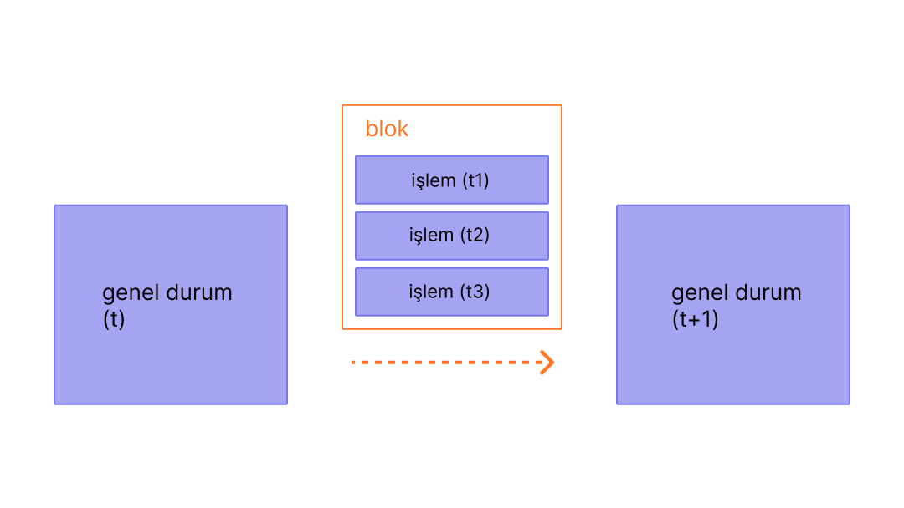

Bloklar, zincirde yer alan bir önceki blok hakkındaki hash değerlerini barındıran işlem gruplarıdır. Bu, blokları birbirine (bir zincir hâlinde) bağlar çünkü hash değerleri blok verilerinden kriptografik olarak türetilir. Bu, geçmişteki herhangi bir bloktaki tek bir değişikliğin sonraki tüm hash değerlerini değiştirerek tüm blokları geçersiz kılacağı ve bu durum blok zincirini yürüten herkes tarafından fark edileceği için dolandırıcılığı önler.

## Ön Koşullar {#prerequisites}

Bloklar, yeni başlayanlar için uygun bir konudur. Ancak bu sayfayı daha iyi anlamanıza yardımcı olmak için önce [Hesaplar](/developers/docs/accounts/), [İşlemler](/developers/docs/transactions/) ve [Ethereum'a giriş](/developers/docs/intro-to-ethereum/) bölümlerini okumanızı öneririz.

## Bloklar neden gerekli? {#why-blocks}

Ethereum ağındaki tüm katılımcıların senkronize durumlarını sürdürmesini ve işlemlerin kesin geçmişi üzerinde anlaşmasını sağlamak için işlemleri bloklar hâlinde topluyoruz. Bu, düzinelerce (veya yüzlerce) işlemin aynı anda yapıldığı, üzerinde anlaşmaya varıldığı ve senkronize edildiği anlamına gelir.

 _Diyagram [Ethereum EVM resmediciden](https://takenobu-hs.github.io/downloads/ethereum_evm_illustrated.pdf) uyarlanmıştır_

Kod girişleri arasında belirli bir süre tanıyarak ağ katılımcıları için yeterli zamanı veriyoruz: işlem talepleri saniye başına düzinelerce oluşsa da bloklar Ethereum üzerinde on iki saniyede bir yaratılmaktadır ve oluşmaktadır.

## Blokların çalışma şekli {#how-blocks-work}

İşlem geçmişini korumak için, bloklar titizlikle sıralanır (oluşturulan her yeni blok, önceki bloğa bir referans içerir) ve bloklar içindeki işlemler de titizlikle sıralanır. Herhangi bir zamanda olabilecek nadir durumlar dışında ağdaki tüm katılımcılar, blokların tam sayısı ve geçmişi konusunda mutabıktır ve mevcut aktif işlem taleplerini bir sonraki blokta gruplandırmak için çalışmaktadır.

Bir blok, ağ üzerinden rastgele seçilmiş doğruluyacılar tarafından bir araya getirildiğinde ağın geri kalanına yayılır, bütün düğümler bu bloku kendi blok zincirlerinin sonuna ekler ve yeni bloku yaratmak için yeni bir doğrulayıcı seçilir. Bu blok birleştirme süreci ve taahtütname/mutabakat süreci şu anda Ethereum'un "hisse ispatı" protokolü tarafından özelleştiriliyor.

## Hisse ispatı protokolü {#proof-of-work-protocol}

Hisse ispatının anlamı aşağıdaki gibidir:

- Doğrulayıcı düğümler, kötü davranışlara karşı bir teminat olarak yatırım sözleşmesine 32 ETH hisselemek zorundadır. Bu, ağın korunmasına yardımcı olur çünkü gerçek anlamda dürüst olmayan aktivite hisselerin kısmen veya tamamen yok olmasına yol açabilir.
- Her bir yuvada (12 saniyelik boşluklara ayrılmış) bir doğrulayıcı, blok önerici olarak seçilir. Doğrulayıcılar işlemleri paketler, yürütür ve yeni "duruma" karar verirler. Bu bilgileri bir bloka atar ve öbür doğrulayıcılara iletirler.
- Yeni blokun haberini alan diğer doğrulayıcılar küresel durum değişim önerisine uydukarını güvence altına almak için işlemleri tekrar yürütürler. Blokun geçerli olduğunu varsayarsak kendi veritabanlarına ekler.
- Eğer bir doğrulayıcı çelişen iki blok hakkında bir haber alırsa en çok ETH hisselemiş olanı çatal seçim algoritmasını kullanarak seçer.

[Hisse ispatı hakkında daha fazla bilgi](/developers/docs/consensus-mechanisms/pos)

## Bir blokta neler yer alır? {#block-anatomy}

Bir blok içinde barındırılan çok fazla bilgi vardır. En yüksek düzeyde, bir blok aşağıdaki alanları barındırır:

| Alan             | Açıklama                                               |
|:---------------- |:------------------------------------------------------ |
| `yuva`           | blokun ait olduğu yuva                                 |
| `proposer_index` | bloku öneren doğrulayıcının kimliği                    |
| `parent_root`    | önceki blokun karması                                  |
| `state_root`     | durum nesnesinin kök karması                           |
| `şablon`         | aşağıda tanımlandığı gibi birkaç alan içeren bir nesne |

Blok `gövdesi` kendi başına birkaç alana sahiptir:

| Alan                 | Açıklama                                                                   |
|:-------------------- |:-------------------------------------------------------------------------- |
| `randao_reveal`      | bir sonraki blok önericisini seçmek için kullanılan değer                  |
| `eth1_data`          | depozito sözleşmesi hakkında bilgi                                         |
| `graffiti`           | blokları etiketlemek için kullanılan keyfi veriler                         |
| `proposer_slashings` | kesilecek doğrulayıcıların listesi                                         |
| `attester_slashings` | kesilecek tasdik edenlerin listesi                                         |
| `tasdikler`          | mevcut blok lehine tasdik listesi                                          |
| `depozitolar`        | depozito sözleşmesine yeni depozito listesi                                |
| `voluntary_exits`    | ağdan çıkan doğrulayıcıların listesi                                       |
| `sync_aggregate`     | hafif istemcilere hizmet etmek için kullanılan doğrulayıcıların alt kümesi |
| `execution_payload`  | yürütüm istemcisinden geçirilen işlemler                                   |

`Tasdik` alanı, bloktaki tüm tasdiklerin bir listesini içerir. Tasdiklerin, birkaç veri parçası içeren kendi veri türleri vardır. Her tasdik şunları içerir:

| Alan               | Açıklama                                                   |
|:------------------ |:---------------------------------------------------------- |
| `aggregation_bits` | bu tasdiğe hangi doğrulayıcıların katıldığının bir listesi |
| `veri`             | birden çok alt alana sahip bir barındırıcı                 |
| `i̇mza`            | tüm onaylayan doğrulayıcıların toplu imzası                |

`Tasdikteki` `veri` alanı şunları içerir:

| Alan                | Açıklama                                     |
|:------------------- |:-------------------------------------------- |
| `yuva`              | tasdiğe bağlı yuva alanı                     |
| `indeks`            | tasdik eden doğrulayıcılar için endeksler    |
| `beacon_block_root` | bu nesneyi içeren İşaret blokunun kök düğümü |
| `kaynak`            | gerekçeli son denetim noktası                |
| `target`            | son dönem sınır bloku                        |

Bu işlemleri `execution_payload`'da yapmak global durumu günceller. Tüm istemciler yeni durum yeni blok `state_root` alanıyla eşleştiğinden emin olmak için işlemleri `execution_payload`'da yeniden çalıştırır. Bu, müşteriler tarafından yeni bir blokun kendi blok zincirlere eklenmesi için geçerli ve güvenli olduğunun söylenmesidir. `Yürütme yükü` birkaç farklı alandan oluşan bir nesnedir. Ayrıca çalıştırma verisiyle ilgili önemli bilgileri içinde bulunduran `execution_payload_header` bir veri yapısı var. Bu veri yapıları şu şekilde organize edilmiştir:

`execution_payload_header` aşağıdaki alanları içerir:

| Alan                | Açıklama                                                              |
|:------------------- |:--------------------------------------------------------------------- |
| `parent_hash`       | üst blokun karması                                                    |
| `fee_recipient`     | işlem ücretlerinin ödeneceği hesap adresi                             |
| `state_root`        | bloka değişimleri uyguladıktan sonraki küresel durum için kök karması |
| `receipts_root`     | işlem makbuzları karması                                              |
| `logs_bloom`        | olay günlüklerini içeren veri yapısı                                  |
| `prev_randao`       | rastgele doğrulayıcı seçiminde kullanılan değer                       |
| `block_number`      | mevcut blokun numarası                                                |
| `gas_limit`         | bu blokta izin verilen maksimum gaz                                   |
| `gas_used`          | bu blokta kullanılan net gaz miktarı                                  |
| `zaman damgası`     | blok süresi                                                           |
| `extra_data`        | i̇steğe bağlı ham bayt olarak eklenen veri                            |
| `base_fee_per_gas`  | ana ücret değeri                                                      |
| `block_hash`        | Uygulama blokunun özeti                                               |
| `transactions_root` | yükteki işlemlerin kök karması                                        |
| `withdrawal_root`   | yükteki para çekme işlemlerinin kök karması                           |

`execution_payload` ise aşağıdakileri kapsar (bunun başlık olanla aynı olduğuna dikkat edin, ancak işlemlerin kök karmaları yerine asıl işlem listesini ve para çekme bilgisini kapsıyor):

| Alan               | Açıklama                                                              |
|:------------------ |:--------------------------------------------------------------------- |
| `parent_hash`      | üst blokun karması                                                    |
| `fee_recipient`    | işlem ücretlerinin ödeneceği hesap adresi                             |
| `state_root`       | bloka değişimleri uyguladıktan sonraki küresel durum için kök karması |
| `receipts_root`    | işlem makbuzları karması                                              |
| `logs_bloom`       | olay günlüklerini içeren veri yapısı                                  |
| `prev_randao`      | rastgele doğrulayıcı seçiminde kullanılan değer                       |
| `block_number`     | mevcut blokun numarası                                                |
| `gas_limit`        | bu blokta izin verilen maksimum gaz                                   |
| `gas_used`         | bu blokta kullanılan net gaz miktarı                                  |
| `zaman damgası`    | blok süresi                                                           |
| `extra_data`       | i̇steğe bağlı ham bayt olarak eklenen veri                            |
| `base_fee_per_gas` | ana ücret değeri                                                      |
| `block_hash`       | Uygulama blokunun özeti                                               |
| `İşlemler`         | yürütülecek işlemlerin listesi                                        |
| `para çekimleri`   | para çekme nesnelerinin listesi                                       |

`withdrawals` listesi aşağıdaki gibi `withdrawal` nesnelerinden oluşur:

| Alan             | Açıklama                  |
|:---------------- |:------------------------- |
| `adres`          | para çekilen hesap adresi |
| `miktar`         | para çekme miktarı        |
| `indeks`         | para çekme endeksi değeri |
| `validatorIndex` | doğrulayıcı endeks değeri |

## Blok süresi {#block-time}

Blok süresi, blokların ayrılması sırasındaki süreye karşılık gelir. Ethereum'da zaman, "yuva" adı verilen 12 saniyelik birimlere bölünmüştür. Her bir yuvada blok önermek için tek bir doğrulayıcı seçilmiştir. Tüm doğrulayıcıların çevrimiçi ve tam anlamıyla işlevsel olduğunu varsayarsak her bir yuvada bir blok oluşacaktır, bu da blok zamanının 12 saniye olduğu anlamına gelir. Ancak bazen doğrulayıcılar, blok önerisine çağrıldıklarında çevrimdışı olabilir, bu da kimi zaman yuvaların boş olacağı anlamına gelir.

Bu uygulama; blok sürelerinin tahmin edilebilir olduğu ve protokolün hedef madencilik zorluğu tarafından ayarlanan iş ispatı temelli sistemlerden ayrılır. Ethereum'un [ortalama blok süresi](https://etherscan.io/chart/blocktime) yeni 12li blok süresinin istikrarına bağlı olarak bakıldığında iş ispatı ve hisse ispatı arasındajki geçişi net olarak gösteren mükemmel bir örnektir.

## Blok boyutu {#block-size}

Son olarak önemli bir not: Blokların kendileri de boyut olarak sınırlandırılmıştır. Her blokun hedef boyutu 15 milyon gazdır ama blok boyutu ağ isteklerine göre 30 milyon gaz olan blok limitine kadar (blok boyutu hedefinin 2 katı) artabilir veya azalabilir. Bloğun gaz limiti, önceki bloğun gaz limitine kıyasla 1/1024 oranında yukarı ya da aşağı yönde ayarlanabilir. Sonuç olarak, doğrulayıcılar bloğun gaz limitini mutabakat yoluyla değiştirebilir. Bloktaki işlemlerden kesilen toplam gaz miktarı, blokun gaz limitinden daha az olmalıdır. Bu, blok boyutunun keyfi olarak belirlenememesini sağladığı için önemlidir. Bloklar keyfi boyutlarda olabilseydi, daha az performans gösteren tam düğümler, alan ve hız gereksinimleri nedeniyle yavaş yavaş ağa ayak uyduramazlardı. Blok ne kadar büyük olursa onu bir sonraki yuvada zamanında işlemek için gereken işlemci gücü de o denli büyük olacaktır. Bu blok boyutlarına üst sınırlar koyarak direnen bir merkezileştirici kuvvet.

## Daha fazla bilgi {#further-reading}

_Size yardımcı olan bir topluluk kaynağı biliyor musunuz? Bu sayfayı düzenleyin ve ekleyin!_

## İlgili konular {#related-topics}

- [İşlemler](/developers/docs/transactions/)
- [Gaz](/developers/docs/gas/)
- [Hisse ispatı](/developers/docs/consensus-mechanisms/pos)
