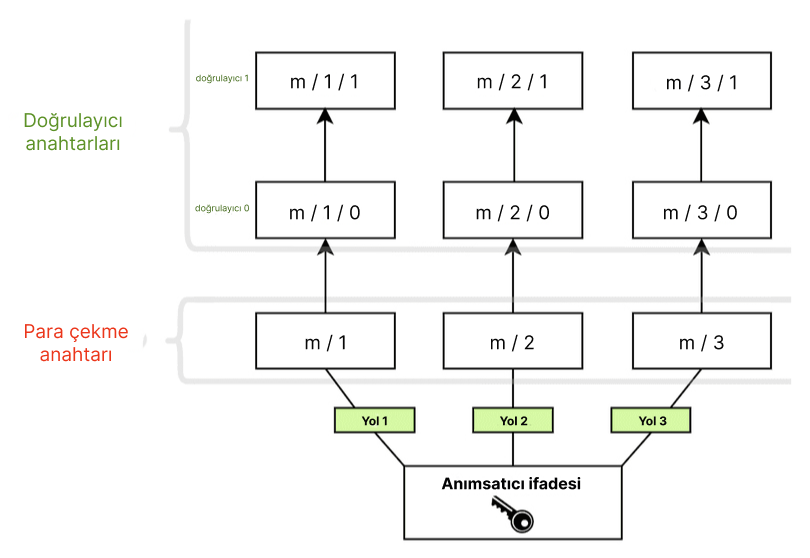

Ethereum, kullanıcı varlıklarını açık-özel anahtar kriptografisi kullanarak güvence altına alır. Açık anahtar, bir Ethereum adresinin temelini oluşturmak için kullanılır; yani genel olarak herkese açıktır ve eşsiz bir tanımlayıcı olarak kullanılır. Özel (veya "gizli") anahtara yalnızca hesap sahibi tarafından erişilebilmelidir. Özel anahtar, işlemleri ve verileri "imzalamak" için kullanılır, böylece kriptografi, özel anahtar sahibinin belirli bir bir eylemi onayladığını kanıtlayabilir.

Ethereum'un anahtarları [eliptik eğri kriptografisi](https://en.wikipedia.org/wiki/Elliptic-curve_cryptography) kullanılarak oluşturulur.

Ancak Ethereum, [iş ispatından](/developers/docs/consensus-mechanisms/pow) [hisse ispatına](/developers/docs/consensus-mechanisms/pos) geçiş yaptığında Ethereum'a yeni bir tür anahtar eklenmiştir. Orijinal anahtarlar hâlâ tamamen önceki gibi çalışıyor, hesapları güvence altına alan eliptik eğri tabanlı anahtarlar üzerinde herhangi bir değişiklik yapılmadı. Ancak kullanıcıların, ETH hisseleyerek ve doğrulayıcıları çalıştırarak hisse ispatına katılmak için yeni bir anahtar türüne ihtiyacı vardı. Bu ihtiyaç, çok sayıda doğrulayıcı arasında geçen birçok mesaj dolayısıyla ortaya çıkan ölçeklenebilirlik zorluklarından kaynaklandı. Ağın mutabakata varması için gereken mesaj miktarını azaltmak için kolayca toplanabilecek bir kriptografik yöntem gerekiyordu.

Bu yeni anahtar tipi [**Boneh-Lynn-Shacham (BLS)** imza şemasını](https://wikipedia.org/wiki/BLS_digital_signature) kullanır. BLS, imzaların çok verimli bir şekilde toplanmasına imkân tanırken, aynı zamanda topplanmış bireysel doğrulayıcı anahtarlarının tersine mühendislik ile çözülmesine izin verir ve doğrulayıcılar arasındaki işlemleri yönetmek için idealdir.

## Doğrulayıcı anahtarlarının iki türü {#two-types-of-keys}

Hisse ispatına geçiş yapmadan önce, Ethereum kullanıcılarının fonlarına erişmek için sadece tek bir eliptik eğri tabanlı özel anahtarı vardı. Hisse ispatının tanıtılmasıyla birlikte, solo paydaş olmak isteyen kullanıcılar aynı zamanda bir **doğrulayıcı anahtarı** ve bir **para çekme anahtarı** gerekli oldu.

### Doğrulayıcı anahtarı {#validator-key}

Doğrulayıcı imza anahtarı iki öğeden oluşur:

- Doğrulayıcı **özel** anahtarı
- Doğrulayıcı **açık** anahtarı

Doğrulayıcı özel anahtarın amacı, blok önerileri ve tasdikler gibi zincir üzerindeki işlemlere imza atmaktır. Bu yüzden, bu anahtarlar sıcak cüzdanda tutulmalıdır.

Bu esneklik, doğrulayıcı imza anahtarlarını bir cihazdan diğerine çok hızlı bir şekilde taşımanın avantajına sahiptir. Ancak, eğer kaybolmuş veya çalınmışlarsa, bir hırsız birkaç şekilde **kötü niyetli olarak hareket edebilir**:

- Doğrulayıcıyı cezalandırmak için:
  - Önerici olmak ve aynı yuva için iki farklı işaret bloku imzalamak
  - Doğrulayıcı olmak ve bir başkasını "çevreleyen" tasdiki imzalamak
  - Doğrulayıcı olmak ve hedefleri aynı olan iki farklı tasdiki imzalamak
- Gönüllü bir çıkışı zorlamak, doğrulayıcının kilitlemesini durdurur ve para çekme anahtarının sahibine doğrulayıcının ETH bakiyesine erişim verir

**Doğrulayıcı açık anahtarı** bir kullanıcı hisseleme mevduat sözleşmesine ETH yatırdığında işlem verisine dahil olarak bulunur. Bu _yatırma verisi_ olarak bilinir ve Ethereum'un doğrulayıcıyı tanımlamasına izin verir.

### Para çekme kimlik bilgileri {#withdrawal-credentials}

Her doğrulayıcı _para çekme kimlikleri_ olarak bilinen özelliğe sahiptir. Bu 32-bayt alan ya BLS para çekme kimliklerini temsil eden `0x00` ile başlar ya da yürütme adresine işaret eden kimlikleri temsil eden `0x01` ile başlar.

`0x00` BLS anahtarları olan doğrulayıcılar fazla bakiye ödemelerini aktive etmek ve hisselemelerini tam olarak çekebilmek için bu kimlikleri güncellemek zorundadır. Bu, başlangıç anahtar üretiminde yatırılan verileri yürütme adresiyle destekleyerek yapılabilir _VEYA_ `BLSToExecutionChange` mesajını imzalamak ve yayınlamak için daha sonra bir para çekme anahtarı kullanılarak yapılabilir.

### Para çekme anahtarı {#withdrawal-key}

Eğer başlangıç yatırımı sırasında ayarlanmamışsa, para çekme anahtarının yürütme adresini işaret eden para çekme kimlik bilgileriyle güncellenmesi gerekir. Bu fazla bakiye ödemeleri süreci başlamasına iimkân sunar, ayrıca kullanıcıların hisselenmiş ETH'lerini çekmelerini sağlar.

Doğrulayıcı anahtarları gibi, para çekme anahtarları da iki kısımdan oluşur:

- Para çekme **özel** anahtarı
- Para çekme **açık** anahtarı

Para çekme kimliklerini `0x01` türüne güncellemeden önce anahtarları kaybetmek doğrulayıcı bakiyenize erişimi kaybetmeniz anlamına gelir. Doğrulayıcı hâlâ doğrulayıcının özel anahtarının gerektiği tasdik ve blok imzalama gibi eylemleri gerçekleştirebilir ancak para çekme anahtarları kaybedildiyse sıfıra yakın bir teşvik bulunmaktadır.

Doğrulayıcı anahtarlarınızı Ethereum hesabınızdan ayırmak birçok doğrulayıcının tek bir kullanıcı tarafından yürütülmesi imkânı sunar.


## Güvenlik kelimelerinden anahtarlar türetmek {#deriving-keys-from-seed}

Eğer hisselenen tüm 32 ETH, tamamen yeni 2 set bağımsız anahtarları gerektirseydi, anahtar yönetimi özellikle birden fazla doğrulayıcı çalıştıran kullanıcılar için çok çabuk kullanılması zor bir hale gelirdi. Bunun yerine, birçok doğrulayıcı anahtarı tek bir genel paroladan türetilir ve bu tek parola birçok doğrulayıcı anahtarına erişime izin verir.

[Anımsatıcılar](https://en.bitcoinwiki.org/wiki/Mnemonic_phrase) ve yollar kullanıcıların cüzdanlarına [eriştiklerinde](https://ethereum.stackexchange.com/questions/19055/what-is-the-difference-between-m-44-60-0-0-and-m-44-60-0) genelde karşılaştıkları önde gelen özelliklerdir. Anımsatıcı bir özel anahtar için başlangıç tohumu olarak işlev gören bir kelime dizisidir. Ek veriyle birleştirildiğinde anımsatıcı, "ana anahtar" olarak bilinen bir karma üretir. Bu bir ağacın kökü gibi düşünülebilir. Bu kökten gelen dallar hiyerarşik bir yol kullanılarak türetilebilir yani bu alt düğümler kendi üst düğümlerinin karmalarının birleşmesinden ve ağaçtaki dizinlerinden var olabilir. Anımsatıcı tabanlı anahtar üretimine dair [BIP-32](https://github.com/bitcoin/bips/blob/master/bip-0032.mediawiki) and [BIP-19](https://github.com/bitcoin/bips/blob/master/bip-0039.mediawiki) standartları hakkındakileri okuyun.

Bu yollar ilerleyen yapıda, donanım cüzdanlarıyla etkileşime geçmiş kullanıcılara tanıdık gelebilir:

```
m/44'/60'/0'/0`
```

Aşağıda belirtildiği gibi bu yoldaki iptaller özel anahtarın ayrı kısımlarıdır:

```
master_key / purpose / coin_type / account / change / address_index
```

Bu mantık kullanıcıların olabildiği kadar doğrulayıcıyı tek bir **anımsatıcı ifadesine** bağlamasının önünü açar çünkü ağaç kökü ortaktır ve farklılaşma dallarda olabilir. Kullanıcı anımsatıcı ifadesinden **herhangi bir sayıda anahtar** türetebilir.

```
      [m / 0]
     /
    /
[m] - [m / 1]
    \
     \
      [m / 2]
```

Her bir bölümün `/` yani `m/2` tarafından ayrılması, ana anahatar ve takip bölümü 2 anlamındadır. Bu şemanın altındaki tek anımsatıcı ifade her biri iki doğrulayıcıyla ilişkilendirilmiş üç para çekme anahtarını saklardı.



## Daha fazla bilgi {#further-reading}

- [Ethereum Foundation blog gönderisi, Carl Beekhuizen](https://blog.ethereum.org/2020/05/21/keys/)
- [EIP-2333 BLS12-381 anahtar üretimi](https://eips.ethereum.org/EIPS/eip-2333)
