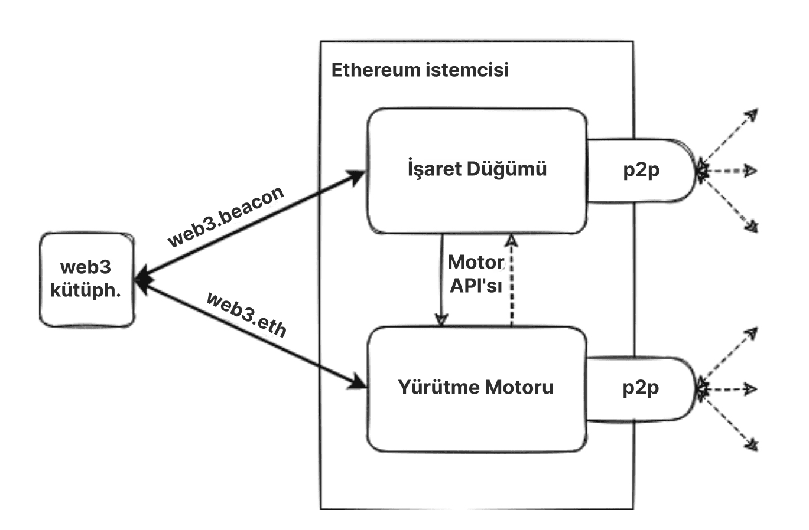
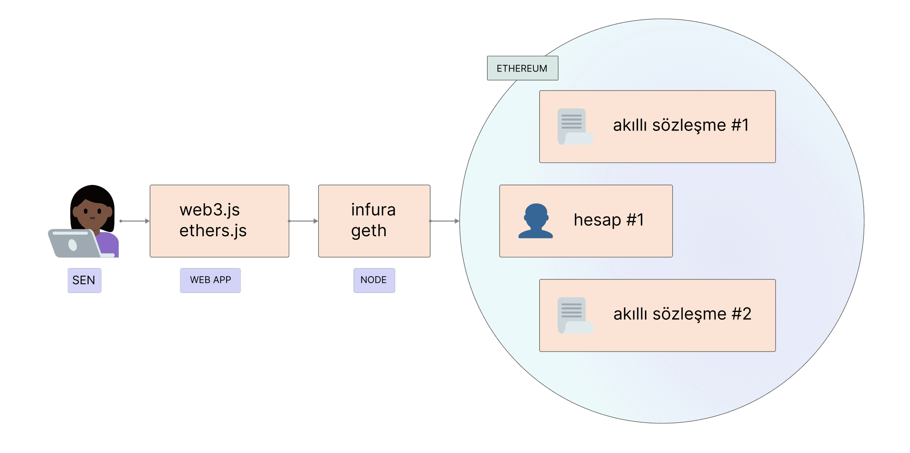

Ethereum, blokları ve işlem verilerini doğrulayabilen yazılım çalıştıran dağıtılmış bir bilgisayar ağıdır (düğümler olarak bilinir). Bilgisayarınızı bir Ethereum düğümüne dönüştürmek için bilgisayarınızda yazılım çalıştırılması gerekir. Bir düğüm oluşturmak için gerekli olan iki ayrı yazılım parçası ('istemci' olarak bilinir) vardır.

## Ön koşullar {#prerequisites}

Daha derine dalmadan ve kendi Ethereum istemci örneğinizi çalıştırmadan önce, eşler arası ağ kavramını ve [EVM'nin temellerini](/developers/docs/evm/) anlamalısınız. [Ethereum'a giriş](/developers/docs/intro-to-ethereum/) yazımıza bir göz atın.

Eğer düğümler konusunda acemiyseniz, ilk olarak [bir Ethereum düğümü çalıştırmak üzerine](/run-a-node) kullanıcı dostu öğreticimize göz atmanızı öneririz.

## Düğümler ve istemciler nedir? {#what-are-nodes-and-clients}

Düğüm, Ehereum yazılımını çalıştırmakta olan bilgisayarlara bağlı ve bu şekilde bir ağ oluşturan herhangi bir Ethereum istemci örneğine verilen addır. Bir istemci, verileri protokol kurallarına göre doğrulayan ve ağı güvende tutan bir Ethereum uygulamasıdır. Bir düğüm iki istemci çalıştırmalıdır: bir fikir birliği istemcisi ve bir yürütüm istemcisi.

- Yürütüm İstemcisi (Yürütüm Motoru, EL istemcisi ya da eski adıyla Eth1 istemcisi olarak da bilinir) ağda yayınlanan yeni işlemleri takip eder, bunları Ethereum Sanal Makinesinde çalıştırır ve son durumlarıyla tüm güncel Ethereum verilerinin veritabanını tutar.
- Fikir Birliği İstemcisi (İşaret Düğümü, CL istemcisi ya da eski adıyla Eth2 istemcisi olarak da bilinir), ağın yürütüm istemcisinden gelen doğrulanmış veriler üzerinde anlaşmaya varmasını sağlayan hisse ispatı mutabakat algoritmasını uygular. Ayrıca yazılımın, düğümün ağı güvende tutma sürecine katılmasını sağlayan, fikir birliği istemcisine eklenebilecek ve "doğrulayıcı" olarak bilinen üçüncü bir parçası daha vardır.

Bu istemciler Ethereum zincirinin başını takip ederler ve kullanıcıların Ethereum ağıyla etkileşime geçmelerini sağlarlar. Çoklu yazılım parçalarının birlikte çalışmasıyla oluşan modüler tasarıma [kapsüllenmiş karışıklık](https://vitalik.eth.limo/general/2022/02/28/complexity.html) adı verilir. Bu yaklaşım [Birleşim](/roadmap/merge)'i sorunsuz bir şekilde uygulamaya geçirmeyi kolaylaştırdı, istemci yazılımını yönetmeyi ve geliştirmeyi kolayşatırdı ve de bireysel istemcilerinin tekrar kullanılabilmesini sağladı, örnek olarak [katman 2 ekosistemi](/layer-2/) verilebilir.

 Birleştirilmiş yürütüm ve fikir birliği istemcisinin basitleştirilmiş diyagramı.

### İstemci çeşitliliği {#client-diversity}

Hem [yürütüm istemcileri](/developers/docs/nodes-and-clients/#execution-clients) hem de [fikir birliği istemcileri](/developers/docs/nodes-and-clients/#consensus-clients) farklı takımlar tarafından geliştirilen çeşitli programlama dillerinde mevcuttur.

Birden fazla istemci uygulaması, tek bir kod tabanına olan bağlılığı azaltarak ağı daha güçlü hale getirebilir. İdeal hedef, ağa herhangi bir istemci hakim olmadan çeşitlilik elde etmek ve böylece potansiyel tek hata noktasını ortadan kaldırmaktır. Dillerin çeşitliliği ayrıca daha geniş bir geliştirici topluluğunu davet eder ve tercih ettikleri dilde entegrasyonlar oluşturmalarına olanak sağlar.

[İstemci çeşitleri](/developers/docs/nodes-and-clients/client-diversity/) hakkında daha fazla bilgi edinin.

Tek bir özelliğe uymaları bu uygulamaların ortak noktalarıdır. Özellikler, Ethereum ağının ve blok zincirinin nasıl çalıştığını belirler. Her teknik detay belirlenmiştir ve özellikler şu şekilde bulunabilir:

- Başlangıçta, [Ethereum Sarı Kağıdı](https://ethereum.github.io/yellowpaper/paper.pdf)
- [Yürütme özellikleri](https://github.com/ethereum/execution-specs/)
- [Mutabakat özellikleri](https://github.com/ethereum/consensus-specs)
- Çeşitli [ağ yükseltmelerinde](/history/) uygulanan [EIP'ler](https://eips.ethereum.org/)

### Ağdaki düğümleri izlemek {#network-overview}

Çoklu iz sürücüler Ehereum ağında bulunan düğümlerle ilgili gerçek zamanlı taslaklar sunarlar. Merkeziyetsiz ağların doğası gereği, bu programların ağ ile ilgili kısıtlı bir perspektif sağlayabileceğine ve yanlış sonuçlar içeren raporlar verebileceğine de dikkat edin.

- [Düğümlerin haritası](https://etherscan.io/nodetracker), Etherscan
- [Ethernodes](https://ethernodes.org/), Bitfly
- [Nodewatch](https://www.nodewatch.io/), Chainsafe. Sürünen mutabakat düğümleri

## Düğüm türleri {#node-types}

[Kendi düğümünüzü çalıştırmak](/developers/docs/nodes-and-clients/run-a-node/) istiyorsanız, farklı şekilde veri tüketen farklı düğüm türleri olduğunu bilmeniz gerekir. İstemciler üç farklı düğüm türünü çalıştırabilir: hafif, tam ve arşiv. Daha hızlı senkronizasyon süresi sağlayan farklı senkronizasyon strateji seçenekleri de vardır. Senkronizasyon, Ethereum'un durumu hakkında en güncel bilgileri ne kadar hızlı alabileceğini ifade eder.

### Tam düğüm {#full-node}

Tam düğümler blok zincirin blok-blok doğrulamasını yaparlar, bu her blok için blok gövdesini ve durum verisini yüklemeyi ve onaylamayı kapsar. Tam düğümün farklı sınıfları vardır - bazıları başlangıç blokundan başlar ve tüm blok zincir tarihindeki her bir bloku onaylar. Diğerleri onaylamalarına geçerli olduklarına güvendikleri daha eski bir bloktan başlarlar (ör:Geth'in "snap sync"i). Onaylamanın nerede başladığı fark etmeksizin, tam düğümler sadece yakın geçmişteki ve alakalı verinin yerel bir kopasını tutarlar (bu sıklıkla son 128 blok olur), bu da eski verinin disk alanından tasarruf edebilmek için silinmesine yol açar. Daha eski veri gerektiğinde yeniden oluşturulabilir.

- Tam blok zincir verilerini depolar (ancak bu periyodik olarak budanır, bu nedenle tam bir düğüm tüm durum verilerini başlangıç zincirine geri depolamaz)
- Blok doğrulamaya katılır, tüm blokları ve durumları doğrular.
- Tüm durumlar, ya yerel depodan alınabilir ya da tam bir düğüm tarafından "anlık görüntüler" kullanılarak yeniden oluşturulabilir.
- Ağa hizmet eder ve talep üzerine veri sağlar.

### Arşiv düğümü {#archive-node}

Arşiv düğümleri Başlangıçtan itibaren her bloku onaylayan ve yüklenmiş hiçbir veriyi silmeyen tam düğümlerdir.

- Tam düğümde tutulan her şeyi depolar ve geçmiş durumların bir arşivini oluşturur. 4.000.000 numaralı bloktaki bir hesap bakiyesi gibi bir şeyi sorgulamak veya izleme kullanarak madencilik yapmadan kendi işlem kümenizi basit ve güvenilir bir şekilde test etmek istiyorsanız bu gereklidir.
- Bu veri, arşiv düğümlerini ortalama kullanıcılar için daha az çekici hale getiren ancak blok arayıcıları, cüzdan satıcıları ve zincir analizi gibi hizmetler için kullanışlı olabilen terabayt birimlerini temsil eder.

İstemcileri arşiv dışındaki herhangi bir modda senkronize etmek, budanmış blok zincir verileriyle sonuçlanacaktır. Bu, tüm geçmiş durumların bir arşivinin olmadığı ancak tam düğümün, talep üzerine bunları oluşturabileceği anlamına gelir.

[Arşiv düğümleri](/developers/docs/nodes-and-clients/archive-nodes) hakkında daha fazla bilgi edinin.

### Hafif düğüm {#light-node}

Her bloku indirmek yerine, hafif düğümler sadece blok başlıklarını indirir. Bu başlıklar blokların içeriği hakkında özet bilgiler içerir. Hafif düğümün ihtiyaç duyduğu diğer bilgiler bir tam düğümden istenir. Hafif düğümü, daha sonra blok başlıklarındaki durum köklerine karşı aldıkları verileri bağımsız olarak doğrulayabilir. Hafif düğümler, kullanıcıların tam düğümleri çalıştırmak için gereken güçlü donanım veya yüksek bant genişliği olmadan Ethereum ağına katılmalarını sağlar. Nihayetinde, hafif düğümler cep telefonlarında veya yerleşik cihazlarda çalışabilir. Hafif düğümler mutabakata katılmazlar (yani madenciler/doğrulayıcılar olamazlar), ancak Ethereum blok zincirine bir tam düğümle aynı işlevsellik ve güvenlik garantisiyle erişebilirler.

Hafif istemciler, Ethereum için aktif bir geliştirme alanıdır ve yakında fikir birliği katmanı ve yürütme katmanı için yeni hafif istemciler görmeyi bekliyoruz. Ayrıca, [dedikodu ağı](https://www.ethportal.net/) üzerinden hafif istemci verileri sağlamanın olası yolları da vardır. Bu avantajlıdır çünkü dedikodu ağı, istekleri yerine getirmek için tam düğümler gerektirmeden, bir hafif düğümler ağını destekleyebilir.

Ethereum henüz büyük bir hafif düğüm popülasyonunu desteklemiyor, ancak hafif düğüm desteği, yakın gelecekte hızla gelişmesi beklenen bir alandır. Özellikle, [Nimbus](https://nimbus.team/), [Helios](https://github.com/a16z/helios), ve [LodeStar](https://lodestar.chainsafe.io/) gibi istemciler şu anda ağırlıklı olarak hafif istemciler üzerine odaklanıyor.

## Neden bir Ethereum düğümü çalıştırmalıyım? {#why-should-i-run-an-ethereum-node}

Bir düğüm çalıştırmak, ağı daha sağlam ve merkezi olmayan bir şekilde tutarak desteklerken, Ethereum'u doğrudan, güvenmek zorunda kalmadan ve özel olarak kullanmanıza olanak tanır.

### Size faydaları {#benefits-to-you}

Kendi düğümünüzü çalıştırmak, Ethereum'u özel, kendine yeten ve güvenilir bir şekilde kullanmanıza olanak sağlar. Verileri istemcinizle kendiniz doğrulayabileceğiniz için ağa güvenmeniz gerekmez. "Güvenme, doğrula." popüler bir blok zincir deyimidir.

- Düğümünüz, tüm işlemleri ve blokları mutabakat kurallarına karşı kendi başına doğrular. Yani ağdaki diğer düğümlere bağlı olmanız veya onlara tamamen güvenmeniz gerekmez.
- Kendi düğümünüzle bir Ethereum cüzdanı kullanabilirsiniz. Merkeziyetsiz uygulamaları daha güvenli ve özel olarak kullanabileceksiniz çünkü adreslerinizi ve bakiyelerinizi mali araçlara sızdırmak zorunda kalmayacaksınız. Her şey sizin kendi istemcinizle kontrol edilebilir. [MetaMask](https://metamask.io), [Frame](https://frame.sh/) ve [birçok farklı cüzdan](/wallets/find-wallet/) size düğümünüzü kullanmalarını sağlayacak olan RPC-içe aktarmasını sunuyor.
- Ethereum verilerine bağlı diğer servisleri çalıştırabilir ve barındırabilirsiniz. Örneğin, bu bir İşaret Zinciri doğrulayıcısı, Katman 2 benzeri yazılımı, altyapı, blok arayıcıları, ödeme işlemcileri olabilir.
- Kendi özelleştirilmiş [RPC uç noktalarınızı](/developers/docs/apis/json-rpc/) sağlayabilirsiniz. Hatta, büyük merkezi sağlayıcılardan kaçınmalarına yardım etmek için bu uç noktaları herkese açık olarak sunabilirsiniz.
- **Süreçler Arası İletişimi (IPC)** kullanarak düğümünüze bağlanabilir veya programınızı bir eklenti olarak yüklemek için düğümü yeniden yazabilirsiniz. Örneğin bu, web3 kütüphaneleri kullanılarak birçok veri işlenirken veya işlemlerinizi olabildiğince hızlı bir şekilde değiştirmeniz gerektiğinde (ör. öncülük etme) bayağı yardımcı olan düşük bir gecikme süresi sunar.
- Ağı güvenli hale getirmek ve ödüller kazanmak için direkt olarak ETH hisseleyebilirsiniz. Başlamak için [solo hisselemeye](/staking/solo/) bakın.

### Ağ avantajları {#network-benefits}

Ethereum'un iyi durumu, güvenliği ve operasyonel esnekliği için çeşitli düğümler bulunması önemlidir.

- Tam düğümler mutabakat kurallarını uygular, böylece onları takip etmeyen blokları kabul etmeleri için kandırılamazlar. Bu, ağda ekstra güvenlik sağlar çünkü eğer bütün düğümler, tam doğrulama yapmayan hafif düğümler olsaydı, doğrulayıcılar ağa saldırabilirdi.
- [Hisse ispatının](/developers/docs/consensus-mechanisms/pos/#what-is-pos) kripto-ekonomik savunmalarını aşan bir saldırı durumunda, sosyal toparlanma dürüst zinciri izlemeyi seçen tam düğümler tarafından gerçekleştirilebilir.
- Ağdaki daha fazla düğüm, sansüre dayanıklı ve güvenilir bir sistem sağlayan, merkeziyetsizliğin nihai hedefi olan daha çeşitli ve dirençli bir ağ ile sonuçlanır.
- Tam düğümler, buna bağlı hafif istemciler için blok zincir verilerine erişim sağlarlar. Hafif düğümler tüm blok zinciri saklamazlar, bunun yerine verileri [blok başlıklarındaki durum kökleri](/developers/docs/blocks/#block-anatomy) aracılığıyla doğrularlar. İhtiyaç duymaları halinde tam düğümlerden daha fazla bilgi talep edebilirler.

Eğer bir tam düğüm çalıştırıyorsanız, bir doğrulayıcı çalıştırmıyor olsanız da tüm Ethereum ağı bundan faydalanır.

## Kendi düğümünüzü çalıştırma {#running-your-own-node}

Kendi Ethereum istemcinizi çalıştırmayı mı düşünüyorsunuz?

Daha acemi dostu bir giriş istiyorsanız, daha fazlasını öğrenmek için [bir düğüm çalıştır](/run-a-node) sayfamızı ziyaret edin.

Eğer daha çok teknik bir kullanıcıysanız, [kendi düğümünüzü nasıl çalıştıracağınıza](/developers/docs/nodes-and-clients/run-a-node/) dair daha fazla detay ve seçeneğe yönelin.

## Alternatifler {#alternatives}

Kendi düğümünüzü kurmak size zaman ve kaynak kaybettirebilir ama her zaman kendi örneğinizi çalıştırmanıza gerek yoktur. Böyle bir durumda, bir üçüncü taraf API sağlayıcısı kullanabilirsiniz. Bu hizmetlerin kullanımına ilişkin genel bakış için [hizmet olarak düğümler](/developers/docs/nodes-and-clients/nodes-as-a-service/) makalesine bakın.

Eğer birisi topluluğunuzda genel API bulunduran bir Ethereum düğümü çalıştırırsa, cüzdanlarınızı Özel RPC aracılığıyla topluluk düğümüne işaret edebilir ve rasgele güvenilir üçüncü bir tarafla olacağından çok daha fazla gizlilik elde edebilirsiniz.

Öte yandan, bir istemci çalıştırırsanız bu istemciyi, ihtiyacı olabilecek arkadaşlarınızla paylaşabilirsiniz.

## Yürütme istemcileri {#execution-clients}

Ethereum topluluğu, farklı programlama dilleri kullanan, farklı ekipler tarafından geliştirilen birden çok, açık kaynaklı yürütüm istemcisini (eskiden "Eth1 istemcileri" veya yalnızca "Ethereum istemcileri" olarak biliniyordu) yürütür. Bu, ağı daha güçlü ve [çeşitli](/developers/docs/nodes-and-clients/client-diversity/) hale getirir. İdeal hedef, herhangi bir istemcinin çoğunluk sağlamadığı bir çeşitlilik elde ederek tüm tek başarısızlık noktalarını azaltmaktır.

Bu tablo, farklı istemcileri özetlemektedir. Hepsi [istemci testlerini](https://github.com/ethereum/tests) başarıyla geçer ve ağ yükseltmeleriyle güncel kalmak için aktif olarak bakıma tabi tutulur.

| İstemci                                                                  | Dil        | İşletim sistemleri    | Ağlar                    | Senkronizasyon stratejileri                                   | Durum budaması  |
| ------------------------------------------------------------------------ | ---------- | --------------------- | ------------------------ | ------------------------------------------------------------- | --------------- |
| [Geth](https://geth.ethereum.org/)                                       | Go         | Linux, Windows, macOS | Ana Ağ, Sepolia, Holesky | [Snap](#snap-sync), [Full](#full-sync)                        | Archive, Pruned |
| [Nethermind](https://www.nethermind.io/)                                 | C#, .NET   | Linux, Windows, macOS | Ana Ağ, Sepolia, Holesky | [Snap](#snap-sync) (hizmet olmadan), Fast, [Full](#full-sync) | Archive, Pruned |
| [Besu](https://besu.hyperledger.org/en/stable/)                          | Java       | Linux, Windows, macOS | Ana Ağ, Sepolia, Holesky | [Snap](#snap-sync), [Fast](#fast-sync), [Full](#full-sync)    | Archive, Pruned |
| [Erigon](https://github.com/ledgerwatch/erigon)                          | Go         | Linux, Windows, macOS | Ana Ağ, Sepolia, Holesky | [Full](#full-sync)                                            | Archive, Pruned |
| [Reth](https://reth.rs/)                                                 | Rust       | Linux, Windows, macOS | Ana Ağ, Sepolia, Holesky | [Full](#full-sync)                                            | Archive, Pruned |
| [EthereumJS](https://github.com/ethereumjs/ethereumjs-monorepo) _(beta)_ | TypeScript | Linux, Windows, macOS | Sepolia, Holesky         | [Full](#full-sync)                                            | Pruned          |

Desteklenen ağlar hakkında daha fazla bilgi için [Ethereum ağları](/developers/docs/networks/) hakkında bilgi edinin.

Her istemcinin benzersiz kullanım durumları ve avantajları vardır, bu nedenle kendi tercihlerinize göre birini seçmelisiniz. Çeşitlilik, uygulamaların farklı özelliklere ve kullanıcı kitlelerine odaklanmasına olanak tanır. Özelliklere, desteğe, programlama diline veya lisanslara göre bir istemci seçmek isteyebilirsiniz.

### Besu {#besu}

Hyperledger Besu, genel ve izin verilen ağlar için kurumsal düzeyde bir Ethereum istemcisidir. Kapsamlı izleme özelliğinden GraphQL'yi takip etmeye kadar tüm Ethereum Ana Ağ özelliklerini çalıştırır ve hem açık topluluk kanallarında hem de işletmeler için ticari SLA'lar aracılığıyla ConsenSys tarafından desteklenir. Java ile yazılmıştır ve Apache 2.0 lisanslıdır.

Besu'nun kapsamlı [dokümanları](https://besu.hyperledger.org/en/stable/) size tüm özellikleri ve kurulum detayları hakkında yol gösterecektir.

### Erigon {#erigon}

Eskiden Turbo-Geth olarak bilinen Ergion, hız ve disk alanı verimliliğine yönelik bir Go Ethereum çatalı olarak başlamıştır. Erigon, diğer dillerde de uygulamaları geliştirilen ancak şu anda Go ile yazılmış olan Ethereum'un tamamen yeniden tasarlanmış bir uygulamasıdır. Erigon'un amacı, Ethereum'un daha hızlı, daha modüler ve daha optimize edilmiş bir uygulamasını sağlamaktır. 3 günden daha kısa bir sürede, yaklaşık 2 TB disk alanı kullanarak, tam arşiv düğümü senkronizasyonu gerçekleştirebilir.

### Go Ethereum {#geth}

Go Ethereum (kısaca Geth), Ethereum protokolünün orijinal uygulamalarından biridir. Şu anda, kullanıcılar ve geliştiriciler için en büyük kullanıcı tabanına ve en çeşitli araçlara sahip en yaygın istemcidir. Go ile yazılmıştır, tamamen açık kaynak kodludur ve GNU LGPL v3 altında lisanslanmıştır.

Geth hakkında kendi [dökümanları ile](https://geth.ethereum.org/docs/) daha fazlasını öğrenin.

### Nethermind {#nethermind}

Nethermind, C# .NET teknoloji yığınıyla oluşturulmuş bir Ethereum uygulamasıdır, LPGL-3.0 ile lisanslanmıştır ve ARM'yi de içeren büyük platformların hepsinde çalışmaktadır. Aşağıdakilerle harika performans sunar:

- optimize edilmiş bir sanal makine
- durum erişimi
- Prometheus/Grafana gösterge panelleri, sıralı kurumsal kayıt desteği, JSON-RPC izleme ve analiz eklentileri gibi ağ iletişimi ve zengin özellikler.

Nethermind ayrıca premium kullanıcılar için [ayrıntılı dokümanlar](https://docs.nethermind.io), güçlü geliştirici desteği, çevrimiçi bir topluluk ve 7/24 desteğe de sahiptir.

### Reth {#reth}

Reth (Rust Ethereum'un kısaltması) kullanıcı dostu, yüksek derecede modüler, hızlı ve verimli olmaya odaklanan bir Ethereum tam düğüm uygulamasıdır. Red başlangıçta Paradigm tarafından geliştirildi ve çalıştırıldı ve Apache ve MIT lisansları altında lisanslandı.

Reth, üretime hazırdır ve hisseleme veya yüksek çalışma süresi gerektiren hizmetler gibi kritik görev ortamlarında kullanıma uygundur. RPC, MEV, indeksleme, simülasyonlar ve P2P aktiviteler gibi yüksek performans ve büyük marjların gerektiği kullanım durumlarında iyi performans gösterir.

Daha fazla bilgi edinmek için [Reth Kitabına](https://reth.rs/) veya [Reth GitHub deposuna](https://github.com/paradigmxyz/reth?tab=readme-ov-file#reth) göz atın.

### Geliştirme aşamasında {#execution-in-development}

Bu istemciler hala geliştirme sürecinin erken aşamalarındadır ve henüz üretim kullanımı için önerilmemektedir.

#### EthereumJS {#ethereumjs}

EthereumJS Yürütüm İstemcisi (EthereumJS), TypeScript'te yazılmıştır ve Blok, İşlem ve Merkle-Patricia Ağacı sınıfları tarafından temsil edilen temel Ethereum ilkeleri ve Ethereum Sanal Makinesi'nin (EVM) bir uygulaması, bir blokzincir sınıfı ve DevP2P ağ yığınını içeren temel istemci bileşenleri de dahil olmak üzere bir dizi paketten oluşur.

[Dokümanları](https://github.com/ethereumjs/ethereumjs-monorepo/tree/master) okuyarak daha fazla bilgi edinin

## Mutabakat istemcileri {#consensus-clients}

[Mutabakat yükseltmelerini](/roadmap/beacon-chain/) desteklemek için birden fazla fikir birliği istemcisi (eskiden "Eth2" istemcisi olarak biliniyordu) vardır. Çatal seçimi algoritması gibi mutabakat ile ilgili tüm akışlardan, doğrulamaları işlemekten ve [hisse ispatı](/developers/docs/consensus-mechanisms/pos) ödül ve cezalarını yönetmekten sorumludurlar.

| İstemci                                                       | Dil        | İşletim sistemleri    | Ağlar                                                                     |
| ------------------------------------------------------------- | ---------- | --------------------- | ------------------------------------------------------------------------- |
| [Lighthouse](https://lighthouse.sigmaprime.io/)               | Rust       | Linux, Windows, macOS | İşaret Zinciri, Gnosis, Goerli, Pyrmont, Sepolia, Ropsten ve daha fazlası |
| [Lodestar](https://lodestar.chainsafe.io/)                    | TypeScript | Linux, Windows, macOS | İşaret Zinciri, Goerli, Sepolia, Ropsten ve daha fazlası                  |
| [Nimbus](https://nimbus.team/)                                | Nim        | Linux, Windows, macOS | İşaret Zinciri, Goerli, Sepolia, Ropsten ve daha fazlası                  |
| [Prysm](https://docs.prylabs.network/docs/getting-started/)   | Başla      | Linux, Windows, macOS | İşaret Zinciri, Gnosis, Goerli, Pyrmont, Sepolia, Ropsten ve daha fazlası |
| [Teku](https://consensys.net/knowledge-base/ethereum-2/teku/) | Java       | Linux, Windows, macOS | İşaret Zinciri, Gnosis, Goerli, Sepolia, Ropsten ve daha fazlası          |

### Lighthouse {#lighthouse}

Lighthouse, Rust ile yazılmış olan, Apache-2.0 lisansı altında bir fikir birliği istemcisi uygulamasıdır. Sigma Prime tarafından sürdürülmektedir ve İşaret Zinciri'nin başlangıcından beri stabil ve kullanıma hazırdır. Birçok kuruluş, hisseleme havuzu ve kişi tarafından güvenilmektedir. Masaüstü PC'lerden karmaşık otomatikleştirilmiş dağıtımlara kadar geniş bir ortam yelpazesinde güvenli, performanslı ve birlikte çalışabilir olmayı hedefler.

Dokümanlara [Lighthouse Book](https://lighthouse-book.sigmaprime.io/)'tan ulaşılabilir

### Lodestar {#lodestar}

Lodestar, Typescript ile yazılan, LGPL-3.0 lisansının altında kullanıma hazır bir fikir birliği istemcisidir. ChainSafe System tarafından sürdürülmektedir ve solo paydaşlar, geliştiriciler ve araştırmacılar için fikir birliği istemcilerinin en yenisidir. Lodestar, Ethereum protokollerinin JavaScript uygulamalarından güç alan bir işaret düğümü ve doğrulayıcı istemcisinden oluşur. Lodestar, hafif istemciler ile Ethereum kullanılabilirliğini geliştirmeyi, erişilebilirliği daha büyük bir geliştirici grubuna genişletmeyi ve ekosistem çeşitliliğine daha fazla katkı sağlamayı hedefler.

Daha fazla bilgiye [Lodestar web sitesinden](https://lodestar.chainsafe.io/) ulaşılabilir

### Nimbus {#nimbus}

Nimbus, Nim ile yazılmış olan, Apache-2.0 lisansı altında bir fikir birliği istemcisi uygulamasıdır. Solo paydaşlar ve hisseleme havuzları tarafından kullanılan kullanıma hazır bir istemcidir. Nimbus, kaynak verimliliği için tasarlanmıştır ve istikrardan veya ödül performansından taviz vermeden kaynak açısından sınırlı cihazlar ve kuruluş altyapılarında eşit kolaylıkla çalıştırılır. Daha hafif bir kaynak ayak izi, istemcinin ağ stres altında olduğunda daha büyük bir güvenlik toleransı olduğu anlamına gelir.

[Nimbus dokümanlarında](https://nimbus.guide/) daha fazlasını öğrenin

### Prysm {#prysm}

Prysm, Go ile yazılmış, GPL-3.0 lisansının altında tam teşekküllü açık kaynak bir fikir birliği istemcisidir. İsteğe bağlı bir web uygulaması arayüzüne sahiptir ve kullanıcı deneyimine, dokümanlara ve hem evdeki hisseleme hem de kurumsal kullanıcılar için yapılandırılabilirliğe öncelik verir.

Daha fazlasını öğrenmek için [Prysm dokümanlarını](https://docs.prylabs.network/docs/getting-started/) ziyaret edin.

### Teku {#teku}

Teku, ilk İşaret Zinciri başlangıç istemcilerinden biridir. Ana hedeflerin (güvenlik, sağlamlık, istikrar, kullanılabilirlik, performans) yanında, Teku özel olarak bazı fikir birliği istemci standartlarına uymayı da hedeflemektedir.

Teku aşırı esnek dağıtım seçenekleri sunar. İşaret düğümü ve doğrulayıcı istemcisi beraber tek bir süreç olarak çalıştırılabilir, bu da solo paydaşlar için gayet uygundur veya karmaşık hisseleme işlemleri için düğümler ayrı biçimde çalıştırılabilir. Ek olarak, Teku imza anahtarı güvenliği ve kesinti koruması için [Web3Signer](https://github.com/ConsenSys/web3signer/) ile tamamen uyumludur.

Teku Java ile yazılmıştır ve Apache 2.0 lisanslıdır. ConsenSys'te aynı zamanda Besu ve Web3Signer için sorumlu olan Protokoller ekibi tarafından geliştirilmiştir. Daha fazlasını [Teku dökümanlarından](https://docs.teku.consensys.net/en/latest/) öğrenin.

## Senkronizasyon modları {#sync-modes}

Ağdaki mevcut verileri takip etmek ve doğrulamak için Ethereum istemcisinin en son ağ durumuyla senkronize olması gerekir. Bu, eşlerden veri indirerek, bütünlüklerini kriptografik olarak doğrulayarak ve yerel bir blok zincir veri tabanı oluşturarak yapılır.

Senkronizasyon modları, çeşitli değiş tokuşlarla bu sürece farklı yaklaşımları temsil eder. İstemciler, senkronizasyon algoritmalarının uygulanmasında da farklılık gösterir. Uygulamaya ilişkin ayrıntılar için her zaman seçtiğiniz istemcinin resmi belgelerine bakın.

### Yürütüm katmanı senkronizasyon modları {#execution-layer-sync-modes}

Yürütüm katmanı, blokzincirin durumunu yeniden yürütmekten güvenilir bir kontrol noktasından yalnızca zincirin ucuyla sekronize etmeye kadar farklı kullanım durumlarına uyan farklı modlarla çalıştırılabilir.

#### Tam senkronizasyon {#full-sync}

Tam senkronizasyon, tüm blokları (başlıklar ve blok gövdeleri dahil) indirir ve her bloğu başlangıçtan yürüterek aşamalı olarak blokzincirin durumunu yeniden oluşturur.

- Her işlemi doğrulayarak güven ihtiyacını en aza indirir ve en yüksek güvenliği sunar.
- Artan sayıda işlemle, tüm işlemlerin işlenmesi günler ila haftalar alabilir.

[Arşiv düğümleri](#archive-node), her bloktaki her işlemde yapılan durum değişikliklerinin eksiksiz bir geçmişini oluşturmak (ve saklamak) amacıyla tam bir senkronizasyon gerçekleştirir.

#### Hızlı senkronizasyon {#fast-sync}

Tam senkronizasyonla aynı şekilde, hızlı senkronizasyon da tüm blokları indirir (başlıklar, işlemler ve makbuzlar dahil olacak şekilde). Bununla birlikte, geçmiş işlemleri yeniden işlemek yerine, hızlı senkronizasyon, tam bir düğüm sağlamak için blokları içe aktarmaya ve işlemeye geçtiğinde yeni bir başa ulaşana kadar makbuzlara güvenir.

- Hızlı senkronizasyon stratejisi.
- Bant genişliği kullanımını destekleyerek işlem talebini azaltır.

#### Snap senkronizasyonu {#snap-sync}

Snap senkronizasyonları aynı zamanda zinciri her seferinde bir blok olacak şekilde doğrular. Ancak bir snap senkronizasyonu, başlangıç bloğundan başlamak yerine, gerçek blokzincirin bir parçası olduğu bilinen daha yeni bir "güvenilir" kontrol noktasından başlar. Düğüm belli bir yaştan daha yaşlı olan veriyi silerken periyodik kontrol noktaları kaydeder. Bu snap görüntüleri, veriyi sonsuza kadar depolamak yerine gerektiğinde durum verisini yeniden oluşturmak için kullanılır.

- Ethereum Ana Ağında güncel olarak varsayılan olan en hızlı senkronizasyon stratejisi.
- Güvenlikten ödün vermeden çok fazla disk kullanımı ve ağ bant genişliği tasarrufu sağlar.

[Snap senkronizasyonu hakkında daha fazla bilgi](https://github.com/ethereum/devp2p/blob/master/caps/snap.md).

#### Hafif senkronizasyon {#light-sync}

Hafif istemci modu, tüm blok başlıklarını indirir, verileri bloklar ve bazılarını rastgele doğrular. Zincirin yalnızca ucunu, güvenilen kontrol noktasından senkronize eder.

- Geliştiricilere ve mutabakat mekanizmasına güvenerek, yalnızca en son durumu alır.
- İstemci, birkaç dakika içinde mevcut ağ durumuyla kullanıma hazırdır.

**NB** Hafif senkronizasyon henüz hisse ispatı Ethereum ile birlikte çalışmamaktadır - hafif sekronizasyonun yeni versiyonları yakında çıkarılacaktır!

[Hafif istemciler hakkında daha fazlası](/developers/docs/nodes-and-clients/light-clients/)

### Fikir birliği katmanı senkronizasyon modları {#consensus-layer-sync-modes}

#### Optimistik senkronizasyon {#optimistic-sync}

Optimistik senkronizasyon kayıt ile ve geriye dönük uyumlu olması için tasarlanan bir birleşim sonrası senkronizasyon stratejisidir, bu da yürütme düğümlerinin yerleşmiş yöntemlerle senkronize edilmesini sağlar. Yürütme motoru _optimistik olarak_ işaret bloklarını tamamen doğrulamadan alabilir, son başı bulabilir ve yukardaki yöntemlerle zinciri senkronize etmeye başlayabilir. Sonrasında, yürütüm istemcisi yetiştiğinde, İşaret Zinciri'ndeki işlemlerin geçerliliğiyle ilgili olarak fikir birliği istemcisini bilgilendirecektir.

[Optimistik senkronizasyon hakkında daha fazlası](https://github.com/ethereum/consensus-specs/blob/dev/sync/optimistic.md)

#### Kontrol noktası senkronizasyonu {#checkpoint-sync}

Aynı zamanda zayıf öznellik senkronizasyonu olarak da bilinen kontrol noktası senkronizasyonu, bir İşaret Zincirinin senkronize edilmesine yönelik üstün bir kullanıcı deneyimi sağlar. İşaret Zincirinin senkronizasyonunu başlangıç yerine yakın tarihli bir zayıf öznellikten başlatan [zayıf öznellik](/developers/docs/consensus-mechanisms/pos/weak-subjectivity/) varsayımlarını temel alır. Kontrol noktası senkronizasyonu, başlangıç senkronizasyon zamanını [başlangıçtan](/glossary/#genesis-block) senkronize etmeye benzer güven varsayımları ile büyük oranda hızlandırır.

Pratikte, bu düğümünüzün yakın tarihli kesinleştirilmiş durumları indirmek için uzak bir servise bağlandığı anlamına gelir ve o noktadan sonra veri doğrulamaya devam eder. Verileri sağlayan üçüncü taraf güvenilirdir ve dikkatlice seçilmelidir.

[Kontrol noktası senkronizasyonu](https://notes.ethereum.org/@djrtwo/ws-sync-in-practice) hakkında daha fazlası

## Daha fazla bilgi {#further-reading}

- [Ethereum 101 - 2. Bölüm - Düğümleri Anlamak](https://kauri.io/ethereum-101-part-2-understanding-nodes/48d5098292fd4f11b251d1b1814f0bba/a) _– Wil Barnes, 13 Şubat 2019_
- [Ethereum Tam Düğümlerini Çalıştırmak: Pek Motivasyonu Olmayanlar İçin Kılavuz](https://medium.com/@JustinMLeroux/running-ethereum-full-nodes-a-guide-for-the-barely-motivated-a8a13e7a0d31) _– Justin Leroux, 7 Kasım 2019_

## İlgili konular {#related-topics}

- [Bloklar](/developers/docs/blocks/)
- [Ağlar](/developers/docs/networks/)

## İlgili öğreticiler {#related-tutorials}

- [Raspberry Pi 4'ünüzü, sadece MicroSD kartı flaşlayarak doğrulayıcı düğüme dönüştürün - Kurulum kılavuzu](/developers/tutorials/run-node-raspberry-pi/) _- Raspberry Pi 4'ünüzü flaşlayın, bir ethernet kablosu takın, SSD diskini bağlayın ve Raspberry Pi 4'ü yürütüm katmanını (Ana ağ) ve/veya fikir birliği katmanını (İşaret zinciri/doğrulayıcı) çalıştıran tam bir Ethereum düğümüne dönüştürmek için cihazı çalıştırın._
