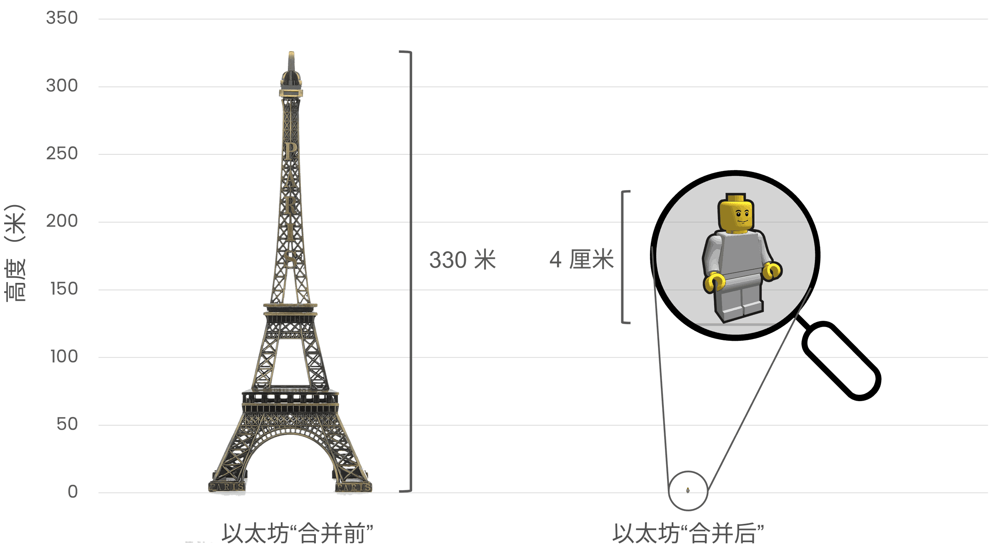

# 以太坊的能源消耗 {#proof-of-stake-energy}

以太坊是一个绿色区块链。 以太坊的[权益证明](/developers/docs/consensus-mechanisms/pos)共识机制，使用以太币而不是[能源](/developers/docs/consensus-mechanisms/pow)来保护网络安全。 整个以太坊全球网络的能源消耗约为 [0.0026 亿千瓦时/年](https://carbon-ratings.com/eth-report-2022)。

以太坊的能耗估算值来自[加密碳评级机构 (CCRI)](https://carbon-ratings.com) 的一项研究。 该机构对以太坊网络的电力消耗和碳足迹进行了自下而上的估算（[查看报告](https://carbon-ratings.com/eth-report-2022)）。 他们测量了具有各种硬件和客户端软件配置的各种不同节点的耗电量。 以太坊网络的年耗电量估算值为 **2,601 兆瓦时**（0.0026 亿千瓦时），相当于应用了区域特定碳强度因子的 **870 吨二氧化碳当量**的年碳排放量。 在节点加入和退出网络时，该值会随之变化 - 可通过使用[剑桥区块链网络可持续性指数](https://ccaf.io/cbnsi/ethereum)提供的连续 7 天的平均估算值进行跟踪（请注意他们使用的估算方式略有不同 - 详细信息请参见其网站）。

为全面了解以太坊的能源消耗，我们可以比较某些其他产品和行业的能源消耗年化估算值。 这将有助于我们更好地理解以太坊能源消耗估算值是高还是低。

<EnergyConsumptionChart />

上面的图表显示了以太坊与其他一些产品和行业的能源消耗估算值，单位为亿千瓦时/年。 所有估算值均来自 2023 年7 月获得的公开信息，其来源链接在下表列出。

|             | 年化能源消耗（亿千瓦时） | 和权益证明以太坊比较 |                                                                                      来源                                                                                       |
|:----------- |:------------:|:----------:|:-----------------------------------------------------------------------------------------------------------------------------------------------------------------------------:|
| 全球数据中心      |     190      |  73,000 倍  |                                    [来源](https://www.iea.org/commentaries/data-centres-and-energy-from-global-headlines-to-local-headaches)                                    |
| 比特币         |     149      |  53,000 倍  |                                                                 [来源](https://ccaf.io/cbnsi/cbeci/comparisons)                                                                 |
| 开采金矿        |     131      |  50,000 倍  |                                                                 [来源](https://ccaf.io/cbnsi/cbeci/comparisons)                                                                 |
| 美国游戏行业\*  |      34      |  13,000 倍  |                 [来源](https://www.researchgate.net/publication/336909520_Toward_Greener_Gaming_Estimating_National_Energy_Use_and_Energy_Efficiency_Potential)                 |
| 工作量证明以太坊    |      21      |  8,100 倍   |                                                                    [来源](https://ccaf.io/cbnsi/ethereum/1)                                                                     |
| Google      |      19      |  7,300 倍   |                                           [来源](https://www.gstatic.com/gumdrop/sustainability/google-2022-environmental-report.pdf)                                           |
| Netflix     |    0.457     |   176 倍    | [来源](https://assets.ctfassets.net/4cd45et68cgf/7B2bKCqkXDfHLadrjrNWD8/e44583e5b288bdf61e8bf3d7f8562884/2021_US_EN_Netflix_EnvironmentalSocialGovernanceReport-2021_Final.pdf) |
| PayPal      |     0.26     |   100 倍    |                                  [来源](https://s202.q4cdn.com/805890769/files/doc_downloads/global-impact/CDP_Climate_Change_PayPal-(1).pdf)                                   |
| AirBnB      |     0.02     |    8 倍     |                               [来源](https://s26.q4cdn.com/656283129/files/doc_downloads/governance_doc_updated/Airbnb-ESG-Factsheet-(Final).pdf)                               |
| **权益证明以太坊** |  **0.0026**  |  **1 倍**   |                                                               [来源](https://carbon-ratings.com/eth-report-2022)                                                                |

\*包括个人电脑、笔记本电脑和游戏机等用户终端设备。

获得准确的能源消耗估算值比较复杂，尤其是被衡量对象有着复杂的供应链或部署细节影响效率时。 例如，Netflix 和 Google 的能源消耗估算值存在差异，这取决于估算值只包括用于维护系统和向用户提供内容的能耗（_直接能耗_），还是也包括制作内容、运营公司、投放广告等方面所需的能耗（_间接能耗_）。 间接能耗还包括用于在用户终端设备（例如电视，电脑和手机）上消费内容的能耗。

以上估算值的比较并不完美。 间接能耗的数量因来源而异，并且很少包括来自用户终端设备的能耗。 每一个数据来源都有关于被衡量对象的更多详细信息。

上面的表格与图表还包括与比特币及工作量证明以太坊的比较。 需要注意的是，工作量证明以太坊网络的能源消耗不是静态的，它每天都在变化。 不同来源的能耗估算值也会有很大差异。 这个话题引起了一些微妙的[争论](https://www.coindesk.com/business/2020/05/19/the-last-word-on-bitcoins-energy-consumption/)，不仅涉及能源消耗量，还涉及能源来源和相关伦理问题。 能源消耗不一定与环境足迹精确对应，因为不同的项目可能使用不同的能源，例如更低或更高比例的可再生能源。 例如，[剑桥比特币耗电量指数](https://ccaf.io/cbnsi/cbeci/comparisons)指出，理论上讲，天然气燃除或在输配电过程中损失的电力就可以满足比特币网络的能源需求。 以太坊的可持续性路线是用一种环保替代方案取代网络中的高能耗部分。

可以在[剑桥区块链网络可持续性指数网站](https://ccaf.io/cbnsi/ethereum)上查看多个不同行业的能源消耗和一氧化碳排放估算值。

## 每笔交易的能耗估算值 {#per-transaction-estimates}

许多文章估算的是区块链上“每笔交易”的能源消耗。 然而，这种估算可能会产生误导，因为提出和验证区块所需的能源与区块中的交易数量无关。 如果以每笔交易为单位计算能源消耗，意味着交易越少能源消耗越少，反之亦然，但事实并非如此。 而且，每笔交易的能源消耗估算值高度依赖于区块链的交易吞吐量是如何定义的，并且可以通过调整这个定义来使估算值看起来更大或更小。

例如，在以太坊上，交易吞吐量不仅是基础层的交易吞吐量，还包括所有“[二层网络](/layer-2/)”卷叠的交易吞吐量总和。 二层网络的交易吞吐量总和通常未包含在计算中，但可以解释排序者使用的额外能源（少量）以及他们处理的交易数量（大量）可能会大幅降低每笔交易的能源消耗估算值。 这就是为什么跨平台比较每笔交易的能源消耗可能造成误导的原因之一。

## 以太坊的碳债务 {#carbon-debt}

以太坊目前的能源消耗非常低，但并非总是如此。 以太坊最初采用工作量证明机制，其环境成本远远高于目前的权益证明机制。

创立伊始，以太坊就计划实施权益证明共识机制，但要施这种共识机制而不牺牲安全性和去中心化，需要多年的重点研究和开发。 因此，我们使用了工作量证明机制启动以太坊网络。 工作量证明机制要求矿工使用计算硬件进行值计算，而这个过程中会消耗能源。

CCRI 估计，以太坊的年化耗电量会因合并减少 **99.988%** 以上。 同样，以太坊的碳足迹减少了大约 **99.992%**（二氧化碳当量从 11,016,000 吨减少到 870 吨）。 比较而言，排放减少量就如同从埃菲尔铁塔的高度下降到小塑料玩偶一般巨大，如上图所示。 因此，保护网络的环境成本大大降低。 同时，据信网络安全也得到改善。

## 绿色应用程序层 {#green-applications}

尽管以太坊的能源消耗非常低，但以太坊上也出现了大量不断增长且高度活跃的[**再生金融 (ReFi)**](/refi/) 社区。 再生金融应用程序使用去中心化金融组件来构建具有积极外部影响，从而使环境受益的金融应用程序。 再生金融是更广泛的[“太阳朋克”](https://en.wikipedia.org/wiki/Solarpunk)运动的一部分，这项运动与以太坊高度契合，旨在将技术进步和环境管理结合起来。 以太坊具有去中心化、无需许可和可组合的特性，这使其成为再生金融和太阳朋克社区的理想基础层。

Web3 原生公共物品融资平台，如 [Gitcoin](https://gitcoin.co) 举行气候回合，推动在以太坊应用程序层上形成环境意识。 通过制定这些计划（以及其他，例如[去中心化科学](/desci/)），以太坊正在成为一项对环境和社会有益的技术。

<InfoBanner emoji=":evergreen_tree:">
  如果你认为本页尚有可改进之处，请提出问题或拉取请求。 本页面上的统计数据是基于公开数据的估算值 - 它们不代表 ethereum.org 团队或以太坊基金会的官方声明或承诺。
</InfoBanner>

## 延伸阅读 {#further-reading}

- [剑桥区块链网络可持续性指数](https://ccaf.io/cbnsi/ethereum)
- [白宫关于工作量证明区块链的报告](https://www.whitehouse.gov/wp-content/uploads/2022/09/09-2022-Crypto-Assets-and-Climate-Report.pdf)
- [以太坊排放量：一种自下而上的估算方法](https://kylemcdonald.github.io/ethereum-emissions/) - _Kyle McDonald_
- [以太坊能源消耗指数](https://digiconomist.net/ethereum-energy-consumption/) - _Digiconomist_
- [ETHMerge.com](https://ethmerge.com/) - _[@InsideTheSim](https://twitter.com/InsideTheSim)_
- [合并 - 对以太坊网络电力消耗和碳足迹的影响](https://carbon-ratings.com/eth-report-2022) - _CCRI_。
- [以太坊的能源消耗](https://mirror.xyz/jmcook.eth/ODpCLtO4Kq7SCVFbU4He8o8kXs418ZZDTj0lpYlZkR8)

## 相关主题 {#related-topics}

- [以太坊愿景](/roadmap/vision/)
- [信标链](/roadmap/beacon-chain)
- [合并](/roadmap/merge/)
