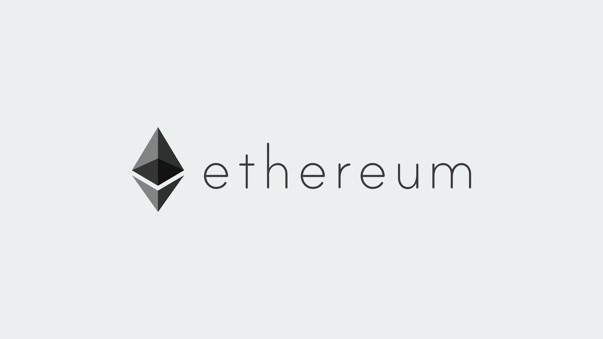
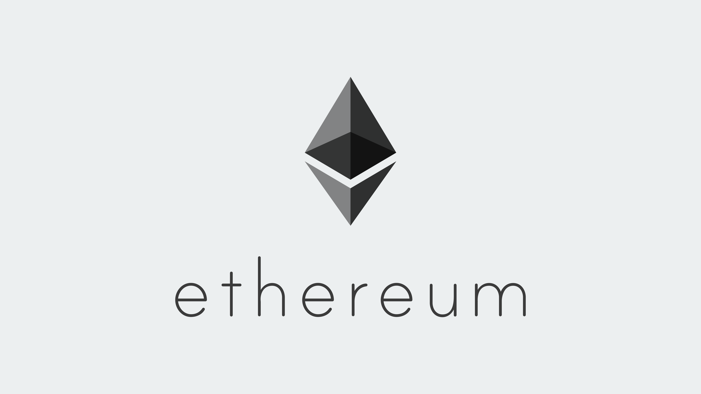
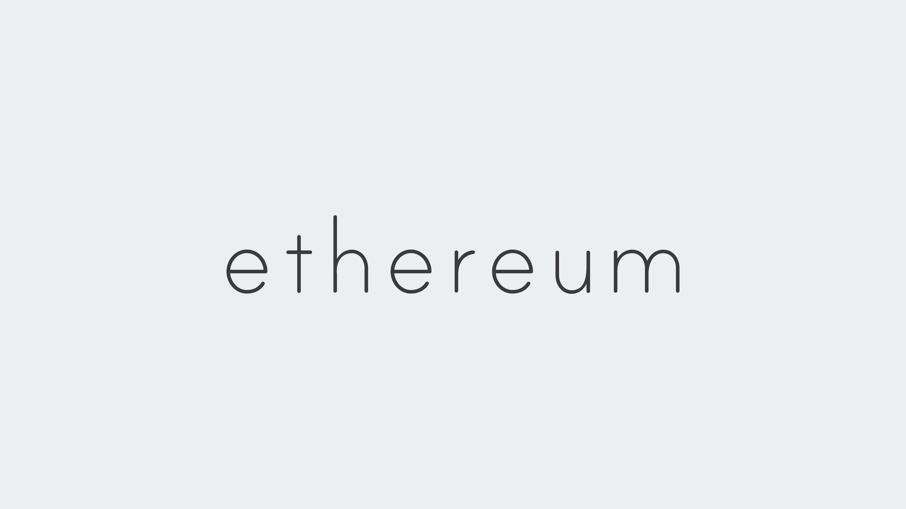

# Ethereum Brand Assets

## Previous landing page artwork

TODO

## Ethereum brand assets

TODO

### General assets

TODO

<!-- #### ETH Diamond Glyph -->
<!--  -->

<!-- #### ETH Diamond -->
<!--  -->

<!-- #### ETH Diamond -->
<!-- TODO convert to jpg / png? -->
<!--  -->

<!-- #### ETH Diamond -->
<!--  -->

<!-- #### ETH Diamond -->
<!-- TODO convert to jpg / png? -->
<!--  -->

### Black logo on gray background

#### Ethereum icon Black

<!-- TODO turn this into a component -->
<!-- accepts filename as prop, searches files for png/svg/jpg verions -->
<!-- displays the first as link image, references the remaining w/ text links -->

 
<a href="/assets/logo-black-gray/ethereum-icon-black.png" target="_blank">
  PNG
</a>
<a href="/assets/logo-black-gray/ethereum-icon-black.svg" target="_blank">
  SVG
</a>
<a href="/assets/logo-black-gray/ethereum-icon-black.jpg" target="_blank">
  JPG
</a>

#### Ethereum logo landscape black

 
<a href="/assets/logo-black-gray/ethereum-logo-landscape-black.png" target="_blank">
  PNG
</a>
<a href="/assets/logo-black-gray/ethereum-logo-landscape-black.svg" target="_blank">
  SVG
</a>
<a href="/assets/logo-black-gray/ethereum-logo-landscape-black.jpg" target="_blank">
  JPG
</a>

#### Ethereum logo portrait black

 
<a href="/assets/logo-black-gray/ethereum-logo-portrait-black.png" target="_blank">
  PNG
</a>
<a href="/assets/logo-black-gray/ethereum-logo-portrait-black.svg" target="_blank">
  SVG
</a>
<a href="/assets/logo-black-gray/ethereum-logo-portrait-black.jpg" target="_blank">
  JPG
</a>

#### Ethereum wordmark black

 
<a href="/assets/logo-black-gray/ethereum-wordmark-black.png" target="_blank">
  PNG
</a>
<a href="/assets/logo-black-gray/ethereum-wordmark-black.svg" target="_blank">
  SVG
</a>
<a href="/assets/logo-black-gray/ethereum-wordmark-black.jpg" target="_blank">
  JPG
</a>

### Black logo on white background

### Purple logo on dark purple background

### Purple logo on white background
