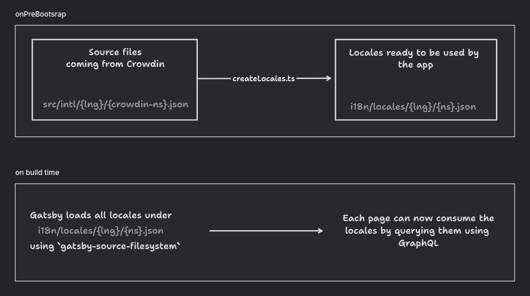

# Locales generation process

Every time `pnpm build` or `pnpm start` is executed, the following process is
going to be triggered as well:

With this process, we reduce the amount of text we bundle on each page since we
are querying only the necessary translations that each page needs.
