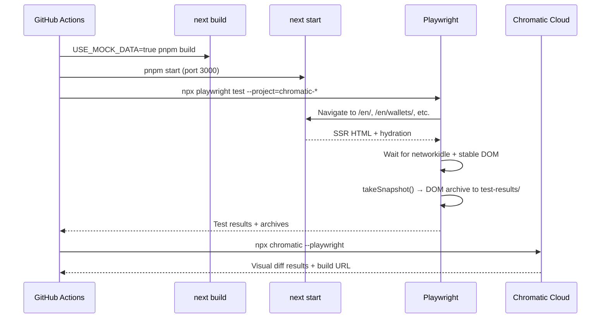

# Full-Page Visual Regression Testing with Playwright + Chromatic

## Overview

Add full-page visual regression testing using Playwright to navigate real Next.js pages and Chromatic to capture, store, and diff DOM snapshots. Pages render against a production build with `USE_MOCK_DATA=true` for deterministic content. This replaces the Storybook-based approach (branch `feat/dual-storybook-page-visual-tests`) which required extensive mocking of server-only APIs.

## Problem Frame

During the Tailwind v4 migration, component-level Chromatic snapshots miss regressions that only surface in full-page context — layout spacing, responsive grids, section composition, cross-component interactions. The previous Storybook approach required mocking `next-intl/server`, `next/navigation`, `@/lib/data`, and `@/lib/utils/contributors` at the webpack level, and still fought `experimentalRSC` render pass issues.

Playwright tests against a real Next.js build avoid all of this — pages render with real SSR, real component tree, real Tailwind output. The only controlled variable is the data layer, which already has a `USE_MOCK_DATA=true` toggle with 27 mock JSON files.

## Requirements Trace

- R1. Capture Chromatic visual snapshots of ~10 representative pages covering all layout patterns
- R2. Pages render deterministic content via `USE_MOCK_DATA=true` — no flaky API-dependent diffs
- R3. Test 3 viewport breakpoints per page: mobile (375px), tablet (768px), desktop (1280px)
- R4. Chromatic diffs show visual regressions on PRs via a separate Chromatic project
- R5. CI runs the Playwright visual tests and uploads to Chromatic in parallel with existing workflows
- R6. Existing e2e tests and Storybook Chromatic workflow are unaffected

## Scope Boundaries

- Not modifying existing e2e tests or Storybook setup
- Not testing every page — one representative per layout pattern
- Not testing multiple locales in this iteration (English only)
- Not adding interaction-based snapshots (hover states, modals) — just page-load snapshots

### Deferred to Separate Tasks

- Multi-locale visual testing (ar, zh): future iteration after English baseline is stable
- Interaction snapshots (modal open, tab switch): separate PR
- Integrating with the existing Storybook Chromatic project: these are intentionally separate projects

## Context & Research

### Relevant Code and Patterns

| File/Pattern | Relevance |
|---|---|
| `playwright.config.ts` | Existing config with 4 e2e + 1 unit project. No `webServer` configured — tests assume external server. `outputDir: "./tests/__results__"` |
| `tests/e2e/` | Existing e2e tests using page object pattern (BasePage → HomePage etc.) |
| `tests/e2e/fixtures/testData.ts` | Centralized test URLs and data |
| `src/data-layer/storage.ts` | `USE_MOCK_DATA` toggle — reads from `src/data-layer/mocks/*.json` instead of Netlify Blobs |
| `src/data-layer/mocks/` | 27 JSON mock files (ETH price, apps, events, RSS, beaconchain, etc.) |
| `.github/workflows/chromatic.yml` | Existing Storybook Chromatic CI (keep separate) |
| `package.json` | `chromatic@16.0.0`, `@playwright/test@^1.52.0` installed. `@chromatic-com/playwright` NOT installed |

### How Chromatic Playwright Works

Chromatic Playwright captures **DOM archives** (not screenshots) during test execution via the `@chromatic-com/playwright` fixture. Archives are uploaded to Chromatic which re-renders them in its own browser fleet for pixel-diffing. The flow is:

1. Build and start Next.js (`next build && next start` with `USE_MOCK_DATA=true`)
2. Run Playwright tests — Chromatic fixture captures DOM archives to `test-results/`
3. Upload archives to Chromatic (`npx chromatic --playwright`)

### Key Constraints

- **Chrome-only** for archive capture — Chromatic re-renders in its own multi-browser fleet
- **No TurboSnap** — unlike Storybook, every Playwright test runs on every build
- **`assetDomains`** required for `s3-dcl1.ethquokkaops.io` (app screenshots/media)
- **Separate Chromatic project** — can't mix Storybook and Playwright builds

## Key Technical Decisions

- **`USE_MOCK_DATA=true` at build time over runtime API mocking**: The data layer already switches between Netlify Blobs and local JSON files based on this env var. Building Next.js with it set bakes deterministic data into the SSG/ISR output. No need for MSW, `page.route()`, or webpack aliases. The 27 existing mock files are the fixtures.

- **Production build (`next build && next start`) over dev server**: Production builds are deterministic (SSG/SSR at build time), faster to serve, and match what users actually see. Dev mode has HMR artifacts, slower rendering, and potential hydration differences.

- **Separate Playwright project in existing config over new config file**: Add `chromatic-*` projects to `playwright.config.ts` alongside existing e2e projects. The `--project` flag isolates them. Avoids config duplication.

- **3 viewport projects (mobile/tablet/desktop) over per-test viewport overrides**: Playwright projects with different viewport sizes run all tests at each size automatically. Cleaner than `test.use()` overrides in every file. 10 pages × 3 viewports = 30 snapshots per build.

- **`disableAutoSnapshot: true` with explicit `takeSnapshot` calls**: Gives control over when exactly the snapshot is taken — after `networkidle`, after specific elements are visible. Prevents premature captures during hydration.

- **Separate CI workflow file over extending existing chromatic.yml**: The Playwright visual test workflow has different steps (build Next.js, start server, run Playwright, upload archives). Keeping it in its own file avoids complicating the Storybook workflow.

## Open Questions

### Resolved During Planning

- **Will `USE_MOCK_DATA=true` cover all data the pages need?** Yes — 27 mock files cover all data-layer getters. The mock layer operates at the storage level (Netlify Blobs → JSON files), so all `src/lib/data/` functions resolve to mock data transparently. No code changes needed.

- **Does Chromatic Playwright conflict with the existing `@chromatic-com/storybook`?** No — `@chromatic-com/playwright` is a separate package. They coexist. Different Chromatic projects, different project tokens.

- **Can we reuse the existing `outputDir: "./tests/__results__"`?** No — set the Chromatic projects to use the default `./test-results` so the Chromatic CLI finds them without extra config. Existing e2e tests keep their `./tests/__results__` path.

- **Does `getGFIs()` (called by `[...slug]` page) need a separate mock?** No — `getGFIs()` is imported from `@/data-layer` which uses `get(KEYS.GFIS)` from the storage layer. `USE_MOCK_DATA=true` reads from `src/data-layer/mocks/fetch-gfis.json`, which exists. The `[...slug]` docs pages are covered by the same mock mechanism as all other data.

### Deferred to Implementation

- **Whether some pages need longer `delay` or `resourceArchiveTimeout`**: Pages with lazy-loaded images or client-side data may need tuning. Start with defaults and adjust if snapshots are flaky.

## Output Structure

```
tests/
  visual/                        # New directory for Chromatic visual tests
    pages.spec.ts                # All page-load visual tests in one file
.github/
  workflows/
    chromatic-pages.yml          # New CI workflow for Playwright + Chromatic
```

## High-Level Technical Design

> *This illustrates the intended approach and is directional guidance for review, not implementation specification.*



## Implementation Units

- [ ] **Unit 1: Install `@chromatic-com/playwright` and configure projects**

  **Goal:** Add the Chromatic Playwright package, create 3 viewport-specific projects in the Playwright config, and add convenience scripts.

  **Requirements:** R3, R5, R6

  **Dependencies:** None

  **Files:**
  - Modify: `package.json` (add `@chromatic-com/playwright` to devDependencies + add scripts)
  - Modify: `playwright.config.ts` (add 3 chromatic projects + webServer)

  **Approach:**
  - Install `@chromatic-com/playwright` as a dev dependency
  - Add 3 new projects to `playwright.config.ts`: `chromatic-desktop` (1280×720), `chromatic-tablet` (768×1024), `chromatic-mobile` (375×812)
  - All 3 use Chrome, share `testDir: "./tests/visual"`, and set `disableAutoSnapshot: true`
  - Set `assetDomains: ["s3-dcl1.ethquokkaops.io"]` for external images
  - Each project gets the default `test-results` outputDir (not `./tests/__results__`)
  - Configure `webServer` to auto-start a production build on port 3000 with `USE_MOCK_DATA=true`. Use `reuseExistingServer: true` so it picks up an already-running server. **Caveat:** for deterministic local results, the running server must have been built with `USE_MOCK_DATA=true`. If a regular dev server is running on port 3000, the visual tests will silently use live data. In CI (Unit 3), the workflow builds with the flag explicitly.
  - Existing e2e and unit projects are untouched
  - Add package.json scripts:
    - `test:visual` — runs all 3 chromatic projects
    - `test:visual:desktop` — runs desktop only (fast iteration)
    - `chromatic:pages` — uploads archives to Chromatic

  **Patterns to follow:**
  - Existing project definitions in `playwright.config.ts`
  - Existing `test:e2e`, `test:unit` script naming in `package.json`

  **Test scenarios:**
  - Happy path: `npx playwright test --project=chromatic-desktop --list` shows the visual test files (once Unit 2 creates them)
  - Edge case: existing `pnpm test:e2e` still runs only the 4 original e2e projects (no chromatic tests leak in)

  **Verification:**
  - `pnpm test:e2e` passes unchanged
  - `npx playwright test --project=chromatic-desktop --list` discovers tests from `tests/visual/`

- [ ] **Unit 2: Create visual test file for ~10 pages**

  **Goal:** Write a single Playwright test file that navigates to each representative page and takes a Chromatic snapshot.

  **Requirements:** R1, R2

  **Dependencies:** Unit 1

  **Files:**
  - Create: `tests/visual/pages.spec.ts`

  **Approach:**
  - Import `test` and `takeSnapshot` from `@chromatic-com/playwright`
  - One `test()` per page, each navigating to the English URL, waiting for `networkidle`, then calling `takeSnapshot()`
  - Pages to cover (~10, one per layout pattern):
    - `/en/` — homepage (hub/sections)
    - `/en/wallets/` — hero + content
    - `/en/staking/` — delegated interactive
    - `/en/developers/` — hub variant with code examples
    - `/en/apps/` — listing/grid
    - `/en/community/events/` — events hub with tabs
    - `/en/run-a-node/` — content page variant
    - `/en/developers/docs/smart-contracts/` — docs layout (sidebar + TOC)
    - `/en/history/` — static layout (breadcrumbs + TOC)
    - `/en/wallets/find-wallet/` — product table
  - The docs and history pages use the `[...slug]` catch-all route which imports `getGFIs()` directly from `@/data-layer`. This is covered by `USE_MOCK_DATA=true` (reads from `src/data-layer/mocks/fetch-gfis.json`), so no additional mocking is needed.
  - Each test waits for a page-specific stable element (e.g., `h1`, main content area) before snapshotting to avoid hydration flicker
  - Use `test.describe("Page Visual Tests", ...)` to group all tests

  **Patterns to follow:**
  - `tests/e2e/home.spec.ts` for navigation and waiting patterns
  - `tests/e2e/fixtures/testData.ts` for URL constants

  **Test scenarios:**
  - Happy path: each test navigates to the page, waits for stable DOM, and `takeSnapshot()` produces an archive in `test-results/`
  - Edge case: pages with lazy-loaded content (homepage swipers, staking comparisons) — wait for a visible stable element, not just `networkidle`
  - Error path: if a page throws (e.g., missing mock data), the test fails with a clear error — not a blank snapshot

  **Verification:**
  - `USE_MOCK_DATA=true pnpm build && pnpm start` then `npx playwright test --project=chromatic-desktop` runs all 10 tests and produces 10 archives in `test-results/`

- [ ] **Unit 3: Create CI workflow**

  **Goal:** Add a GitHub Actions workflow that builds Next.js with mock data, runs Playwright visual tests, and uploads to Chromatic.

  **Requirements:** R4, R5, R6

  **Dependencies:** Unit 2. Also requires the Chromatic project token (`CHROMATIC_PAGES_TOKEN`) to be created in the dashboard and stored as a GitHub Actions secret (see Manual Setup Required).

  **Files:**
  - Create: `.github/workflows/chromatic-pages.yml`

  **Approach:**
  - Two-job workflow to enable partial archive upload when some tests fail:
    - **Job 1: `playwright-visual`** — checkout, install, `USE_MOCK_DATA=true pnpm build`, start server, run visual tests, upload `test-results/` as artifact (with `if: always()` so archives upload even on test failure)
    - **Job 2: `chromatic-upload`** — download artifact, run `npx chromatic --playwright` with project token. Uses `if: always()` so Chromatic still receives partial results when some pages fail.
  - Use `mcr.microsoft.com/playwright` container image for consistent browser versions
  - Trigger on PRs to `dev`, `master`, `staging`
  - Separate from existing `chromatic.yml` (Storybook) — both workflows trigger independently on the same events and run in parallel
  - `exitZeroOnChanges: true` so visual changes don't block PRs

  **Patterns to follow:**
  - Existing `.github/workflows/chromatic.yml` for trigger config and pnpm/node setup

  **Test scenarios:**
  - Happy path: workflow runs both jobs, Chromatic build link appears in PR checks
  - Edge case: `test-results/` artifact is correctly passed between jobs
  - Error path: one page test fails → Job 1 uploads partial archives → Job 2 still runs Chromatic with available snapshots

  **Verification:**
  - Workflow YAML is valid
  - The two jobs are correctly sequenced (job 2 depends on job 1 via `needs:`)
  - Both jobs use `if: always()` for partial-failure resilience
  - Existing Storybook chromatic workflow is unchanged

## System-Wide Impact

- **Interaction graph:** Adds a new CI workflow and Playwright projects. Does not modify any application code, components, or the data layer. The `USE_MOCK_DATA` env var is already used by `test:unit`.
- **Error propagation:** Visual test failures don't block PRs (`exitZeroOnChanges: true`). Build failures in the Next.js step would fail the workflow — same as any CI build.
- **Unchanged invariants:** Existing e2e tests, Storybook, component Chromatic project, and the production build are completely unaffected. The mock data files in `src/data-layer/mocks/` are read-only in this context.

## Alternative Approaches Considered

**Storybook page stories with webpack mocking (implemented, then replaced):** Built on branch `feat/dual-storybook-page-visual-tests`. Required mocking `next-intl/server`, `next/navigation`, `@/lib/data`, and `@/lib/utils/contributors` at the webpack level. Worked but fought `experimentalRSC` render pass issues and required either composition components (divergence risk) or complex webpack aliases. Playwright against a real build avoids all of this.

**Playwright `page.route()` for API mocking:** Mock individual fetch calls in each test. More flexible but requires maintaining route handlers per page. The `USE_MOCK_DATA` env var is simpler — one flag controls all data at the storage layer.

**`toHaveScreenshot()` (Playwright's built-in visual comparison):** Standard Playwright visual regression with local baseline images. Works but requires committing baseline PNGs to the repo, manual updates on intentional changes, and doesn't provide the Chromatic review UI (side-by-side diff, accept/reject workflow, team collaboration).

## Risks & Dependencies

| Risk | Mitigation |
|------|------------|
| Mock data files become stale as APIs evolve | Mock files are already maintained for `test:unit`. If a new data field is added, unit tests catch it first. |
| DOM archive captures differ between local and CI | Use the official Playwright container image in CI. Run `next build && next start` (not dev mode) in both environments. |
| Some pages lazy-load content after `networkidle` | Use explicit `waitForSelector` on a stable element before `takeSnapshot()`. Tune `delay` and `resourceArchiveTimeout` per page if needed. |
| No TurboSnap — all 30 snapshots run on every PR | 30 snapshots is modest for Chromatic. If it becomes expensive, use `test.skip` to disable specific pages during non-visual PRs. |
| `@chromatic-com/playwright` bundles Storybook 8.x internally | This is used only for the archive packaging step and doesn't conflict with the project's Storybook 10.x. They operate in separate contexts. |
| Chromatic project requires manual dashboard setup | User is already creating the project. Store token as `CHROMATIC_PAGES_TOKEN` GitHub secret. |

## Manual Setup Required

1. Create a Playwright-type Chromatic project in the dashboard (named "ethereum-org-website-pages")
2. Store the project token as `CHROMATIC_PAGES_TOKEN` GitHub Actions secret
3. Run the first baseline build locally: `USE_MOCK_DATA=true pnpm build && pnpm start &` then `pnpm test:visual && pnpm chromatic:pages`

## Sources & References

- Chromatic Playwright docs: https://www.chromatic.com/docs/playwright/
- Chromatic Playwright setup: https://www.chromatic.com/docs/playwright/setup/
- Chromatic Playwright configuration: https://www.chromatic.com/docs/playwright/configure/
- Chromatic Playwright targeted snapshots: https://www.chromatic.com/docs/playwright/targeted-snapshots/
- Previous Storybook approach: branch `feat/dual-storybook-page-visual-tests`
- Existing mock data: `src/data-layer/mocks/` (27 JSON files)
