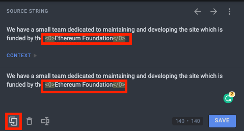
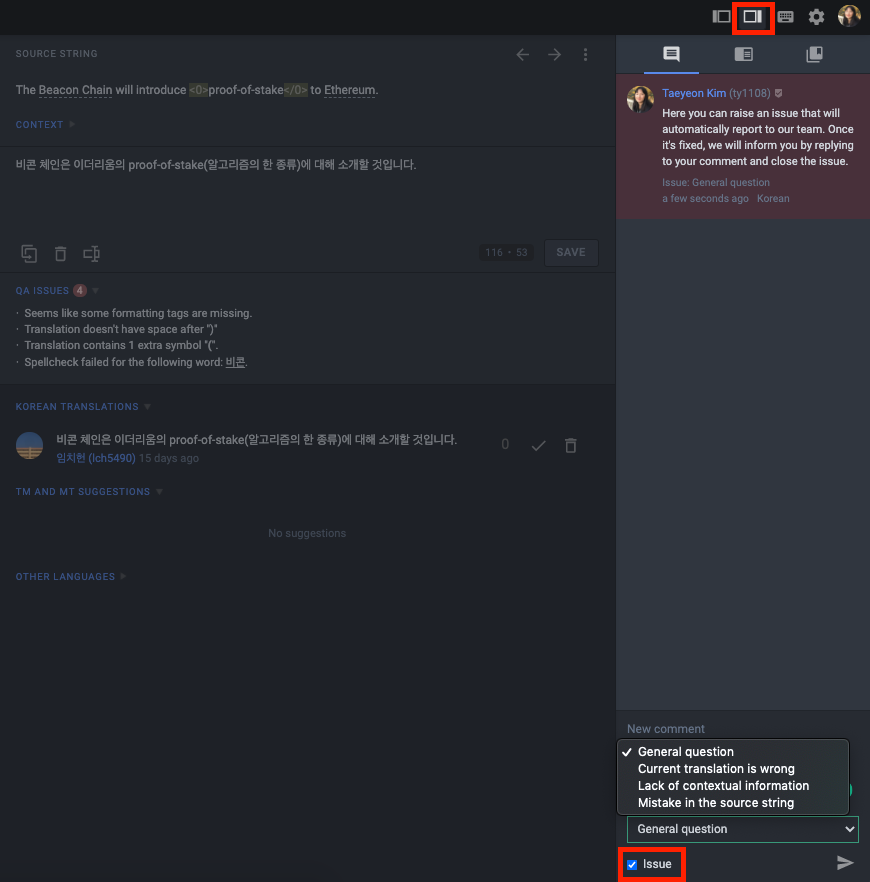
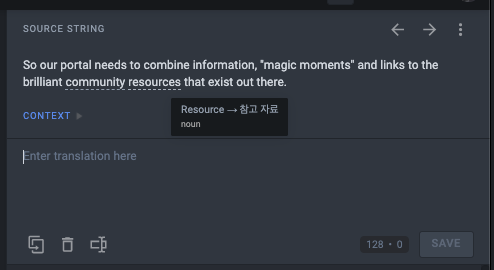
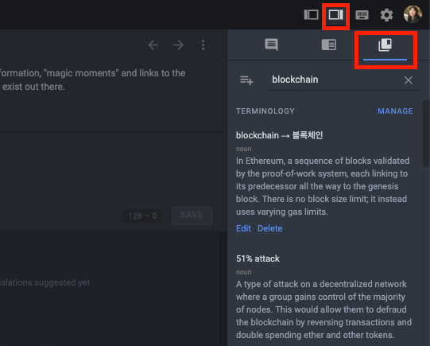

# Translating ethereum.org guide {#translating-ethereum-guide}

If you're new to the Translation Program and are hesitant to jump in, here are some FAQs that can help you begin. Use this guide to find answers to the most common queries.

## Can I get compensated for translating ethereum.org? {#compensation}

Ethereum.org is an open-source website, which means that anyone can get involved and contribute.

The ethereum.org Translation Program is an extension of that and is organized with a similar philosophy in mind.

The goal of the Translation Program is to make Ethereum content accessible to everyone, regardless of the languages they speak. It also allows any bilingual person to get involved with the Ethereum ecosystem and contribute in an accessible way.

For this reason, the Translation Program is open and voluntary, and participation is not subject to compensation. If we were to compensate translators for the number of words they translate, we could only invite those with sufficient translation experience (professional translators) to join the Translation Program. This would make the Translation Program exclusionary and prevent us from reaching the outlined goals, specifically: allowing everyone to participate and get involved with the ecosystem.

We make every effort to enable our contributors to succeed in the Ethereum ecosystem; many non-monteary incentives are in place such as: [offering POAPs](/contributing/translation-program/acknowledgements/#poap) and a [translator certificate](/contributing/translation-program/acknowledgements/#certificate), as well as organizing the [Translation Leaderboards](/contributing/translation-program/acknowledgements/) and [listing all of our translators on the site](/contributing/translation-program/contributors/).

## How do I translate strings with `<HTML tags>`? {#tags}

Not every string is written in pure text form. There are some strings that consist of mixed scripts like HTML tags (`<0>`, `</0>`).This is usually for hyperlinks or alternative styling in the middle of a sentence.

- Translate the text inside the tags but not the tags themselves. Anything in the `<` and `>` must not be translated or removed.
- To keep the string safe, we recommend that you click the "Copy Source" button on the bottom left. This will copy the original string and paste it into the text box. This lets you clarify where the tags are and helps you avoid mistakes.

You can move the position of the tags within the string to make it more natural in your language – just be sure to move the whole tag.

For more in-depth information on dealing with tags and code snippets, please refer to the [ethereum.org Translation Style Guide](/contributing/translation-program/translators-guide/#dealing-with-tags).

## Where do the strings live? {#strings}

Often the source strings alone might not be enough for you to provide an accurate translation.

- Take a look at "screenshots" and "context" for more information. In the source string section, you will see the screenshot image attached which will show you how we're using the string in context.
- If you are still unsure, raise a flag in the "comment section". [Not sure how to leave a comment?](#comment)

## How can I leave comments or ask questions? I would like to flag an issue or typos... {#comment}

If you want to raise a flag on a particular string that needs attention, feel free to submit a comment.

- Click the second button of the top-right bar. The hidden tab will appear on your right. Leave a new comment and click the "Issue" checkbox on the bottom. You can specify the type of issue by choosing one of the options from the drop-down menu.
- Once submitted, it will be reported to our team. We will fix the issue and let you know by replying to your comment and closing the issue.
- If you report an incorrect translation, the translation and your suggested alternative will be reviewed by a native speaker during the next review.

## What is Translation Memory (TM)? {#translation-memory}

Translation Memory (TM) is a feature of Crowdin that stores all the previously translated strings across [ethereum.org](http://ethereum.org/). When a string is translated, it is automatically saved into our project TM. This could be a useful tool to help you save your time!

- Look at the "TM and MT Suggestions" section and you will see how other translators translated the same or similar string. If you find a suggestion with a high matching rate, feel free to refer to the translation by clicking it.
- If there is nothing on the list, you can search the TM for previously made translations and reuse them for consistency.

## How do I use the Crowdin glossary? {#glossary}

Ethereum terminology is another crucial part of our translation work as often new tech terms will not be localized in many languages yet. Also, there are terms that have different meanings in different contexts. [More on translating Ethereum terminology](#terminology)

The Crowdin glossary is the best place for clarification of terms and definitions. There are two ways to refer to the glossary.

- First, when you find an underlined term on the source string, you can mouse over and see a brief definition of it.

- Second, If you see a term that is not familiar to you but not underlined, you can search in the glossary tab (the third button of the right column). You will find explanations of specific terms and ones frequently used in the project.

- If you still can't find it, it's your chance to add a new term! We encourage you to look it up on a search engine and add the description to the glossary. It will be of great help to other translators to better understand the term.

### Terminology translation policy {#terminology}

_For names (brands, companies, people) and new tech terms (Beacon Chain, shard chains, etc.)_

Ethereum presents a lot of new terms that have been coined recently. Some terms will vary from translator to translator as there is no official translation in their respective language. Such inconsistencies can cause misunderstanding and decrease readability.

Due to the linguistic diversity and different standardizations in each language, it has been nearly impossible to come up with a unified terminology translation policy that can be adapted in all supported languages.

After careful consideration, we have reached the decision to leave the most frequently used terminology up to you, the translators.

Here is what we suggest, when you find a term that's unfamiliar to you:

- Refer to the [Glossary of terms](#glossary), you may find how other translators have previously translated it. If you think the previously translated term is not appropriate, feel free to restore your translation by adding a new term to Crowdin Glossary.
- If such a previous translation doesn't exist in the Glossary, we encourage you to look it up on a search engine or media article that shows how the term is actually used in your community.
- If you don't find any references at all, feel free to trust your intuition and suggest a new translation to your language!
- If you feel less confident to do so, leave the term untranslated. Sometimes, English terms are more than adequate in delivering accurate definitions.

We recommend you leave names of brands, companies, and personnel untranslated as a translation might cause unnecessary confusion and SEO difficulties.

## How does the review process work? {#review-process}

To ensure a certain level of quality and consistency in our translations, we work with [Acolad](https://www.acolad.com/), one of the largest language service providers globally. Acolad has 20,000 professional linguists, which means that they can provide professional reviewers for every language and type of content we need.

The review process is straightforward; once a certain [content bucket](/contributing/translation-program/content-buckets) is 100% translated, we order a review for that content bucket. The review process takes place directly in Crowdin. Once the review is complete, we update the website with the translated content.

## How do I add content in my language? {#adding-foreign-language-content}

Currently, all non-English content is translated directly from the English source content, and any content that does not exist in English cannot be added to other languages.

To suggest new content for ethereum.org, you can [create an issue](https://github.com/ethereum/ethereum-org-website/issues) on GitHub. If added, the content will be written in English and translated to other languages using Crowdin.

We plan to add support for non-English content additions in the near future.

## Get in touch {#contact}

Thank you for reading through all of these. We hope this helps you to onboard our program. Feel free to join our [Discord translation channel](https://discord.gg/XVepFu7sqR) to ask questions and collaborate with other translators, or reach out to us at translations@ethereum.org!
