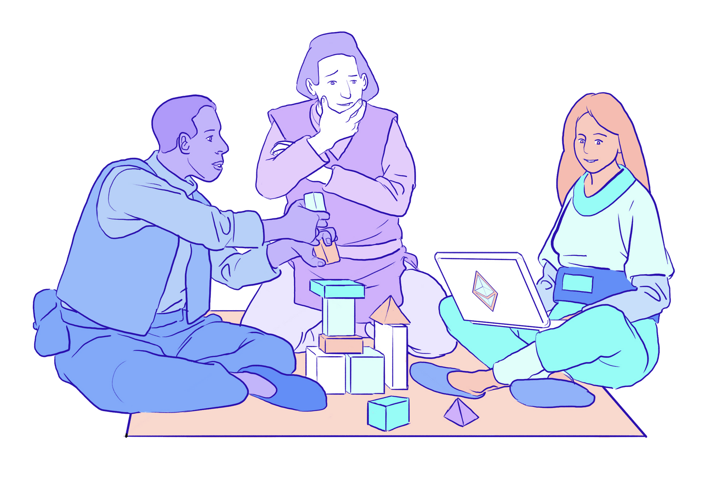

# Translation Program {#translation-program}

The Translation Program is a collaborative effort to translate ethereum.org into different languages in order to make the website more accessible to billions of non-English speakers around the world.

## Help us translate {#help-us-translate}

The ethereum.org Translation Program is open and anyone can contribute!

1. You will need to log in to your Crowdin account or sign up.
2. Select the language you want to contribute to.
3. Before starting, please check out the [How to translate](/contributing/translation-program/how-to-translate/) guide to learn how to use Crowdin, and the [Translation Style Guide](/contributing/translation-program/translators-guide/) for tips and best practices.
4. Machine translations will not be approved.
5. All translations are reviewed before being added to the site, so there will be a short delay before your translations go live.

_Join the [ethereum.org Discord](/discord/) to collaborate on translations, ask questions, share feedback and ideas, or join a translation group._

<ButtonLink to="https://crowdin.com/project/ethereum-org/">
  Start translating
</ButtonLink>

## About the Translation Program {#about-us}

The Ethereum community aims to be global and inclusive, yet much of its content only caters to English speakers, leaving out the world's 6 billion non-English speakers. For ethereum.org to act as the portal into Ethereum for the worldwide community, we believe providing non-English speakers with Ethereum content in their native languages is essential.

The ethereum.org Translation Program aims to make Ethereum accessible to everyone by translating ethereum.org and other Ethereum content into as many languages as possible.

Read more about the ethereum.org Translation Program [mission and vision](/contributing/translation-program/mission-and-vision).

### Our progress so far {#our-progress}

- [**5,600 +** translators](/contributing/translation-program/contributors/)
- **62** languages live on site
- [**3 million** words translated in 2023](/contributing/translation-program/acknowledgements/)

<TranslationChartImage />

### Acknowledgements {#acknowledgements}

Ethereum.org is translated by thousands of community members and they are the key part of the Translation Program.
We want to acknowledge our translators and support them on their career paths. Here are some of our translator acknowledgements:

#### Certificate {#certificate}

If you have contributed to the Translation Program and at least 5,000 of your translated words have been approved, you are eligible for an ethereum.org translator certificate. [More on certificates](/contributing/translation-program/acknowledgements/#certificate)

#### POAPs {#poaps}

All of our translators are eligible for a POAP (Proof of Attendance Protocol) - an NFT that proves their contribution to the ethereum.org Translation Program. [More on POAPs](/contributing/translation-program/acknowledgements/#poap)

#### Translator acknowledgements {#translator-acknowledgements}

Public acknowledgements of our top translators using [leaderboards](/contributing/translation-program/acknowledgements/) and a [list of all contributors to the Translation Program](/contributing/translation-program/contributors/).

#### Rewards {#rewards}

In the past, we have retroactively rewarded our most active contributors with tickets to Ethereum conferences like [Devcon](https://devcon.org/en/) and [Devconnect](https://devconnect.org/), as well as exclusive ethereum.org merch.

We're constantly thinking of new and innovative ways to reward our contributors, so stay tuned!

### Guides and resources {#guides-and-resources}

If you are contributing to the Translation Program or thinking about getting involved, you should check out the translation guides below:

- [Translation Style Guide](/contributing/translation-program/translators-guide/) _– instructions and tips for ethereum.org translators_
- [Translation FAQs](/contributing/translation-program/faq/) _– frequently asked questions and answers about the ethereum.org Translation Program_
- [Crowdin online editor guide](https://support.crowdin.com/online-editor/) _– an in-depth guide to using the Crowdin online editor and some of Crowdin's advanced features_
- [Content buckets](/contributing/translation-program/content-buckets/) _– which pages are included in each content bucket of ethereum.org_

For other useful translation tools, translator communities and Translation Program blog posts, please visit the [Resources page](/contributing/translation-program/resources/).

## Get in touch {#get-in-touch}

Do you have any questions? Or want to collaborate with our team and other translators? Please post in the #translations channel of our [ethereum.org Discord server](https://discord.gg/ethereum-org)

You can also reach out to us at translations@ethereum.org

## Starting your own translation program {#starting-a-translation-program}

We are dedicated to translating Ethereum content into as many languages as possible and making educational content available to everyone.
In line with our focus on translations, we want to help other Ethereum projects organize, manage, and improve their own translation efforts.

For this reason, we have created a [Translation Program playbook](/contributing/translation-program/playbook/) that contains some tips and best practices we have picked up in the process of translating ethereum.org.

Want to collaborate further or use some of our translation resources? Have any feedback on the playbook? We would love to hear from you at translations@ethereum.org.
