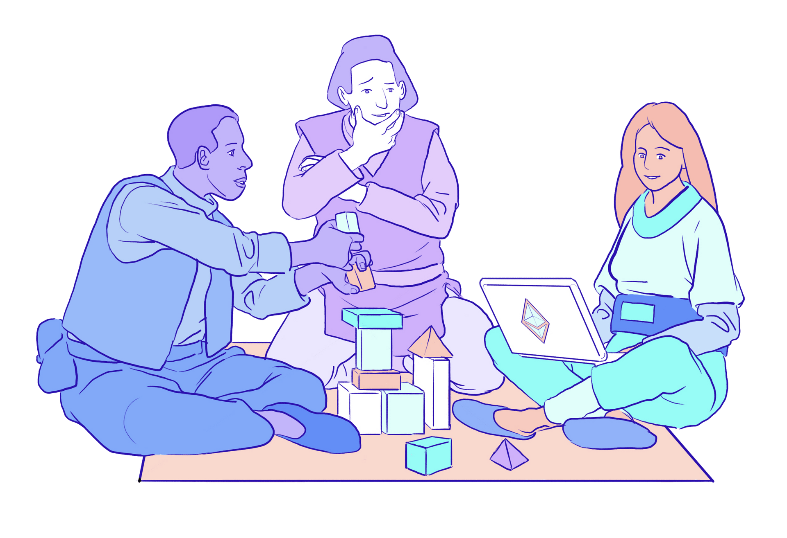

The Translation Program is a collaborative effort to translate ethereum.org into different languages in order to make the website more accessible to billions of non-English speakers around the world.

## Program status {#program-status}

The ethereum.org Translation Program is winding down and is no longer onboarding new translators. The Crowdin project is being closed, and we are not accepting new translation submissions through it.

We are deeply grateful to the thousands of community translators who made ethereum.org available in dozens of languages over the years—their work remains live on the site, and their recognition on the [acknowledgements](/contributing/translation-program/acknowledgements/) and [contributors](/contributing/translation-program/contributors/) pages stays in place.

If you spot an error in an existing translation, please [open an issue on GitHub](https://github.com/ethereum/ethereum-org-website/issues/new/choose).

_Join the [ethereum.org Discord](https://discord.gg/ethereum-org) to ask questions or share feedback._

## About the Translation Program {#about-us}

The [Ethereum](/) community aims to be global and inclusive, yet much of its content only caters to English speakers, leaving out the world's 6 billion non-English speakers. For ethereum.org to act as the portal into Ethereum for the worldwide community, we believe providing non-English speakers with Ethereum content in their native languages is essential.

The ethereum.org Translation Program aims to make Ethereum accessible to everyone by translating ethereum.org and other Ethereum content into as many languages as possible.

### Our progress so far {#our-progress}

- [**6,900 +** translators](/contributing/translation-program/contributors/)
- **68** languages live on site
- [**2.89 million** words translated in 2024](/contributing/translation-program/acknowledgements/)

<TranslationChartImage />

### Acknowledgements {#acknowledgements}

Ethereum.org is translated by thousands of community members and they are the key part of the Translation Program.
We want to acknowledge our translators and support them on their career paths. Here are some of our translator acknowledgements:

#### Certificate {#certificate}

If you have contributed to the Translation Program and at least 5,000 of your translated words have been approved, you are eligible for an ethereum.org translator certificate. [More on certificates](/contributing/translation-program/acknowledgements/#certificate)

#### OATs {#oats}

Contributors to the Translation Program are eligible for different OATs (onchain achievement tokens) based on their number of translated words in 2024. OATs are NFTs that prove your contribution to the ethereum.org Translation Program. [More on OATs](/contributing/translation-program/acknowledgements/#oats)

#### Translator acknowledgements {#translator-acknowledgements}

Public acknowledgements of our top translators using [leaderboards](/contributing/translation-program/acknowledgements/) and a [list of all contributors to the Translation Program](/contributing/translation-program/contributors/).

#### Rewards {#rewards}

In the past, we have retroactively rewarded our most active contributors with tickets to Ethereum conferences like [Devcon](https://devcon.org/en/) and [Devconnect](https://devconnect.org/), as well as exclusive ethereum.org merch.

We're constantly thinking of new and innovative ways to reward our contributors, so stay tuned!

### Guides and resources {#guides-and-resources}

These reference materials remain available for translation communities and projects running their own programs:

- [Translation Style Guide](/contributing/translation-program/translators-guide/) _– instructions and tips for ethereum.org translators_

For other useful translation tools, translator communities and Translation Program blog posts, please visit the [Resources page](/contributing/translation-program/resources/).

## Get in touch {#get-in-touch}

Do you have any questions? Or want to collaborate with our team and other translators? Please post in the #translations channel of our [ethereum.org Discord server](https://discord.gg/ethereum-org)

You can also reach out to us at translations@ethereum.org

## Starting your own translation program {#starting-a-translation-program}

We are dedicated to translating Ethereum content into as many languages as possible and making educational content available to everyone.
In line with our focus on translations, we want to help other Ethereum projects organize, manage, and improve their own translation efforts.

For this reason, we have created a [Translation Program playbook](/contributing/translation-program/playbook/) that contains some tips and best practices we have picked up in the process of translating ethereum.org.

Want to collaborate further or use some of our translation resources? Have any feedback on the playbook? We would love to hear from you at translations@ethereum.org.
