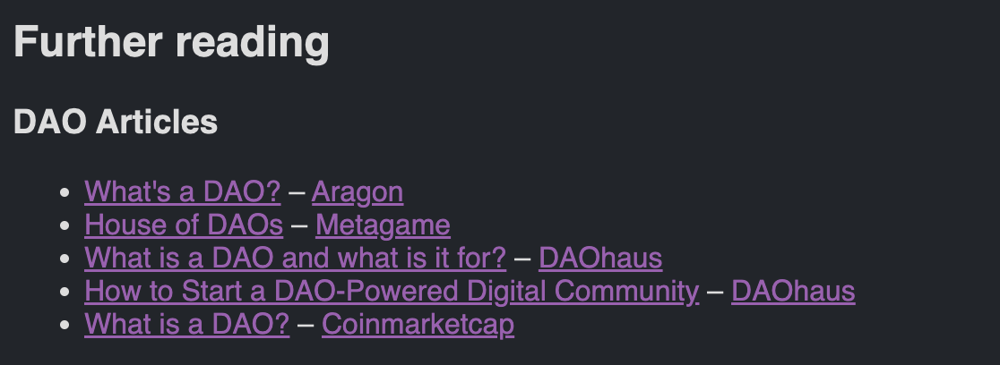
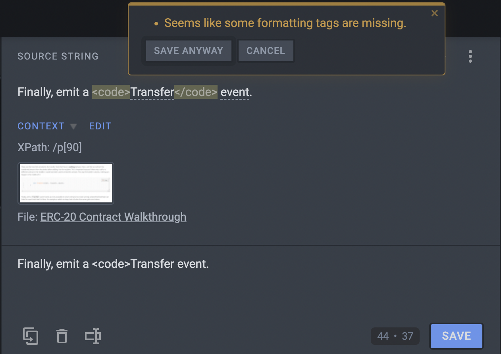
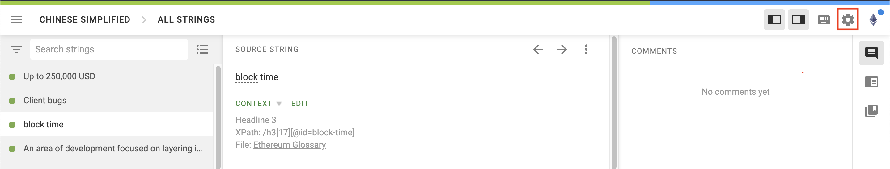
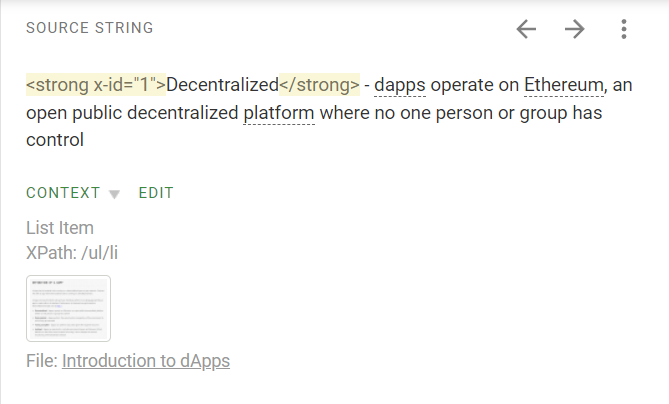
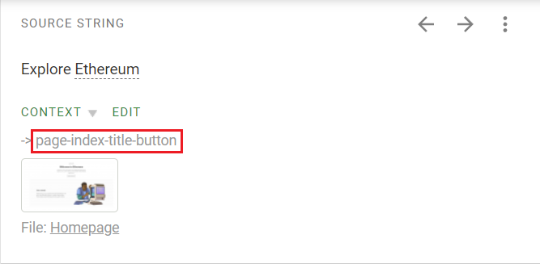

# Ethereum.org Translation Style Guide {#style-guide}

The ethereum.org translation style guide contains some of the most important guidelines, instructions, and tips for translators, helping us localize the website.

This document serves as a general guide and is not specific to any one language.

If you have any questions, suggestions or feedback, feel free to reach out to us at translations@ethereum.org, send a message to @ethdotorg on Crowdin, or [join our Discord](https://discord.gg/XVepFu7sqR), where you can message us in the #translations channel or reach out to any of the team members.

### Using Crowdin {#using-crowdin}

You can find basic instructions on how to join the project in Crowdin and how to use the Crowdin online editor on the [Translation Program page](/contributing/translation-program/#how-to-translate).

If you would like to learn more about Crowdin and using some of its advanced feature, the [Crowdin knowledge base](https://support.crowdin.com/online-editor/) contains a lot of in-depth guides and overviews of all Crowdin functionality.

### Capturing the essence of the message {#capturing-the-essence}

When translating ethereum.org content, avoid literal translations.

It is important that the translations capture the essence of the message. This could mean rephrasing certain phrases, or using descriptive translations instead of translating the content word for word.

Different languages have different grammar rules, conventions and word order. When translating, please be mindful of how sentences are structured in the target languages, and avoid literally translating the English source, as this can lead to poor sentence structure and readability.

Instead of translating the source text word for word, it is recommended you read the entire sentence and adapt it to fit the conventions of the target language.

### Formal vs. informal {#formal-vs-informal}

We use the formal form of address, which is always polite and appropriate for all visitors.

Using the formal address allows us to avoid sounding unofficial or offensive, and works regardless of the visitor’s age and gender.

Most Indo-European and Afro-Asiatic languages use gender-specific second-person personal pronouns, which distinguish between male and female. When addressing the user or using possessive pronouns, we can avoid assuming the visitor’s gender, as the formal form of address is generally applicable and consistent, regardless of how they identify.

### Simple and clear vocabulary and meaning {#simple-vocabulary}

Our goal is to make content on the website understandable to as many people as possible.

In most cases, this can be easily achieved by using short and simple words that are easily understandable. If there are multiple possible translations for a certain word in your language with the same meaning, the best option is most often the shortest word that clearly reflects the meaning.

### Writing system {#writing-system}

Ethereum.org is available in a number of languages, using alternative writing systems (or writing scripts) to Latin.

All of the content should be translated using the correct writing system for your language, and should not include any words, written using Latin characters.

When translating the content, you should ensure that the translations are consistent and do not include any Latin characters.

A common misconception is that Ethereum should always be written in Latin. This is mostly incorrect, please use the spelling of Ethereum, native to your language (e.g. 以太坊 in Chinese, إيثيريوم in Arabic, etc.).

**The above doesn’t apply to languages, where proper names shouldn’t be translated as a rule.**

### Translating page metadata {#translating-metadata}

Some pages contain metadata on the page, like 'title', 'lang', 'description', 'sidebar', etc.

We hide the content that translators should never translate when uploading new pages to Crowdin, meaning that all the metadata visible to translators in Crowdin should get translated.

Please be especially mindful when translating any strings where the source text is 'en'. This represents the language that the page is available in and should be translated to the [ISO language code for your language](https://www.andiamo.co.uk/resources/iso-language-codes/). These strings should always be translated using Latin characters, not the writing script, native to the target language.

If you are unsure which language code to use, you can check the translation memory in Crowdin or find the language code for your language in the URL of the page in the Crowdin online editor.

Some examples of language codes for the most widely spoken languages:

- Arabic - ar
- Chinese Simplified - zh
- French - fr
- Hindi - hi
- Spanish - es

### Titles of external articles {#external-articles}

Some strings contain titles of external articles. Most of our developer documentation pages contain links to external articles for further reading. The strings containing titles of articles need to be translated, regardless of the article's language, to ensure a more consistent user experience for the visitors viewing the page in their language.

You can find some examples of what these strings look like for translators and how to identify them below (links to articles can be found mostly at the bottom of these pages, in the 'Further reading' section):

### Crowdin warnings {#crowdin-warnings}

Crowdin has a built-in feature that warns translators when they are about to make a mistake. Crowdin will automatically warn you of this before saving your translation if you forget to include a tag from the source, translate elements that should not be translated, add several consecutive spaces, forget end punctuation, etc.
If you see a warning like this, please go back and double-check the suggested translation.

**Never ignore these warnings, as they usually mean that something is wrong, or that the translation is missing a key part of the source text.**

An example of a Crowdin warning when you forget to add a tag to your translation:

### Dealing with tags and code snippets {#dealing-with-tags}

A lot of the source content contains tags and variables, which are highlighted in yellow in the Crowdin editor. These serve different functions and should be approached correctly.

**Crowdin settings**

To make it easier to manage tags and copy them directly from the source, we recommend changing your settings in the Crowdin editor.

1. Open settings
   

2. Scroll down to the 'HTML tags displaying' section

3. Select 'Hide'
   

4. Click 'Save'

By selecting this option, the full tag text will no longer be shown, and will be replaced by a number.
When translating, clicking on this tag will automatically copy the exact tag to the translation field.

**Links**

You may notice full links to pages on ethereum.org or other websites.

These should be identical to the source and not changed or translated. If you translate a link or change it in any way, even just removing a part of it, like a slash (/), this will lead to broken and unusable links.

The best way to handle links is to copy them directly from the source, either by clicking on them or using the ‘Copy Source’ button (Alt+C).

Links also appear in the source text in the form of tags (i.e. <0> </0>). If you hover over the tag, the editor will show its full content - sometimes these tags will represent links.

It is very important to copy the links from the source and not change their order.

If the order of the tags is changed, the link they represent will be broken.

**Tags and variables**

The source text contains many different types of tags, which should always be copied from the source and never changed. Similarly to above, the order of these tags in the translation should also remain the same as the source.

Tags always contain an opening and closing tag. In most cases, the text between opening and closing tags should be translated.

Example: `<strong x-id="1">`Decentralized`</strong>`

`<strong x-id="1">` - _Opening tag that makes the text bold_

Decentralized - _Translatable text_

`</strong>` - _Closing tag_

Code snippets should be approached slightly differently to the other tags, since they contain code that should not be translated.

Example: `<code>`nonce`</code>`

`<code>` - _Opening tag, which contains a code snippet_

nonce - _Non-translatable text_

`</code>` - _Closing tag_

The source text also contains shortened tags, which only contain numbers, meaning that their function is not immediately obvious. You can hover over these tags to see exactly which function they serve.

In the example below, you can see that hovering over the <0> tag shows that it represents `<code>` and contains a code snippet, therefore the content inside these tags should not be translated.

### Short vs. full forms/abbreviations {#short-vs-full-forms}

There are a lot of abbreviations used on the website, e.g. dapps, NFT, DAO, DeFi, etc. These abbreviations are commonly used in English and most visitors to the website are familiar with them.

Since they usually don’t have established translations in other languages, the best way to approach these and similar terms is to provide a descriptive translation of the full form, and add the English abbreviation in brackets.

Do not translate these abbreviations, since most people wouldn’t be familiar with them, and the localized versions would not make much sense to most visitors.

Example of how to translate dapps:

- Decentralized applications (dapps) → _Translated full form (English abbreviation in brackets)_

### Terms without established translations {#terms-without-established-translations}

Some terms might not have established translations in other languages, and are widely known by the original English term. Such terms mostly include newer concepts, like proof-of-work, proof-of-stake, Beacon Chain, staking, etc.

While translating these terms can sound unnatural, since the English version is commonly used in other languages as well, it is highly recommended that they are translated.

When translating them, feel free to get creative, use descriptive translations, or simply translate them literally.

**The reason why most terms should be translated, instead of leaving some in English, is the fact that this new terminology will become more widespread in the future, as more people start using Ethereum and related technologies. If we want to onboard more people from all over the world to this space, we need to provide understandable terminology in as many languages as possible, even if we need to create it ourselves.**

### Buttons & CTAs {#buttons-and-ctas}

The website contains numerous buttons, which should be translated differently than other content.

Button text can be identified by viewing the context screenshots, connected with most strings, or by checking the context in the editor, which includes the phrase ‘’button’’.

The translations for buttons should be as short as possible, to prevent formatting mismatches. Additionally, button translations should be imperative, i.e. present a command or request.

### Translating for inclusivity {#translating-for-inclusivity}

Ethereum.org visitors come from all over the world and from different backgrounds. The language on the website should therefore be neutral, welcoming to everyone and not exclusive.

An important aspect of this is gender neutrality. This can be easily achieved by using the formal form of address, and avoiding any gender-specific words in the translations.

Another form of inclusivity is trying to translate for a global audience, not specific to any country, race or region.

Finally, the language should be suitable for all audiences and ages.

## Language-specific translations {#language-specific-translations}

When translating, it is important to follow the grammar rules, conventions and formatting, used in your language, as opposed to copying from the source. The source text follows English grammar rules and conventions, which is not applicable to many other languages.

You should be aware of the rules for your language and translate accordingly. If you need help, reach out to us and we will help you find some resources on how these elements should be used in your language.

Some examples of what to be particularly mindful of:

### Punctuation, formatting {#punctuation-and-formatting}

**Capitalization**

- There are vast differences in capitalization in different languages.
- In English, it is common to capitalize all words in titles and names, months and days, language names, holidays, etc. In many other languages, this is grammatically incorrect, as they have different capitalization rules.
- Some languages also have rules about capitalizing personal pronouns, nouns, and certain adjectives, which are not capitalized in English.

**Spacing**

- Orthography rules define the use of spaces for each language. Because spaces are used everywhere, these rules are some of the most distinct, and spaces are some of the most mistranslated elements.
- Some common differences in spacing between English and other languages:
  - Space before units of measure and currencies (e.g. USD, EUR, kB, MB)
  - Space before degree signs (e.g. °C, ℉)
  - Space before some punctuation marks, especially the ellipsis (…)
  - Space before and after slashes (/)

**Lists**

- Every language has a diverse and complex set of rules for writing lists. These can be significantly different to English.
- In some languages, the first word of each new line needs to be capitalized, while in others, new lines should start with lower-case letters. Many languages also have different rules about capitalization in lists, depending on the length of each line.
- The same applies to punctuation of line items. The end punctuation in lists can be a period (**.**), comma (**,**), or semicolon (**;**), depending on the language.

**Quotation marks**

- Languages use many different quotation marks. Simply copying the English quotation marks from the source is often incorrect.
- Some of the most common types of quotation marks include:
  - „example text“
  - ‚example text’
  - »example text«
  - “example text”
  - ‘example text’
  - «example text»

**Hyphens and dashes**

- In English, a hyphen (-) is used to join words or different parts of a word, while a dash (–) is used to indicate a range or a pause.
- Many languages have different rules for using hyphens and dashes that should be observed.

### Formats {#formats}

**Numbers**

- The main difference in writing numbers in different languages is the separator used for decimals and thousands. For thousands, this can be a period, comma or space. Similarly, some languages use a decimal point, while others use a decimal comma.
  - Some examples of large numbers:
    - English – **1,000.50**
    - Spanish – **1.000,50**
    - French – **1 000,50**
- Another important consideration when translating numbers is the percent sign. It can be written in different ways: **100%**, **100 %** or **%100**.
- Finally, negative numbers can be displayed differently, depending on the language: -100, 100-, (100) or [100].

**Dates**

- When translating dates, there are a number of considerations and differences based on the language. These include the date format, separator, capitalization and leading zeros. There are also differences between full-length and numerical dates.
  - Some examples of different date formats:
    - English UK (dd/mm/yyyy) – 1st January, 2022
    - English US (mm/dd/yyyy) – January 1st, 2022
    - Chinese (yyyy-mm-dd) – 2022 年 1 月 1 日
    - French (dd/mm/yyyy) – 1er janvier 2022
    - Italian (dd/mm/yyyy) – 1º gennaio 2022
    - German (dd/mm/yyyy) – 1. Januar 2022

**Currencies**

- Translating currencies can be challenging, due to the different formats, conventions and conversions. As a general rule, please keep currencies the same as the source. You can add your local currency and conversion in brackets, for the benefit of the reader.
- The main differences in writing currencies in different languages include symbol placement, decimal commas vs. decimal points, spacing, and abbreviations vs. symbols.
  - Symbol placement: $100 or 100$
  - Decimal commas vs. decimal points: 100,50$ or 100.50$
  - Spacing: 100$ or 100 $
  - Abbreviations vs. symbols: 100 $ or 100 USD

**Units of measure**

- As a general rule, please keep the units of measure as per the source. If your country uses a different system, you can include the conversion in brackets.
- Aside from the localization of units of measure, it is also important to note the differences in how languages approach these units. The main difference is the spacing between the number and unit, which can be different, based on the language. Examples of this include 100kB vs. 100 kB or 50ºF vs. 50 ºF.

### Conclusion {#conclusion}

Translating ethereum.org is a great opportunity to learn about the different aspects of Ethereum.

When translating, try not to rush. Take it easy and have fun!

Thank you for being involved with the Translation Program and helping us make the website accessible to a wider audience. The Ethereum community is global, and we are happy you are a part of it!
