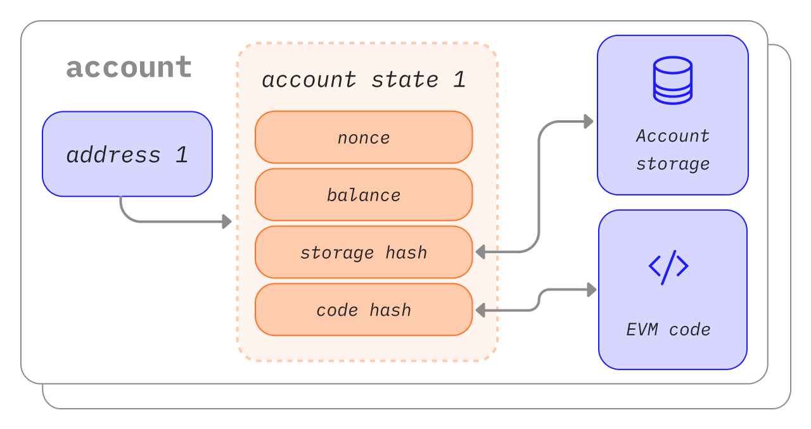

An Ethereum account is an entity with an ether (ETH) balance that can send transactions on Ethereum. Accounts can be user-controlled or deployed as smart contracts.

## Prerequisites {#prerequisites}

To help you better understand this page, we recommend you first read through our [introduction to Ethereum](/developers/docs/intro-to-ethereum/).

## Account types {#types-of-account}

Ethereum has two account types:

- Externally-owned account (EOA) – controlled by anyone with the private keys
- Contract account – a smart contract deployed to the network, controlled by code. Learn about [smart contracts](/developers/docs/smart-contracts/)

Both account types have the ability to:

- Receive, hold and send ETH and tokens
- Interact with deployed smart contracts

### Key differences {#key-differences}

**Externally-owned**

- Creating an account costs nothing
- Can initiate transactions
- Transactions between externally-owned accounts can only be ETH/token transfers
- Made up of a cryptographic pair of keys: public and private keys that control account activities

**Contract**

- Creating a contract has a cost because you're using network storage
- Can only send transactions in response to receiving a transaction
- Transactions from an external account to a contract account can trigger code which can execute many different actions, such as transferring tokens or even creating a new contract
- Contract accounts don't have private keys. Instead, they are controlled by the logic of the smart contract code

## An account examined {#an-account-examined}

Ethereum accounts have four fields:

- `nonce` – A counter that indicates the number of transactions sent from an externally-owned account or the number of contracts created by a contract account. Only one transaction with a given nonce can be executed for each account, protecting against replay attacks where signed transactions are repeatedly broadcast and re-executed.
- `balance` – The number of wei owned by this address. Wei is a denomination of ETH and there are 1e+18 wei per ETH.
- `codeHash` – This hash refers to the _code_ of an account on the Ethereum virtual machine (EVM). Contract accounts have code fragments programmed in that can perform different operations. This EVM code gets executed if the account gets a message call. It cannot be changed, unlike the other account fields. All such code fragments are contained in the state database under their corresponding hashes for later retrieval. This hash value is known as a codeHash. For externally owned accounts, the codeHash field is the hash of an empty string.
- `storageRoot` – Sometimes known as a storage hash. A 256-bit hash of the root node of a Merkle Patricia trie that encodes the storage contents of the account (a mapping between 256-bit integer values), encoded into the trie as a mapping from the Keccak 256-bit hash of the 256-bit integer keys to the RLP-encoded 256-bit integer values. This trie encodes the hash of the storage contents of this account, and is empty by default.


_Diagram adapted from [Ethereum EVM illustrated](https://takenobu-hs.github.io/downloads/ethereum_evm_illustrated.pdf)_

## Externally-owned accounts and key pairs {#externally-owned-accounts-and-key-pairs}

An account is made up of a pair of cryptographic keys: public and private. They help prove that a transaction was actually signed by the sender and prevent forgeries. Your private key is what you use to sign transactions, so it grants you custody over the funds associated with your account. You never really hold cryptocurrency, you hold private keys – the funds are always on Ethereum's ledger.

This prevents malicious actors from broadcasting fake transactions because you can always verify the sender of a transaction.

If Alice wants to send ether from her own account to Bob’s account, Alice needs to create a transaction request and send it out to the network for verification. Ethereum’s usage of public-key cryptography ensures that Alice can prove that she originally initiated the transaction request. Without cryptographic mechanisms, a malicious adversary Eve could simply publicly broadcast a request that looks something like “send 5 ETH from Alice’s account to Eve’s account,” and no one would be able to verify that it didn’t come from Alice.

## Account creation {#account-creation}

When you want to create an account, most libraries will generate you a random private key.

A private key is made up of 64 hex characters and can be encrypted with a password.

Example:

`fffffffffffffffffffffffffffffffebaaedce6af48a03bbfd25e8cd036415f`

The public key is generated from the private key using the [Elliptic Curve Digital Signature Algorithm](https://wikipedia.org/wiki/Elliptic_Curve_Digital_Signature_Algorithm). You get a public address for your account by taking the last 20 bytes of the Keccak-256 hash of the public key and adding `0x` to the beginning.

This means an Externally owned account (EOA) has a 42-character address (20-byte segment which is 40 hexadecimal characters plus the `0x` prefix).

Example:

`0x5e97870f263700f46aa00d967821199b9bc5a120`

The following example shows how to use a signing tool called [Clef](https://geth.ethereum.org/docs/tools/clef/introduction) to generate a new account. Clef is an account management and signing tool that comes bundled with the Ethereum client, [Geth](https://geth.ethereum.org). The `clef newaccount` command creates a new key pair and saves them in an encrypted keystore.

```
> clef newaccount --keystore <path>

Please enter a password for the new account to be created:
> <password>

------------
INFO [10-28|16:19:09.156] Your new key was generated       address=0x5e97870f263700f46aa00d967821199b9bc5a120
WARN [10-28|16:19:09.306] Please backup your key file      path=/home/user/go-ethereum/data/keystore/UTC--2022-10-28T15-19-08.000825927Z--5e97870f263700f46aa00d967821199b9bc5a120
WARN [10-28|16:19:09.306] Please remember your password!
Generated account 0x5e97870f263700f46aa00d967821199b9bc5a120
```

[Geth documentation](https://geth.ethereum.org/docs)

It is possible to derive new public keys from your private key, but you cannot derive a private key from public keys. It is vital to keep your private keys safe and, as the name suggests, **PRIVATE**.

You need a private key to sign messages and transactions which output a signature. Others can then take the signature to derive your public key, proving the author of the message. In your application, you can use a JavaScript library to send transactions to the network.

## Contract accounts {#contract-accounts}

Contract accounts also have a 42 character hexadecimal address:

Example:

`0x06012c8cf97bead5deae237070f9587f8e7a266d`

The contract address is usually given when a contract is deployed to the Ethereum Blockchain. The address comes from the creator's address and the number of transactions sent from that address (the “nonce”).

## Validator keys {#validators-keys}

There is also another type of key in Ethereum, introduced when Ethereum switched from proof-of-work to proof-of-stake based consensus. These are 'BLS' keys and they are used to identify validators. These keys can be efficiently aggregated to reduce the bandwidth required for the network to come to consensus. Without this key aggregation the minimum stake for a validator would be much higher.

[More on validator keys](/developers/docs/consensus-mechanisms/pos/keys/).

## A note on wallets {#a-note-on-wallets}

An account is not a wallet. A wallet is an interface or application that lets you interact with your Ethereum account, either an externally-owned account or a contract account.

## A visual demo {#a-visual-demo}

Watch Austin walk you through hash functions, and key pairs.

<YouTube id="QJ010l-pBpE" />

<YouTube id="9LtBDy67Tho" />

## Further reading {#further-reading}

- [Understanding Ethereum Accounts](https://info.etherscan.com/understanding-ethereum-accounts/) - etherscan

_Know of a community resource that helped you? Edit this page and add it!_

## Related topics {#related-topics}

- [Smart contracts](/developers/docs/smart-contracts/)
- [Transactions](/developers/docs/transactions/)
