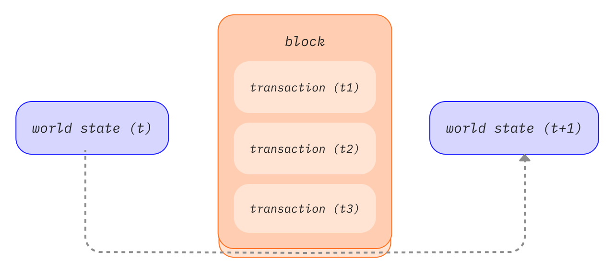

Blocks are batches of transactions with a hash of the previous block in the chain. This links blocks together (in a chain) because hashes are cryptographically derived from the block data. This prevents fraud, because one change in any block in history would invalidate all the following blocks as all subsequent hashes would change and everyone running the blockchain would notice.

## Prerequisites {#prerequisites}

Blocks are a very beginner-friendly topic. But to help you better understand this page, we recommend you first read [Accounts](/developers/docs/accounts/), [Transactions](/developers/docs/transactions/), and our [introduction to Ethereum](/developers/docs/intro-to-ethereum/).

## Why blocks? {#why-blocks}

To ensure that all participants on the Ethereum network maintain a synchronized state and agree on the precise history of transactions, we batch transactions into blocks. This means dozens (or hundreds) of transactions are committed, agreed on, and synchronized all at once.

_Diagram adapted from [Ethereum EVM illustrated](https://takenobu-hs.github.io/downloads/ethereum_evm_illustrated.pdf)_

By spacing out commits, we give all network participants enough time to come to consensus: even though transaction requests occur dozens of times per second, blocks are only created and committed on Ethereum once every twelve seconds.

## How blocks work {#how-blocks-work}

To preserve the transaction history, blocks are strictly ordered (every new block created contains a reference to its parent block), and transactions within blocks are strictly ordered as well. Except in rare cases, at any given time, all participants on the network are in agreement on the exact number and history of blocks, and are working to batch the current live transaction requests into the next block.

Once a block is put together by a randomly selected validator on the network, it is propagated to the rest of the network; all nodes add this block to the end of their blockchain, and a new validator is selected to create the next block. The exact block-assembly process and commitment/consensus process is currently specified by Ethereum’s “proof-of-stake” protocol.

## Proof-of-stake protocol {#proof-of-work-protocol}

Proof-of-stake means the following:

- Validating nodes have to stake 32 ETH into a deposit contract as collateral against bad behavior. This helps protect the network because provably dishonest activity leads to some or all of that stake being destroyed.
- In every slot (spaced twelve seconds apart) a validator is randomly selected to be the block proposer. They bundle transactions together, execute them and determine a new 'state'. They wrap this information into a block and pass it around to other validators.
- Other validators who hear about the new block re-execute the transactions to ensure they agree with the proposed change to the global state. Assuming the block is valid, they add it to their own database.
- If a validator hears about two conflicting blocks for the same slot they use their fork-choice algorithm to pick the one supported by the most staked ETH.

[More on proof-of-stake](/developers/docs/consensus-mechanisms/pos)

## What's in a block? {#block-anatomy}

There is a lot of information contained within a block. At the highest level a block contains the following fields:

| Field            | Description                                           |
| :--------------- | :---------------------------------------------------- |
| `slot`           | the slot the block belongs to                         |
| `proposer_index` | the ID of the validator proposing the block           |
| `parent_root`    | the hash of the preceding block                       |
| `state_root`     | the root hash of the state object                     |
| `body`           | an object containing several fields, as defined below |

The block `body` contains several fields of its own:

| Field                | Description                                        |
| :------------------- | :------------------------------------------------- |
| `randao_reveal`      | a value used to select the next block proposer     |
| `eth1_data`          | information about the deposit contract             |
| `graffiti`           | arbitrary data used to tag blocks                  |
| `proposer_slashings` | list of validators to be slashed                   |
| `attester_slashings` | list of attesters to be slashed                   |
| `attestations`       | list of attestations in favor of the current block |
| `deposits`           | list of new deposits to the deposit contract       |
| `voluntary_exits`    | list of validators exiting the network             |
| `sync_aggregate`     | subset of validators used to serve light clients   |
| `execution_payload`  | transactions passed from the execution client      |

The `attestations` field contains a list of all the attestations in the block. Attestations have their own data type that contains several pieces of data. Each attestation contains:

| Field              | Description                                                 |
| :----------------- | :---------------------------------------------------------- |
| `aggregation_bits` | a list of which validators participated in this attestation |
| `data`             | a container with multiple subfields                         |
| `signature`        | aggregate signature of all attesting validators             |

The `data` field in the `attestation` contains the following:

| Field               | Description                                              |
| :------------------ | :------------------------------------------------------- |
| `slot`              | the slot the attestation relates to                      |
| `index`             | indices for attesting validators                         |
| `beacon_block_root` | the root hash of the Beacon block containing this object |
| `source`            | the last justified checkpoint                            |
| `target`            | the latest epoch boundary block                          |

Executing the transactions in the `execution_payload` updates the global state. All clients re-execute the transactions in the `execution_payload` to ensure the new state matches that in the new block `state_root` field. This is how clients can tell that a new block is valid and safe to add to their blockchain. The `execution payload` itself is an object with several fields. There is also an `execution_payload_header` that contains important summary information about the execution data. These data structures are organized as follows:

The `execution_payload_header` contains the following fields:

| Field               | Description                                                         |
| :------------------ | :------------------------------------------------------------------ |
| `parent_hash`       | hash of the parent block                                            |
| `fee_recipient`     | account address for paying transaction fees to                      |
| `state_root`        | root hash for the global state after applying changes in this block |
| `receipts_root`     | hash of the transaction receipts trie                               |
| `logs_bloom`        | data structure containing event logs                                |
| `prev_randao`       | value used in random validator selection                            |
| `block_number`      | the number of the current block                                     |
| `gas_limit`         | maximum gas allowed in this block                                   |
| `gas_used`          | the actual amount of gas used in this block                         |
| `timestamp`         | the block time                                                      |
| `extra_data`        | arbitrary additional data as raw bytes                              |
| `base_fee_per_gas`  | the base fee value                                                  |
| `block_hash`        | Hash of execution block                                             |
| `transactions_root` | root hash of the transactions in the payload                        |
| `withdrawal_root`   | root hash of the withdrawals in the payload                         |

The `execution_payload` itself contains the following (notice this is identical to the header except that instead of the root hash of the transactions it includes the actual list of transactions and withdrawal information) :

| Field              | Description                                                         |
| :----------------- | :------------------------------------------------------------------ |
| `parent_hash`      | hash of the parent block                                            |
| `fee_recipient`    | account address for paying transaction fees to                      |
| `state_root`       | root hash for the global state after applying changes in this block |
| `receipts_root`    | hash of the transaction receipts trie                               |
| `logs_bloom`       | data structure containing event logs                                |
| `prev_randao`      | value used in random validator selection                            |
| `block_number`     | the number of the current block                                     |
| `gas_limit`        | maximum gas allowed in this block                                   |
| `gas_used`         | the actual amount of gas used in this block                         |
| `timestamp`        | the block time                                                      |
| `extra_data`       | arbitrary additional data as raw bytes                              |
| `base_fee_per_gas` | the base fee value                                                  |
| `block_hash`       | Hash of execution block                                             |
| `transactions`     | list of transactions to be executed                                 |
| `withdrawals`      | list of withdrawal objects                                          |

The `withdrawals` list contains `withdrawal` objects structured in the following way:

| Field            | Description                        |
| :--------------- | :--------------------------------- |
| `address`        | account address that has withdrawn |
| `amount`         | withdrawal amount                  |
| `index`          | withdrawal index value             |
| `validatorIndex` | validator index value              |

## Block time {#block-time}

Block time refers to the time separating blocks. In Ethereum, time is divided up into twelve second units called 'slots'. In each slot a single validator is selected to propose a block. Assuming all validators are online and fully functional there will be a block in every slot, meaning the block time is 12s. However, occasionally validators might be offline when called to propose a block, meaning slots can sometimes go empty.

This implementation differs from proof-of-work based systems where block times are probabilistic and tuned by the protocol's target mining difficulty. Ethereum's [average block time](https://etherscan.io/chart/blocktime) is a perfect example of this whereby the transition from proof-of-work to proof-of-stake can be clearly inferred based on the consistency of the new 12s block time.

## Block size {#block-size}

A final important note is that blocks themselves are bounded in size. Each block has a target size of 15 million gas but the size of blocks will increase or decrease in accordance with network demands, up until the block limit of 30 million gas (2x target block size). The block gas limit can be adjusted upwards or downwards by a factor of 1/1024 from the previous block's gas limit. As a result, validators can change the block gas limit through consensus. The total amount of gas expended by all transactions in the block must be less than the block gas limit. This is important because it ensures that blocks can’t be arbitrarily large. If blocks could be arbitrarily large, then less performant full nodes would gradually stop being able to keep up with the network due to space and speed requirements. The larger the block, the greater the computing power required to process them in time for the next slot. This is a centralizing force, which is resisted by capping block sizes.

## Further reading {#further-reading}

_Know of a community resource that helped you? Edit this page and add it!_

## Related topics {#related-topics}

- [Transactions](/developers/docs/transactions/)
- [Gas](/developers/docs/gas/)
- [Proof-of-stake](/developers/docs/consensus-mechanisms/pos)
