Understanding where crypto data originates is crucial for anyone involved in the blockchain space. This comprehensive breakdown will guide you through each step of the process, from the initial data request to the final transformation of data into a meaningful metric. 

In the first post of this series, we will explore how client nodes initiate data retrieval, the role of request pipelines, and the nature of raw on-chain data. You will also learn about the critical process of decoding raw data, transforming it into human-readable formats, and the subsequent aggregation of data for various use cases. We'll also touch on integrating off-chain sources and more complex on-chain schemas to provide a holistic view of data transformations.

We won't get too deep on all the different informations that can be retrieved by interacting with the blockchain. Rather than exhaustively detailing every possible data point and schemas retrievable from the blockchain, this guide will offer a broad overview of the essential business logic needed to derive ecosystem level of data, such as the overall volume of the DEXes. Whether you’re a developer, data analyst, or researcher, this detailed guide will enhance your understanding of the crypto data landscape and its applications.

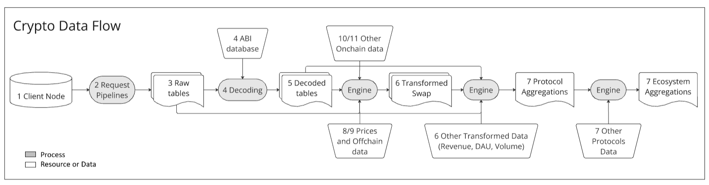
*Crypto Data Flow*

Not every data transformation pipeline follows clear steps like those outlined above. Leaner processes or with well-defined goals often skip, blur, or merge steps together, adapting to the unique needs of the task. This article will explore a process tailored for a data provider, which enables the data creation on any protocol or network, similar to platforms like Dune.

## 1 - Client Nodes {#client-nodes}

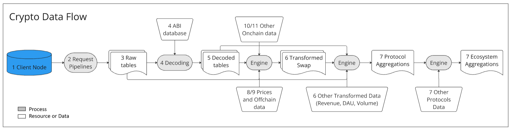

The process of fetching data from the blockchain starts with a request to a client node. "Nodes" and "clients" are terms used to describe core software infrastructure that allows you to both read (request data) and write (submit transactions). For this purpose, every client implements a [JSON-RPC specification](/developers/docs/apis/json-rpc/), providing a uniform set of methods that applications can rely on, regardless of the specific node or client implementation.

Every chain has its own client specification, and if you want data from multiple chains, you must run multiple clients, one for each network. You’re not required to run your own node. But if you don’t, you will need a communication channel with the person running it for you, like a node-as-a-service provider.

**Node examples:** Geth, Lighthouse, Prism, Erigon.
**Node-as-a-service examples:** Alchemy, Infura, Akr, Quicknode, Tenderly

## 2 - Request Pipelines {#request-pipelines}

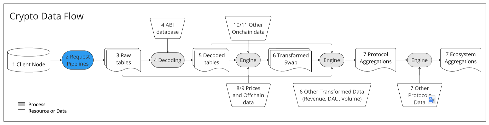

Retrieving blocks, transactions, or events through an interface, such as a JSON RPC request, is a common requirement for accessing on-chain data. Nodes can provide both historical and current network states. However, interacting with the node API is a complex endeavor, requiring a structured approach to manage the information flow. A robust request pipeline must be established to handle incoming requests and efficiently transform the raw data into organized tables.

To simplify the challenges associated with request pipelines, data extraction tools have emerged as valuable assets in blockchain data management. Tools like [Cryo](https://github.com/paradigmxyz/cryo), provide an efficient interface for extracting blockchain data such as blocks, transactions, logs, and traces, utilizing JSON-RPC protocols and offering outputs in formats like Parquet and CSV for further analysis. Similarly, the EVM Query Language ([EQL](https://github.com/iankressin/eql)) offers a SQL-like syntax for querying Ethereum and EVM-compatible blockchains, making it easier for developers and analysts to retrieve data using familiar concepts from relational databases while also offering extraction to various file formats. These tools streamline communication with nodes and reduce the need to build complex custom pipelines, fitting seamlessly into ELT workflows and enhancing the efficiency of broader data transformation processes

## 3 - Raw tables (Onchain Data) {#raw-tables}

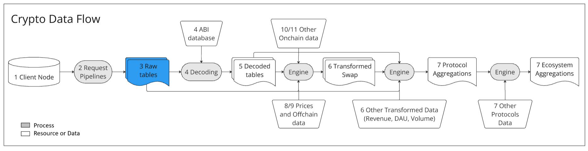

**What is it** Raw on-chain data encompasses anything you can extract through an RPC call from a node. While the full list of available data is extensive, in this post, we've narrowed it down to the most common types that follow standard schemas, making them easier to transform later.

Note: Raw in this context only means the opposite of decoded, explained below.

**Examples:** Blocks, Transactions, Accounts, Raw Traces, Raw Logs
**Use Cases:**
- Network level metrics
- Source for Decoded Data

**Metrics obtained by transforming raw onchain data:**
- TPS - transaction per second
- Gas per transaction
- Top contracts called
- Distinct new accounts
- Daily unique transaction signers
- Block meantime
- Transaction size

## 4 - Decoding {#decoding}

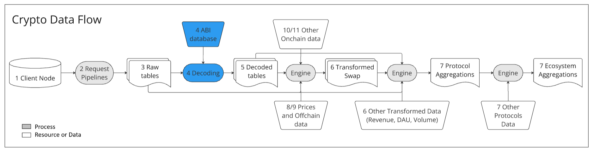

If you explore raw on-chain data, you'll notice that the data in function inputs, outputs, and logs doesn't look like what you see on Etherscan. The main challenge is the lack of context—what each field or value represents—and the fact that everything is stored in bytes (hexadecimal format).

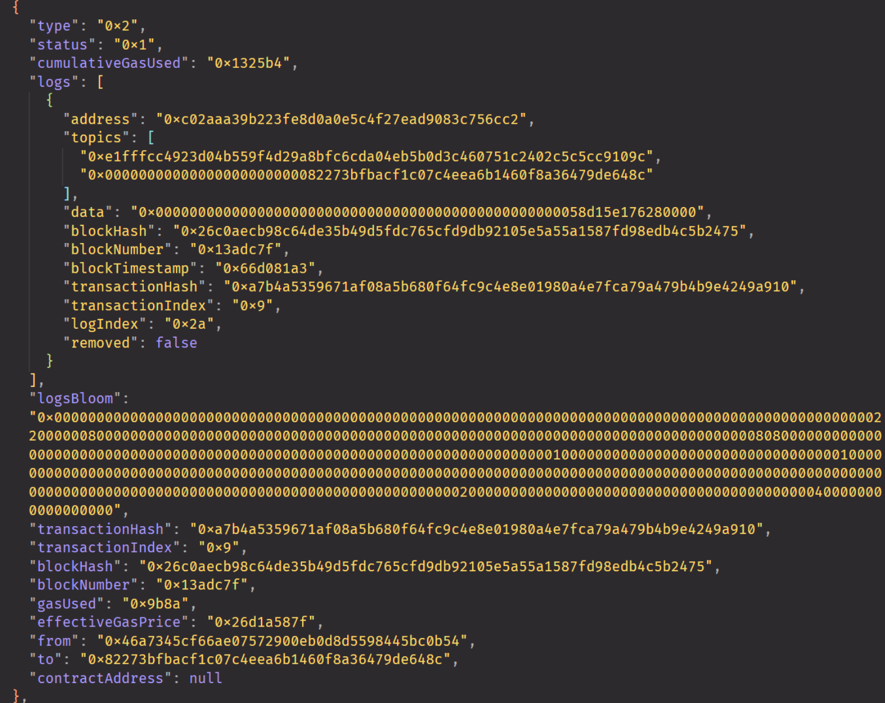
*Example of a raw transaction receipt.*

Decoding is the process of translating the data in raw events and traces into a human-readable format (with function and parameter names) using the contract ABI. This can only be achieved if you have access to the contract ABI or the original Solidity code.

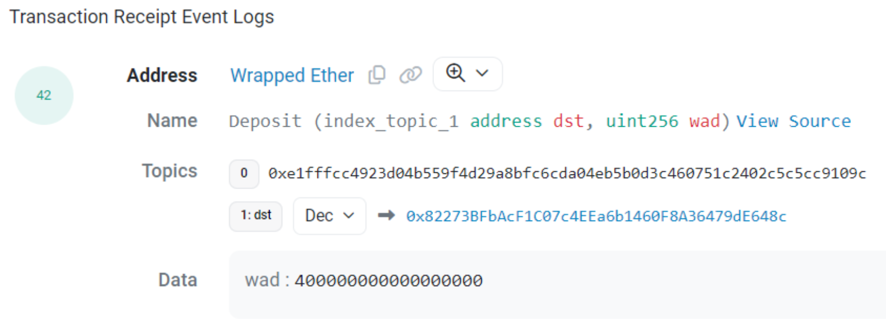
*The above transaction log, translated to a readable event. It was a Deposit of 4.10^17 wad to the WETH, with  destination the [`0x82273BFbAcF1C07c4EEa6b1460F8A36479dE648c`](https://etherscan.io/address/0x82273BFbAcF1C07c4EEa6b1460F8A36479dE648c) account.*

The reason this transformation is necessary is that smart-contracts are stored on-chain as opcodes—a low-level EVM readable set of instructions —rather than in Solidity. Solidity is a high-level language that compiles into opcodes, which is what the nodes execute. Nodes are unaware of the original Solidity code that generated the opcodes, resulting in a lack of information about function names, parameter names, and output meanings.

Access to the contract's code is only possible if someone with the deployed code makes it public, typically by submitting it to a database or a service like Etherscan. With the Solidity code, you can compile it, compare it to the on-chain opcodes, and verify its authenticity. Alternatively, you can use the [contract ABI](https://docs.soliditylang.org/en/latest/abi-spec.html), which is generated from Solidity at the compilation step. The ABI maps function and event signatures to their actual names and includes the encoding details of parameters, such as word size and variable types. However, it is important to note that not all contract codes and ABIs are publicly available, which means that not all contracts and transactions can be decoded.

## 5 - Decoded Data {#decoded-data}

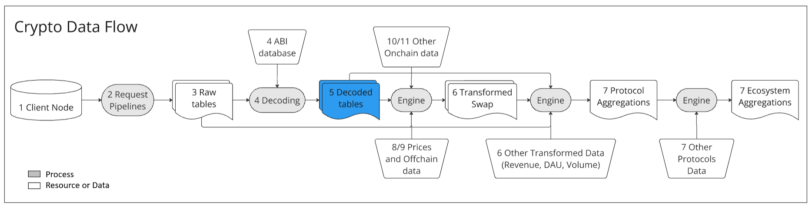

**What is it?** Decoded data includes logs, traces, transfers, and view functions translated into human-readable parameters. In a data flow, some form of decoding is almost always performed, even for less common data types.

**Examples:** Decoded Traces, Decoded Logs, ERC20 Transfer Events
**Use Cases:**
- Primary source for all protocol level metrics
- Primary source for Transformed Data

**Metrics obtained by transforming decoded data:**
- Aave deposits and withdraws
- Daily Liquidations
- ProtocolTVL
- DAU
- Bridges ilows and outflows
- Volume and Open Interest
- Protocol Revenue
- ETH2 contract deposits

Having all decoded traces, logs, and ERC20 transfer events extracted and loaded into tables is the most convenient method for establishing an ELT (Extract, Load, Transform) process, allowing for the derivation of a wide range of protocol data.

## Transformation Engine {#transformation-engine}

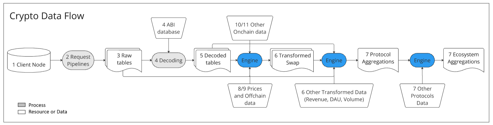

Now that you have all this data available, a transformation infrastructure is needed to process and convert it into meaningful metrics. Transformation engines can vary widely from company to company; they can range from something as simple as a Python notebook to a complex data warehouse infrastructure (Eg. Dagster/Airflow, DBT, Snowflake/Databricks).

The transformation process can take in raw or decoded data, along with other on-chain sources, and combine it with prices or other off-chain data to produce metric outputs. In the flow diagram, you’ll notice multiple arrows directing data into the transformation engine. After data is transformed, the output can be saved and reused—either in whole or in part—for further transformations. Data processing is essentially an endless cycle of reshaping and refining previous outputs to extract new insights.

## 6 - Transformed Data {#transformed-data}

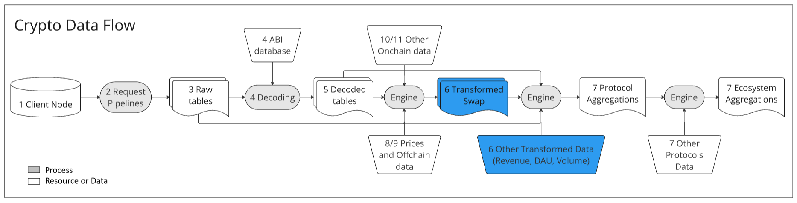

**What is it?** Transformed data consists of business-level metrics or aggregates derived from all the sources available, including raw and decoded. After collecting all the raw and decoded information, the next step is to manipulate and combine it to create meaningful metrics. Transformed data is the output of any data transformation process, and it's often stored for future use to avoid recomputation. By transforming data once and reusing it whenever necessary, you can optimize efficiency and performance.

**Examples:** Uniswap SWAPs, Aave TVL, DEX.trades

**Use Cases:**
- Feed the analytics layer (analytics UI, dashboards, charts)
- Source for other Transformed Data (reprocess)
- Source for aggregations

## 7 - Aggregations {#aggregations}

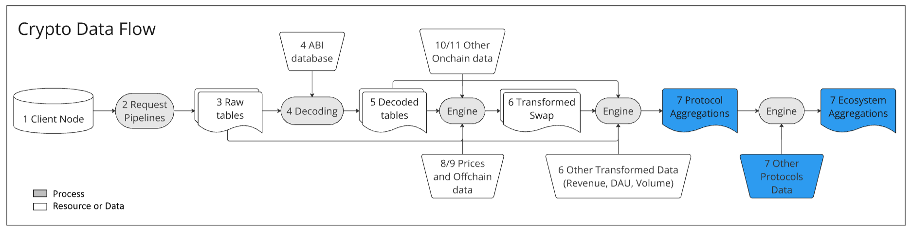

Users often seek ecosystem-level data, such as answers to questions like “How much volume are DEXes generating?”, “What is the total value locked (TVL) in DeFi?”, or “How many users do crypto social platforms have?”. These kinds of questions rarely have shortcuts; instead, they typically require a step-by-step "brute force" approach to generate meaningful answers. This involves creating metrics for a single protocol (e.g., Uniswap), then aggregating metrics across multiple protocols within a network (e.g., Ethereum DEXes), and finally aggregating these metrics across multiple chains to reflect the broader market (e.g., the entire DEX ecosystem).

**Example Metrics:**
- Aggregate metrics for one protocol (Uniswap Metrics)
- Aggregate metrics for multiple protocols into a Network Metric (Ethereum DEXes Metrics)
- Aggregate metrics from multiple chains into market metrics (DEXes ecosystem Metrics)

## 8 - Offchain Data {#offchain-data}

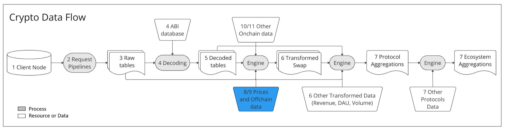

**What is it?** Off-chain data refers to any data that doesn’t originate from a blockchain node. Blockchain metrics can be significantly enhanced by incorporating data that isn't available onchain, typically sourced from external data providers. Centralized exchanges (CEXes) are among the most common sources, especially when converting metrics into dollar terms, as they provide the necessary price information for tokens at specific times. Additionally, some data may reside in more centralized or semi-decentralized databases. Ingesting this data directly into your system can serve as a shortcut to the Extract-Translate-Transform process.

**Examples:**
- Token prices from centralized exchanges
- NFT collections metadata
- Data from “appchains”
- Governance proposals from platforms like Snapshot
- Social APIs (e.g., Lens and Farcaster)
- MEV (Maximal Extractable Value) data

**Example Metrics:**
- Converting token amounts and volume to USD terms.
- Enriching protocol data where activity occurs off-chain
- Sourcing data from pseudo-chains or other sources not directly supported on-chain

## 9 - Prices (offchain data) {#prices}
Prices play such a crucial role in the crypto data flow that they warrant a dedicated explanation. There is no single, definitive source of truth for prices in the crypto world. Each exchange and blockchain can have different prices for the same trading pair at any given time. To address this, the prices table aims to aggregate and time-weight average (TWAP) these prices from multiple sources, including both centralized exchanges (CEXes) and decentralized exchanges (DEXes), into a single, representative value for a given time.

The process is not trivial; it involves inputting known prices, calculating volumes, removing outliers, and filtering out lagged or less representative markets. By carefully handling these steps, the process ensures a more accurate and reliable pricing metric that reflects the broader market dynamics.

## 10 - Other On-Chain Data {#other-onchain}

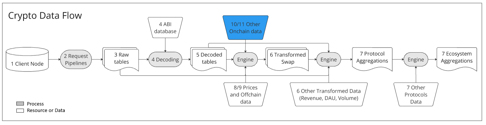

**What is it?** This refers to pre-indexed data extracted from blockchains that is less standardized and more specific. Blockchains don’t just store blocks, transactions, and logs; they also contain a wide variety of other data types, which may require additional steps to extract and are often harder to standardize into table formats. While EVM-compatible chains usually have defined standards, more exotic chains (e.g., Beacon chain) also produce and store unique data. Depending on your application, your data needs might be entirely centered around these specific and less conventional data types, and the process might not be as well defined as the steps presented above.

**Examples include:**
- Mem Pool data for high-frequency trading or block building,
- Beacon chain deposits and withdrawals for staking providers, 
- Blobs data for L2 sequencers.
- P2P communications

Below are some limited examples, particularly relevant for network and protocol metrics:

| Example | What is it? | Complexity | What makes it complex for a ELT process? | Use case |
| ----- | ----- | ----- | ----- | ----- |
| Token Metadata | Name, symbol, and decimals from tokens; extracted via view calls. | Easy | Identifying token contracts; handling mutable values. | Translating token addresses to names and symbols; calculating real amounts. . |
| ERC20 View Functions | BalanceOf and SupplyOf from ERC20; extracted via view calls. | Medium | When triggering a call for indexing? capturing all value changes (e.g., rebasing, contract construct)? | Tracking wallet balances over time; monitoring token supply changes. |
| Contract-Specific View Functions | View functions access state and output relevant contract’s data. | Hard | What triggers a call for indexing? What functions do people care about? | Create protocol metrics that were not surfaced in logs or traces. |
| State Changes | State diffs at every transaction. | Hard | Decoding state changes; determining which memory addresses to index. | Create protocol metrics that were not surfaced in logs or traces. |
| Contract internal variables | Variables saved during execution but not stored. | Hard | Requires runtime execution access; identifying relevant variables to index. | Create protocol metrics that were not surfaced in logs or traces. |
| Shadow/Ghost Logs | Additional logs emitted by modified contract code. | Hard | Determining which are the user-desired shadow logs; Rewrintg the appropriate code. | Accessing internal states and variables, formatted as logs. |

## 11 - View Functions Calls (Other On-Chain Data) {#view-functions-call}
In EVM-compatible blockchains, much of the data categorized as “Other On-Chain Data” can be accessed through the outputs of “view functions”. View functions are a type of Solidity function that does not modify the blockchain state; instead, they simply read and transform existing state data. This programmatic method allows you to read the network state and return data for use by other functions in the code. Since view functions don’t alter the state, they can be executed without incurring gas costs.

You can also make external view function calls to a node (in Etherscan, read contract tab), as client nodes implement an API for executing these calls and returning the results. However, there is a limitation: regular client nodes do not store historical state data, so view functions can only return the latest state at the time of the call.

A naive pipeline designed to index view function outputs would only capture data from the current state, at the time of the request. To gather historical data, you would need to start the node from Genesis and synchronize requests every time indexing is required, or use a historical node capable of returning historical states.

The second challenge is that the output of a view function isn’t always a direct representation of the state—it can also involve transformations. For example, the `BalanceOf` function returns the token balance of an account. For standard tokens, the balance is stored as a state mapping, but for rebasing tokens, the balance is calculated as `amount_scale * rebase_index`, where rebase_index is a global variable that adjusts all account balances simultaneously. With a few thousand accounts rebasing at every block, indexing this data can quickly result in billions of rows. If, instead, you indexed the amount_scale and the `rebase_index`, you could calculate user balance whenever you need it,  and it would represent much less data.

This leads to the third challenge: determining when to index. You’ll need to define triggers for indexing, such as every block, every transfer event, or whenever a specific call trace occurs. Since each application has unique requirements, this often necessitates custom pipelines.

In conclusion, working with view functions can be quite complex, and designing an effective ELT process for storing view function outputs requires thoughtful planning and a strategic approach.

## Conclusion {#conclusion}
Understanding crypto data flows is crucial for anyone working in the blockchain space. This article has explored the key steps in the data journey—from retrieving raw on-chain data to transforming it into actionable metrics using client nodes, request pipelines, and transformation engines. We’ve covered the importance of decoding data, handling view function calls, and integrating off-chain information like prices, emphasizing the complexity and care required in each process.

Effective management of crypto data flows allows for the creation of valuable insights and metrics, driving better decisions and innovations. As the blockchain landscape continues to evolve, mastering these data flows will be essential for staying ahead and making the most of blockchain's potential.