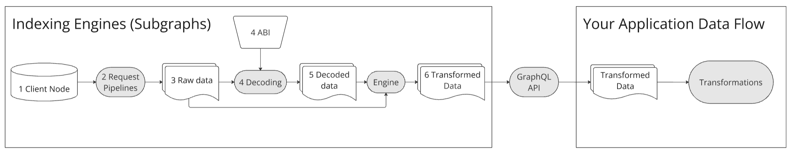

Optimizing for a use case is paramount in the ever-evolving landscape of data processing and analytics. As organizations grapple with vast amounts of data, the need for streamlined, effective, and purpose-driven data management systems becomes increasingly critical. This post delves into three distinct approaches to data handling, each offering unique advantages and suited for different requirements. Together with outsourcing data extraction covered in the previous post, each of these data management systems will help you align your data workflows with your specific goals and requirements.

**The Lean Stack** represents an optimized approach designed to deliver only the necessary metrics through streamlined request pipelines, decoding processes, and transformation engines. By minimizing unnecessary data extraction and processing, this approach ensures efficiency but is highly tailored to its initial design, making it less flexible for evolving needs.

**Indexing Engines or Subgraphs** offer a standardized way to structure and query blockchain data, allowing for greater flexibility and reuse across multiple applications. By using predefined rules and user-defined scripts, these engines transform raw data into structured entities accessible through GraphQL APIs, making them ideal for applications requiring frequent and varied data queries.

On the other hand, the **Data Lake** utilizes an ELT (Extract, Load, Transform) methodology, emphasizing the storage of vast quantities of raw data for subsequent analysis and transformation. This approach is characterized by its exploratory capabilities, allowing users to delve into extensive datasets, filter relevant information, and model data to derive meaningful insights.

Each of these data management strategies serves unique needs, offering different strengths and trade-offs. This chapter delves into each approach's workings, benefits, and use cases, helping you understand how to align your data workflows with your specific goals and requirements.

## The lean stack {#lean-stack}

**What is it? \-** The Lean Stack is an approach where request pipelines, decoding processes, and transformation engines are meticulously designed to deliver only the required metrics, with no extra data processing or storage. It is the least flexible approach, as the stack is tailored specifically to process the data it was initially designed for and nothing more.

Conceptually, the Lean Stack is highly customizable and can employ any language. It follows a classic ETL (Extract, Transform, Load) process, extracting only the necessary data without any excess. This approach eliminates the need for extensive data storage or processing beyond what is essential for the desired output metrics, making the system highly efficient and "lean".

In this configuration, system processes often share the same infrastructure, blurring the lines between each step in the data flow (explored in part 1 of the series). For instance, when decoding is required, ABIs are inputed as source data, and the same engine manages the translation of raw data into readable parameters and performs the necessary transformations, all in one integrated process. The Lean Stack can also utilize "Node-as-a-Service" solutions, interacting with NaaS APIs instead of direct Node RPC calls.

Nevertheless, what we call a lean stack, can be a very complex system. It can segment the workflow into distinct steps, deploying different solutions for each phase and storing intermediary data when necessary for optimization. However, its primary strength remains in its streamlined, goal-oriented design, focused solely on producing the required metrics with minimal overhead.

## Indexing Engines (Subgraphs) {#subgraphs}

**What is it?** Indexing engines provide a standardized way to manage data flows, enabling reuse across various outputs and applications. By predefining these flows, data processing can be outsourced to third parties as long as they implement the required stack.

The primary advantage of using an indexing engine is outsourcing the operation to an “Indexer” who maintains the indexing service, keeping it online and operational. This approach is especially attractive for small teams, as it eliminates the need for any dedicated data infrastructure, similar to outsourcing with “Indexed Data Providers” (covered in [Outsourced Data Types](/developers/docs/data-and-analytics/outsourcing-data)). In this context, the stack refers to the system used by the indexer, rather than the system of the user of the final data.

Indexing engines have a similar flow as the “Indexed Data Providers”. Still, instead of the provider defining the code that dictates the output, users of indexing engines create their own code scripts to define the desired output, adhering to specific subgraph guidelines. The processed data is then made accessible via a GraphQL API, as users typically do not manage the engines directly.

A **Subgraph** is essentially a collection of code scripts designed to generate a specific output. It comprises several components that work together:

* A **manifest** contains information on data sources, templates, and some subgraph metadata (e.g. description, repository, etc.). The manifest defines the contracts that are going to be indexed by a subgraph, the relevant events and function calls, and how to transform the raw data into entities that will be stored and later delivered to the user.
* **A schema** defines the structure of the subgraph's output data and details how it can be queried using GraphQL. It includes entity definitions and specifies the structured data for each entity.  
* **AssemblyScripts** **Mappings** are scripts that execute when specified events occur, as detailed in the manifest. These mappings define event handlers that transform incoming data from events or function calls, subsequently storing the processed data in the Graph node store.

**Examples:** The Graph, Alchemy, Sentio, Ponder.

## Data Lake {data-lake}

**What is it?** The data lake stack uses an ELT (Extract, Load, Transform) process, differing from the ETL approach seen in the Lean Stack and Indexing Engines. This stack leverages a data warehouse to store large quantities of raw and decoded data, much of which may not be immediately used. It offers a clear separation between processes like request pipelines, decoding, storage, and transformations. Outsourcing to raw and decoded streamers can be used, bypassing the need to handle the requesting and decoding process inhouse.

Given that a data warehouse is used, SQL is typically the language of choice for data transformation. The process to generate metrics using a data lake stack includes the following steps:

* **Exploration:** Since the data lake contains more data than strictly necessary, the initial step is to explore and identify the contracts and events relevant to the desired output. With all data readily accessible, you can investigate the parameters directly, eliminating the need to consult project documentation.
* **Filtering:** Data lakes often store data using broad, unified schemas for similar data types. Filtering involves narrowing down these extensive datasets to include only the specific contracts and functions your protocol requires. This step aims to minimize the dataset size to reduce computational costs, and filtering is performed on demand, solely for the data that will be used.
* **Modeling:** This phase involves creating models for your protocol by utilizing data from various sources, including raw, decoded, offline, and custom-ingested data. Multiple models can be generated as needed, and saved transformations can be used later for aggregation, allowing for comprehensive and flexible data analysis.

**Examples:** Allium, Flipside, Dune, Chainbase, Transpose

## Online SQL

Lastly, we highlight Online SQL tools, which, while not a stack per se, have become crucial for analyzing and leveraging the vast amounts of data generated by blockchain networks.

**What is it?** \- Online SQL tools provide the necessary infrastructure for the otherwise expensive and cumbersome process of using a data lake stack to regular users. These platforms enable users to analyze, transform, and create metrics from blockchain data as a back-end process and also offer additional features like visualization tools and dashboards to showcase insights.

**How does it work? \-** Users interact with an online interface that provides access to an underlying data warehouse. Through SQL queries, users can transform and combine available data to derive meaningful metrics. The platform handles data ingestion and storage, with user-submitted queries often becoming part of the platform's intellectual property. These tools manage the materialization of some queries into transformed data tables, facilitating efficient access and analysis. Providers typically monetize through various channels, including selling API access, computation services, and access to premium data.

**Examples:** Flipside, Dune, Chainbase, Transpose

## Conclusion

In the diverse world of crypto data, finding a pure stack that strictly adheres to just one of the types presented is rare. Most data providers and organizations employ a hybrid approach, leveraging a combination of these solutions to meet their specific needs. This often includes mixing different stacks and outsourcing various data processes to optimize for ther business proposal, scalability, and cost-effectiveness. The flexibility to blend these methodologies allows data players to tailor their systems, ensuring they can adapt to the evolving demands of the blockchain landscape and deliver accurate, reliable insights across a range of applications.