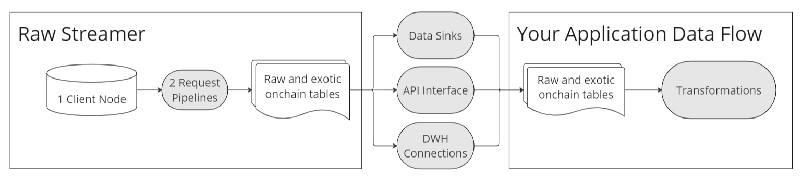
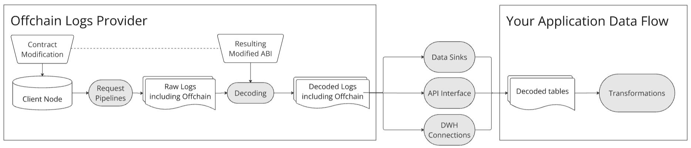

In the ever-evolving landscape of blockchain technology, managing and interpreting vast amounts of data presents both a challenge and an opportunity. For developers and businesses looking to leverage blockchain without the complexity of managing their own nodes and infrastructure, outsourced data services have become a crucial solution. This chapter delves into various outsourced data types that have emerged to address these needs, offering scalable, reliable, and efficient methods to access and process blockchain data.

## Node-as-a-Service {#node-as-a-service}

**What is it?** \- Running your own node can be challenging, especially when getting started or when you want to scale fast. These services run optimized node infrastructures for you, and provide an interface for you to request its data, so you can focus on developing your transformation or product instead. Oftentimes, node services will run a variety of chains and optimized types, so you don’t need to run multiple clients, allowing you to access full and archive nodes in addition to client-specific methods in one API.

Running your own node can be daunting, especially when starting out or scaling quickly. Node-as-a-Service (NaaS) providers offer optimized node infrastructures, allowing you to focus on development without the hassle of managing your own nodes. These services often support a range of chains and optimized types, providing access to both full and archive nodes, as well as client-specific methods, through a unified API.

**How does it work? \-** NaaS providers operate distributed node clients behind the scenes and typically offer an API interface for interacting with the blockchain. This can include dedicated nodes or shared nodes that balance request loads. While NaaS itself does not index data, it may offer optimization features and provide raw or decoded data streams upon request.

**Examples:** Alchemy, Infura, Akr, Quicknode, Tenderly

**Data available:** Everything you can request a node, including raw and more exotic onchain data.

## Raw Stream {#raw-stream}

**What is it?** \- Customers often require data in large quantities and in a regular cadence to keep up with the chain tip. Raw Stream services provide a solution by offering standardized schemas for frequently requested data and delivering it through various interfaces and sinks.

**How does it work? \-** Raw Stream services are similar to Node-as-a-Service but with the added capability of storing and serving large volumes of data. These providers maintain infrastructure designed to handle continuous data flows, ensuring that users can access real-time or near-real-time data efficiently.

**Examples:** Major Node-as-a-Service providers such as Alchemy, Infura, Akr, QuickNode, Tenderly, and Block Native, as well as specialized decoded streamers, offer raw streaming capabilities.

**Data available:**

* Typically Blocks, Transaction, Traces, Logs
* MemPool data
* Blob Indexing
* Beacon Chain
* MEV data

## Decoded Stream {#decoded-stream}

**What is it? \-** Decoded streaming services take raw data streams a step further by providing human-readable logs, traces, and sometimes view function tables. This relatively new service simplifies working with complex blockchain data by translating it into formats that are easier to interpret and analyze.

**How does it work? \-** Decoding data involves more than just accessing raw data from the nodes. Providers must maintain a comprehensive ABI (Application Binary Interface) database and a decoding system running. Since ABIs cannot be sourced directly from the blockchain, they are usually obtained from off-chain providers like Etherscan, where contracts are submitted for transparency and auditability. However, not all contracts have their ABIs available.

There are two primary methods for decoding data:

1. **Manual ABI Retrieval:** This method, pioneered by Dune, involves users filling out a form to provide an ABI or allowing the system to automatically download it from Etherscan. Only the requested contracts are decoded, with a exact ABI match, making this method highly reliable but dependent on having a wide range of contract submissions to increase corverage.
2. **Algorithmic Decoding:** This method uses algorithms to match log and function signatures (topic0, 8 bytes) with any available ABIs. Although it involves complex logic, because contracts share a lot of code, the algotith can identify ABIs that match contract signatures even if the exact ABI file is not available. This approach offers broader coverage but may require handling mismatches. This method is very useful for analytics since it allows exploration of contract data without prior knowing about it existence.

**Examples:** Dune, Flipside, Allium, Sonaverse, Bitquery, Chainbase

**Data available:**

* Decoded Traces, Decoded Logs, ERC20/721/1155 Transfer Evts
* BalanceOf and SupplyOf view functions (Allium), triggered after a transferEvt

## Indexed Data API {#indexed-data}

**What is it? \-**  Indexed Data APIs is the regular product for any data provider. They provide metrics (transformed data) through an API, often accompanied by an SDK for easier integration.These metrics can encompass a wide range of data, with providers continually expanding their offerings to include new and specialized metrics, each provider trying to open new niches.

**How does it work?** While it might seem that Indexed Data Providers are an evolution of previous services, they actually serve a different function. Although the data still undergoes the entire flow described in the first post of this series, Indexed Data Providers typically operate with a more streamlined stack. They focus on extracting, transforming, loading and delivering specific metrics rather then serving decoded, raw, or data requests from their clients. The previous types of services are designed for scalability, offering a standartized and broad range of data, without transformation, whereas Indexed Data Providers are optimized for providing specific, pre-processed metrics.

Moreover, the streaming services discussed earlier can only provide raw and decoded data. If the metrics offered by an Indexed Data Provider require “Other Onchain Data,” their systems must make additional node requests—either through their own nodes or by relying on external nodes—to source the necessary data according to their specifications.

**Examples:** Nansem, Defillama, Artemis, Bitquery, Arkham, Blockworks, Glassnode, Messari, Token Terminal

**Data available:**

* Network and Protocol Metrics (Dex, Lending, Derivatives and Perps, Dex Agg, etc)  
* NFT  
* Wallet interaction and balances  
* Mempool  
* Bridges  
* Staking, etc

## Offchain Logs

**What is it? \-**  Offchain logs are similar to regular logs, but instead of it being emitted by the contracts deployed on the blockchain, it’s emitted by modifying in the contract’s source code locally, and then submitting it to a special archive node. This node re-executes the blockchain history up to the current head, but running the contract’s new code version instead. Companies offering shadow logs provide the data in a format similar to how raw or decoded logs are delivered. 

**How does it work? \-** Unlike regular logs, which must be written into the original contract code, offchain logs can be created by anyone at any time, not just the deployer. This flexibility enables the creation of logs and metrics that were not present in the original contract deployment. Offchain logs can thus access a wide range of data types, including parts of the state that otherwise would be much more complex to read, such as internal functions and internal variables. This makes offchain logs a powerful tool for in-deep data analysis.

**Examples:** Shadow Logs, Ghost Logs

## Conclusion

Understanding what services can be outsourced have become essential for navigating the vast and complex landscape of crypto data. From running nodes to providing raw, decoded, and indexed data, these services allow developers and businesses to access the blockchain efficiently without managing their own infrastructure. Each type of outsourced data offers unique trade-offs that cater to different needs. By leveraging these services, users can focus on building and scaling their applications, while the heavy lifting of data  infrastructure is handled by specialized providers. As the ecosystem continues to evolve, the reliance on keeping these outsourced solutions accessible will only grow, making them a cornerstone of the crypto data landscape.
