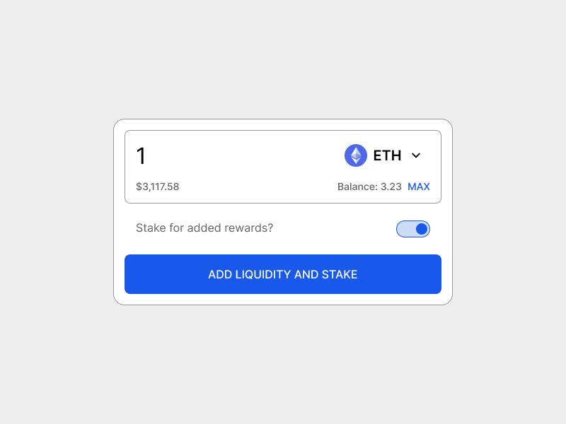

Usability heuristics are broad “rules of thumb” that you can use to measure the usability of your site.
The 7 heuristics here are specifically tailored for Web3 and should be used alongside Jakob Nielsen's [10 general principles for interaction design](https://www.nngroup.com/articles/ten-usability-heuristics/).

## Seven usability heuristics for web3 {#seven-usability-heuristics-for-web3}

1. Feedback follows action
2. Security and trust
3. The most important info is obvious
4. Understandable terminology
5. Actions are as short as possible
6. Network connections are visible and flexible
7. Control from the app, not the wallet

## Definitions and examples {#definitions-and-examples}

### 1. Feedback follows action {#feedback-follows-action}

**It should be obvious when something has happened, or is happening.**

Users decide on their next steps based on the outcome of their previous steps. Therefore it is essential that they remain informed about the system status. This is especially important in Web3 as transactions can sometimes take a short time to commit to the blockchain. If there is no feedback informing them to wait, users are unsure if anything has happened.

**Tips:** 
- Inform the user via messaging, notifications, and other alerts.
- Communicate waiting times clearly.
- If an action is going to take longer than a few seconds, reassure the user with a timer or an animation to make them feel like something is happening.
- If there are multiple steps to a process, show each step.

**Example:**
Showing each step involved in a transaction helps users know where they are in the process. Appropriate icons let the user know the status of their actions.

### 2. Security and trust are baked in {#security-and-trust-are-backed-in}

Security should be prioritized, and this should be emphasized for the user. 
People care deeply about their data. Safety is often a primary concern for users, so it should be considered at all levels of the design. You should always be seeking to earn the trust of your users, but the way you do this can mean different things on different apps. It should not be an afterthought, but should be designed consciously throughout. Build trust throughout the user experience, including social channels and documentation, as well as the final UI. Things like the level of decentralization, the treasury multi-sig status, and whether the team is doxxed, all affect users' trust

**Tips:**
- List your audits proudly
- Get multiple audits
- Advertise any safety features that you designed
- Highlight possible risks, including underlying integrations
- Communicate complexity of strategies
- Consider non-UI issues that might affect your users' perception of safety

**Example:** 
Include your audits in the footer, at a prominent size.

### 3. The most important info is obvious {#the-most-important-info-is-obvious}

For complex systems, show only the most relevant data. Determine what is most important, and prioritize its display. 
Too much information is overwhelming and users typically anchor on one piece of information when making decisions. In DeFi, this will probably be APR on yield apps and LTV on lending apps.

**Tips:**
- User research will uncover the most important metric
- Make the key info big, and the other details small and unobtrusive
- People don’t read, they scan; ensure your design is scannable

**Example:** Large tokens in full color are easy to find when scanning. The APR is big and highlighted in an accent color.

### 4. Clear terminology {#clear-terminology}

Terminology should be understandable and appropriate.
Technical jargon can be a huge blocker, because it requires the construction of a completely new mental model. Users are unable to relate the design to words, phrases and concepts they already know. Everything seems confusing and unfamiliar, and there is a steep learning curve before they can even attempt to use it. A users might approach DeFi wanting to save some money, and what they find is: Mining, farming, staking, emissions, bribes, vaults, lockers, veTokens, vesting, epochs, decentralized algorithms, protocol-owned liquidity…
Try to use simple terms that will be understood by the broadest group of people. Do not invent brand new terms just for your project.

**Tips:**
- Use simple and consistent terminology
- Use existing language as much as possible
- Don’t come up with your own terms
- Follow conventions as they appear
- Educate users as much as possible

**Example:**
“Your rewards” is a broadly understood, neutral, term; not a new word made up for this project. The rewards are denominated in USD to match real world mental models, even if the rewards themselves are in another token.

### 5. Actions are as short as possible {#actions-are-as-short-as-possible}

Speed up the user’s interactions by grouping sub actions. 
This may be done on the smart contract level, as well as the UI. The user should not have to move from one part of the system to another – or leave the system entirely – to complete a common action. 

**Tips:**
- Combine "Approve" with other actions where possible
- Bundle signing steps as close together as possible

**Example:** Combining “add liquidity” and “stake” is a simple example of an accelerator that saves a user both time and gas.

### 6. Network connections are visible and flexible {#network-connections-are-visible-and-flexible}

Inform the user about what network they are connected to, and provide clear shortcuts to change network. 
This is especially important on multichain apps. The main functions of the app should still be visible while disconnected or connected to a non-supported network.

**Tips:**
- Show as much of the app as possible while disconnected
- Show which network the user is currently connected to
- Don’t make the user go to the wallet to change network
- If the app requires the user to switch network, prompt the action from the main call to action
- If the app contains markets or vaults for multiple networks, clearly state which set the user is currently looking at

**Example:** Show the user which network they are connected to, and allow them to change it,  in the appbar.

### 7. Control from the app, not the wallet {#control-from-the-app-not-the-wallet}

The UI should tell the user everything they need to know and give them control over everything they need to do. 
In Web3, there are actions you take in the UI, and actions you take in the wallet. Generally, you initiate an action in the UI, and then confirm it in the wallet. Users can feel uncomfortable if these two strands are not integrated carefully.

**Tips:**
- Communicate system status via feedback in the UI
- Keep a record of their history
- Provide links to block explorers for old transactions
- Provide shortcuts to change networks. 

**Example:** A subtle container shows the user what relevant tokens they have in their wallet, and the main CTA provides a shortcut to change the network.

