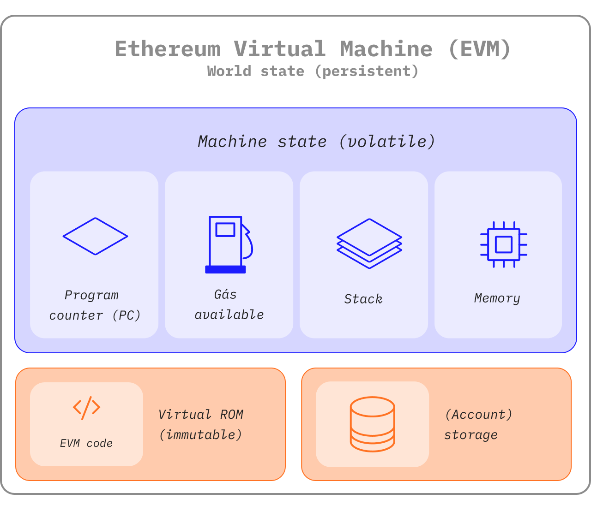

The Ethereum Virtual Machine (EVM) is a decentralized virtual environment that executes code consistently and securely across all Ethereum nodes. Nodes run the EVM to execute smart contracts, using "[gas](/gas/)" to measure the computational effort required for [operations](/developers/docs/evm/opcodes/), ensuring efficient resource allocation and network security.

## Prerequisites {#prerequisites}

Some basic familiarity with common terminology in computer science such as [bytes](https://wikipedia.org/wiki/Byte), [memory](https://wikipedia.org/wiki/Computer_memory), and a [stack](<https://wikipedia.org/wiki/Stack_(abstract_data_type)>) are necessary to understand the EVM. It would also be helpful to be comfortable with cryptography/blockchain concepts like [hash functions](https://wikipedia.org/wiki/Cryptographic_hash_function) and the [Merkle tree](https://wikipedia.org/wiki/Merkle_tree).

## From ledger to state machine {#from-ledger-to-state-machine}

The analogy of a 'distributed ledger' is often used to describe blockchains like Bitcoin, which enable a decentralized currency using fundamental tools of cryptography. The ledger maintains a record of activity which must adhere to a set of rules that govern what someone can and cannot do to modify the ledger. For example, a Bitcoin address cannot spend more Bitcoin than it has previously received. These rules underpin all transactions on Bitcoin and many other blockchains.

While Ethereum has its own native cryptocurrency (ether) that follows almost exactly the same intuitive rules, it also enables a much more powerful function: [smart contracts](/developers/docs/smart-contracts/). For this more complex feature, a more sophisticated analogy is required. Instead of a distributed ledger, Ethereum is a distributed [state machine](https://wikipedia.org/wiki/Finite-state_machine). Ethereum's state is a large data structure which holds not only all accounts and balances, but a _machine state_, which can change from block to block according to a pre-defined set of rules, and which can execute arbitrary machine code. The specific rules of changing state from block to block are defined by the EVM.


_Diagram adapted from [Ethereum EVM illustrated](https://takenobu-hs.github.io/downloads/ethereum_evm_illustrated.pdf)_

## The Ethereum state transition function {#the-ethereum-state-transition-function}

The EVM behaves as a mathematical function would: Given an input, it produces a deterministic output. It therefore is quite helpful to more formally describe Ethereum as having a **state transition function**:

```
Y(S, T)= S'
```

Given an old valid state `(S)` and a new set of valid transactions `(T)`, the Ethereum state transition function `Y(S, T)` produces a new valid output state `S'`

### State {#state}

In the context of Ethereum, the state is an enormous data structure called a [modified Merkle Patricia Trie](/developers/docs/data-structures-and-encoding/patricia-merkle-trie/), which keeps all [accounts](/developers/docs/accounts/) linked by hashes and reducible to a single root hash stored on the blockchain.

### Transactions {#transactions}

Transactions are cryptographically signed instructions from accounts. There are two types of transactions: those which result in message calls and those which result in contract creation.

Contract creation results in the creation of a new contract account containing compiled [smart contract](/developers/docs/smart-contracts/anatomy/) bytecode. Whenever another account makes a message call to that contract, it executes its bytecode.

## EVM instructions {#evm-instructions}

The EVM executes as a [stack machine](https://wikipedia.org/wiki/Stack_machine) with a depth of 1024 items. Each item is a 256-bit word, which was chosen for the ease of use with 256-bit cryptography (such as Keccak-256 hashes or secp256k1 signatures).

During execution, the EVM maintains a transient _memory_ (as a word-addressed byte array), which does not persist between transactions.

Contracts, however, do contain a Merkle Patricia _storage_ trie (as a word-addressable word array), associated with the account in question and part of the global state.

Compiled smart contract bytecode executes as a number of EVM [opcodes](/developers/docs/evm/opcodes), which perform standard stack operations like `XOR`, `AND`, `ADD`, `SUB`, etc. The EVM also implements a number of blockchain-specific stack operations, such as `ADDRESS`, `BALANCE`, `BLOCKHASH`, etc.


_Diagrams adapted from [Ethereum EVM illustrated](https://takenobu-hs.github.io/downloads/ethereum_evm_illustrated.pdf)_

## EVM implementations {#evm-implementations}

All implementations of the EVM must adhere to the specification described in the Ethereum Yellowpaper.

Over Ethereum's nine year history, the EVM has undergone several revisions, and there are several implementations of the EVM in various programming languages.

[Ethereum execution clients](/developers/docs/nodes-and-clients/#execution-clients) include an EVM implementation. Additionally, there are multiple standalone implementations, including:

- [Py-EVM](https://github.com/ethereum/py-evm) - _Python_
- [evmone](https://github.com/ethereum/evmone) - _C++_
- [ethereumjs-vm](https://github.com/ethereumjs/ethereumjs-vm) - _JavaScript_
- [revm](https://github.com/bluealloy/revm) - _Rust_

## Further Reading {#further-reading}

- [Ethereum Yellowpaper](https://ethereum.github.io/yellowpaper/paper.pdf)
- [Jellopaper aka KEVM: Semantics of EVM in K](https://jellopaper.org/)
- [The Beigepaper](https://github.com/chronaeon/beigepaper)
- [Ethereum Virtual Machine Opcodes](https://www.ethervm.io/)
- [Ethereum Virtual Machine Opcodes Interactive Reference](https://www.evm.codes/)
- [A short introduction in Solidity's documentation](https://docs.soliditylang.org/en/latest/introduction-to-smart-contracts.html#index-6)
- [Mastering Ethereum - The Ethereum Virtual Machine](https://github.com/ethereumbook/ethereumbook/blob/develop/13evm.asciidoc)

## Related Topics {#related-topics}

- [Gas](/developers/docs/gas/)
