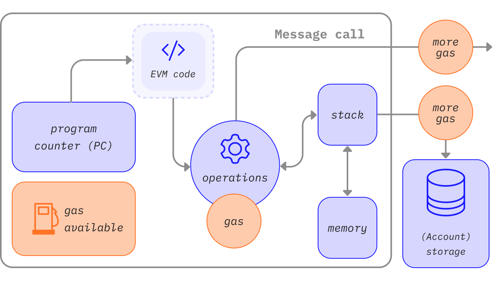
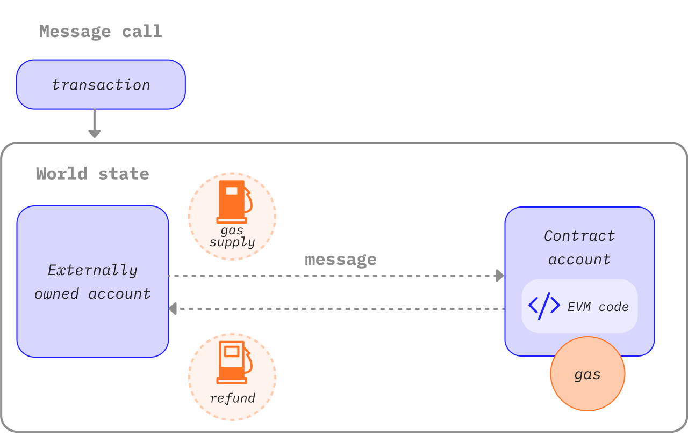

Gas is essential to the Ethereum network. It is the fuel that allows it to operate, in the same way that a car needs gasoline to run.

## Prerequisites {#prerequisites}

To better understand this page, we recommend you first read up on [transactions](/developers/docs/transactions/) and the [EVM](/developers/docs/evm/).

## What is gas? {#what-is-gas}

Gas refers to the unit that measures the amount of computational effort required to execute specific operations on the Ethereum network.

Since each Ethereum transaction requires computational resources to execute, those resources have to be paid for to ensure Ethereum is not vulnerable to spam and cannot get stuck in infinite computational loops. Payment for computation is made in the form of a gas fee.

The gas fee is **the amount of gas used to do some operation, multiplied by the cost per unit gas**. The fee is paid regardless of whether a transaction succeeds or fails.

_Diagram adapted from [Ethereum EVM illustrated](https://takenobu-hs.github.io/downloads/ethereum_evm_illustrated.pdf)_

Gas fees have to be paid in Ethereum's native currency, ether (ETH). Gas prices are usually quoted in gwei, which is a denomination of ETH. Each gwei is equal to one-billionth of an ETH (0.000000001 ETH or 10-9 ETH).

For example, instead of saying that your gas costs 0.000000001 ether, you can say your gas costs 1 gwei.

The word 'gwei' is a contraction of 'giga-wei', meaning 'billion wei'. One gwei is equal to one billion wei. Wei itself (named after [Wei Dai](https://wikipedia.org/wiki/Wei_Dai), creator of [b-money](https://www.investopedia.com/terms/b/bmoney.asp)) is the smallest unit of ETH.

## How are gas fees calculated? {#how-are-gas-fees-calculated}

You can set the amount of gas you are willing to pay when you submit a transaction. By offering a certain amount of gas, you are bidding for your transaction to be included in the next block. If you offer too little, validators are less likely to choose your transaction for inclusion, meaning your transaction may execute late or not at all. If you offer too much, you might waste some ETH. So, how can you tell how much to pay?

The total gas you pay is divided into two components: the `base fee` and the `priority fee` (tip).

The `base fee` is set by the protocol - you have to pay at least this amount for your transaction to be considered valid. The `priority fee` is a tip that you add to the base fee to make your transaction attractive to validators so that they choose it for inclusion in the next block.

A transaction that only pays the `base fee` is technically valid but unlikely to be included because it offers no incentive to the validators to choose it over any other transaction. The 'correct' `priority` fee is determined by the network usage at the time you send your transaction - if there is a lot of demand then you might have to set your `priority` fee higher, but when there is less demand you can pay less.

For example, let's say Jordan has to pay Taylor 1 ETH. An ETH transfer requires 21,000 units of gas, and the base fee is 10 gwei. Jordan includes a tip of 2 gwei.

The total fee would now be equal to:

`units of gas used * (base fee + priority fee)`

where the `base fee` is a value set by the protocol and the `priority fee` is a value set by the user as a tip to the validator.

i.e. `21,000 * (10 + 2) = 252,000 gwei` (0.000252 ETH).

When Jordan sends the money, 1.000252 ETH will be deducted from Jordan's account. Taylor will be credited 1.0000 ETH. The validator receives the tip of 0.000042 ETH. The `base fee` of 0.00021 ETH is burned.

### Base fee {#base-fee}

Every block has a base fee which acts as a reserve price. To be eligible for inclusion in a block the offered price per gas must at least equal the base fee. The base fee is calculated independently of the current block and is instead determined by the blocks before it - making transaction fees more predictable for users. When the block is created this **base fee is "burned"**, removing it from circulation.

The base fee is calculated by a formula that compares the size of the previous block (the amount of gas used for all the transactions) with the target size. The base fee will increase by a maximum of 12.5% per block if the target block size is exceeded. This exponential growth makes it economically non-viable for block size to remain high indefinitely.

| Block Number | Included Gas | Fee Increase | Current Base Fee |
| ------------ | -----------: | -----------: | ---------------: |
| 1            |          15M |           0% |         100 gwei |
| 2            |          30M |           0% |         100 gwei |
| 3            |          30M |        12.5% |       112.5 gwei |
| 4            |          30M |        12.5% |       126.6 gwei |
| 5            |          30M |        12.5% |       142.4 gwei |
| 6            |          30M |        12.5% |       160.2 gwei |
| 7            |          30M |        12.5% |       180.2 gwei |
| 8            |          30M |        12.5% |       202.7 gwei |

Following the table above - to create a transaction on block number 9, a wallet will let the user know with certainty that the **maximum base fee** to be added to the next block is `current base fee * 112.5%` or `202.7 gwei * 112.5% = 228.1 gwei`.

It's also important to note it is unlikely we will see extended spikes of full blocks because of the speed at which the base fee increases preceding a full block.

| Block Number | Included Gas | Fee Increase | Current Base Fee |
| ------------ | -----------: | -----------: | ---------------: |
| 30           |          30M |        12.5% |      2705.6 gwei |
| ...          |          ... |        12.5% |              ... |
| 50           |          30M |        12.5% |     28531.3 gwei |
| ...          |          ... |        12.5% |              ... |
| 100          |          30M |        12.5% |  10302608.6 gwei |

### Priority fee (tips) {#priority-fee}

The priority fee (tip) incentivizes validators to include a transaction in the block. Without tips, validators would find it economically viable to mine empty blocks, as they would receive the same block reward. Small tips give validators a minimal incentive to include a transaction. For transactions to be preferentially executed ahead of other transactions in the same block, a higher tip can be added to try to outbid competing transactions.

### Max fee {#maxfee}

To execute a transaction on the network, users can specify a maximum limit they are willing to pay for their transaction to be executed. This optional parameter is known as the `maxFeePerGas`. For a transaction to be executed, the max fee must exceed the sum of the base fee and the tip. The transaction sender is refunded the difference between the max fee and the sum of the base fee and tip.

### Block size {#block-size}

Each block has a target size of 15 million gas, but the size of blocks will increase or decrease in accordance with network demand, up until the block limit of 30 million gas (2x the target block size). The protocol achieves an equilibrium block size of 15 million on average through the process of _tâtonnement_. This means if the block size is greater than the target block size, the protocol will increase the base fee for the following block. Similarly, the protocol will decrease the base fee if the block size is less than the target block size. The amount by which the base fee is adjusted is proportional to how far the current block size is from the target. [More on blocks](/developers/docs/blocks/).

### Calculating gas fees in practice {#calculating-fees-in-practice}

You can explicitly state how much you are willing to pay to get your transaction executed. However, most wallet providers will automatically set a recommended transaction fee (base fee + recommended priority fee) to reduce the amount of complexity burdened onto their users.

## Why do gas fees exist? {#why-do-gas-fees-exist}

In short, gas fees help keep the Ethereum network secure. By requiring a fee for every computation executed on the network, we prevent bad actors from spamming the network. In order to avoid accidental or hostile infinite loops or other computational wastage in code, each transaction is required to set a limit to how many computational steps of code execution it can use. The fundamental unit of computation is "gas".

Although a transaction includes a limit, any gas not used in a transaction is returned to the user (i.e. `max fee - (base fee + tip)` is returned).

_Diagram adapted from [Ethereum EVM illustrated](https://takenobu-hs.github.io/downloads/ethereum_evm_illustrated.pdf)_

## What is the gas limit? {#what-is-gas-limit}

The gas limit refers to the maximum amount of gas you are willing to consume on a transaction. More complicated transactions involving [smart contracts](/developers/docs/smart-contracts/) require more computational work, so they require a higher gas limit than a simple payment. A standard ETH transfer requires a gas limit of 21,000 units of gas.

For example, if you put a gas limit of 50,000 for a simple ETH transfer, the EVM would consume 21,000, and you would get back the remaining 29,000. However, if you specify too little gas, for example, a gas limit of 20,000 for a simple ETH transfer, the EVM will consume your 20,000 gas units attempting to fulfill the transaction, but it will not complete. The EVM then reverts any changes, but since the validator has already done 20k gas units worth of work, that gas is consumed.

## Why can gas fees get so high? {#why-can-gas-fees-get-so-high}

High gas fees are due to the popularity of Ethereum. If there's too much demand, users must offer higher tip amounts to try and outbid other users' transactions. A higher tip can make it more likely that your transaction will get into the next block. Also, more complex smart contract apps might be doing lots of operations to support their functions, making them consume a lot of gas.

## Initiatives to reduce gas costs {#initiatives-to-reduce-gas-costs}

The Ethereum [scalability upgrades](/roadmap/) should ultimately address some of the gas fee issues, which will, in turn, enable the platform to process thousands of transactions per second and scale globally.

Layer 2 scaling is a primary initiative to greatly improve gas costs, user experience and scalability. [More on layer 2 scaling](/developers/docs/scaling/#layer-2-scaling).

## Monitoring gas fees {#monitoring-gas-fees}

If you want to monitor gas prices, so you can send your ETH for less, you can use many different tools such as:

- [Etherscan](https://etherscan.io/gastracker) _Transaction gas price estimator_
- [ETH Gas Tracker](https://www.ethgastracker.com/) _Monitor and track the Ethereum, and L2 gas prices to reduce transaction fees and save money_
- [Blocknative ETH Gas Estimator](https://chrome.google.com/webstore/detail/blocknative-eth-gas-estim/ablbagjepecncofimgjmdpnhnfjiecfm) _Gas estimating Chrome extension supporting both Type 0 legacy transactions and Type 2 EIP-1559 transactions._
- [Cryptoneur Gas Fees Calculator](https://www.cryptoneur.xyz/gas-fees-calculator) _Calculate gas fees in your local currency for different transaction types on Mainnet, Arbitrum, and Polygon._

## Related tools {#related-tools}

- [Blocknative's Gas Platform](https://www.blocknative.com/gas) _Gas estimation API powered by Blocknative's global mempool data platform_

## Further reading {#further-reading}

- [Ethereum Gas Explained](https://defiprime.com/gas)
- [Reducing the gas consumption of your Smart Contracts](https://medium.com/coinmonks/8-ways-of-reducing-the-gas-consumption-of-your-smart-contracts-9a506b339c0a)
- [Proof of Stake versus Proof of Work](https://blockgeeks.com/guides/proof-of-work-vs-proof-of-stake/)
- [Gas Optimization Strategies for Developers](https://www.alchemy.com/overviews/solidity-gas-optimization)
- [EIP-1559 docs](https://eips.ethereum.org/EIPS/eip-1559).
- [Tim Beiko's EIP-1559 Resources](https://hackmd.io/@timbeiko/1559-resources).
