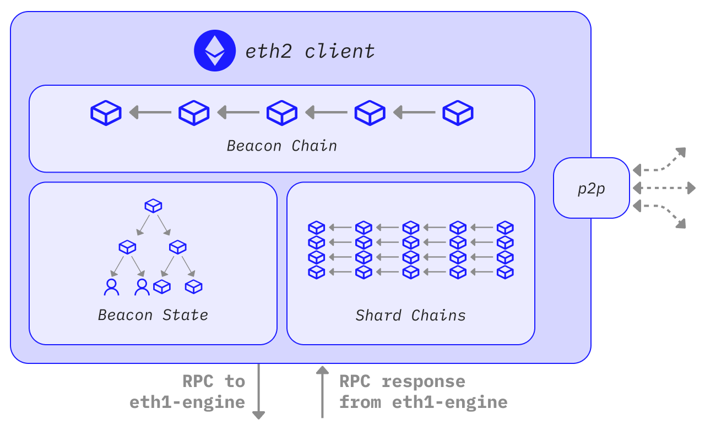
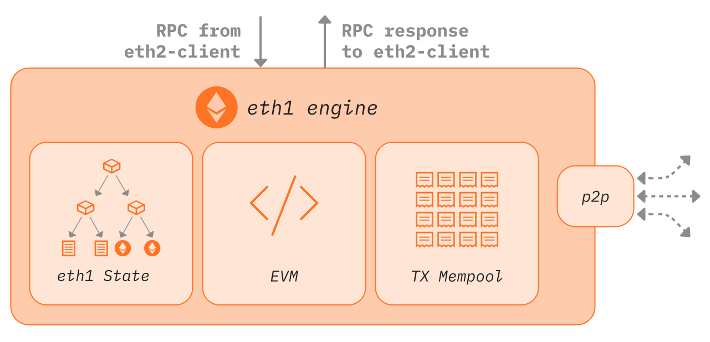

Ethereum is a peer-to-peer network with thousands of nodes that must be able to communicate with one another using standardized protocols. The "networking layer" is the stack of protocols that allow those nodes to find each other and exchange information. This includes "gossiping" information (one-to-many communication) over the network as well as swapping requests and responses between specific nodes (one-to-one communication). Each node must adhere to specific networking rules to ensure they are sending and receiving the correct information.

There are two parts to the client software (execution clients and consensus clients), each with its own distinct networking stack. As well as communicating with other Ethereum nodes, the execution and consensus clients have to communicate with each other. This page gives an introductory explanation of the protocols that enable this communication.

Execution clients gossip transactions over the execution-layer peer-to-peer network. This requires encrypted communication between authenticated peers. When a validator is selected to propose a block, transactions from the node's local transaction pool will be passed to consensus clients via a local RPC connection, which will be packaged into Beacon blocks. Consensus clients will then gossip Beacon blocks across their p2p network. This requires two separate p2p networks: one connecting execution clients for transaction gossip and one connecting consensus clients for block gossip.

## Prerequisites {#prerequisites}

Some knowledge of Ethereum [nodes and clients](/developers/docs/nodes-and-clients/) will be helpful for understanding this page.

## The Execution Layer {#execution-layer}

The execution layer's networking protocols is divided into two stacks:

- the discovery stack: built on top of UDP and allows a new node to find peers to connect to

- the DevP2P stack: sits on top of TCP and enables nodes to exchange information

Both stacks work in parallel. The discovery stack feeds new network participants into the network, and the DevP2P stack enables their interactions.

### Discovery {#discovery}

Discovery is the process of finding other nodes in network. This is bootstrapped using a small set of bootnodes (nodes whose addresses are [hardcoded](https://github.com/ethereum/go-ethereum/blob/master/params/bootnodes.go) into the client so they can be found immediately and connect the client to peers). These bootnodes only exist to introduce a new node to a set of peers - this is their sole purpose, they do not participate in normal client tasks like syncing the chain, and they are only used the very first time a client is spun up.

The protocol used for the node-bootnode interactions is a modified form of [Kademlia](https://medium.com/coinmonks/a-brief-overview-of-kademlia-and-its-use-in-various-decentralized-platforms-da08a7f72b8f) which uses a [distributed hash table](https://en.wikipedia.org/wiki/Distributed_hash_table) to share lists of nodes. Each node has a version of this table containing the information required to connect to its closest peers. This 'closeness' is not geographical - distance is defined by the similarity of the node's ID. Each node's table is regularly refreshed as a security feature. For example, in the [Discv5](https://github.com/ethereum/devp2p/tree/master/discv5), discovery protocol nodes are also able to send 'ads' that display the subprotocols that the client supports, allowing peers to negotiate about the protocols they can both use to communicate over.

Discovery starts with a game of PING-PONG. A successful PING-PONG "bonds" the new node to a bootnode. The initial message that alerts a bootnode to the existence of a new node entering the network is a `PING`. This `PING` includes hashed information about the new node, the bootnode and an expiry time-stamp. The bootnode receives the `PING` and returns a `PONG` containing the `PING` hash. If the `PING` and `PONG` hashes match then the connection between the new node and bootnode is verified and they are said to have "bonded".

Once bonded, the new node can send a `FIND-NEIGHBOURS` request to the bootnode. The data returned by the bootnode includes a list of peers that the new node can connect to. If the nodes are not bonded, the `FIND-NEIGHBOURS` request will fail, so the new node will not be able to enter the network.

Once the new node receives a list of neighbours from the bootnode, it begins a PING-PONG exchange with each of them. Successful PING-PONGs bond the new node with its neighbours, enabling message exchange.

```
start client --> connect to bootnode --> bond to bootnode --> find neighbours --> bond to neighbours
```

Execution clients are currently using the [Discv4](https://github.com/ethereum/devp2p/blob/master/discv4.md) discovery protocol and there is an active effort to migrate to the [Discv5](https://github.com/ethereum/devp2p/tree/master/discv5) protocol.

#### ENR: Ethereum Node Records {#enr}

The [Ethereum Node Record (ENR)](/developers/docs/networking-layer/network-addresses/) is an object that contains three basic elements: a signature (hash of record contents made according to some agreed identity scheme), a sequence number that tracks changes to the record, and an arbitrary list of key:value pairs. This is a future-proof format that allows easier exchange of identifying information between new peers and is the preferred [network address](/developers/docs/networking-layer/network-addresses) format for Ethereum nodes.

#### Why is discovery built on UDP? {#why-udp}

UDP does not support any error checking, resending of failed packets, or dynamically opening and closing connections - instead it just fires a continuous stream of information at a target, regardless of whether it is successfully received. This minimal functionality also translates into minimal overhead, making this kind of connection very fast. For discovery, where a node simply wants to make its presence known in order to then establish a formal connection with a peer, UDP is sufficient. However, for the rest of the networking stack, UDP is not fit for purpose. The informational exchange between nodes is quite complex and therefore needs a more fully featured protocol that can support resending, error checking etc. The additional overhead associated with TCP is worth the additional functionality. Therefore, the majority of the P2P stack operates over TCP.

### DevP2P {#devp2p}

DevP2P is itself a whole stack of protocols that Ethereum implements to establish and maintain the peer-to-peer network. After new nodes enter the network, their interactions are governed by protocols in the [DevP2P](https://github.com/ethereum/devp2p) stack. These all sit on top of TCP and include the RLPx transport protocol, wire protocol and several sub-protocols. [RLPx](https://github.com/ethereum/devp2p/blob/master/rlpx.md) is the protocol governing initiating, authenticating and maintaining sessions between nodes. RLPx encodes messages using RLP (Recursive Length Prefix) which is a very space-efficient method of encoding data into a minimal structure for sending between nodes.

A RLPx session between two nodes begins with an initial cryptographic handshake. This involves the node sending an auth message which is then verified by the peer. On successful verification, the peer generates an auth-acknowledgement message to return to the initiator node. This is a key-exchange process that enables the nodes to communicate privately and securely. A successful cryptographic handshake then triggers both nodes to send a "hello" message to one another "on the wire". The wire protocol is initiated by a successful exchange of hello messages.

The hello messages contain:

- protocol version
- client ID
- port
- node ID
- list of supported sub-protocols

This is the information required for a successful interaction because it defines what capabilities are shared between both nodes and configures the communication. There is a process of sub-protocol negotiation where the lists of sub-protocols supported by each node are compared and those that are common to both nodes can be used in the session.

Along with the hello messages, the wire protocol can also send a "disconnect" message that gives warning to a peer that the connection will be closed. The wire protocol also includes PING and PONG messages that are sent periodically to keep a session open. The RLPx and wire protocol exchanges therefore establish the foundations of communication between the nodes, providing the scaffolding for useful information to be exchanged according to a specific sub-protocol.

### Sub-protocols {#sub-protocols}

#### Wire protocol {#wire-protocol}

Once peers are connected, and an RLPx session has been started, the wire protocol defines how peers communicate. Initially, the wire protocol defined three main tasks: chain synchronization, block propagation and transaction exchange. However, once Ethereum switched to proof-of-stake, block propagation and chain synchronization became part of the consensus layer. Transaction exchange is still in the remit of the execution clients. Transaction exchange refers to exchanging pending transactions between nodes so that block builders can select some of them for inclusion in the next block. Detailed information about these tasks is available [here](https://github.com/ethereum/devp2p/blob/master/caps/eth.md). Clients that support these sub-protocols expose them via the [JSON-RPC](/developers/docs/apis/json-rpc/).

#### les (light ethereum subprotocol) {#les}

This is a minimal protocol for syncing light clients. Traditionally this protocol has rarely been used because full nodes are required to serve data to light clients without being incentivized. The default behavior of execution clients is not to serve light client data over les. More information is available in the les [spec](https://github.com/ethereum/devp2p/blob/master/caps/les.md).

#### Snap {#snap}

The [snap protocol](https://github.com/ethereum/devp2p/blob/master/caps/snap.md#ethereum-snapshot-protocol-snap) is an optional extension that allows peers to exchange snapshots of recent states, allowing peers to verify account and storage data without having to download intermediate Merkle trie nodes.

#### Wit (witness protocol) {#wit}

The [witness protocol](https://github.com/ethereum/devp2p/blob/master/caps/wit.md#ethereum-witness-protocol-wit) is an optional extension that enables exchange of state witnesses between peers, helping to sync clients to the tip of the chain.

#### Whisper {#whisper}

Whisper was a protocol that aimed to deliver secure messaging between peers without writing any information to the blockchain. It was part of the DevP2P wire protocol but is now deprecated. Other [related projects](https://wakunetwork.com/) exist with similar aims.

## The consensus layer {#consensus-layer}

The consensus clients participate in a separate peer-to-peer network with a different specification. Consensus clients need to participate in block gossip so that they can receive new blocks from peers and broadcast them when it is their turn to be block proposer. Similar to the execution layer, this first requires a discovery protocol so that a node can find peers and establish secure sessions for exchanging blocks, attestations etc.

### Discovery {#consensus-discovery}

Similar to the execution clients, consensus clients use [discv5](https://github.com/ethereum/consensus-specs/blob/dev/specs/phase0/p2p-interface.md#the-discovery-domain-discv5) over UDP for finding peers. The consensus layer implementation of discv5 differs from that of the execution clients only in that it includes an adaptor connecting discv5 into a [libP2P](https://libp2p.io/) stack, deprecating DevP2P. The execution layer's RLPx sessions are deprecated in favour of libP2P's noise secure channel handshake.

### ENRs {#consensus-enr}

The ENR for consensus nodes includes the node's public key, IP address, UDP and TCP ports and two consensus-specific fields: the attestation subnet bitfield and `eth2` key. The former makes it easier for nodes to find peers participating in specific attestation gossip sub-networks. The `eth2` key contains information about which Ethereum fork version the node is using, ensuring peers are connecting to the right Ethereum.

### libP2P {#libp2p}

The libP2P stack supports all communications after discovery. Clients can dial and listen on IPv4 and/or IPv6 as defined in their ENR. The protocols on the libP2P layer can be subdivided into the gossip and req/resp domains.

### Gossip {#gossip}

The gossip domain includes all information that has to spread rapidly throughout the network. This includes beacon blocks, proofs, attestations, exits and slashings. This is transmitted using libP2P gossipsub v1 and relies on various metadata being stored locally at each node, including maximum size of gossip payloads to receive and transmit. Detailed information about the gossip domain is available [here](https://github.com/ethereum/consensus-specs/blob/dev/specs/phase0/p2p-interface.md#the-gossip-domain-gossipsub).

### Request-response {#request-response}

The request-response domain contains protocols for clients requesting specific information from their peers. Examples include requesting specific Beacon blocks matching certain root hashes or within a range of slots. The responses are always returned as snappy-compressed SSZ encoded bytes.

## Why does the consensus client prefer SSZ to RLP? {#ssz-vs-rlp}

SSZ stands for simple serialization. It uses fixed offsets that make it easy to decode individual parts of an encoded message without having to decode the entire structure, which is very useful for the consensus client as it can efficiently grab specific pieces of information from encoded messages. It is also designed specifically to integrate with Merkle protocols, with related efficiency gains for Merkleization. Since all hashes in the consensus layer are Merkle roots, this adds up to a significant improvement. SSZ also guarantees unique representations of values.

## Connecting the execution and consensus clients {#connecting-clients}

Both consensus and execution clients run in parallel. They need to be connected so that the consensus client can provide instructions to the execution client, and the execution client can pass bundles of transactions to the consensus client to include in Beacon blocks. The communication between the two clients can be achieved using a local RPC connection. An API known as the ['Engine-API'](https://github.com/ethereum/execution-apis/blob/main/src/engine/common.md) defines the instructions sent between the two clients. Since both clients sit behind a single network identity, they share an ENR (Ethereum node record) which contains a separate key for each client (eth1 key and eth2 key).

A summary of the control flow is shown below, with the relevant networking stack in brackets.

### When consensus client is not block producer: {#when-consensus-client-is-not-block-producer}

- Consensus client receives a block via the block gossip protocol (consensus p2p)
- Consensus client pre-validates the block, i.e. ensures it arrived from a valid sender with correct metadata
- The transactions in the block are sent to the execution layer as an execution payload (local RPC connection)
- The execution layer executes the transactions and validates the state in the block header (i.e. checks hashes match)
- Execution layer passes validation data back to consensus layer, block now considered to be validated (local RPC connection)
- Consensus layer adds block to head of its own blockchain and attests to it, broadcasting the attestation over the network (consensus p2p)

### When consensus client is block producer: {#when-consensus-client-is-block-producer}

- Consensus client receives notice that it is the next block producer (consensus p2p)
- Consensus layer calls `create block` method in execution client (local RPC)
- Execution layer accesses the transaction mempool which has been populated by the transaction gossip protocol (execution p2p)
- Execution client bundles transactions into a block, executes the transactions and generates a block hash
- Consensus client grabs the transactions and block hash from the execution client and adds them to the beacon block (local RPC)
- Consensus client broadcasts the block over the block gossip protocol (consensus p2p)
- Other clients receive the proposed block via the block gossip protocol and validate as described above (consensus p2p)

Once the block has been attested by sufficient validators it is added to the head of the chain, justified and eventually finalized.




Network layer schematic for consensus and execution clients, from [ethresear.ch](https://ethresear.ch/t/eth1-eth2-client-relationship/7248)

## Further Reading {#further-reading}

[DevP2P](https://github.com/ethereum/devp2p)
[LibP2p](https://github.com/libp2p/specs)
[Consensus layer network specs](https://github.com/ethereum/consensus-specs/blob/dev/specs/phase0/p2p-interface.md#enr-structure)
[kademlia to discv5](https://vac.dev/kademlia-to-discv5)
[kademlia paper](https://pdos.csail.mit.edu/~petar/papers/maymounkov-kademlia-lncs.pdf)
[intro to Ethereum p2p](https://p2p.paris/en/talks/intro-ethereum-networking/)
[eth1/eth2 relationship](http://ethresear.ch/t/eth1-eth2-client-relationship/7248)
[merge and eth2 client details video](https://www.youtube.com/watch?v=zNIrIninMgg)
