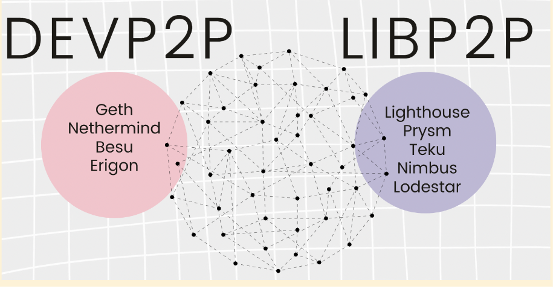

Ethereum is a network made up of computers that run Ethereum client software. Each of these computers is called a 'node'. The client software allows a node to send and receive data on the Ethereum network, and verifies data against the Ethereum protocol rules. Nodes keep a lot of historical data in their disk storage and add to it when they receive new packets of information, known as blocks, from other nodes on the network. This is necessary for always checking that a node has information consistent with the rest of the network. This means running a node can require a lot of disk space. Some node operations can require a lot of RAM too.

To get around this disk storage problem, 'light' nodes have been developed that request information from full nodes instead of storing it all themselves. However, this means the light node is not independently verifying the information and is trusting another node instead. It also means that full nodes are required to take on extra work to serve those light nodes.

The Portal Network is a new networking design for Ethereum that aims to solve the data availability problem for "light" nodes without having to trust or put extra strain on full nodes, by sharing the necessary data in small chunks across the network.

More on [nodes and clients](/developers/docs/nodes-and-clients/)

## Why do we need the Portal Network {#why-do-we-need-portal-network}

Ethereum nodes store their own full or partial copy of the Ethereum blockchain. This local copy is used to validate transactions and ensure the node is following the correct chain. This locally stored data allows nodes to independently verify that incoming data is valid and correct without needing to trust any other entity.

This local copy of the blockchain and associated state and receipt data takes up a lot of space on the node's hard disk. For example, a 2TB hard disk is recommended for running a node using [Geth](https://geth.ethereum.org) paired to a consensus client. Using snap sync, which only stores chain data from a relatively recent set of blocks, Geth typically occupies about 650GB of disk space but grows at around 14GB/week (you can prune the node back down to 650GB periodically).

This means running nodes can be expensive, because a large amount of disk space has to be dedicated to Ethereum. There are several solutions to this problem on the Ethereum roadmap, including [history expiry](/roadmap/statelessness/#history-expiry), [state expiry](/roadmap/statelessness/#state-expiry) and [statelessness](/roadmap/statelessness/). However, these are likely several years away from being implemented. There are also [light nodes](/developers/docs/nodes-and-clients/light-clients/) that do not save their own copy of the chain data, they request the data they need from full nodes. However, this means light nodes have to trust full nodes to provide honest data and also stresses the full nodes that have to serve the data the light nodes need.

The Portal Network aims to provide an alternative way for light nodes to get their data that does not require trusting or adding significantly to the work that has to be done by full nodes. The way this will be done is to introduce a new way for Ethereum nodes to share data across the network.

## How does the Portal Network work? {#how-does-portal-network-work}

Ethereum nodes have strict protocols that define how they communicate with each other. Execution clients communicate using a set of subprotocols known as [DevP2P](/developers/docs/networking-layer/#devp2p), while consensus clients use a different stack of subprotocols called [libP2P](/developers/docs/networking-layer/#libp2p). These define the types of data that can be passed between nodes.

Nodes can also serve specific data through the [JSON-RPC API](/developers/docs/apis/json-rpc/), which is how apps and wallets swap information with Ethereum nodes. However, none of these are ideal protocols for serving data to light clients.

Light clients can't currently request specific pieces of chain data over DevP2P or libP2p because those protocols are only designed to enable chain synchronization and gossiping of blocks and transactions. Light clients do not want to download this information because that would stop them from being "light".

The JSON-RPC API is not an ideal choice for light client data requests either, because it relies upon a connection to a specific full node or centralized RPC provider that can serve the data. This means the light client has to trust that specific node/provider to be honest, and also the full node might have to handle lots of requests from many light clients, adding to their bandwidth requirements.

The point of the Portal Network is to rethink the whole design, building specifically for lightness, outside of the design constraints of the existing Ethereum clients.

The core idea of the Portal Network is to take the best bits of the current networking stack by enabling information needed by light clients, such as historical data and the identity of the current head of the chain to be served through a lightweight DevP2P style peer-to-peer decentralized network using a [DHT](https://en.wikipedia.org/wiki/Distributed_hash_table) (similar to Bittorrent).

The idea is to add small parts of the total historical Ethereum data and some specific node responsibilities to each node. Then, requests are served by seeking out the nodes storing the specific data that was requested and retrieving it from them.

This inverts the normal model of light nodes finding a single node and requesting them to filter and serve large volumes of data; instead, they quickly filter a large network of nodes that each handle small amounts of data.

The goal is to allow a decentralized network of lightweight Portal clients to:

- track the head of the chain
- sync recent and historical chain data
- retrieve state data
- broadcast transactions
- execute transactions using the [EVM](/developers/docs/evm/)

The benefits of this network design are:

- reduce dependence on centralized providers
- Reduce Internet bandwidth usage
- Minimized or zero syncing
- Accessible to resource-constrained devices (<1 GB RAM, <100 MB disk space, 1 CPU)

The diagram below shows the functions of existing clients that can be delivered by the Portal Network, enabling users to access these functions on very low-resource devices.

### The Portal Networks

| Beacon light client | State network                | Transaction gossip  | History network |
| ------------------- | ---------------------------- | ------------------- | --------------- |
| Beacon chain light  | Account and contract storage | Lightweight mempool | Headers         |
| Protocol data       |                              |                     | Block bodies    |
|                     |                              |                     | Receipts        |

## Client diversity by default {#client-diversity-as-default}

The Portal Network developers also made the design choice to build three separate Portal Network clients from day one.

The Portal Network clients are:

- [Trin](https://github.com/ethereum/trin): written in Rust
- [Fluffy](https://nimbus.team/docs/fluffy.html): written in Nim
- [Ultralight](https://github.com/ethereumjs/ultralight): written in Typescript
- [Shisui](https://github.com/optimism-java/shisui): written in Go

Having multiple independent client implementations enhances the resilience and decentralization of the Ethereum network.

If one client experiences issues or vulnerabilities, other clients can continue to operate smoothly, preventing a single point of failure. Additionally, diverse client implementations foster innovation and competition, driving improvements and reducing monoculture risk within the ecosystem.

## Further reading {#further-reading}

- [The Portal Network (Piper Merriam at Devcon Bogota)](https://www.youtube.com/watch?v=0stc9jnQLXA).
- [The Portal Network discord](https://discord.gg/CFFnmE7Hbs)
- [The Portal Network website](https://www.ethportal.net/)
