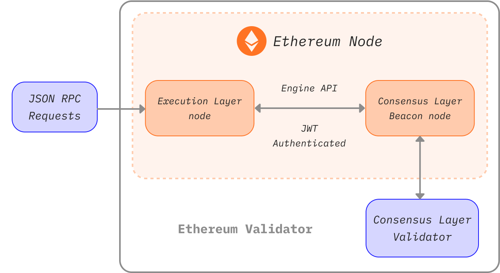

Running your own node provides you various benefits, opens new possibilities, and helps to support the ecosystem. This page will guide you through spinning up your own node and taking part in validating Ethereum transactions.

Note that after [The Merge](/roadmap/merge), two clients are required to run an Ethereum node; an **execution layer (EL)** client and a **consensus layer (CL)** client. This page will show how to install, configure and connect these two clients to run an Ethereum node.

## Prerequisites {#prerequisites}

You should understand what an Ethereum node is and why you might want to run a client. This is covered in [Nodes and clients](/developers/docs/nodes-and-clients/).

If you're new to the topic of running a node, or looking for a less technical path, we recommend first checking out our user-friendly introduction on [running an Ethereum node](/run-a-node).

## Choosing an approach {#choosing-approach}

The first step in spinning up your node is choosing your approach. Based on requirements and various possibilities, you must select the client implementation (of both execution and consensus clients), the environment (hardware, system), and the parameters for client settings.

This page will guide you through these decisions and help you find the most suitable way to run your Ethereum instance.

To choose from client implementations, see all the available Mainnet ready [execution clients](/developers/docs/nodes-and-clients/#execution-clients), [consensus clients](/developers/docs/nodes-and-clients/#consensus-clients) and learn about [client diversity](/developers/docs/nodes-and-clients/client-diversity).

Decide whether to run the software on your own [hardware or in the cloud](#local-vs-cloud), considering clients' [requirements](#requirements).

After preparing the environment, install the chosen clients either with [beginner-friendly interface](#automatized-setup) or [manually](#manual-setup) using a terminal with advanced options.

When the node is running and syncing, you are ready to [use it](#using-the-node), but make sure to keep an eye on its [maintenance](#operating-the-node).



### Environment and hardware {#environment-and-hardware}

#### Local or cloud {#local-vs-cloud}

Ethereum clients are able to run on consumer grade computers and don't require any special hardware, like mining machines for example. Therefore, you have various options for deploying the node based on your needs.
To simplify, let's think about running a node on both a local physical machine and a cloud server:

- Cloud
  - Providers offer high server uptime and static public IP addresses
  - Getting dedicated or virtual server can be more comfortable than building your own
  - Trade off is trusting a third party - server provider
  - Because of the required storage size for full node, the price of a rented server might get high
- Own hardware
  - More trustless and sovereign approach
  - One time investment
  - An option to buy preconfigured machines
  - You have to physically prepare, maintain, and potentially troubleshoot the machine and networking

Both options have different advantages summed up above. If you are looking for a cloud solution, in addition to many traditional cloud computing providers, there are also services focused on deploying nodes. Check out [nodes as a service](/developers/docs/nodes-and-clients/nodes-as-a-service/) for more options on hosted nodes.

#### Hardware {#hardware}

However, a censorship-resistant, decentralized network should not rely on cloud providers. Instead, running your node on your own local hardware is healthier for the ecosystem. [Estimations](https://www.ethernodes.org/networkType/Hosting) show a large share of nodes run on the cloud, which could become a single point of failure.

Ethereum clients can run on your computer, laptop, server, or even a single-board computer. While running clients on your personal computer is possible, having a dedicated machine just for your node can significantly enhance its performance and security while minimizing the impact on your primary computer.

Using your own hardware can be very easy. There are many simple options as well as advanced setups for more technical people. So let's look into the requirements and means for running Ethereum clients on your machine.

#### Requirements {#requirements}

Hardware requirements differ by client but generally are not that high since the node just needs to stay synced. Don't confuse it with mining, which requires much more computing power. Sync time and performance do improve with more powerful hardware however.

Before installing any client, please ensure your computer has enough resources to run it. You can find the minimum and recommended requirements below.

The bottleneck for your hardware is mostly disk space. Syncing the Ethereum blockchain is very input/output intensive and requires a lot of space. It is best to have a **solid-state drive (SSD)** with hundreds of GBs of free space to spare even after the synchronization.

The size of the database and speed of the initial synchronization depends on the chosen client, its configuration and [sync strategy](/developers/docs/nodes-and-clients/#sync-modes).

Also make sure your internet connection is not limited by a [bandwidth cap](https://wikipedia.org/wiki/Data_cap). It's recommended to use an unmetered connection since initial sync and data broadcasted to the network could exceed your limit.

##### Operating system

All clients support major operating systems - Linux, MacOS, Windows. This means you can run nodes on regular desktop or server machines with the operating system (OS) that suits you the best. Make sure your OS is up to date to avoid potential issues and security vulnerabilities.

##### Minimum requirements

- CPU with 2+ cores
- 8 GB RAM
- 2TB SSD
- 10+ MBit/s bandwidth

##### Recommended specifications

- Fast CPU with 4+ cores
- 16 GB+ RAM
- Fast SSD with 2+TB
- 25+ MBit/s bandwidth

The sync mode and client you choose will affect space requirements, but we've estimated the disk space you'll need for each client below.

| Client     | Disk size (snap sync) | Disk size (full archive) |
| ---------- | --------------------- | ------------------------ |
| Besu       | 800GB+                | 12TB+                    |
| Erigon     | N/A                   | 2.5TB+                   |
| Geth       | 500GB+                | 12TB+                    |
| Nethermind | 500GB+                | 12TB+                    |
| Reth       | N/A                   | 2.2TB+                   |

- Note: Erigon and Reth do not offer snap sync, but Full Pruning is possible (~2TB for Erigon, ~1.2TB for Reth)

For consensus clients, space requirement also depends on client implementation and enabled features (e.g. validator slasher) but generally count with another 200GB needed for beacon data. With a large number of validators, the bandwidth load grows as well. You can find [details on consensus client requirements in this analysis](https://mirror.xyz/0x934e6B4D7eee305F8C9C42b46D6EEA09CcFd5EDc/b69LBy8p5UhcGJqUAmT22dpvdkU-Pulg2inrhoS9Mbc).

#### Plug-and-play solutions {#plug-and-play}

The easiest option for running a node with your own hardware is using plug-and-play boxes. Preconfigured machines from vendors offer the most straightforward experience: order, connect, run. Everything is preconfigured and runs automatically with an intuitive guide and dashboard for monitoring and controlling the software.

- [DappNode](https://dappnode.io/)
- [Avado](https://ava.do/)

#### Ethereum on a single-board computer {#ethereum-on-a-single-board-computer}

An easy and cheap way of running an Ethereum node is to use a single board computer, even with an ARM architecture like the Raspberry Pi. [Ethereum on ARM](https://ethereum-on-arm-documentation.readthedocs.io/en/latest/) provides easy-to-run images of multiple execution and consensus client for Raspberry Pi and other ARM boards.

Small, affordable and efficient devices like these are ideal for running a node at home but keep in mind their limited performance.

## Spinning up the node {#spinning-up-node}

The actual client setup can be done either with automated launchers or manually, setting up client software directly.

For less advanced users, the recommended approach is to use a launcher, software that guides you through the installation and automates the client setup process. However, if you have some experience of using a terminal, the steps for manual setup should be simple to follow.

### Guided setup {#automatized-setup}

Multiple user-friendly projects aim to improve the experience of setting up a client. These launchers provide automatic client installation and configuration, with some even offering a graphical interface for guided setup and monitoring of clients.

Below are a few projects which can help you install and control clients just with a few clicks:

- [DappNode](https://docs.dappnode.io/docs/user/getting-started/choose-your-path) - DappNode doesn't come only with a machine from a vendor. The software, the actual node launcher and control center with many features can be used on arbitrary hardware.
- [eth-docker](https://eth-docker.net/) - Automated setup using Docker focused on easy and secure staking, requires basic terminal and Docker knowledge, recommended for a bit more advanced users.
- [Stereum](https://stereum.net/ethereum-node-setup/) - Launcher for installing clients on a remote server via SSH connection with a GUI setup guide, control center, and many other features.
- [NiceNode](https://www.nicenode.xyz/) - Launcher with a straightforward user experience to run a node on your computer. Just choose clients and start them with a few clicks. Still in development.
- [Sedge](https://docs.sedge.nethermind.io/docs/intro) - Node setup tool which automatically generates a Docker configuration using CLI wizard. Written in Go by Nethermind.

### Manual clients setup {#manual-setup}

The other option is to download, verify, and configure the client software manually. Even if some clients offer a graphical interface, a manual setup still requires basic skills with the terminal but offers much more versatility.

As explained before, setting up your own Ethereum node will require running a pair of consensus and execution clients. Some clients might include a light client of the other kind and sync without any other software needed. However, full trustless verification requires both implementations.

#### Getting the client software {#getting-the-client}

First, you need to obtain your preferred [execution client](/developers/docs/nodes-and-clients/#execution-clients) and [consensus client](/developers/docs/nodes-and-clients/#consensus-clients) software.

You can simply download an executable application or installation package that suits your operating system and architecture. Always verify the signatures and checksums of downloaded packages. Some clients also offer repositories or Docker images for easier installation and updates. All of the clients are open source, so you can also build them from source. This is a more advanced method, but in some cases, it might be required.

Instructions for installing each client are provided in the documentation linked in the client lists above.

Here are the release pages of clients where you can find their pre-built binaries or instructions on installation:

##### Execution clients

- [Besu](https://github.com/hyperledger/besu/releases)
- [Erigon](https://github.com/ledgerwatch/erigon/releases)
- [Geth](https://geth.ethereum.org/downloads/)
- [Nethermind](https://downloads.nethermind.io/)
- [Reth](https://reth.rs/installation/installation.html)

It is also worth noting that client diversity is an [issue on the execution layer](/developers/docs/nodes-and-clients/client-diversity/#execution-layer). It is recommended that readers consider running a minority execution client.

##### Consensus clients

- [Lighthouse](https://github.com/sigp/lighthouse/releases/latest)
- [Lodestar](https://chainsafe.github.io/lodestar/install/source/) (Doesn't provide a pre-built binary, only a Docker image or to be build from source)
- [Nimbus](https://github.com/status-im/nimbus-eth2/releases/latest)
- [Prysm](https://github.com/prysmaticlabs/prysm/releases/latest)
- [Teku](https://github.com/ConsenSys/teku/releases)

[Client diversity](/developers/docs/nodes-and-clients/client-diversity/) is critical for consensus nodes running validators. If the majority of validators are running a single client implementation, network security is at risk. It is therefore recommended to consider choosing a minority client.

[See the latest network client usage](https://clientdiversity.org/) and learn more about [client diversity](/developers/docs/nodes-and-clients/client-diversity).

##### Verifying the software

When downloading software from the internet, it's recommended to verify its integrity. This step is optional but especially with crucial infrastructure piece like the Ethereum client, it's important to be aware of potential attack vectors and avoid them. If you downloaded a pre-built binary, you need to trust it and risk that an attacker could swap the executable for a malicious one.

Developers sign released binaries with their PGP keys so you can cryptographically verify you are running exactly the software they created. You just need to obtain public keys used by developers, which can be found on client release pages or in documentation. After downloading the client release and its signature, you can use a PGP implementation, e.g. [GnuPG](https://gnupg.org/download/index.html) to easily verify them. Check out a tutorial on verifying open-source software using `gpg` on [linux](https://www.tecmint.com/verify-pgp-signature-downloaded-software/) or [Windows/MacOS](https://freedom.press/training/verifying-open-source-software/).

Another form of verification is to make sure that the hash, a unique cryptographic fingerprint, of the software you downloaded matches the one provided by developers. This is even easier than using PGP, and some clients offer only this option. Just run the hash function on the downloaded software and compare it to the one from the release page. For example:

```sh
sha256sum teku-22.6.1.tar.gz

9b2f8c1f8d4dab0404ce70ea314ff4b3c77e9d27aff9d1e4c1933a5439767dde
```

#### Client setup {#client-setup}

After installing, downloading, or compiling the client software, you are ready to run it. This only means it has to be executed with the proper configuration. Clients offer rich configuration options, which can enable various features.

Let's start with options that can significantly influence client performance and data usage. [Sync modes](/developers/docs/nodes-and-clients/#sync-modes) represent different methods of downloading and validating blockchain data. Before starting the node, you should decide what network and sync mode to use. The most important things to consider are the disk space, and sync time the client will need. Pay attention to the client's docs to determine which sync mode is the default. If that doesn't suit you, pick another one based on the level of security, available data, and cost. Apart from the synchronization algorithm, you can also set pruning of different kinds of old data. Pruning enables deleting outdated data, e.g. removing state trie nodes that are unreachable from recent blocks.

Other basic configuration options are, e.g. choosing a network - Mainnet or testnets, enabling HTTP endpoint for RPC or WebSockets, etc. You can find all features and options in the client's documentation. Various client configurations can be set by executing the client with the corresponding flags directly in the CLI or config file. Each client is a bit different; please always refer to its official documentation or help page for details on config options.

For testing purposes, you might prefer to run a client on one of the testnet networks. [See overview of supported networks](/developers/docs/nodes-and-clients/#execution-clients).

Examples of running execution clients with basic configuration can be found in next section.

#### Starting the execution client {#starting-the-execution-client}

Before starting the Ethereum client software, perform a last check that your environment is ready. For example, make sure:

- There is enough disk space considering the chosen network and sync mode.
- Memory and CPU is not halted by other programs.
- Operating system is updated to the latest version.
- System has the correct time and date.
- Your router and firewall accept connections on listening ports. By default Ethereum clients use a listener (TCP) port and a discovery (UDP) port, both on 30303 by default.

Run your client on a testnet first to help make sure everything is working correctly.

You need to declare any client settings that aren't default at the start. You can use flags or the config file to declare your preferred configuration. Set of features and config syntax of each client differs. Check out your client's documentation for the specifics.

Execution and consensus clients communicate via an authenticated endpoint specified in [Engine API](https://github.com/ethereum/execution-apis/tree/main/src/engine). In order to connect to a consensus client, the execution client must generate a [`jwtsecret`](https://jwt.io/) at a known path. For security and stability reasons, clients should run on the same machine, and both clients must know this path as it is used to authenticate a local RPC connection between them. The execution client must also define a listening port for authenticated APIs.

This token is generated automatically by the client software, but in some cases, you might need to do it yourself. You can generate it using [OpenSSL](https://www.openssl.org/):

```sh
openssl rand -hex 32 > jwtsecret
```

#### Running an execution client {#running-an-execution-client}

This section will guide you through starting execution clients. It only serves as an example of a basic configuration, which will start the client with these settings:

- Specifies network to connect to, Mainnet in our examples
  - You can instead choose [one of testnets](/developers/docs/networks/) for preliminary testing of your setup
- Defines data directory, where all the data including blockchain will be stored
  - Make sure to substitute the path with a real one, e.g. pointing to your external drive
- Enables interfaces for communicating with the client
  - Including JSON-RPC and Engine API for communication with consensus client
- Defines path to `jwtsecret` for authenticated API
  - Make sure to substitute the example path with a real one which can be accessed by clients, e.g. `/tmp/jwtsecret`

Please keep in mind that this is just a basic example, all other settings will be set to default. Pay attention to the documentation of each client to learn about default values, settings, and features. For more features, for example for running validators, monitoring, etc., please refer to the documentation of the specific client.

> Note that backslashes `\` in examples are only for formatting purposes; config flags can be defined in a single line.

##### Running Besu

This example starts Besu on Mainnet, stores blockchain data in default format at `/data/ethereum`, enables JSON-RPC and Engine RPC for connecting consensus client. Engine API is authenticated with token `jwtsecret` and only calls from `localhost` are allowed.

```sh
besu --network=mainnet \
    --data-path=/data/ethereum \
    --rpc-http-enabled=true \
    --engine-rpc-enabled=true \
    --engine-host-allowlist="*" \
    --engine-jwt-enabled=true \
    --engine-jwt-secret=/path/to/jwtsecret
```

Besu also comes with a launcher option which will ask a series of questions and generate the config file. Run the interactive launcher using:

```sh
besu --Xlauncher
```

[Besu's documentation](https://besu.hyperledger.org/en/latest/HowTo/Get-Started/Starting-node/) contains additional options and configuration details.

##### Running Erigon

This example starts Erigon on Mainnet, stores blockchain data at `/data/ethereum`, enables JSON-RPC, defines which namespaces are allowed and enables authentication for connecting the consensus client which is defined by the `jwtsecret` path.

```sh
erigon --chain mainnet \
    --datadir /data/ethereum  \
    --http --http.api=engine,eth,web3,net \
    --authrpc.jwtsecret=/path/to/jwtsecret
```

Erigon by default performs a full sync with 8GB HDD which will result in more than 2TB of archive data. Make sure `datadir` is pointing to disk with enough free space or look into `--prune` flag which can trim different kinds of data. Check the Erigon's `--help` to learn more.

##### Running Geth

This example starts Geth on Mainnet, stores blockchain data at `/data/ethereum`, enables JSON-RPC and defines which namespaces are allowed. It also enables authentication for connecting consensus client which requires path to `jwtsecret` and also option defining which connections are allowed, in our example only from `localhost`.

```sh
geth --mainnet \
    --datadir "/data/ethereum" \
    --http --authrpc.addr localhost \
    --authrpc.vhosts="localhost" \
    --authrpc.port 8551
    --authrpc.jwtsecret=/path/to/jwtsecret
```

Check [docs for all configuration options](https://geth.ethereum.org/docs/fundamentals/command-line-options) and learn more about [running Geth with a consensus client](https://geth.ethereum.org/docs/getting-started/consensus-clients).

##### Running Nethermind

Nethermind offers various [installation options](https://docs.nethermind.io/nethermind/first-steps-with-nethermind/getting-started). The package comes with various binaries, including a Launcher with a guided setup, which will help you to create the configuration interactively. Alternatively, you find Runner which is the executable itself and you can just run it with config flags. JSON-RPC is enabled by default.

```sh
Nethermind.Runner --config mainnet \
    --datadir /data/ethereum \
    --JsonRpc.JwtSecretFile=/path/to/jwtsecret
```

Nethermind docs offer a [complete guide](https://docs.nethermind.io/nethermind/first-steps-with-nethermind/running-nethermind-post-merge) on running Nethermind with consensus client.

An execution client will initiate its core functions, chosen endpoints, and start looking for peers. After successfully discovering peers, the client starts synchronization. The execution client will await a connection from consensus client. Current blockchain data will be available once the client is successfully synced to the current state.

##### Running Reth

This example starts Reth on Mainnet, using default data location. Enables JSON-RPC and Engine RPC authentication for connecting the consensus client which is defined by the `jwtsecret` path, with only calls from `localhost` are allowed.

```sh
reth node \
    --authrpc.jwtsecret /path/to/jwtsecret \
    --authrpc.addr 127.0.0.1 \
    --authrpc.port 8551
```

See [Configuring Reth](https://reth.rs/run/config.html?highlight=data%20directory#configuring-reth) to learn more about default data directories. [Reth's documentation](https://reth.rs/run/mainnet.html) contains additional options and configuration details.

#### Starting the consensus client {#starting-the-consensus-client}

The consensus client must be started with the right port configuration to establish a local RPC connection to the execution client. The consensus clients have to be run with the exposed execution client port as configuration argument.

The consensus client also needs the path to the execution client's `jwt-secret` in order to authenticate the RPC connection between them. Similar to execution examples above, each consensus client has a configuration flag which takes the jwt token file path as an argument. This must be consistent with the `jwtsecret` path provided to the execution client.

If you plan to run a validator, make sure to add a configuration flag specifying the Ethereum address of the fee recipient. This is where ether rewards for your validator accumulate. Each consensus client has an option, e.g. `--suggested-fee-recipient=0xabcd1`, that takes an Ethereum address as an argument.

When starting a Beacon Node on a testnet, you can save significant syncing time by using a public endpoint for [Checkpoint sync](https://notes.ethereum.org/@launchpad/checkpoint-sync).

#### Running a consensus client {#running-a-consensus-client}

##### Running Lighthouse

Before running Lighthouse, learn more on how to install and configure it in [Lighthouse Book](https://lighthouse-book.sigmaprime.io/installation.html).

```sh
lighthouse beacon_node \
    --network mainnet \
    --datadir /data/ethereum \
    --http \
    --execution-endpoint http://127.0.0.1:8551 \
    --execution-jwt /path/to/jwtsecret
```

##### Running Lodestar

Install Lodestar software by compiling it or downloading the Docker image. Learn more in [docs](https://chainsafe.github.io/lodestar/) and more comprehensive [setup guide](https://hackmd.io/@philknows/rk5cDvKmK).

```sh
lodestar beacon \
    --rootDir="/data/ethereum" \
    --network=mainnet \
    --eth1.enabled=true \
    --execution.urls="http://127.0.0.1:8551" \
    --jwt-secret="/path/to/jwtsecret"
```

##### Running Nimbus

Nimbus comes with both consensus and execution clients. It can be run on various devices even with very modest computing power.
After [installing dependencies and Nimbus itself](https://nimbus.guide/quick-start.html), you can run its consensus client:

```sh
nimbus_beacon_node \
    --network=mainnet \
    --web3-url=http://127.0.0.1:8551 \
    --rest \
    --jwt-secret="/path/to/jwtsecret"
```

##### Running Prysm

Prysm comes with script which allows easy automatic installation. Details can be found in the [Prysm docs](https://docs.prylabs.network/docs/install/install-with-script).

```sh
./prysm.sh beacon-chain \
    --mainnet \
    --datadir /data/ethereum  \
    --execution-endpoint=http://localhost:8551  \
    --jwt-secret=/path/to/jwtsecret
```

##### Running Teku

```sh
teku --network mainnet \
    --data-path "/data/ethereum" \
    --ee-endpoint http://localhost:8551 \
    --ee-jwt-secret-file "/path/to/jwtsecret"
```

When a consensus client connects to the execution client to read the deposit contract and identify validators, it also connects to other Beacon Node peers and begins syncing consensus slots from genesis. Once the Beacon Node reaches the current epoch, the Beacon API becomes usable for your validators. Learn more about [Beacon Node APIs](https://eth2docs.vercel.app/).

### Adding Validators {#adding-validators}

A consensus client serves as a Beacon Node for validators to connect. Each consensus client has its own validator software described in detail in its respective documentation.

Running your own validator allows for [solo staking](/staking/solo/), the most impactful and trustless method to support the Ethereum network. However, this requires a deposit of 32 ETH. To run a validator on your own node with a smaller amount, a decentralized pool with permissionless node operators, such as [Rocket Pool](https://rocketpool.net/node-operators), might interest you.

The easiest way to get started with staking and validator key generation is to use the [Holesky Testnet Staking Launchpad](https://holesky.launchpad.ethereum.org/), which allows you to test your setup by [running nodes on Holesky](https://notes.ethereum.org/@launchpad/holesky). When you're ready for Mainnet, you can repeat these steps using the [Mainnet Staking Launchpad](https://launchpad.ethereum.org/).

Look into [staking page](/staking) for an overview about staking options.

### Using the node {#using-the-node}

Execution clients offer [RPC API endpoints](/developers/docs/apis/json-rpc/) that you can use to submit transactions, interact with or deploy smart contracts on the Ethereum network in various ways:

- Manually calling them with a suitable protocol (e.g. using `curl`)
- Attaching a provided console (e.g. `geth attach`)
- Implementing them in applications using web3 libraries, e.g. [web3.py](https://web3py.readthedocs.io/en/stable/overview.html#overview), [ethers](https://github.com/ethers-io/ethers.js/)

Different clients have different implementations of the RPC endpoints. But there is a standard JSON-RPC which you can use with every client. For an overview [read the JSON-RPC docs](/developers/docs/apis/json-rpc/). Applications that need information from the Ethereum network can use this RPC. For example, popular wallet MetaMask lets you [connect to your own RPC endpoint](https://metamask.zendesk.com/hc/en-us/articles/360015290012-Using-a-Local-Node) which has strong privacy and security benefits.

The consensus clients all expose a [Beacon API](https://ethereum.github.io/beacon-APIs) that can be used to check the status of the consensus client or download blocks and consensus data by sending requests using tools such as [Curl](https://curl.se). More information on this can be found in the documentation for each consensus client.

#### Reaching RPC {#reaching-rpc}

The default port for the execution client JSON-RPC is `8545` but you can modify the ports of local endpoints in the configuration. By default, the RPC interface is only reachable on the localhost of your computer. To make it remotely accessible, you might want to expose it to the public by changing the address to `0.0.0.0`. This will make it reachable over local network and public IP addresses. In most cases you'll also need to set up port forwarding on your router.

Approach exposing ports to the internet with caution as this will let anyone on the internet control your node. Malicious actors could access your node to bring down your system or steal your funds if you're using your client as a wallet.

A way around this is to prevent potentially harmful RPC methods from being modifiable. For example, with Geth, you can declare modifiable methods with a flag: `--http.api web3,eth,txpool`.

Access to the RPC interface can be extended through the development of edge layer APIs or web server applications, like Nginx, and connecting them to your client's local address and port. Leveraging a middle layer can also allow developers the ability to setup a certificate for secure `https` connections to the RPC interface.

Setting up a web server, a proxy, or external facing Rest API is not the only way to provide access to the RPC endpoint of your node. Another privacy-preserving way to set up a publicly reachable endpoint is to host the node on your own [Tor](https://www.torproject.org/) onion service. This will let you reach the RPC outside your local network without a static public IP address or opened ports. However, using this configuration may only allow the RPC endpoint to be accessible via the Tor network which is not supported by all the applications and might result in connection issues.

To do this, you have to create your own [onion service](https://community.torproject.org/onion-services/). Checkout [the documentation](https://community.torproject.org/onion-services/setup/) on onion service setup to host your own. You can point it to a web server with proxy to the RPC port or just directly to the RPC.

Lastly, and one of the most popular ways to provide access to internal networks is through a VPN connection. Depending on your use case and the quantity of users needing access to your node, a secure VPN connection might be an option. [OpenVPN](https://openvpn.net/) is a full-featured SSL VPN which implements OSI layer 2 or 3 secure network extension using the industry standard SSL/TLS protocol, supports flexible client authentication methods based on certificates, smart cards, and/or username/password credentials, and allows user or group-specific access control policies using firewall rules applied to the VPN virtual interface.

### Operating the node {#operating-the-node}

You should regularly monitor your node to make sure it's running properly. You may need to do occasional maintenance.

#### Keeping a node online {#keeping-node-online}

Your node doesn't have to be online all the time, but you should keep it online as much as possible to keep it in sync with the network. You can shut it down to restart it, but keep in mind that:

- Shutting down can take a few minutes if the recent state is still being written on disk.
- Forced shut downs can damage the database requiring you to resync the entire node.
- Your client will go out of sync with the network and will need to resync when you restart it. While the node can begin syncing from were it was last shutdown, the process can take time depending on how long it has been offline.

_This doesn't apply on consensus layer validator nodes._ Taking your node offline will affect all services dependent on it. If you are running a node for _staking_ purposes you should try to minimize downtime as much as possible.

#### Creating client services {#creating-client-services}

Consider creating a service to run your clients automatically on startup. For example, on Linux servers, good practice would be to create a service, e.g. with `systemd`, that executes the client with proper config, under a user with limited privileges and automatically restarts.

#### Updating clients {#updating-clients}

You need to keep your client software up-to-date with the latest security patches, features, and [EIPs](/eips/). Especially before [hard forks](/history/), make sure you are running the correct client versions.

> Before important network updates, EF publishes a post on its [blog](https://blog.ethereum.org). You can [subscribe to these announcements](https://blog.ethereum.org/category/protocol#subscribe) to get a notification to your mail when your node needs an update.

Updating clients is very simple. Each client has specific instructions in their documentation, but the process is generally just to download the latest version and restart the client with the new executable. The client should pick up where it left off, but with the updates applied.

Each client implementation has a human-readable version string used in the peer-to-peer protocol but is also accessible from the command line. This version string lets users check they are running the correct version and allows block explorers and other analytical tools interested in quantifying the distribution of specific clients over the network. Please refer to the individual client documentation for more information about version strings.

#### Running additional services {#running-additional-services}

Running your own node lets you use services that require direct access to Ethereum client RPC. These are services built on top of Ethereum like [layer 2 solutions](/developers/docs/scaling/#layer-2-scaling), backend for wallets, block explorers, developer tools and other Ethereum infrastructure.

#### Monitoring the node {#monitoring-the-node}

To properly monitor your node, consider collecting metrics. Clients provide metrics endpoints so you can get comprehensive data about your node. Use tools like [InfluxDB](https://www.influxdata.com/get-influxdb/) or [Prometheus](https://prometheus.io/) to create databases which you can turn into visualizations and charts in software like [Grafana](https://grafana.com/). There are many setups for using this software and different Grafana dashboards for you to visualise your node and the network as a whole. For example, check out [tutorial on monitoring Geth](/developers/tutorials/monitoring-geth-with-influxdb-and-grafana/).

As part of your monitoring, make sure to keep an eye on your machine's performance. During your node's initial sync, the client software may be very heavy on CPU and RAM. In addition to Grafana, you can use the tools your OS offers like `htop` or `uptime` to do this.

## Further reading {#further-reading}

- [Ethereum Staking Guides](https://github.com/SomerEsat/ethereum-staking-guides) - _Somer Esat, updated often_
- [Guide | How to setup a validator for Ethereum staking on mainnet](https://www.coincashew.com/coins/overview-eth/guide-or-how-to-setup-a-validator-on-eth2-mainnet) _– CoinCashew, updated regularly_
- [ETHStaker guides on running validators on testnets](https://github.com/remyroy/ethstaker#guides) – _ETHStaker, updated regularly_
- [The Merge FAQ for node operators](https://notes.ethereum.org/@launchpad/node-faq-merge) - _July 2022_
- [Analyzing the hardware requirements to be an Ethereum full validated node](https://medium.com/coinmonks/analyzing-the-hardware-requirements-to-be-an-ethereum-full-validated-node-dc064f167902) _– Albert Palau, 24 September 2018_
- [Running Ethereum Full Nodes: A Guide for the Barely Motivated](https://medium.com/@JustinMLeroux/running-ethereum-full-nodes-a-guide-for-the-barely-motivated-a8a13e7a0d31) _– Justin Leroux, 7 November 2019_
- [Running a Hyperledger Besu Node on the Ethereum Mainnet: Benefits, Requirements, and Setup](https://pegasys.tech/running-a-hyperledger-besu-node-on-the-ethereum-mainnet-benefits-requirements-and-setup/) _– Felipe Faraggi, 7 May 2020_
- [Deploying Nethermind Ethereum Client with Monitoring Stack](https://medium.com/nethermind-eth/deploying-nethermind-ethereum-client-with-monitoring-stack-55ce1622edbd) _– Nethermind.eth, 8 July 2020_

## Related topics {#related-topics}

- [Nodes and clients](/developers/docs/nodes-and-clients/)
- [Blocks](/developers/docs/blocks/)
- [Networks](/developers/docs/networks/)
