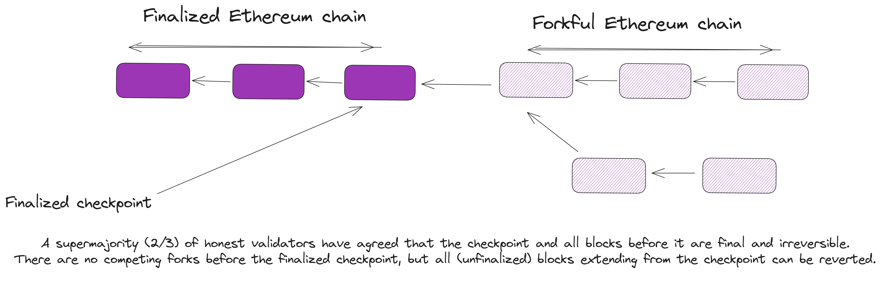
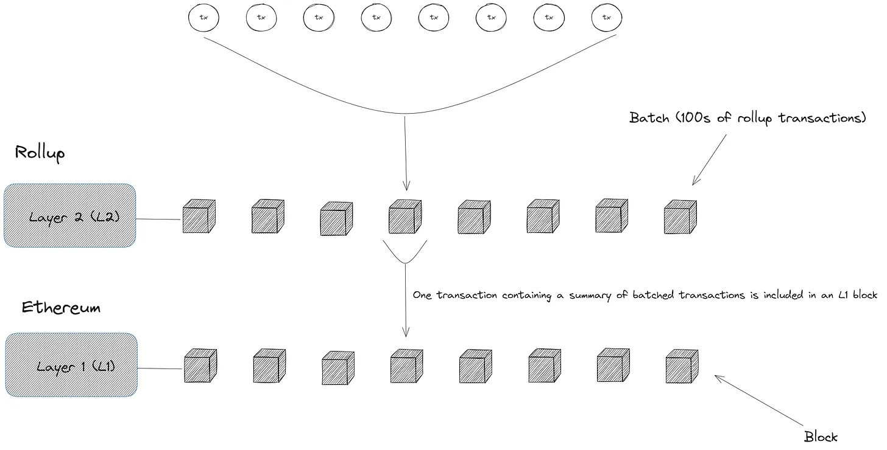

Layer 2 (L2) scaling initially referred to any construction that improved throughput on Ethereum by processing transactions off-chain by optimizing usage of Ethereum’s data bandwidth and computational resources. This group included Plasma chains, sidechains, state channels, validiums, and more recently, rollups. But the term “Layer 2” has now come to refer to off-chain networks that inherit consensus, data availability, and settlement guarantees from Ethereum.

## Prerequisites {#prerequisites}

Understanding of how blockchains like Ethereum work and familiarity with [Ethereum scaling](/developers/docs/scaling/) will make it easier to grasp the various concepts discussed in this page. Implementing and integrating with scaling solutions, like optimiums, is an advanced topic as the technology is still under active research and development.

## Why are optimiums not considered a Layer 2 (L2) scaling solution? {#optimiums-not-l2}

Optimiums derive consensus and data availability for one or more separate sources, which means Ethereum cannot guarantee safety and liveness of the chain—except with the cooperation of off-chain actors. This runs against the ethos of Layer 2 scaling: a user should be confident in their ability to withdraw funds as long as Ethereum itself is secure against consensus and data availability faults.

Besides inheriting Ethereum’s consensus, L2s also extend Ethereum’s decentralization—users should only make assumptions about the decentralization of the Ethereum network when assessing the security of assets bridged off-chain from Ethereum to a scaling-focused off-chain network. Note that considerations around social, technical, and architectural decentralization in _Ethereum_ rollups (e.g., centralized vs. decentralized sequencing, control of the bridge contract by a multisig vs. a DAO, permissionless vs. permissioned proposal of state outputs, etc.) are orthogonal to this discussion and are best addressed separately (see [L2Beat’s risk framework](https://l2beat.com/scaling/risk) and [rollup decentralization framework](https://ethereum-magicians.org/t/proposed-milestones-for-rollups-taking-off-training-wheels/11571) for details).

Instead, this definition is concerned with the set of actors that determine the liveness and safety of the off-chain network (which determine security of assets transferred off-chain from Ethereum via bridge):

- **Liveness**: Liveness is the property that "something good eventually happens" and includes **chain progress** (the chain keeps advancing and nodes can produce new blocks that execute transactions and update the state) and **censorship resistance** (eventual execution of user-generated transactions)

- **Safety**: Safety is the property that "something bad never happens" and includes **block validity** (invalid transactions are never added to the canonical chain) and **resistance to malicious block reorganizations** (an attacker cannot rewrite the history of the chain or reverse finalized transactions).

In a decentralized Layer 2 construction, an honest majority of Ethereum validators can guarantee the safety and liveness of the off-chain protocol—even if the operator or validators in the off-chain network are untrusted. Thus a decentralized rollup is said to “inherit security from Ethereum” as the same assumptions that underpin the security of the Layer 1 chain itself (e.g., infeasibility of finalizing conflicting blocks) apply to the security of the rollup and safety of funds deposited in the rollup’s bridge.

Narrowing the scope of L2 scaling was the result of extensive discussions within the Ethereum community and a recognition that any scaling solution was valuable to the extent in which it preserved and extended Ethereum’s guarantees of decentralization and security. In the case of off-chain scaling solutions, users should only have to trust Ethereum’s security—having to trust any other party to secure assets and transactions in the off-chain network meant such a scaling solution could not scale Ethereum without introducing new trust assumptions and reducing decentralization.

**[Read more on Ethereum’s rollup-centric roadmap](https://ethereum-magicians.org/t/a-rollup-centric-ethereum-roadmap/4698).**

We discuss the basic properties that decentralized L2 protocols satisfy and compare them to optimium chains in the next section:

### Consensus {#consensus}

**Consensus** defines the canonical ordering of transactions in a blockchain and determines transaction finality. Finality (the property that transactions added to the canonical chain are irreversible) is tied to the consensus mechanism, which provides the rule for confirming a transaction’s inclusion in the canonical chain. Bitcoin and other Proof of Work (PoW) chains have _probabilistic finality_ (a user’s transaction can be reverted if a miner builds a longer chain that excludes that transaction) and a [_k_-deep confirmation rule](https://en.bitcoin.it/wiki/Confirmation), where transactions are confirmed after a miner builds upon the block containing the transaction (_k_ is the number of descendant blocks that build on the block containing the confirmed transaction).

Ethereum and other Proof of Stake (PoS) blockchains have _economic finality_, where nodes agree to never revert blocks beyond a certain finalized checkpoint; if the chain reverts a block beyond this checkpoint, accountable safety guarantees that at least ⅓ of validators (weighted by stake) can be slashed—provided ⅔ validators are honest. The cost of reverting blocks past a finalized checkpoint places a quantifiable cost on reorgs and provides a confirmation rule, where a transaction is confirmed after the corresponding block is voted by a supermajority (⅔) of validators (weighted by stake) in two successive epochs (~15 minutes).

Layer 2 blockchains inherit consensus from Ethereum by submitting transaction batches for inclusion in Ethereum blocks. A batch of L2 transactions is final when the L1 block that includes the batch is confirmed by a supermajority in two successful epochs; reverting finalized transactions requires burning ⅓ of the active stake to revert the L1 block. Due to this relationship (described as merged consensus), decentralized rollups are able to use Ethereum’s confirmation rule—which decides what blocks are canonical—to provide strong guarantees of transaction finality and resistance to malicious reorgs/double-spend attacks.

Optimiums do not submit transaction batches to Ethereum and inherit consensus from wherever transaction data is stored. For example, an optimium that stores transaction data (blocks) with validators has transaction finality when a majority of validators approve the block and add it to the canonical chain. Conversely, an optimium integrated with an external data availability service has transaction finality when a quorum of nodes on the data availability layer confirms the batch. Finality of optimium transactions is dependent on the security of the external data availability protocol against adversarial attempts to revert the ordering of confirmed transaction batches.

#### Settlement vs. finality {#settlement-vs-finality}

Finality is often used interchangeably with settlement due to the way traditional blockchains are designed, even if they are different. Finality asserts inclusion of a transaction or block in the history of the canonical chain, but does not explicitly guarantee validity of transactions and blocks. Settlement asserts the validity of the execution of a transaction or block included in the canonical chain and guarantees that the result of a settled transaction cannot be reversed, except the chain suffers a finality attack.

On Ethereum, finality is roughly with settlement: a block can include invalid transactions, and a supermajority finalizes the block—this is finality. If no one detects the bad block, the output of the block’s transactions (i.e., the effects of applying the transactions to the chain’s state) are “settled”. But the protocol has a rule that says if ⅔ of validators are honest, an honest validator can include evidence of a previous block’s validity in a new block and trigger slashing of ⅓ validators that signed the block. The chain also reverts to the earliest state before the invalid block and discards any other blocks that build on the invalid block.

Since validators have incentive not to include invalid transactions, a finalized block is considered settled from the perspective of an entity observing the chain. But finality and settlement take different notions when off-chain scaling solutions are concerned—especially as off-chain scaling solutions split execution, consensus, and settlement between separate layers.

In the context of optimiums, this difference means a transaction is “final” when its ordering in a batch is confirmed by the external data availability layer, and “settled” when the transaction’s output or effect on the chain’s state is confirmed by the settlement layer. Settlement on Ethereum happens once a commitment to the execution of transactions (a state root) is accepted by the optimium’s on-chain light client contract. Ethereum can guarantee settlement of transactions conducted on an optimium chain that implements the following components on-chain:

- A light client verifier that stores commitments to updates to the optimium’s state (changes in account balances and code). If the state commitment asserting the output of an optimium transaction remains unchallenged, the light client verifier updates to the newest state commitment after the challenge window concludes.

- A dispute protocol that encodes the optimium’s state transition logic and can re-execute transactions to verify disputed state transitions. The dispute protocol accepts fraud proofs from honest challengers during the dispute window—provided an honest validator is available to include the fraud proof transaction in an Ethereum block.

These components combined allow the Ethereum network to provide meaningful guarantees of transaction settlement for optimium chains. Due to the links between state commitments stored on Ethereum (each state commitment is stored inside an Ethereum block and links to the previous state commitment), a user interacting with an optimium chain can be confident that the **output** of a transaction (i.e., the effects of the transaction on the optimium’s state) will not be reverted—provided the following are true:

- Validators are honest and treat the chain of state commitments stored in the on-chain light client on Ethereum as the source of truth for the optimium’s latest finalized state.

- The validator in an optimium is honest and proposes a valid block _b’_ that builds on the head block _b_ and asserts a correct post-state _s’_.

If the aforementioned conditions are true, everyone observing the optimium chain—including users and applications that interact with the optimium’s state (e.g., bridges, exchanges, liquidity providers, fiat offramps) will always have a single view of the optimium’s state. This is critical to enforcing the chain’s safety property—one of which has to do with consistency: two honest nodes should never have conflicting views of the chain at the same block height.

Settlement on Ethereum should, however, not be conflated with finality: the absence of a fraud proof inductively proves the validity of a transaction, allowing applications and users to make decisions based on the result of a transaction. But the acceptance of a state commitment by the optimium’s light client contract does not guarantee hard finality of transactions: an optimium can periodically checkpoint states on-chain by posting state commitments, but a loss of security in the external data availability layer can trigger the reversal of the network to a state before a finalized checkpoint.

Unlike Layer 2 (L2) chains, optimiums cannot use Ethereum’s block confirmation rule (e.g., a rollup user may treat a transaction as finalized if the transaction data is included in an L1 block) and must rely on the security of the data availability layer for protection against chain reorganizations. We illustrate the distinction between finality and settlement for optimium chains on Ethereum:

- Bob has a balance of 25 tokens on the optimium chain and pays Alice 25 tokens for a cup of coffee. Bob’s transaction is included in a batch by the sequencer and submitted to the data availability network. A block including the sequencer’s batch is confirmed by a supermajority of validators on the data availability network—Alice considers Bob’s transaction as final at this point.

- A validator (Max) creates a block b using transaction data from the sequencer’s (now finalized) batch and computes a commitment to the state _s_—asserting the result of Bob’s transaction `(Bob: 0 tokens | Alice: 25 tokens)`—and submits the state commitment to the on-chain light client contract. No one disputes the asserted state transition throughout the seven-day challenge window, and the light client contract updates to the state commitment s—Bob’s transaction is settled at this point. Alice makes decisions based on the new state, such as paying Hermione 25 tokens for a fresh supply of coffee beans.

- Bob goes rogue and bribes Max to create a new block b’ that asserts the state _s’_ `(Bob: 25 tokens | Alice: 0 tokens)`—effectively reverting the result of the earlier transaction—to the on-chain light client contract. Alice needs to create a fraud proof showing that the transition from state s to state _s’_ does not follow the optimium’s validity rule (the fraud proof will show that the output of applying block _b’_ on the pre-state s (the post-state root _s’_) does not match the state s’ asserted by Max).

- Bob goes further and bribes the majority of validators on the data availability network to revert block b and replace it with a block _b’_ that excludes Bob’s transfer of 25 tokens to Alice. Or Max simply withholds the data from Alice (if no data availability service is used). From the dispute protocol’s perspective, Alice cannot create a valid fraud proof; block _b_ from the canonical optimium chain (determined by full nodes on the data availability layer) will not reflect a reduction in Bob’s balance from the initial payment to Alice, so the transition from state _s_ `(Bob: 25 tokens | Alice: 0 tokens)` to state _s’_ `(Bob: 25 tokens | Alice: 0 tokens)` is valid. Alice is obviously the right party in the dispute, but the loss of security in the external data availability layer prevents her from successfully challenging the state transition.

- If the light client contract (inevitably) accepts the state commitment _s’_, Alice’s previous balance of 25 tokens from the transaction with Bob will disappear. Hermione’s balance of 25 tokens from the transaction with Alice will also disappear as the canonical chain (defined by the list of state commitments stored in the light client contract) has no record of Alice ever owning the 25 tokens sent to Hermione.

This hypothetical example highlights a major distinction between optimiums and Layer 2 (L2) scaling solutions (e.g., optimistic rollups): Ethereum cannot enforce canonical ordering of transactions on optimiums, nor the availability of transaction data, and thus cannot fully guarantee critical safety properties, like finality of transactions. To use the previous example, Bob will find it more difficult to revert the state of an optimistic rollup that stores transaction data on Ethereum and inherits L1 consensus:

- The sequencer submits transaction batches by calling the rollup contract’s batch submission function and attaching the compressed transaction data as calldata to the function call. The light client contract confirms inclusion of the sequencer’s batch submission transaction in a finalized Ethereum block, computes a Merkle hash of the batch, and stores the Merkle root as a commitment to the data.

- Alice creates a fraud proof showing that the block b’ does not correctly extend block _b_ and provides a Merkle proof showing inclusion of the input to the fraud proof (i.e., the block b and state root s) in the canonical rollup chain (the canonical rollup chain is defined by the list of batches stored on L1 and confirmed during Ethereum’s consensus operations). The dispute manager contract can verify Alice’s inputs by checking the Merkle proof against the transaction batch root stored in the light client contract.

- Bob cannot game the dispute protocol this time—this requires reverting the Ethereum blocks containing batch submission transactions from the optimium’s sequencer and rewinding the light client contract to store a different Merkle hash for transaction batches. Without any means to construct an alternate view of history, Bob is guaranteed to lose the challenge once the dispute manager contract re-executes the state transition and confirms Max asserted an invalid state transition.

Decoupling an optimium’s consensus from Ethereum consensus produces a safety failure in the previous example: Alice and Max have different views of the canonical optimium chain. Not inheriting Ethereum’s consensus can also affect liveness in optimium chains. Liveness is a security property that asserts freedom from deadlock: (1) The chain should be capable of progressing by processing transactions and adding blocks. (2) The chain should eventually process transactions from users with bounded delays on execution.

Layer 2 blockchains guarantee (1) by publishing the minimum data required to reconstruct the chain’s state on-chain; if the operator goes offline and refuses to produce a new block, anyone can sync with the tip of the chain by deriving blocks from L1 data and produce a new block to advance the chain. L2s guarantee (2) by implementing an escape hatch: users can force inclusion of transactions by sending a transaction to the validating bridge on L1. If the L2 has a fork-choice rule that requires validators to include all transactions sent on L2, users can rely on Ethereum’s control of the L2 ordering to force-include transactions and circumvent a censoring operator.

For optimiums, liveness depends on either the honesty of sidechain validators or the security of the data availability layer. If N validators are involved in an optimistic sidechain, and a transaction t can be censored as long as a threshold m of validators agree to never finalize a block with t, then `m of n` is the number of validators that need to collude to censor a transaction. The same also holds for a data availability layer that uses validators to order transactions for an optimium chain.

### Data availability {#data-availability}

[Data availability](/developers/docs/data-availability/) is the guarantee that transaction data required to verify a block and reproduce the chain’s state is available to network participants. Optimiums implement off-chain data availability, where transaction data is stored with an external authority (a data availability provider) and validators only post succinct cryptographic commitments to outputs of transactions (state roots) on-chain. (For readers familiar with cryptography, this is equivalent to saying Ethereum nodes have access to the **hash** of the root of the optimium's state trie but not the **preimage** of the hash, i.e., the original data committed to using a hash function.) Off-chain data availability provides certain benefits for optimium chains:

- **Higher transaction volumes**: Transaction batches can be arbitrarily large, depending on the capacity of the data availability provider, as transaction data is not published on Ethereum. Conversely, off-chain scaling solutions with on-chain data availability must constrain batches to account for limits on Ethereum’s data bandwidth (e.g., limits on transaction `calldata`).

- **Reduced transaction costs for users**: The cost of storing transaction data on Ethereum is a major operating cost for rollups that publish batches on-chain. Off-chain data availability reduces this cost, which reduces the costs passed on to users interacting with applications in an optimium chain.

However, off-chain data availability also presents significant tradeoffs that affect safety and liveness of optimium chains:

(1). **Safety**: Honest validators may lack access to transaction data required to independently verify changes in state or construct fraud proofs to convince the on-chain light client of an invalid state transition (e.g., Alice cannot create a fraud proof to dispute Max’s invalid state transition from the previous example) if validators or data availability providers withhold data. Malicious actors can revert state updates by reverting the ordering of previously finalized transactions on the external data availability layer.

(2). **Liveness**: Forced transaction inclusion mechanisms for anti-censorship protection rely on the security and decentralization of external data availability layers that store an optimium’s transaction data, not Ethereum. Honest validators cannot produce new blocks if the data availability protocol or sidechain validators withhold data required to sync with the head of the chain.

Besides freezing the chain, performing a data withholding attack can prevent users from withdrawing funds from the optimum’s bridge contract; without access to state data, it is impossible to prove details about the optimium’s state—such as balances of accounts on the sidechain, the inclusion of exit transactions (proof of burn) in finalized blocks—to the bridge contract and process withdrawals.

Layer 2 (L2) chains inherit data availability from Ethereum by publishing the minimum amount of transaction data required to reconstruct the state of the L2 on-chain as calldata. Calldata is not persisted directly in Ethereum’s state, but can be retrieved by retracing historical blocks and downloading the transaction trie of past Ethereum blocks that include batch submission transactions from the L2 operator. This provides stronger guarantees of safety and liveness:

- Watcher nodes, like Alice from the previous example, can derive the data needed to create a fraud proof and assist the L2’s validating bridge in enforcing correctness of state transitions. Alice can also compute the Merkle proof required to prove ownership of funds on the off-chain network or inclusion of exit transactions in a submitted batch without relying on off-chain actors to make the data available.

- Users can rely on Ethereum for anti-censorship protection. Honest nodes can prevent the chain from freezing by deriving blocks from L1 and producing new blocks and submitting state roots that update the on-chain light client’s view of the L2 state. This data is guaranteed to be available as long as the majority of Ethereum’s validators never finalize blocks with unavailable data.

**Note**: L2s in the future will no longer use `calldata` and will instead use ephemeral blobs (pruned after a short period) to store transaction data, so L2 nodes cannot rely on L1 to provide the data required to sync with the L2 chain from genesis. However, the availability of transaction data during the challenge window is arguably more important and Ethereum guarantees that this data will be available if the majority of validators are acting honestly.

## Further reading on optimiums {#further-reading}

- [What are different types of Layer 2s?](https://vitalik.eth.limo/general/2023/10/31/l2types.html)
- [Do Rollups Inherit Security?](https://dba.xyz/do-rollups-inherit-security/)
- [Optimium, AnyTrust, Sidechain](https://mirror.xyz/0xfa892B19c72c2D2C6B10dFce8Ff8E7a955b58A61/rWTCYr0F7X92vucJ5M4kQPqH4d0O6-bnIm15NkMOv10)
